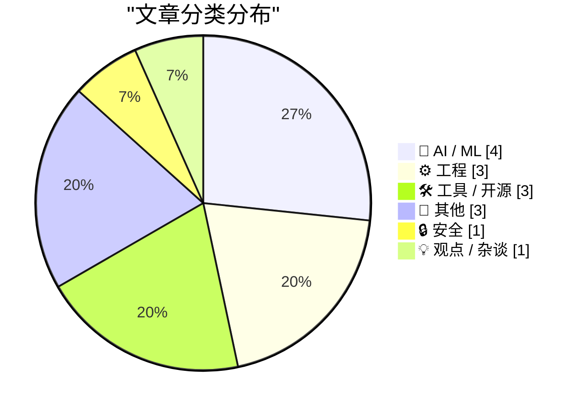
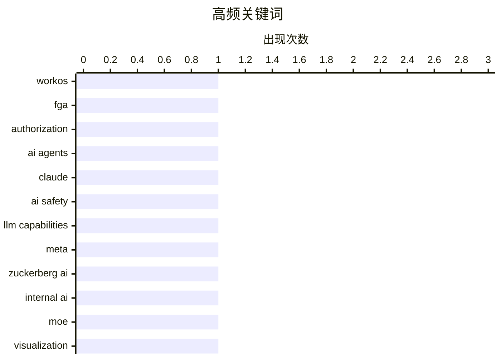

# 📰 AI 博客每日精选 — 2026-04-22

> 来自 Karpathy 推荐的 92 个顶级技术博客，AI 精选 Top 15

## 📝 今日看点

今日技术圈聚焦三大趋势：AI 代理的安全授权机制成为企业部署新瓶颈，WorkOS 推出细粒度权限控制方案应对挑战；大模型能力持续突破，Claude Mythos 在推理任务中表现亮眼，Meta 则探索用 AI 分身优化内部沟通。与此同时，工程实践与工具创新并进，从高效算法到 MoE 路由可视化，再到跨平台包管理规范，技术栈底层正加速演进。

---

## 🏆 今日必读

🥇 **WorkOS FGA：面向 AI 代理的授权层**

[[Sponsor] WorkOS FGA: The Authorization Layer for AI Agents](https://workos.com/blog/agents-need-authorization-not-just-authentication?utm_source=daringfireball&utm_medium=newsletter&utm_campaign=q22026) — daringfireball.net · 2026-04-13 · ⚙️ 工程

> 文章探讨了企业级 AI 代理部署中的核心瓶颈并非模型质量或延迟，而是授权机制。WorkOS 提出的 FGA（Fine-Grained Authorization）方案通过资源级权限控制，精确界定 AI 代理的操作范围，从而增强企业安全性。该方案解决了身份验证（Authentication）无法限制行为边界的局限，使企业能安全信任并部署 AI 代理。作者强调，在 AI 竞争中，真正胜出的将是那些能被企业安全信赖的系统。

💡 **为什么值得读**: 如果你正在评估如何在企业中安全地集成 AI 代理，这篇关于细粒度授权的深度解析提供了关键的技术路径和实际解决方案。

🏷️ WorkOS, FGA, authorization, AI agents

🥈 **Claude Mythos 评测：我们该害怕吗？**

[Claude Mythos, evaluated](https://garymarcus.substack.com/p/claude-mythos-evaluated) — garymarcus.substack.com · 2026-04-13 · 🤖 AI / ML

> 本文对 Anthropic 新发布的 Claude Mythos 模型进行了全面评估，重点分析其在复杂推理任务上的表现。评测发现该模型在数学、逻辑和代码生成方面显著优于前代产品，但在事实一致性和长上下文理解上仍有缺陷。作者认为 Mythos 代表了当前大语言模型的进步，但尚未达到 AGI 水平，公众无需过度恐慌。

💡 **为什么值得读**: 想了解最新 Claude 模型真实能力边界的技术读者必读，评测揭示了突破与局限并存的前沿进展。

🏷️ Claude, AI safety, LLM capabilities

🥉 **Meta 打造马克·扎克伯格 AI 分身与员工互动**

[FT: ‘Meta Builds AI Version of Mark Zuckerberg to Interact With Staff’](https://www.ft.com/content/02107c23-6c7a-4c19-b8e2-b45f4bb9ce5f) — daringfireball.net · 2026-04-13 · 🤖 AI / ML

> 据《金融时报》报道，Meta 正秘密开发一个基于扎克伯格个人风格训练的 AI 角色，用于与内部员工进行对话和反馈。该 AI 被训练模仿其公开言论、语气和行为习惯，旨在提升内部沟通效率。项目由扎克伯格亲自监督，目前处于测试阶段，反映了科技巨头将 AI 深度融入组织管理的战略趋势。

💡 **为什么值得读**: 了解 Meta 如何将 CEO 形象数字化以优化内部运营，这对关注企业 AI 应用落地的读者极具参考价值。

🏷️ Meta, Zuckerberg AI, internal AI

---

## 📊 数据概览

| 扫描源 |    抓取文章     | 时间范围 |   精选    |
| :----: | :-------------: | :------: | :-------: |
| 86/92  | 2484 篇 → 20 篇 |   24h    | **15 篇** |

### 分类分布



### 高频关键词



<details>
<summary>📈 纯文本关键词图（终端友好）</summary>

```
workos           │ ████████████████████ 1
fga              │ ████████████████████ 1
authorization    │ ████████████████████ 1
ai agents        │ ████████████████████ 1
claude           │ ████████████████████ 1
ai safety        │ ████████████████████ 1
llm capabilities │ ████████████████████ 1
meta             │ ████████████████████ 1
zuckerberg ai    │ ████████████████████ 1
internal ai      │ ████████████████████ 1
```

</details>

### 🏷️ 话题标签

**workos**(1) · **fga**(1) · **authorization**(1) · ai agents(1) · claude(1) · ai safety(1) · llm capabilities(1) · meta(1) · zuckerberg ai(1) · internal ai(1) · moe(1) · visualization(1) · expert routing(1) · algorithm(1) · duplicate detection(1) · array(1) · location privacy(1) · metadata(1) · android(1) · ai adoption(1)

---

## 🤖 AI / ML

### 1. Claude Mythos 评测：我们该害怕吗？

[Claude Mythos, evaluated](https://garymarcus.substack.com/p/claude-mythos-evaluated) — **garymarcus.substack.com** · 2026-04-13 · ⭐ 26/30

> 本文对 Anthropic 新发布的 Claude Mythos 模型进行了全面评估，重点分析其在复杂推理任务上的表现。评测发现该模型在数学、逻辑和代码生成方面显著优于前代产品，但在事实一致性和长上下文理解上仍有缺陷。作者认为 Mythos 代表了当前大语言模型的进步，但尚未达到 AGI 水平，公众无需过度恐慌。

🏷️ Claude, AI safety, LLM capabilities

---

### 2. Meta 打造马克·扎克伯格 AI 分身与员工互动

[FT: ‘Meta Builds AI Version of Mark Zuckerberg to Interact With Staff’](https://www.ft.com/content/02107c23-6c7a-4c19-b8e2-b45f4bb9ce5f) — **daringfireball.net** · 2026-04-13 · ⭐ 24/30

> 据《金融时报》报道，Meta 正秘密开发一个基于扎克伯格个人风格训练的 AI 角色，用于与内部员工进行对话和反馈。该 AI 被训练模仿其公开言论、语气和行为习惯，旨在提升内部沟通效率。项目由扎克伯格亲自监督，目前处于测试阶段，反映了科技巨头将 AI 深度融入组织管理的战略趋势。

🏷️ Meta, Zuckerberg AI, internal AI

---

### 3. 可视化 MoE 专家路由的小工具

[A little tool to visualise MoE expert routing](https://martinalderson.com/posts/moe-expert-routing-visualization/?utm_source=rss&utm_medium=rss&utm_campaign=feed) — **martinalderson.com** · 2026-04-13 · ⭐ 24/30

> 作者开发了一个交互式工具，用于直观展示 Mixture of Experts (MoE) 模型中 token 如何被路由到不同专家网络。该工具让用户可以实时观察模型决策过程，揭示哪些输入触发了特定专家的激活。这种可视化有助于理解 MoE 架构的动态行为，为模型调试和优化提供直观依据。

🏷️ MoE, visualization, expert routing

---

### 4. 史蒂夫·耶格谈 Google AI 采用现状：像拖拉机公司一样缓慢

[Steve Yegge](https://simonwillison.net/2026/Apr/13/steve-yegge/#atom-everything) — **simonwillison.net** · 2026-04-13 · ⭐ 21/30

> Steve Yegge 引述一位在 Google 担任技术主管二十年的朋友透露，Google 工程团队对 AI 的采用程度堪比 John Deere 拖拉机公司——仅有 20% 的“代理型”重度用户，20% 完全拒绝，其余 60% 处于观望状态。这表明即使是顶级科技公司，AI 内部渗透也面临巨大阻力。

🏷️ AI adoption, Google, enterprise AI

---

## ⚙️ 工程

### 5. WorkOS FGA：面向 AI 代理的授权层

[[Sponsor] WorkOS FGA: The Authorization Layer for AI Agents](https://workos.com/blog/agents-need-authorization-not-just-authentication?utm_source=daringfireball&utm_medium=newsletter&utm_campaign=q22026) — **daringfireball.net** · 2026-04-13 · ⭐ 26/30

> 文章探讨了企业级 AI 代理部署中的核心瓶颈并非模型质量或延迟，而是授权机制。WorkOS 提出的 FGA（Fine-Grained Authorization）方案通过资源级权限控制，精确界定 AI 代理的操作范围，从而增强企业安全性。该方案解决了身份验证（Authentication）无法限制行为边界的局限，使企业能安全信任并部署 AI 代理。作者强调，在 AI 竞争中，真正胜出的将是那些能被企业安全信赖的系统。

🏷️ WorkOS, FGA, authorization, AI agents

---

### 6. 在 1 到 N−1 范围内找出重复整数的高效算法

[Finding a duplicated item in an array of N integers in the range 1 to N − 1](https://devblogs.microsoft.com/oldnewthing/20260413-00/?p=112227) — **devblogs.microsoft.com/oldnewthing** · 2026-04-13 · ⭐ 23/30

> 本文提出一种利用数组特殊性质的 O(N) 时间复杂度算法，用于在包含 N 个整数的数组中找出唯一重复项，其中所有元素取值范围为 1 到 N−1。算法基于数学推导，避免使用哈希表等额外空间，实现原地计算。该方法展示了如何通过问题约束简化经典查找难题，适用于内存受限环境。

🏷️ algorithm, duplicate detection, array

---

### 7. Ada 中的面向对象编程

[Object Oriented Programming in Ada](https://entropicthoughts.com/object-oriented-programming-in-ada) — **entropicthoughts.com** · 2026-04-13 · ⭐ 17/30

> 文章探讨了 Ada 语言中实现面向对象编程（OOP）的机制，重点介绍了其支持封装、继承和多态的方式。作者指出，Ada 通过记录类型（records）、访问类型（access types）和泛型（generics）等特性实现了类式结构，同时保持了语言的强类型和安全性优势。尽管 Ada 并非传统意义上的 OOP 语言，但其设计允许开发者以接近现代面向对象风格的方式组织代码。

🏷️ Ada, OOP, programming language

---

## 🛠 工具 / 开源

### 8. 通用软件包规范（非跨平台格式）

[Common Package Specification](https://nesbitt.io/2026/04/13/common-package-specification.html) — **nesbitt.io** · 2026-04-13 · ⭐ 21/30

> Nesbitt 提出的 Common Package Specification 并非如其名称暗示的跨平台解决方案，而是一个专注于单一生态系统内软件分发的新标准。该规范旨在统一包管理行为，解决现有工具碎片化问题，但目前仍处于概念阶段，未获广泛支持。

🏷️ package specification, ecosystem, compatibility

---

### 9. MacOS 技巧：启用缩放‘预览’手势

[MacOS Tip: Enable the Zoom ‘Peek’ Gesture](https://unsung.aresluna.org/testing-tip-enable-the-zoom-peek-gesture/) — **daringfireball.net** · 2026-04-13 · ⭐ 17/30

> Marcin Wichary 推荐一个长期被忽视的 MacOS 内置功能：在辅助功能设置中开启‘使用修饰键滚动缩放’后，按住 Control 并用双指滑动即可即时缩放整个屏幕。关闭‘平滑图像’选项还能获得像素级清晰显示，这是无需第三方软件的强大生产力工具。

🏷️ macOS, zoom gesture, accessibility

---

### 10. Apple Frames 4：面向 Apple 设备的截图边框快捷方式重大更新

[Apple Frames 4](https://www.macstories.net/stories/introducing-apple-frames-4-a-revamped-shortcut-support-for-frame-colors-proportional-scaling-and-the-apple-frames-cli-for-developers/) — **daringfireball.net** · 2026-04-13 · ⭐ 15/30

> Apple Frames 4 是一款专为带官方 Apple 产品边框的截图设计的快捷方式应用，此次更新显著提升了性能并扩展了个性化功能。新版本首次支持为不同设备设置多种颜色，用户可自由混搭设备与边框色彩。此外，该工具新增比例缩放支持和命令行界面（CLI），方便开发者集成到自动化流程中。

🏷️ Apple Frames, screenshot, shortcut

---

## 📝 其他

### 11. 数学极简主义：用函数和常数 1 构建全部初等函数

[Mathematical minimalism](https://www.johndcook.com/blog/2026/04/13/the-smallest-math-library/) — **johndcook.com** · 2026-04-13 · ⭐ 19/30

> Andrzej Odrzywolek 在 arXiv 发表论文证明，仅需基本指数函数（eml）和常数 1，即可推导出加法、减法、乘法和除法等全部初等运算。该成果挑战了传统认为需要多个基础函数才能构建数学体系的理念，展示了数学基础的简洁性。

🏷️ mathematical minimalism, elementary functions, arithmetic

---

### 12. Cyrix 486SLC CPU 于1992年4月13日发布

[Cyrix 486SLC CPU: Introduced April 13,1992](https://dfarq.homeip.net/cyrix-486slc-cpu-introduced-april-131992/?utm_source=rss&utm_medium=rss&utm_campaign=cyrix-486slc-cpu-introduced-april-131992) — **dfarq.homeip.net** · 2026-04-13 · ⭐ 14/30

> 1992年4月13日，Cyrix 推出了其首款自主设计的486SLC处理器，标志着该公司进入 x86 兼容 CPU 市场的重要一步。由于缺乏自有晶圆厂，Cyrix 依赖 SGS Thomson 和德州仪器（TI）等第三方制造商生产芯片，其中 TI 不仅代工还获得了部分知识产权授权。这款低成本、低功耗的处理器虽性能不及 Intel 同期产品，但在嵌入式系统和 OEM 设备中广受欢迎。

🏷️ Cyrix, 486SLC, history of computing

---

### 13. Marcin Wichary 探访大型系统博物馆

[Marcin Wichary Visits the Large Scale Systems Museum](https://flickr.com/photos/mwichary/albums/72177720332956990/) — **daringfireball.net** · 2026-04-13 · ⭐ 12/30

> 知名 UX 设计师 Marcin Wichary 分享了他参观大型系统博物馆（Large Scale Systems Museum）的照片集，展示了大量古董键盘的细节。其中包括一个设计奇特的“RE-START”按键，文字被刻意拆分为两行，虽不符合常规却具有强烈的视觉张力。这些图像不仅展现技术文物之美，也唤起人们对人机交互演变的思考。

🏷️ Large Scale Systems Museum, vintage keyboards, Marcin Wichary

---

## 🔒 安全

### 14. Android 阻止照片自动分享位置信息

[Android now stops you sharing your location in photos](https://shkspr.mobi/blog/2026/04/android-now-stops-you-sharing-your-location-in-photos/) — **shkspr.mobi** · 2026-04-13 · ⭐ 22/30

> Google Android 系统更新后默认不再允许用户选择是否嵌入地理位置元数据到照片中。此前 OpenBenches 网站依赖此功能将用户上传的纪念长椅照片定位到地图，现在该流程已被破坏。开发者指出，网页端使用 `<input type="file" accept="image/jpeg">` 调用系统相册时，位置信息仍会被自动写入。

🏷️ location privacy, metadata, Android

---

## 💡 观点 / 杂谈

### 15. 紧缩政策催生法西斯主义

[Pluralistic: Austerity creates fascism (13 Apr 2026)](https://pluralistic.net/2026/04/12/always-great/) — **pluralistic.net** · 2026-04-13 · ⭐ 15/30

> 作者认为，长期的经济紧缩政策会削弱民主制度，为极端主义和威权统治创造条件。文章引用历史与现实案例，指出财政紧缩往往导致公共服务削减、社会不平等加剧，从而激发民粹情绪。作者强调，‘我们负担不起不拥有美好事物’，呼吁在政策制定中优先考虑人文关怀而非纯粹经济理性。

🏷️ austerity, fascism, politics

---

_生成于 2026-04-22 12:52 | 扫描 86 源 → 获取 2484 篇 → 精选 15 篇_
_基于 [Hacker News Popularity Contest 2025](https://refactoringenglish.com/tools/hn-popularity/) RSS 源列表，由 [Andrej Karpathy](https://x.com/karpathy) 推荐_
_由「懂点儿AI」制作，欢迎关注同名微信公众号获取更多 AI 实用技巧 💡_
