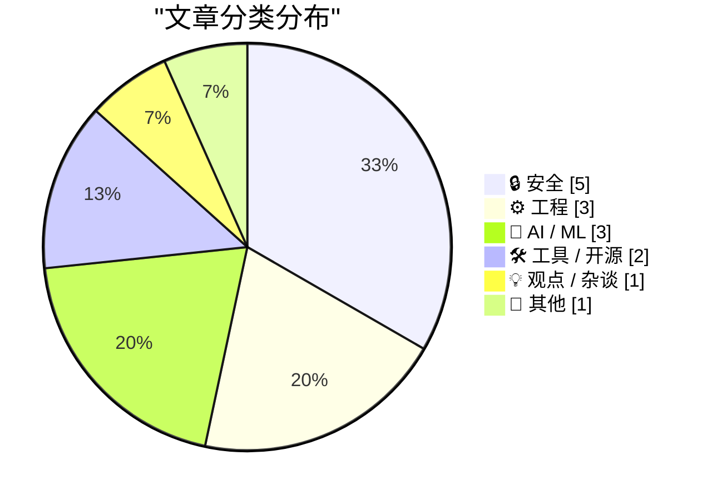
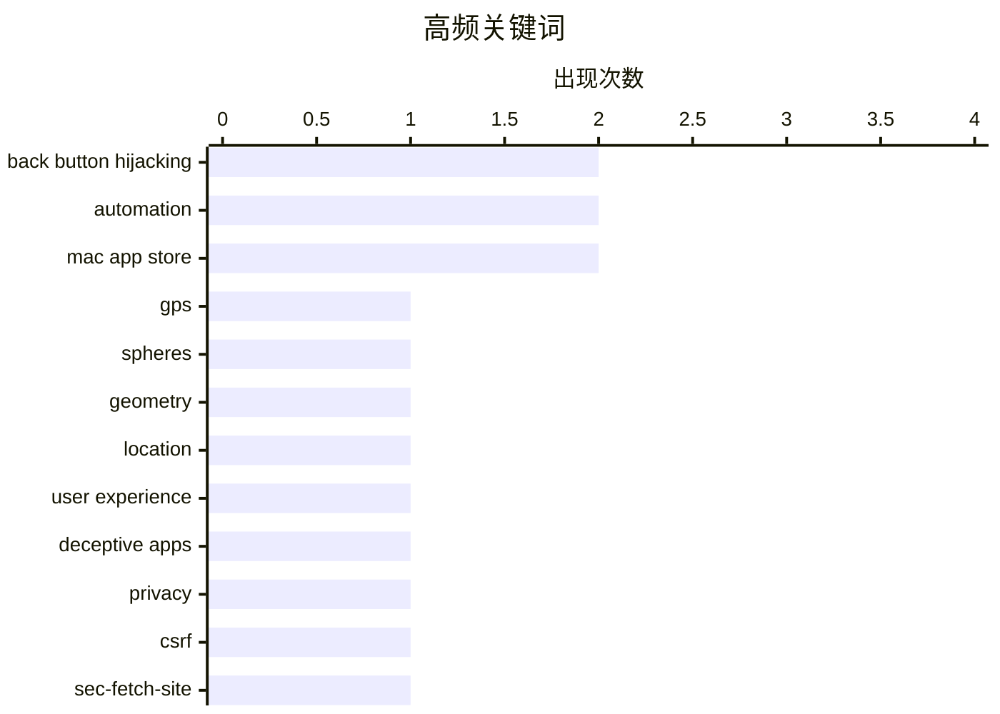

# 📰 AI 博客每日精选 — 2026-04-22

> 来自 Karpathy 推荐的 92 个顶级技术博客，AI 精选 Top 15

## 📝 今日看点

今日技术圈聚焦三大趋势：一是AI安全威胁升级，从Claude Mythos暴露的攻击能力到OpenAI推出专用防御模型GPT-5.4-Cyber，业界正加速构建AI驱动的主动网络安全体系；二是开发工具持续优化，Datasette转向Sec-Fetch-Site头部简化CSRF防护，Homebrew重写底层以提升稳定性，体现对代码简洁与健壮性的追求；三是用户体验与安全边界日益受重视，浏览器后退劫持减少、分区管理理念兴起，反映出在复杂数字环境中平衡便利性与安全性的新思路。

---

## 🏆 今日必读

🥇 **相交球体与GPS定位**

[Intersecting spheres and GPS](https://www.johndcook.com/blog/2026/04/14/intersecting-spheres-and-gps/) — johndcook.com · 2026-04-14 · ⚙️ 工程

> 文章解释了GPS定位背后的几何原理：当已知到卫星的距离d时，用户位置必然位于地球表面与该距离构成的以卫星为中心的球面的交线上，而两个球面的交集是一个圆。因此，单颗卫星的观测只能确定用户在一个圆环上，需至少三颗卫星才能实现精确定位。这一原理揭示了为什么单个GPS测量值无法唯一确定位置。

💡 **为什么值得读**: 它用直观的球面几何解释了看似简单的GPS技术背后隐藏的关键限制，适合对定位原理感兴趣的读者快速理解核心机制。

🏷️ GPS, spheres, geometry, location

🥈 **后退按钮劫持正在消失**

[Back button hijacking is going away](https://idiallo.com/blog/back-button-hijacking-is-going-away-seo?src=feed) — idiallo.com · 2026-04-14 · 🔒 安全

> 文章指出网站滥用浏览器后退功能（back-button hijacking）的行为正逐渐减少，这类设计会激怒用户并损害品牌声誉。作者认为，随着用户体验意识提升和浏览器防护增强，恶意软件通过微妙手段（如‘温水煮青蛙’式诱导）操控用户行为的策略已难以为继。

💡 **为什么值得读**: 揭示了现代Web开发中一个被忽视但日益改善的用户体验问题，有助于开发者避免破坏性交互设计。

🏷️ back button hijacking, user experience, deceptive apps, privacy

🥉 **Datasette PR #2689：用Sec-Fetch-Site头部替代基于令牌的CSRF保护**

[datasette PR #2689: Replace token-based CSRF with Sec-Fetch-Site header protection](https://simonwillison.net/2026/Apr/14/replace-token-based-csrf/#atom-everything) — simonwillison.net · 2026-04-14 · ⚙️ 工程

> Datasette项目计划弃用传统的CSRF令牌机制，转而采用更简洁的Sec-Fetch-Site HTTP头部进行同源策略验证。此举旨在简化模板代码，消除在每个表单中手动插入csrftoken隐藏字段的需求，同时利用浏览器内置的安全机制提升兼容性与可维护性。

💡 **为什么值得读**: 展示了如何利用现代浏览器安全特性简化Web应用的安全架构，对关注CSRF防御演进的后端开发者极具参考价值。

🏷️ CSRF, Sec-Fetch-Site, ASGI, security

---

## 📊 数据概览

| 扫描源 |    抓取文章     | 时间范围 |   精选    |
| :----: | :-------------: | :------: | :-------: |
| 86/92  | 2484 篇 → 25 篇 |   24h    | **15 篇** |

### 分类分布



### 高频关键词



<details>
<summary>📈 纯文本关键词图（终端友好）</summary>

```
back button hijacking │ ████████████████████ 2
automation            │ ████████████████████ 2
mac app store         │ ████████████████████ 2
gps                   │ ██████████░░░░░░░░░░ 1
spheres               │ ██████████░░░░░░░░░░ 1
geometry              │ ██████████░░░░░░░░░░ 1
location              │ ██████████░░░░░░░░░░ 1
user experience       │ ██████████░░░░░░░░░░ 1
deceptive apps        │ ██████████░░░░░░░░░░ 1
privacy               │ ██████████░░░░░░░░░░ 1
```

</details>

### 🏷️ 话题标签

**back button hijacking**(2) · **automation**(2) · **mac app store**(2) · gps(1) · spheres(1) · geometry(1) · location(1) · user experience(1) · deceptive apps(1) · privacy(1) · csrf(1) · sec-fetch-site(1) · asgi(1) · security(1) · claude mythos(1) · ai safety institute(1) · cybersecurity(1) · proof of work(1) · patch tuesday(1) · zero-day(1)

---

## 🔒 安全

### 1. 后退按钮劫持正在消失

[Back button hijacking is going away](https://idiallo.com/blog/back-button-hijacking-is-going-away-seo?src=feed) — **idiallo.com** · 2026-04-14 · ⭐ 25/30

> 文章指出网站滥用浏览器后退功能（back-button hijacking）的行为正逐渐减少，这类设计会激怒用户并损害品牌声誉。作者认为，随着用户体验意识提升和浏览器防护增强，恶意软件通过微妙手段（如‘温水煮青蛙’式诱导）操控用户行为的策略已难以为继。

🏷️ back button hijacking, user experience, deceptive apps, privacy

---

### 2. 网络安全如今更像工作量证明

[Cybersecurity Looks Like Proof of Work Now](https://simonwillison.net/2026/Apr/14/cybersecurity-proof-of-work/#atom-everything) — **simonwillison.net** · 2026-04-14 · ⭐ 24/30

> 英国AI安全研究所评估Claude Mythos时发现其具备强大的网络攻击能力，促使业界重新思考AI在攻防中的角色。文章暗示当前网络安全体系正逼近‘工作量证明’模式——即防御方需投入巨大资源构建复杂系统以对抗自动化、高智能的攻击者，形成成本不对称的博弈格局。

🏷️ Claude Mythos, AI Safety Institute, cybersecurity, proof of work

---

### 3. 2026年4月补丁星期二：微软修复167个漏洞

[Patch Tuesday, April 2026 Edition](https://krebsonsecurity.com/2026/04/patch-tuesday-april-2026-edition/) — **krebsonsecurity.com** · 2026-04-14 · ⭐ 24/30

> 微软本月发布紧急更新，修补Windows及相关软件中多达167个安全漏洞，其中包括SharePoint Server零日漏洞和代号“BlueHammer”的Windows Defender公开漏洞。谷歌Chrome同期修复了当年第四个零日漏洞，Adobe也针对可导致远程代码执行的主动利用漏洞推出应急补丁。

🏷️ Patch Tuesday, zero-day, BlueHammer, Microsoft

---

### 4. 假冒Ledger加密货币钱包App骗取950万美元

[Fraudulent Cryptocurrency App in Mac App Store Stole $9.5 Million From 50-Some Users](https://www.web3isgoinggreat.com/?id=fake-ledger-app) — **daringfireball.net** · 2026-04-14 · ⭐ 21/30

> 一款伪造的Ledger钱包应用成功上架苹果App Store，诱骗50余名用户输入助记词，导致总计950万美元被盗。受害者包括音乐人G. Love，他因误信该应用为正品而转移资产，凸显第三方应用商店审核机制的潜在风险。

🏷️ cryptocurrency fraud, Mac App Store, phishing, Ledger

---

### 5. 谷歌将于6月起对实施“后退按钮劫持”的网站进行处罚

[Google Will Finally Begin Punishing Sites for Back-Button Hijacking in June](https://developers.google.com/search/blog/2026/04/back-button-hijacking) — **daringfireball.net** · 2026-04-14 · ⭐ 21/30

> 谷歌宣布将在6月更新其垃圾信息政策，将“后退按钮劫持”列为恶意行为并予以处罚。该行为通过阻止用户正常使用浏览器后退功能来误导用户，破坏浏览体验。此举旨在打击利用技术手段操纵用户行为的网站。谷歌表示这将作为垃圾信息政策中“恶意行为”的明确违规项，可能导致网站被降权或移除索引。

🏷️ back button hijacking, Google Search, spam policy, user deception

---

## ⚙️ 工程

### 6. 相交球体与GPS定位

[Intersecting spheres and GPS](https://www.johndcook.com/blog/2026/04/14/intersecting-spheres-and-gps/) — **johndcook.com** · 2026-04-14 · ⭐ 26/30

> 文章解释了GPS定位背后的几何原理：当已知到卫星的距离d时，用户位置必然位于地球表面与该距离构成的以卫星为中心的球面的交线上，而两个球面的交集是一个圆。因此，单颗卫星的观测只能确定用户在一个圆环上，需至少三颗卫星才能实现精确定位。这一原理揭示了为什么单个GPS测量值无法唯一确定位置。

🏷️ GPS, spheres, geometry, location

---

### 7. Datasette PR #2689：用Sec-Fetch-Site头部替代基于令牌的CSRF保护

[datasette PR #2689: Replace token-based CSRF with Sec-Fetch-Site header protection](https://simonwillison.net/2026/Apr/14/replace-token-based-csrf/#atom-everything) — **simonwillison.net** · 2026-04-14 · ⭐ 24/30

> Datasette项目计划弃用传统的CSRF令牌机制，转而采用更简洁的Sec-Fetch-Site HTTP头部进行同源策略验证。此举旨在简化模板代码，消除在每个表单中手动插入csrftoken隐藏字段的需求，同时利用浏览器内置的安全机制提升兼容性与可维护性。

🏷️ CSRF, Sec-Fetch-Site, ASGI, security

---

### 8. 求解过两点且给定斜率的抛物线

[Finding a parabola through two points with given slopes](https://www.johndcook.com/blog/2026/04/14/artz-parabola/) — **johndcook.com** · 2026-04-14 · ⭐ 19/30

> John D. Cook探讨了Artzt抛物线的数学原理——这类特殊抛物线需满足两个条件：通过指定两点，且在每点处的切线方向与给定直线平行。文章推导了这类问题的通用解法，涉及二次曲线的一般形式ax² + bxy + cy²。该研究有助于理解现代三角形几何中的特殊曲线构造方法。

🏷️ parabola, Artzt parabolas, conic sections, mathematics

---

## 🤖 AI / ML

### 9. Zappa：一款由AI驱动的中间人代理工具

[zappa: an AI powered mitmproxy](https://geohot.github.io//blog/jekyll/update/2026/04/15/zappa-mitmproxy.html) — **geohot.github.io** · 2026-04-14 · ⭐ 24/30

> geohot提出Zappa项目，旨在利用即将成熟的AI能力模拟人类与互联网的交互行为，实现智能化的中间人流量拦截与分析。他认为这不仅是技术挑战，更是解放用户注意力、对抗平台监控与广告追踪的革命性机会。

🏷️ AI, MITM, zappa, automation

---

### 10. 为下一代网络防御打造可信访问

[Trusted access for the next era of cyber defense](https://simonwillison.net/2026/Apr/14/trusted-access-openai/#atom-everything) — **simonwillison.net** · 2026-04-14 · ⭐ 21/30

> OpenAI推出GPT-5.4-Cyber模型，专门针对网络安全防御场景进行微调，以应对Claude Mythos等AI驱动的网络威胁。这表明行业正转向专用AI模型赋能主动防御，构建‘可信访问’机制来识别、阻断和响应自动化攻击。

🏷️ GPT-5.4-Cy, cyber defense, AI model, OpenAI

---

### 11. 每周更新499：AI助手Bruce的新用途

[Weekly Update 499](https://www.troyhunt.com/weekly-update-499/) — **troyhunt.com** · 2026-04-14 · ⭐ 21/30

> Troy Hunt在最新一期周报中分享了对AI助手Bruce的新认识——它不仅能自动回复工单，还能在人工介入时提供精准支持。这种混合式客服模式显著提升了响应质量与效率。作者认为AI不应完全取代人工，而是作为增强工具提升整体服务能力。该观点反映了当前AI应用从自动化向协作化演进的趋势。

🏷️ AI assistant, customer support, automation, Bruce

---

## 🛠 工具 / 开源

### 12. 站在Homebrew的肩膀上重写简单部分

[Standing on the shoulders of Homebrew](https://nesbitt.io/2026/04/14/standing-on-the-shoulders-of-homebrew.html) — **nesbitt.io** · 2026-04-14 · ⭐ 22/30

> 作者着手重写Homebrew的部分基础组件，目标是简化其内部实现，使其更易维护和扩展。此举并非推翻原有架构，而是聚焦于那些‘容易出错却常被忽略’的底层细节，以提升包管理工具的稳定性与开发者体验。

🏷️ Homebrew, package manager, macOS, open source

---

### 13. 苹果已从Mac App Store下架旧版Pages、Keynote和Numbers应用

[Apple Has Hidden the Pre-Creator-Studio Versions of Keynote, Numbers, and Pages in the Mac App Store](https://9to5mac.com/2026/04/13/apple-removes-old-pages-keynote-numbers-apps-for-macos/) — **daringfireball.net** · 2026-04-14 · ⭐ 19/30

> 苹果正式从Mac App Store中移除了带有Creator Studio功能的旧版iWork套件（Pages、Keynote、Numbers）。此前这些应用与新版并存导致版本混乱，现在用户只能获取集成Creator Studio功能的新版本。此次调整统一了macOS与iOS/iPadOS的应用发布策略，简化了用户获取流程。

🏷️ iWork, Creator Studio, Mac App Store, Apple

---

## 💡 观点 / 杂谈

### 14. 颂扬（某些）分区的价值

[Pluralistic: In praise of (some) compartmentalization (14 Apr 2026)](https://pluralistic.net/2026/04/14/compartment/) — **pluralistic.net** · 2026-04-14 · ⭐ 23/30

> 本文倡导在数字生活中适度分区的重要性，主张通过物理或逻辑隔离（如专用设备、独立账户）来管理不同用途的信息流，从而降低认知负荷、提升专注力并增强安全性。作者认为合理的分区策略能有效缓解多任务处理带来的效率损耗与信息污染。

🏷️ compartmentalization, multitasking, productivity, focus

---

## 📝 其他

### 15. 亚马逊收购Globalstar并将为iPhone和Apple Watch提供卫星服务

[Amazon to Acquire Globalstar, Announces Agreement With Apple to Continue Service for iPhone and Apple Watch](https://www.aboutamazon.com/news/company-news/amazon-globalstar-apple) — **daringfireball.net** · 2026-04-14 · ⭐ 18/30

> 亚马逊宣布与Globalstar达成收购协议，计划将其低地球轨道卫星网络与直接到设备(D2D)服务整合。同时与苹果达成协议，由亚马逊Leo卫星网络为iPhone和Apple Watch提供包括紧急SOS在内的卫星通信服务。这项合作将显著扩展偏远地区的蜂窝覆盖范围。

🏷️ Amazon, Globalstar, direct-to-device, satellite network

---

_生成于 2026-04-22 12:59 | 扫描 86 源 → 获取 2484 篇 → 精选 15 篇_
_基于 [Hacker News Popularity Contest 2025](https://refactoringenglish.com/tools/hn-popularity/) RSS 源列表，由 [Andrej Karpathy](https://x.com/karpathy) 推荐_
_由「懂点儿AI」制作，欢迎关注同名微信公众号获取更多 AI 实用技巧 💡_
