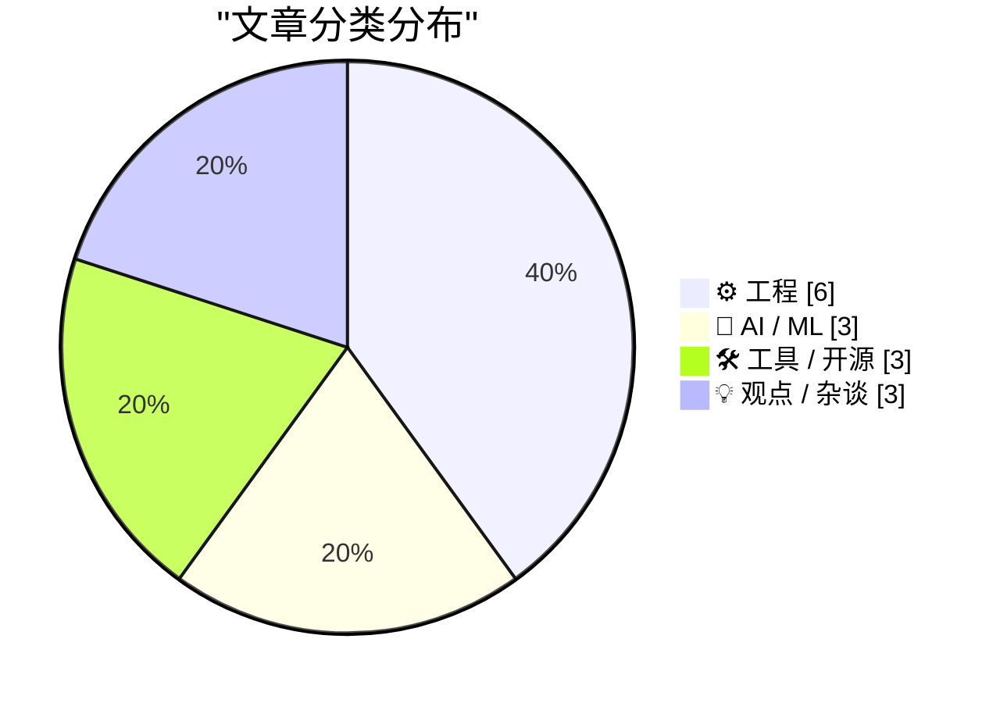
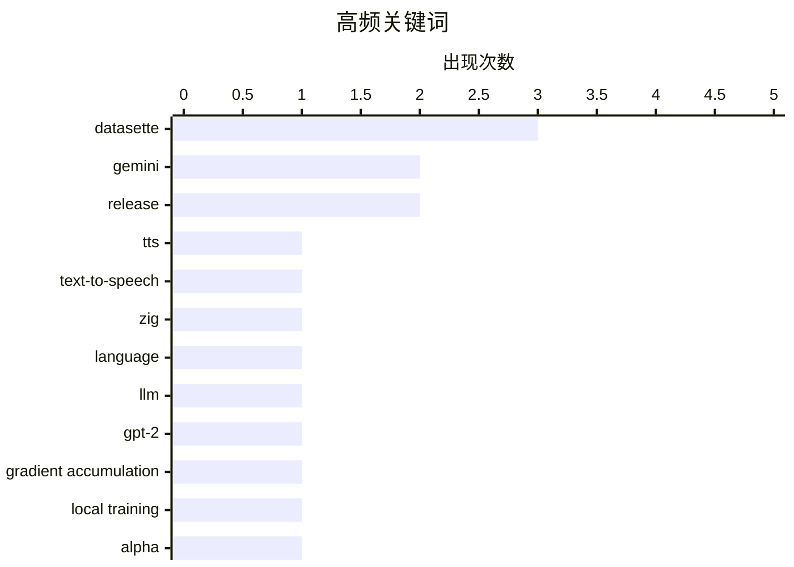

# 📰 AI 博客每日精选 — 2026-04-22

> 来自 Karpathy 推荐的 92 个顶级技术博客，AI 精选 Top 15

## 📝 今日看点

今日技术圈聚焦三大趋势：AI 语音交互持续进化，谷歌 Gemini 3.1 Flash TTS 支持自然语言提示驱动，Simon Willison 已推出体验工具；底层系统优化受关注，Zig 0.16.0 引入“Juicy Main”依赖注入机制，simdutf 提升跨平台兼容性；同时，AI 治理与责任问题浮现，Kyle Kingsbury 提出未来或需“人肉盾牌”承担 AI 系统问责。

---

## 🏆 今日必读

🥇 **Gemini 3.1 Flash TTS：谷歌发布支持提示词驱动的新文本转语音模型**

[Gemini 3.1 Flash TTS](https://simonwillison.net/2026/Apr/15/gemini-31-flash-tts/#atom-everything) — simonwillison.net · 6 天前 · 🤖 AI / ML

> Google 发布了 Gemini 3.1 Flash TTS，这是一个全新的文本转语音（TTS）模型，可通过自然语言提示进行控制。该模型通过标准的 Gemini API 提供，使用 `gemini-3.1-flash-tts-preview` 作为模型 ID，但仅支持输出音频文件。其功能基于 AI 驱动的语音生成技术，适用于需要动态语音合成的应用场景。

💡 **为什么值得读**: 如果你正在寻找一个能通过自然语言指令生成高质量语音的 API 解决方案，这个新发布的 Gemini 3.1 Flash TTS 是一个值得关注的突破。

🏷️ Gemini, TTS, text-to-speech

🥈 **Zig 0.16.0 发布：“Juicy Main”依赖注入功能上线**

[Zig 0.16.0 release notes: "Juicy Main"](https://simonwillison.net/2026/Apr/15/juicy-main/#atom-everything) — simonwillison.net · 2026-04-15 · ⚙️ 工程

> Zig 0.16.0 正式发布，其中引入了一个名为“Juicy Main”的重要特性——为程序入口函数 `main()` 提供依赖注入机制，允许接收 `process.Init` 参数。这一改进显著提升了程序的模块化和可测试性，使开发者能更灵活地管理初始化逻辑和外部依赖。

💡 **为什么值得读**: 对于追求极致控制力和可维护性的系统级编程者来说，Zig 的‘Juicy Main’依赖注入是一次令人兴奋的语言演进。

🏷️ Zig, language, release

🥉 **从零开始构建 LLM（第32k部分）：本地训练与梯度累积优化**

[Writing an LLM from scratch, part 32k -- Interventions: training a better model locally with gradient accumulation](https://www.gilesthomas.com/2026/04/llm-from-scratch-32k-interventions-training-our-best-model-locally-gradient-accumulation) — gilesthomas.com · 6 天前 · 🤖 AI / ML

> 作者基于 Sebastian Raschka 的《Build a Large Language Model from Scratch》一书，开发了一个类似 GPT-2-small 的小型语言模型，并尝试多种干预策略以提升性能。本次重点介绍使用梯度累积（gradient accumulation）在本地训练中优化模型效果的技术方案，旨在降低对大规模计算资源的需求同时保持训练稳定性。

💡 **为什么值得读**: 如果你想在有限硬件条件下高效训练自己的语言模型，这篇关于梯度累积的实践指南提供了宝贵的经验和技术路径。

🏷️ LLM, GPT-2, gradient accumulation, local training

---

## 📊 数据概览

| 扫描源 |    抓取文章     | 时间范围 |   精选    |
| :----: | :-------------: | :------: | :-------: |
| 86/92  | 2484 篇 → 23 篇 |   24h    | **15 篇** |

### 分类分布



### 高频关键词



<details>
<summary>📈 纯文本关键词图（终端友好）</summary>

```
datasette             │ ████████████████████ 3
gemini                │ █████████████░░░░░░░ 2
release               │ █████████████░░░░░░░ 2
tts                   │ ███████░░░░░░░░░░░░░ 1
text-to-speech        │ ███████░░░░░░░░░░░░░ 1
zig                   │ ███████░░░░░░░░░░░░░ 1
language              │ ███████░░░░░░░░░░░░░ 1
llm                   │ ███████░░░░░░░░░░░░░ 1
gpt-2                 │ ███████░░░░░░░░░░░░░ 1
gradient accumulation │ ███████░░░░░░░░░░░░░ 1
```

</details>

### 🏷️ 话题标签

**datasette**(3) · **gemini**(2) · **release**(2) · tts(1) · text-to-speech(1) · zig(1) · language(1) · llm(1) · gpt-2(1) · gradient accumulation(1) · local training(1) · alpha(1) · simdutf(1) · libc++(1) · c++(1) · performance(1) · windows(1) · threading(1) · waitforsingleobject(1) · synchronization(1)

---

## ⚙️ 工程

### 1. Zig 0.16.0 发布：“Juicy Main”依赖注入功能上线

[Zig 0.16.0 release notes: "Juicy Main"](https://simonwillison.net/2026/Apr/15/juicy-main/#atom-everything) — **simonwillison.net** · 2026-04-15 · ⭐ 25/30

> Zig 0.16.0 正式发布，其中引入了一个名为“Juicy Main”的重要特性——为程序入口函数 `main()` 提供依赖注入机制，允许接收 `process.Init` 参数。这一改进显著提升了程序的模块化和可测试性，使开发者能更灵活地管理初始化逻辑和外部依赖。

🏷️ Zig, language, release

---

### 2. simdutf 现已无需依赖 libc++ 或 libc++abi

[Simdutf Can Now Be Used Without libc++ or libc++abi](https://mitchellh.com/writing/simdutf-no-libcxx) — **mitchellh.com** · 2026-04-15 · ⭐ 24/30

> simdutf 库宣布支持在无 libc++ 或 libc++abi 的环境下运行，扩展了其跨平台兼容性。这一改进使得该高性能 UTF 转换库能够在更多嵌入式系统和轻量级环境中部署，而无需强制依赖特定 C++ 运行时库。

🏷️ simdutf, libc++, C++, performance

---

### 3. 线程退出后 WaitForSingleObject 为何存在延迟？微软揭秘底层机制

[Why is there a long delay between a thread exiting and the Wait­For­Single­Object returning?](https://devblogs.microsoft.com/oldnewthing/20260415-00/?p=112235) — **devblogs.microsoft.com/oldnewthing** · 6 天前 · ⭐ 24/30

> 微软资深工程师 Raymond Chen 解释了一个常见 Windows 编程现象：线程退出后，WaitForSingleObject 返回可能存在较长延迟。文章指出，这并非线程未真正退出，而是操作系统内核在清理资源时引入了短暂延迟，属于正常行为而非 bug。

🏷️ Windows, threading, WaitForSingleObject, synchronization

---

### 4. Framework 笔记本 ARM 主板实测：MetaComputing AI PC 搭载 12 核 Arm SoC

[An Arm Mainboard for the Framework Laptop](https://www.jeffgeerling.com/blog/2026/arm-mainboard-for-framework-laptop/) — **jeffgeerling.com** · 6 天前 · ⭐ 21/30

> Jeff Geerling 测试了 Framework 13 笔记本机箱上的三种不同主板：x86 Ryzen AI 5 340、RISC-V DC-ROMA II 以及唯一的 ARM 选项——MetaComputing AI PC，后者配备 12 核 Arm SoC 并支持最高 32GB 内存，展示了 ARM 平台在轻薄本领域的潜力。

🏷️ Framework Laptop, ARM, mainboard

---

### 5. Linux 外接指纹读取器选购困境

[Pressed For Options](https://feed.tedium.co/link/15204/17319282/linux-external-fingerprint-reader-challenges) — **tedium.co** · 2026-04-15 · ⭐ 19/30

> 作者因在 Temu 购买了一款声称兼容 Linux 的 USB 指纹读取器而陷入使用难题。尽管这是唯一找到的可行选项，但实际驱动支持有限，反映出开源社区在生物识别硬件兼容性方面的滞后。文章揭示了低价跨境购物平台虽提供便利，却可能牺牲关键系统的长期可用性。

🏷️ USB fingerprint reader, Linux, hardware compatibility

---

### 6. 详尽规格不等于代码：为什么过度设计的需求文档适得其反

[A sufficiently comprehensive spec is not (necessarily) code](https://buttondown.com/hillelwayne/archive/a-sufficiently-comprehensive-spec-is-not/) — **buttondown.com/hillelwayne** · 6 天前 · ⭐ 18/30

> 文章通过 CommitStrip 漫画指出一个常见误区：认为详尽的业务规格可以完全替代开发者的编码工作。作者强调，即使规格极其全面，也无法涵盖所有运行时场景，反而会抑制开发者的创造力与问题解决能力。真正的协作应是灵活迭代而非机械执行文档。

🏷️ specification, software design, requirements

---

## 🤖 AI / ML

### 7. Gemini 3.1 Flash TTS：谷歌发布支持提示词驱动的新文本转语音模型

[Gemini 3.1 Flash TTS](https://simonwillison.net/2026/Apr/15/gemini-31-flash-tts/#atom-everything) — **simonwillison.net** · 6 天前 · ⭐ 25/30

> Google 发布了 Gemini 3.1 Flash TTS，这是一个全新的文本转语音（TTS）模型，可通过自然语言提示进行控制。该模型通过标准的 Gemini API 提供，使用 `gemini-3.1-flash-tts-preview` 作为模型 ID，但仅支持输出音频文件。其功能基于 AI 驱动的语音生成技术，适用于需要动态语音合成的应用场景。

🏷️ Gemini, TTS, text-to-speech

---

### 8. 从零开始构建 LLM（第32k部分）：本地训练与梯度累积优化

[Writing an LLM from scratch, part 32k -- Interventions: training a better model locally with gradient accumulation](https://www.gilesthomas.com/2026/04/llm-from-scratch-32k-interventions-training-our-best-model-locally-gradient-accumulation) — **gilesthomas.com** · 6 天前 · ⭐ 25/30

> 作者基于 Sebastian Raschka 的《Build a Large Language Model from Scratch》一书，开发了一个类似 GPT-2-small 的小型语言模型，并尝试多种干预策略以提升性能。本次重点介绍使用梯度累积（gradient accumulation）在本地训练中优化模型效果的技术方案，旨在降低对大规模计算资源的需求同时保持训练稳定性。

🏷️ LLM, GPT-2, gradient accumulation, local training

---

### 9. Simon Willison 评测 Gemini 3.1 Flash TTS：实用工具上线

[Gemini 3.1 Flash TTS](https://simonwillison.net/2026/Apr/15/gemini-flash-tts/#atom-everything) — **simonwillison.net** · 6 天前 · ⭐ 22/30

> Simon Willison 推出了一款名为 `tools.simonwillison.net/gemini-flash-tts` 的在线工具，用于快速体验 Google 最新发布的 Gemini 3.1 Flash TTS 文本转语音模型。该工具简化了 API 调用流程，方便用户直接试听模型生成的语音输出。

🏷️ Gemini, Flash TTS, tool

---

## 🛠 工具 / 开源

### 10. Datasette 1.0a27 发布：弃用 Django CSRF 令牌，改用现代浏览器安全头

[datasette 1.0a27](https://simonwillison.net/2026/Apr/15/datasette/#atom-everything) — **simonwillison.net** · 6 天前 · ⭐ 24/30

> Datasette 1.0a27 发布两个重大变更：一是彻底移除 Django 风格的 CSRF 表单令牌机制，转而采用 Filippo Valsorda 提出的现代浏览器安全头部（如 Origin 和 Referer）来防御跨站请求伪造攻击；二是优化了插件兼容性以适配新的安全策略。

🏷️ Datasette, alpha, release

---

### 11. datasette-export-database 0.3a1 更新：适配 Datasette 1.0a27 的 CSRF 变更

[datasette-export-database 0.3a1](https://simonwillison.net/2026/Apr/15/datasette-export-database/#atom-everything) — **simonwillison.net** · 6 天前 · ⭐ 21/30

> datasette-export-database 插件发布 0.3a1 版本，修复了因 Datasette 1.0a27 不再设置 `ds_csrftoken` cookie 而导致的自定义签名 URL 失效问题。此次更新确保了插件在新版本中的兼容性和安全性。

🏷️ Datasette, plugin, export

---

### 12. datasette-ports 0.3 发布：查看本地 Datasette 实例的新功能

[datasette-ports 0.3](https://simonwillison.net/2026/Apr/15/datasette-ports/#atom-everything) — **simonwillison.net** · 2026-04-15 · ⭐ 19/30

> Simon Willison 发布了 datasette-ports 工具的版本 0.3，该工具用于监控用户笔记本电脑上运行的 Datasette 实例。本次更新新增两项关键功能：显示每个进程 PID 对应的工作目录，以及完整路径到每个数据库文件。输出示例展示了 localhost 端口及其关联目录结构，提升了开发者对本地数据服务状态的可见性。

🏷️ Datasette, ports, monitoring

---

## 💡 观点 / 杂谈

### 13. Kyle Kingsbury 谈未来职业趋势：AI 系统需“人肉盾牌”承担问责

[Quoting Kyle Kingsbury](https://simonwillison.net/2026/Apr/15/kyle-kingsbury/#atom-everything) — **simonwillison.net** · 6 天前 · ⭐ 20/30

> Kyle Kingsbury 提出未来可能出现一类新型职业角色——“人肉盾牌”（meat shields），即负责监督和管理 AI 系统运行的人类员工。这类角色可能涉及内部内容审核或外部法律责任，凸显了 AI 时代人机协同治理的重要性。

🏷️ ML accountability, meat shields, ethics

---

### 14. 机器人权利：并非一切都有资格获得道德考量

[Pluralistic: Rights for robots (15 Apr 2026)](https://pluralistic.net/2026/04/15/artificial-lifeforms/) — **pluralistic.net** · 2026-04-15 · ⭐ 20/30

> 文章探讨了在人工智能和机器人技术快速发展的背景下，是否应赋予机器人物理权利的问题。作者认为，并非所有具备感知能力的实体都应自动获得道德地位，而应基于其意识、情感体验等内在属性进行判断。他批评了将复杂伦理问题简化为法律条款的做法，并指出当前法律体系如DMCA对AI权利讨论的局限性。最终主张应建立更精细的标准来界定哪些实体值得道德关怀。

🏷️ robots, moral consideration, DMCA, rights

---

### 15. 速度阻碍智慧：为何慢下来才能做出明智决策

[Speed is Not Conducive to Wisdom](https://blog.jim-nielsen.com/2026/speed-not-conducive-to-wisdom/) — **blog.jim-nielsen.com** · 6 天前 · ⭐ 18/30

> 作者批判现代社会将‘快速’奉为最高美德，导致人们急于求成而忽视深度反思。他认为真正的智慧来自于被现实‘推翻’的过程：观点被事实瓦解、作品被环境检验、构想因短视而崩塌。这些经历虽缓慢且痛苦，却是成长不可或缺的部分。

🏷️ productivity, wisdom, speed

---

_生成于 2026-04-22 13:05 | 扫描 86 源 → 获取 2484 篇 → 精选 15 篇_
_基于 [Hacker News Popularity Contest 2025](https://refactoringenglish.com/tools/hn-popularity/) RSS 源列表，由 [Andrej Karpathy](https://x.com/karpathy) 推荐_
_由「懂点儿AI」制作，欢迎关注同名微信公众号获取更多 AI 实用技巧 💡_
