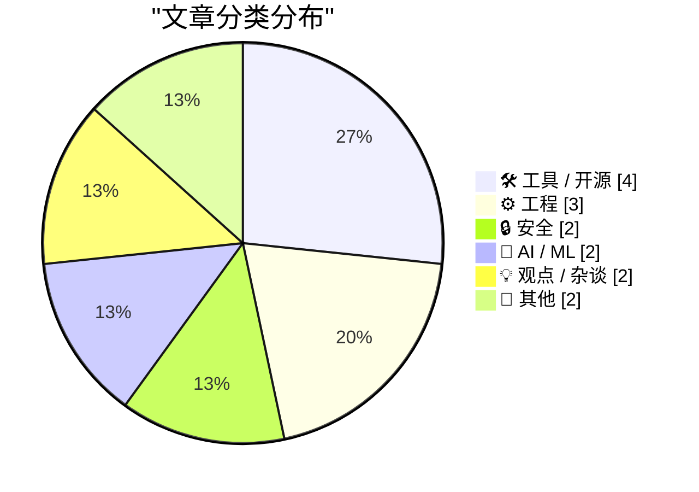
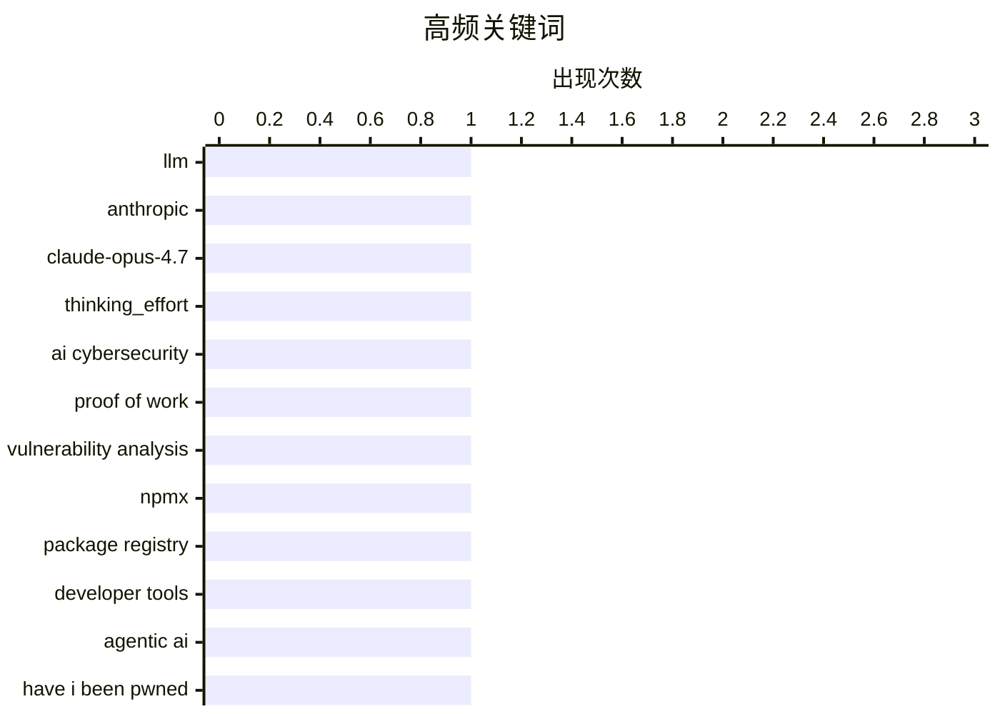

# 📰 AI 博客每日精选 — 2026-04-22

> 来自 Karpathy 推荐的 92 个顶级技术博客，AI 精选 Top 15

## 📝 今日看点

今日技术圈聚焦三大趋势：AI 安全争议再起，专家批判将 AI 威胁类比为区块链 PoW 的逻辑谬误，强调漏洞利用的本质差异；Agentic AI 应用加速落地，既能通过调用 Have I Been Pwned API 主动识别数据泄露，又在图像生成任务中展现超越 Claude Opus 4.7 的潜力；与此同时，开发者工具持续创新，npmx 的前端设计范式与 SQLAlchemy 2 的高级关系建模技巧，凸显工程实践向轻量化、可定制方向演进。

---

## 🏆 今日必读

🥇 **llm-anthropic 0.25 发布：支持 Claude Opus 4.7 的 thinking_effort 与自适应思考模式**

[llm-anthropic 0.25](https://simonwillison.net/2026/Apr/16/llm-anthropic/#atom-everything) — simonwillison.net · 5 天前 · 🛠 工具 / 开源

> Simon Willison 发布了 llm-anthropic 插件版本 0.25，新增对 Anthropic 最新模型 claude-opus-4.7 的支持，该模型引入 thinking_effort 参数并默认提升至 xhigh 级别。同时新增了 thinking_display 和 thinking_adaptive 两个布尔选项，用于控制模型推理过程的显示方式，目前仅支持 JSON 输出或日志记录。此外，max_tokens 默认值从 1024 增加到 8192，显著提升了长文本处理能力。此次更新强化了本地运行大语言模型的推理能力与可观测性。

💡 **为什么值得读**: 如果你正在使用 llm CLI 工具运行 Claude 模型，这个更新带来了更强的推理控制和更长的上下文支持，值得立即升级体验。

🏷️ llm, anthropic, claude-opus-4.7, thinking_effort

🥈 **AI 网络安全不是工作量证明：漏洞利用的本质差异**

[AI cybersecurity is not proof of work](http://antirez.com/news/163) — antirez.com · 6 天前 · 🔒 安全

> Antirez 指出将 AI 安全类比为区块链中的工作量证明（PoW）是错误的类比。PoW 依赖计算资源竞争，而软件漏洞的利用则不同：LLM 执行路径虽多样，但最终受限于代码状态空间，攻击面饱和后难以持续突破。即使采样模型寻找特定代码漏洞，其行为仍受输入分布和模型结构约束，无法像哈希碰撞那样通过无限算力保证成功。因此，AI 安全威胁更依赖智能而非蛮力。

💡 **为什么值得读**: 这篇文章澄清了一个常见误解，帮助读者理解 AI 安全与传统密码学安全之间的本质区别，适合关注 AI 风险的技术人员阅读。

🏷️ AI cybersecurity, proof of work, vulnerability analysis

🥉 **从 npmx 中窃取的功能：每个开发者都应借鉴的设计亮点**

[Features everyone should steal from npmx](https://nesbitt.io/2026/04/16/features-everyone-should-steal-from-npmx.html) — nesbitt.io · 6 天前 · 🛠 工具 / 开源

> 本文探讨了 npmx 作为自定义包注册表前端的设计创新，重点介绍其用户驱动的前端架构如何提升包管理体验。作者强调 npmx 实现了轻量级、可定制的 UI 层，允许开发者绕过传统注册表的限制，实现更快的搜索、版本预览和依赖可视化。这些功能启发社区构建去中心化、高性能的包管理工具，推动 npm 生态的演进。

💡 **为什么值得读**: 如果你关心现代包管理系统的用户体验和未来发展方向，npmx 的设计思路提供了极具价值的参考案例。

🏷️ npmx, package registry, developer tools

---

## 📊 数据概览

| 扫描源 |    抓取文章     | 时间范围 |   精选    |
| :----: | :-------------: | :------: | :-------: |
| 86/92  | 2484 篇 → 24 篇 |   24h    | **15 篇** |

### 分类分布



### 高频关键词



<details>
<summary>📈 纯文本关键词图（终端友好）</summary>

```
llm                    │ ████████████████████ 1
anthropic              │ ████████████████████ 1
claude-opus-4.7        │ ████████████████████ 1
thinking_effort        │ ████████████████████ 1
ai cybersecurity       │ ████████████████████ 1
proof of work          │ ████████████████████ 1
vulnerability analysis │ ████████████████████ 1
npmx                   │ ████████████████████ 1
package registry       │ ████████████████████ 1
developer tools        │ ████████████████████ 1
```

</details>

### 🏷️ 话题标签

**llm**(1) · **anthropic**(1) · **claude-opus-4.7**(1) · thinking_effort(1) · ai cybersecurity(1) · proof of work(1) · vulnerability analysis(1) · npmx(1) · package registry(1) · developer tools(1) · agentic ai(1) · have i been pwned(1) · apis(1) · sqlalchemy(1) · orm(1) · database relationships(1) · apple pay(1) · express transit mode(1) · visa(1) · skimming scam(1)

---

## 🛠 工具 / 开源

### 1. llm-anthropic 0.25 发布：支持 Claude Opus 4.7 的 thinking_effort 与自适应思考模式

[llm-anthropic 0.25](https://simonwillison.net/2026/Apr/16/llm-anthropic/#atom-everything) — **simonwillison.net** · 5 天前 · ⭐ 24/30

> Simon Willison 发布了 llm-anthropic 插件版本 0.25，新增对 Anthropic 最新模型 claude-opus-4.7 的支持，该模型引入 thinking_effort 参数并默认提升至 xhigh 级别。同时新增了 thinking_display 和 thinking_adaptive 两个布尔选项，用于控制模型推理过程的显示方式，目前仅支持 JSON 输出或日志记录。此外，max_tokens 默认值从 1024 增加到 8192，显著提升了长文本处理能力。此次更新强化了本地运行大语言模型的推理能力与可观测性。

🏷️ llm, anthropic, claude-opus-4.7, thinking_effort

---

### 2. 从 npmx 中窃取的功能：每个开发者都应借鉴的设计亮点

[Features everyone should steal from npmx](https://nesbitt.io/2026/04/16/features-everyone-should-steal-from-npmx.html) — **nesbitt.io** · 6 天前 · ⭐ 24/30

> 本文探讨了 npmx 作为自定义包注册表前端的设计创新，重点介绍其用户驱动的前端架构如何提升包管理体验。作者强调 npmx 实现了轻量级、可定制的 UI 层，允许开发者绕过传统注册表的限制，实现更快的搜索、版本预览和依赖可视化。这些功能启发社区构建去中心化、高性能的包管理工具，推动 npm 生态的演进。

🏷️ npmx, package registry, developer tools

---

### 3. Sofa 5.0：个人生活的 Notion 式管理应用

[So Close to Getting It](https://www.theverge.com/tech/906873/sofa-app-track-tv-movies-installer) — **daringfireball.net** · 6 天前 · ⭐ 19/30

> The Verge 的 David Pierce 高度赞扬了 Sofa 5.0 的重大更新，称其为‘Installerverse 的最爱’。该应用现已演变为一个强大的个人内容管理平台，涵盖观看、阅读、游戏甚至现实生活中的活动（IRL），被作者比作‘个人生活的 Notion’。尽管此前仅专注于影视内容时未能形成使用习惯，但此次全面升级使其成为苹果设备用户的理想工具。目前仅限 Apple 生态使用。

🏷️ Sofa, app management, media organization, Installerverse

---

### 4. datasette.io 网站新闻预览功能上线

[datasette.io news preview](https://simonwillison.net/2026/Apr/16/datasette-io-preview/#atom-everything) — **simonwillison.net** · 6 天前 · ⭐ 18/30

> Simon Willison 推出了 datasette.io 网站的新闻预览功能，该功能基于 GitHub 仓库中的 news.yaml 文件构建。用户可以通过 tools.simonwillison.net/datasette-io-preview 访问此预览页面，查看即将发布的 Datasette 版本信息及其他动态。这一功能展示了如何利用简单的 YAML 格式来管理和展示项目新闻。

🏷️ datasette, news preview, yaml, documentation

---

## ⚙️ 工程

### 5. SQLAlchemy 2 实战第五章：高级多对多关系设计技巧

[SQLAlchemy 2 In Practice - Chapter 5 - Advanced Many-To-Many Relationships](https://blog.miguelgrinberg.com/post/sqlalchemy-2-in-practice---chapter-5---advanced-many-to-many-relationships) — **miguelgrinberg.com** · 6 天前 · ⭐ 24/30

> Miguel Grinberg 在其《SQLAlchemy 2 in Practice》课程第五讲中深入讲解复杂多对多关系的实现策略。他介绍了如何通过中间表、关联对象和自定义查询逻辑来处理非对称、条件化或多态关联场景。书中提供具体代码示例，展示如何优化性能、维护数据完整性，并避免常见的 ORM 陷阱。

🏷️ SQLAlchemy, ORM, database relationships

---

### 6. Windows 窗口消息 0x0091 为何携带异常参数？系统消息越界问题解析

[What’s up with window message 0x0091? We’re getting it with unexpected parameters](https://devblogs.microsoft.com/oldnewthing/20260416-00/?p=112240) — **devblogs.microsoft.com/oldnewthing** · 5 天前 · ⭐ 22/30

> Raymond Chen 在 Old New Thing 博客中分析 Windows 系统消息 0x0091（WM_NCUAHDRAWCAPTION）被错误传递非预期参数的现象。他指出这是第三方应用程序或驱动违规发送消息所致，并非系统缺陷。文章解释了消息机制的工作原理，并提供调试建议，帮助开发者识别和修复此类越界调用。

🏷️ Windows messages, system programming, Win32 API

---

### 7. 探索电路设计的隐秘世界

[The Secret Life of Circuits](https://lcamtuf.substack.com/p/the-secret-life-of-circuits) — **lcamtuf.substack.com** · 5 天前 · ⭐ 18/30

> 本文深入探讨了电子电路设计的复杂性与趣味性，揭示了隐藏在常见电子元件背后的设计哲学与挑战。作者通过分析具体案例，展示了从基础逻辑门到复杂系统集成的设计思路，强调了理解底层原理对于创新和问题解决的重要性。

🏷️ circuit design, hardware, electronics

---

## 🔒 安全

### 8. AI 网络安全不是工作量证明：漏洞利用的本质差异

[AI cybersecurity is not proof of work](http://antirez.com/news/163) — **antirez.com** · 6 天前 · ⭐ 24/30

> Antirez 指出将 AI 安全类比为区块链中的工作量证明（PoW）是错误的类比。PoW 依赖计算资源竞争，而软件漏洞的利用则不同：LLM 执行路径虽多样，但最终受限于代码状态空间，攻击面饱和后难以持续突破。即使采样模型寻找特定代码漏洞，其行为仍受输入分布和模型结构约束，无法像哈希碰撞那样通过无限算力保证成功。因此，AI 安全威胁更依赖智能而非蛮力。

🏷️ AI cybersecurity, proof of work, vulnerability analysis

---

### 9. Apple Pay Express Transit 模式在使用 Visa 卡时存在诈骗漏洞

[Apple Pay Express Mode for Transit, When Used With a Visa Card, Is Vulnerable to Scam Tap-to-Pay Readers](https://www.macrumors.com/2026/04/15/apple-pay-visa-transit-exploit/) — **daringfireball.net** · 5 天前 · ⭐ 22/30

> 研究发现 Apple Pay 的 Express Transit 模式结合 Visa 卡存在安全漏洞，攻击者可利用 NFC 读卡器伪造扣费交易而不触发用户确认。该漏洞仅影响 Visa 卡，不适用于 Mastercard 或 American Express，且 Samsung Pay 不受影响。苹果尚未发布修复补丁，建议用户谨慎启用此功能。

🏷️ Apple Pay, Express Transit Mode, Visa, skimming scam

---

## 🤖 AI / ML

### 10. Agentic AI 如何利用 Have I Been Pwned 的 API 揭示数据泄露真相

[Here's What Agentic AI Can Do With Have I Been Pwned's APIs](https://www.troyhunt.com/heres-what-agentic-ai-can-do-with-have-i-been-pwneds-apis/) — **troyhunt.com** · 5 天前 · ⭐ 24/30

> Troy Hunt 展示了 agentic AI 如何通过调用 Have I Been Pwned 的公开 API 自动识别用户是否遭遇数据泄露。AI 代理可模拟真实用户行为，批量查询邮箱、密码或用户名，并将结果以结构化报告形式呈现，极大提升了个人隐私监控效率。这一应用体现了 AI 在网络安全领域的实用价值，而非空洞炒作。

🏷️ agentic AI, Have I Been Pwned, APIs

---

### 11. Qwen3.6-35B-A3B 在笔记本上绘制的鹈鹕优于 Claude Opus 4.7

[Qwen3.6-35B-A3B on my laptop drew me a better pelican than Claude Opus 4.7](https://simonwillison.net/2026/Apr/16/qwen-beats-opus/#atom-everything) — **simonwillison.net** · 5 天前 · ⭐ 21/30

> Simon Willison 对比测试了阿里云 Qwen3.6-35B-A3B 与 Anthropic Claude Opus 4.7 在“骑自行车的鹈鹕”图像生成任务上的表现。结果显示，Qwen3.6 生成的图像细节更丰富、构图更自然，且在本地运行无需联网，凸显其在消费级硬件上的高效性与创造力。尽管两者均为前沿模型，但 Qwen3.6 在视觉生成任务上略胜一筹。

🏷️ Qwen3.6-35B-A3B, Claude Opus 4.7, pelican benchmark, model comparison

---

## 💡 观点 / 杂谈

### 12. AI 末日赌注：一个关于 AI 灾难主义者的帕斯卡尔式警告

[Pluralistic: A Pascal's Wager for AI Doomers (16 Apr 2026)](https://pluralistic.net/2026/04/16/pascals-wager/) — **pluralistic.net** · 6 天前 · ⭐ 21/30

> Cory Doctorow 发表了一篇名为《AI 末日赌注》的文章，提出一个反直觉的观点：即便我们相信超级智能 AI 终将毁灭人类，我们也应该继续投资和发展它。他认为，与其恐惧未来可能发生的灾难，不如现在就开始构建防护机制，因为‘预防胜于治疗’。文章还穿插了一系列文化观察与技术评论，展现作者一贯的社会批判风格。

🏷️ AI doomerism, Pascal's wager, existential risk

---

### 13. 为何我不涉足信息安全 punditry：我的立场声明

[Why I refrain from infosec punditry](https://lcamtuf.substack.com/p/why-i-refrain-from-infosec-punditry) — **lcamtuf.substack.com** · 5 天前 · ⭐ 20/30

> lcamtuf（Clement Lefevre）解释自己为何不在 Substack 上讨论信息安全话题。尽管他是该领域专家，但他认为当前信息安全的舆论环境过于情绪化和碎片化，缺乏深度分析。他更愿意专注于技术实践而非空谈，避免成为‘ punditry’的一部分。

🏷️ infosec, punditry, professional ethics

---

## 📝 其他

### 14. Rory Goss 的故事：视力障碍如何激发他成为 Apple 辅助技术倡导者

[Rory Goss’s Accessibility Story](https://www.apple.com/education/college-students/success-stories/goss/) — **daringfireball.net** · 5 天前 · ⭐ 18/30

> Apple 发布了一篇关于 Rory Goss 的励志故事短片。这位来自北爱尔兰的 16 岁学生，在 2024 年 1 月的一次意外中突然失明，这促使他开始深入研究并倡导 Apple 的辅助技术，特别是 VoiceOver 和 Switch Control。他的经历展示了这些技术如何帮助视障人士克服挑战，追求学术和职业目标。

🏷️ accessibility, Rory Goss, vision impairment, education

---

### 15. Netflix 为 Apple TV 应用更换自定义播放器引发用户不满

[Chance Miller: ‘Netflix Ruined Its Apple TV App by Switching to a Custom Video Player’](https://9to5mac.com/2026/04/15/netflix-ruined-its-apple-tv-app-by-switching-to-a-custom-video-player/) — **daringfireball.net** · 5 天前 · ⭐ 17/30

> 9to5Mac 报道，Netflix 近期为其 Apple TV 应用更换了自定义视频播放器，导致用户普遍感到不满。用户抱怨失去了对完整回放控制、Apple TV Remote 应用的访问权限，以及无法启用‘增强对话’等关键功能。此举甚至引发了一些用户在 Reddit 上讨论取消订阅。

🏷️ Netflix, Apple TV app, custom video player, user experience

---

_生成于 2026-04-22 13:16 | 扫描 86 源 → 获取 2484 篇 → 精选 15 篇_
_基于 [Hacker News Popularity Contest 2025](https://refactoringenglish.com/tools/hn-popularity/) RSS 源列表，由 [Andrej Karpathy](https://x.com/karpathy) 推荐_
_由「懂点儿AI」制作，欢迎关注同名微信公众号获取更多 AI 实用技巧 💡_
