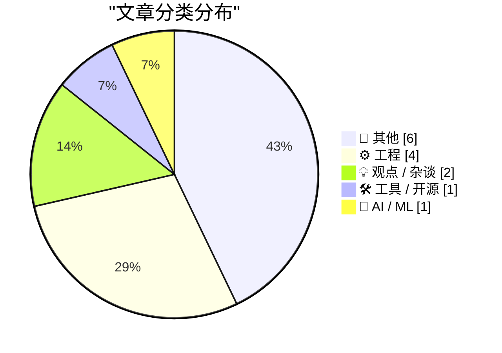
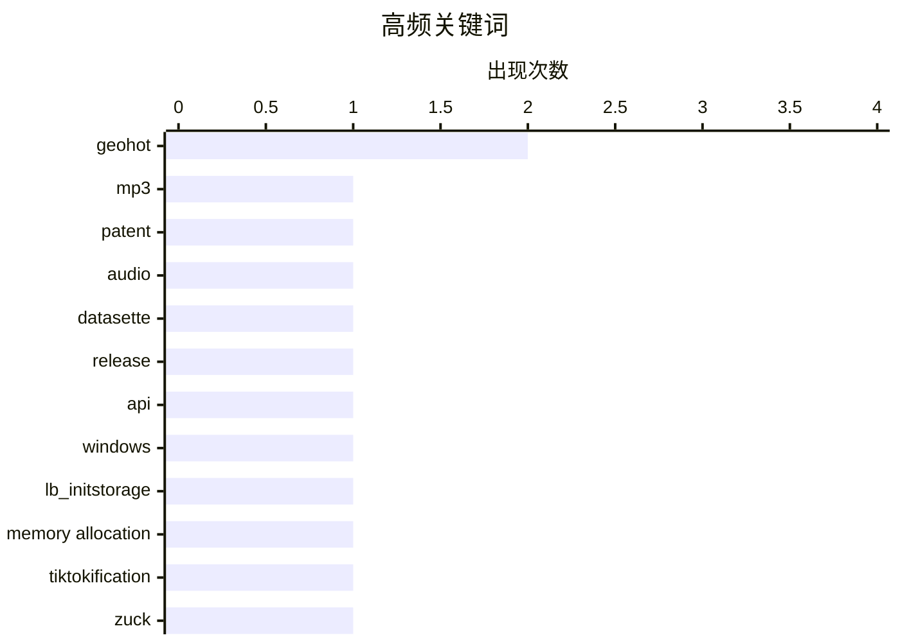

# 📰 AI 博客每日精选 — 2026-04-22

> 来自 Karpathy 推荐的 92 个顶级技术博客，AI 精选 Top 14

## 📝 今日看点

今日技术圈聚焦三大趋势：一是经典技术遗产的终结与新生，MP3专利正式失效标志数字音频时代的公共化转折；二是AI模型训练持续优化，小规模语言模型在数据积累中展现连贯性提升路径；三是平台机制缺陷引发反思，App Store评分算法与Freecash类应用暴露用户信任与系统设计间的深层矛盾。

---

## 🏆 今日必读

🥇 **最后的 MP3 专利**

[The last MP3 patent](https://dfarq.homeip.net/mp3-is-dead-long-live-mp3-oh-wait-its-just-the-patent/?utm_source=rss&utm_medium=rss&utm_campaign=mp3-is-dead-long-live-mp3-oh-wait-its-just-the-patent) — dfarq.homeip.net · 5 天前 · ⚙️ 工程

> 文章探讨了 MP3 音频格式的法律命运，指出其核心专利已于2017年到期，这意味着该编解码技术已进入公共领域。作者回顾了MP3从诞生到专利失效的历史，并澄清一个常见误解：虽然专利过期，但MP3本身并未“死亡”，仍在广泛使用。文章还引用中世纪欧洲关于王权继承的谚语作为类比，讽刺性地描述这一法律终结时刻。最终结论是，MP3的技术生命因专利到期而真正自由化。

💡 **为什么值得读**: 这是一篇兼具历史趣味与法律洞察的文章，适合对知识产权、数字媒体标准演变感兴趣的读者。

🏷️ mp3, patent, audio

🥈 **datasette 1.0a28 发布**

[datasette 1.0a28](https://simonwillison.net/2026/Apr/17/datasette/#atom-everything) — simonwillison.net · 5 天前 · 🛠 工具 / 开源

> Datasette 发布了 alpha 版本 1.0a28，修复了前一个版本 1.0a27 中引入的一个严重兼容性问题。该问题影响 `execute_write_fn()` 回调函数，可能导致插件或扩展功能意外中断。此次更新旨在恢复稳定性，确保云实例升级后不会破坏现有配置。开发者建议用户尽快升级到该版本以避免潜在故障。

💡 **为什么值得读**: 如果你正在使用 Datasette 或其云服务，这个修复至关重要，能防止因 alpha 版本变更导致的意外崩溃。

🏷️ Datasette, release, API

🥉 **被遗忘的旧消息：LB_INITSTORAGE**

[Forgotten message from the past: LB_INIT­STORAGE](https://devblogs.microsoft.com/oldnewthing/20260417-00/?p=112243) — devblogs.microsoft.com/oldnewthing · 4 天前 · ⚙️ 工程

> 文章回顾了 Windows 列表框控件中的一个旧特性 LB_INITSTORAGE，该机制用于预分配内存以优化性能。若不启用此标志，动态添加大量项会导致二次时间复杂度行为，显著降低响应速度。Raymond Chen 解释了这一设计背后的原理，强调在现代系统中合理使用内存预分配的重要性。

💡 **为什么值得读**: 对于理解 Windows UI 性能优化历史和避免常见编程陷阱非常有价值。

🏷️ Windows, LB_INITSTORAGE, memory allocation

---

## 📊 数据概览

| 扫描源 |    抓取文章     | 时间范围 |   精选    |
| :----: | :-------------: | :------: | :-------: |
| 87/92  | 2512 篇 → 14 篇 |   24h    | **14 篇** |

### 分类分布



### 高频关键词



<details>
<summary>📈 纯文本关键词图（终端友好）</summary>

```
geohot            │ ████████████████████ 2
mp3               │ ██████████░░░░░░░░░░ 1
patent            │ ██████████░░░░░░░░░░ 1
audio             │ ██████████░░░░░░░░░░ 1
datasette         │ ██████████░░░░░░░░░░ 1
release           │ ██████████░░░░░░░░░░ 1
api               │ ██████████░░░░░░░░░░ 1
windows           │ ██████████░░░░░░░░░░ 1
lb_initstorage    │ ██████████░░░░░░░░░░ 1
memory allocation │ ██████████░░░░░░░░░░ 1
```

</details>

### 🏷️ 话题标签

**geohot**(2) · **mp3**(1) · **patent**(1) · audio(1) · datasette(1) · release(1) · api(1) · windows(1) · lb_initstorage(1) · memory allocation(1) · tiktokification(1) · zuck(1) · platform control(1) · llm(1) · coherence(1) · training dynamics(1) · pycon(1) · ai track(1) · security track(1) · networking(1)

---

## 📝 其他

### 1. 《恨家指南：私募信贷》

[Premium: The Hater's Guide to Private Credit](https://www.wheresyoured.at/hatersguide-privatecredit/) — **wheresyoured.at** · 4 天前 · ⭐ 16/30

> 文章揭露私募信贷行业的营销乱象，作者自述曾申请商业贷款后每天收到至少三条推销短信，金额高达15万至数百万美元。这些贷款产品往往附带苛刻条款和高额费用，反映出该行业利用信息不对称牟利的问题。

🏷️ private credit, finance, advertising

---

### 2. App Store 评论系统存在缺陷

[App Store Reviews Are Busted](https://blog.terrygodier.com/2026/04/13/app-store-reviews-are-busted.html) — **daringfireball.net** · 5 天前 · ⭐ 15/30

> 文章指出 App Store 评分机制的设计缺陷：即使五星好评，若应用当前评分为4.1星，四星级评论仍会拉低平均分。许多用户误以为‘四星=负面’，实则因算法加权导致善意评价反成伤害。这表明评分系统未能准确反映真实用户体验。

🏷️ App Store, ratings, user behavior

---

### 3. Freecash 更像 scamcash

[Freecash Was More Like Scamcash](https://techcrunch.com/2026/04/14/how-the-rewards-app-freecash-scammed-its-way-to-the-top-of-the-app-stores/) — **daringfireball.net** · 5 天前 · ⭐ 15/30

> 据网络安全公司 Malwarebytes 报告，曾被宣传为‘刷 TikTok 赚钱’的 Freecash 应用实际通过让用户玩手机游戏来获利，同时收集大量敏感数据。该应用曾攀升至美国 App Store 第二位，但其商业模式涉嫌欺诈和数据滥用。

🏷️ Freecash, TikTok, scam

---

### 4. 美国失去了天命

[America lost the Mandate of Heaven](https://geohot.github.io//blog/jekyll/update/2026/04/18/america-mandate-of-heaven.html) — **geohot.github.io** · 4 天前 · ⭐ 14/30

> 文章探讨了一个国家如何衡量其是否‘正在获胜’的问题，并反思了‘天命’这一概念在现代政治中的适用性。作者提出，美国若想在技术、社会或全球影响力方面重新崛起，必须重新赢得这种‘天命’。文章没有提供具体的技术方案，而是以讽刺和哲学思辨的方式呼吁美国回归某种理想化的领导地位。核心观点是：当前的美国已偏离正轨，亟需通过自我革新重拾‘天命’。

🏷️ geohot, politics, mandate

---

### 5. 雷恩-勒-夏托之谜（第四部分）：非虚构与虚构的交汇

[The Mystery of Rennes-le-Château, Part 4: Non-Fiction Meets Fiction](https://www.filfre.net/2026/04/the-mystery-of-rennes-le-chateau-part-4-non-fiction-meets-fiction/) — **filfre.net** · 4 天前 · ⭐ 12/30

> 本系列文章追溯了《Gabriel Knight 3：圣血与罪血》背后的历史与伪史背景，聚焦于1982年英国出版的《圣血与圣杯》一书及其引发的阴谋论浪潮。文章分析了该书如何将真实历史事件（如圣殿骑士团、耶稣后裔传说）与小说叙事交织，并探讨了这些虚构元素如何影响公众对历史的认知。作者指出，这类作品模糊了事实与想象的界限，使历史真相被神话所掩盖。

🏷️ rennes-le-chateau, gabriel-knight, fiction

---

### 6. 书评：《如何杀死女巫——父权制指南》★★★⯪☆

[Book Review: How To Kill A Witch - A Guide For The Patriarchy by Claire Mitchell and Zoe Venditozzi ★★★⯪☆](https://shkspr.mobi/blog/2026/04/book-review-how-to-kill-a-witch-a-guide-for-the-patriarchy-by-claire-mitchell-and-zoe-venditozzi/) — **shkspr.mobi** · 5 天前 · ⭐ 10/30

> 本书深入剖析了苏格兰猎巫审判的历史根源，揭示女性在父权社会中如何成为替罪羊。作者结合史料与文学分析，探讨了巫术指控背后的性别权力结构，并延伸至现代社会的性别暴力问题。虽然文笔略显学术化，但对理解历史上女性迫害机制具有重要参考价值。

🏷️ witch trials, history, gender

---

## ⚙️ 工程

### 7. 最后的 MP3 专利

[The last MP3 patent](https://dfarq.homeip.net/mp3-is-dead-long-live-mp3-oh-wait-its-just-the-patent/?utm_source=rss&utm_medium=rss&utm_campaign=mp3-is-dead-long-live-mp3-oh-wait-its-just-the-patent) — **dfarq.homeip.net** · 5 天前 · ⭐ 25/30

> 文章探讨了 MP3 音频格式的法律命运，指出其核心专利已于2017年到期，这意味着该编解码技术已进入公共领域。作者回顾了MP3从诞生到专利失效的历史，并澄清一个常见误解：虽然专利过期，但MP3本身并未“死亡”，仍在广泛使用。文章还引用中世纪欧洲关于王权继承的谚语作为类比，讽刺性地描述这一法律终结时刻。最终结论是，MP3的技术生命因专利到期而真正自由化。

🏷️ mp3, patent, audio

---

### 8. 被遗忘的旧消息：LB_INITSTORAGE

[Forgotten message from the past: LB_INIT­STORAGE](https://devblogs.microsoft.com/oldnewthing/20260417-00/?p=112243) — **devblogs.microsoft.com/oldnewthing** · 4 天前 · ⭐ 24/30

> 文章回顾了 Windows 列表框控件中的一个旧特性 LB_INITSTORAGE，该机制用于预分配内存以优化性能。若不启用此标志，动态添加大量项会导致二次时间复杂度行为，显著降低响应速度。Raymond Chen 解释了这一设计背后的原理，强调在现代系统中合理使用内存预分配的重要性。

🏷️ Windows, LB_INITSTORAGE, memory allocation

---

### 9. 加入我们在 PyCon US 2026 的行列——今年新增 AI 与安全专题

[Join us at PyCon US 2026 in Long Beach - we have new AI and security tracks this year](https://simonwillison.net/2026/Apr/17/pycon-us-2026/#atom-everything) — **simonwillison.net** · 4 天前 · ⭐ 21/30

> PyCon US 2026将于5月13日至19日在加州长滩举行，这是自2017年以来首次重返西海岸，也是自2013年后首次在加州举办。会议包括周五至周日的主论坛演讲，以及前后两天的教程和冲刺日。今年特别增设了人工智能与安全两个新专题，为参会者提供前沿技术交流机会。

🏷️ PyCon, AI track, security track

---

### 10. 有意识地关闭我的网站

[Taking down my site on purpose:](https://maurycyz.com/misc/v6day/) — **maurycyz.com** · 5 天前 · ⭐ 18/30

> 文章反思了个人网站托管与数据同步的挑战，指出多设备环境下数据迁移的普遍难题。作者回顾早期网络因缺乏统一寻址协议而导致文件跨网传输需依赖中间节点手动转发的问题，引出互联网如何通过 IP 路由实现自动数据传输的历史背景。

🏷️ networking, addressing, data sync

---

## 💡 观点 / 杂谈

### 11. 多元宇宙：TikTok 化将解放我们

[Pluralistic: Tiktokification shall set us free (17 Apr 2026)](https://pluralistic.net/2026/04/17/for-youze/) — **pluralistic.net** · 5 天前 · ⭐ 23/30

> 文章是一系列松散关联的社会评论集合，涵盖 Zuckerberg 无意中释放人质、B2B 版托洛茨基主义、新西兰三振出局法、斯诺登作为主唱、奥巴马谈金钱如何影响政治等话题。标题‘TikTokification shall set us free’暗示平台算法可能带来某种解放性力量，但整体内容更偏向讽刺与观察。

🏷️ TikTokification, Zuck, platform control

---

### 12. 修复美国的五个简单步骤

[Five Simple Steps to Fix America](https://geohot.github.io//blog/jekyll/update/2026/04/18/five-simple-steps.html) — **geohot.github.io** · 4 天前 · ⭐ 11/30

> 作者以幽默口吻提出五项建议来‘修复’美国，包括恢复对科学和技术的尊重、重建道德价值观、加强教育体系、推动社会公平以及重振国家荣誉感。文章强调美国仍有巨大潜力，只要采纳这些简单但关键的改革措施即可实现复兴。尽管缺乏具体政策细节，但其乐观态度和对国家未来的期待构成了核心论点。

🏷️ geohot, america, policy

---

## 🛠 工具 / 开源

### 13. datasette 1.0a28 发布

[datasette 1.0a28](https://simonwillison.net/2026/Apr/17/datasette/#atom-everything) — **simonwillison.net** · 5 天前 · ⭐ 24/30

> Datasette 发布了 alpha 版本 1.0a28，修复了前一个版本 1.0a27 中引入的一个严重兼容性问题。该问题影响 `execute_write_fn()` 回调函数，可能导致插件或扩展功能意外中断。此次更新旨在恢复稳定性，确保云实例升级后不会破坏现有配置。开发者建议用户尽快升级到该版本以避免潜在故障。

🏷️ Datasette, release, API

---

## 🤖 AI / ML

### 14. LLM 在训练过程中如何变得更连贯

[How an LLM becomes more coherent as we train it](https://www.gilesthomas.com/2026/04/how-an-llm-becomes-more-coherent-over-training) — **gilesthomas.com** · 4 天前 · ⭐ 23/30

> 作者训练了一个拥有1.63亿参数的 GPT-2-small 风格语言模型，在约32亿 tokens（约12.8 GiB文本）上进行训练，观察其输出质量随训练轮次的变化。结果显示，随着训练进行，模型的输出逐渐变得更加连贯、逻辑清晰，验证了现代基于 Transformer 的 LLM 在训练过程中确实展现出类似 RNN 的渐进式改进模式。

🏷️ LLM, coherence, training dynamics

---

_生成于 2026-04-22 13:22 | 扫描 87 源 → 获取 2512 篇 → 精选 14 篇_
_基于 [Hacker News Popularity Contest 2025](https://refactoringenglish.com/tools/hn-popularity/) RSS 源列表，由 [Andrej Karpathy](https://x.com/karpathy) 推荐_
_由「懂点儿AI」制作，欢迎关注同名微信公众号获取更多 AI 实用技巧 💡_
