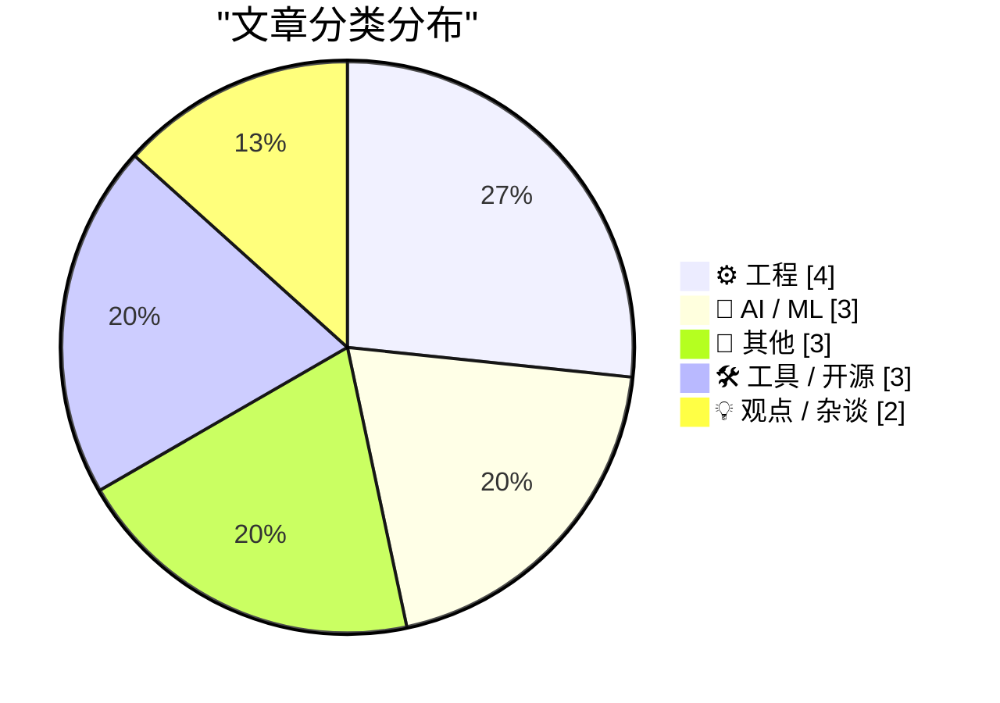
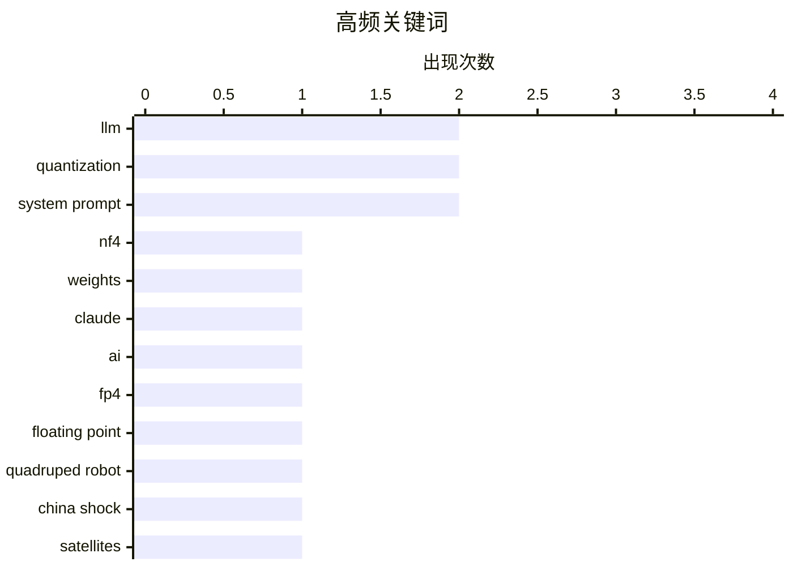

# 📰 AI 博客每日精选 — 2026-04-22

> 来自 Karpathy 推荐的 92 个顶级技术博客，AI 精选 Top 15

## 📝 今日看点

今日技术圈聚焦两大趋势：一是大语言模型优化持续深入，FP4、NF4等4位浮点格式成为降低内存与计算开销的关键突破；二是AI安全治理受关注，Claude系统提示更新引发对指令清晰度与用户交互引导机制的探讨。与此同时，工具链自动化与历史追溯能力受到开发者青睐，Git化系统提示管理成为新实践方向。

---

## 🏆 今日必读

🥇 **LLM 中的高斯分布权重**

[Gaussian distributed weights for LLMs](https://www.johndcook.com/blog/2026/04/18/qlora/) — johndcook.com · 3 天前 · 🤖 AI / ML

> 本文探讨了为大型语言模型（LLMs）设计高斯分布权重的技术方案，重点分析了 NF4 和 FP4 两种 4 位浮点格式在量化过程中的应用。NF4 是一种专为高斯分布优化的 4 位数据类型，相比标准 FP4 能更好地保持数值分布特性，提升低比特量化下的模型性能。文章指出，当从 Hugging Face 下载四比特量化的 LLM 权重时，这些权重通常采用 NF4 或 FP4 格式存储。作者强调，这种基于统计特性的量化方法显著提高了低精度推理的准确性和稳定性。

💡 **为什么值得读**: 如果你正在研究 LLM 量化技术，这篇关于 NF4 与高斯分布结合的文章提供了关键的理论基础和实用见解，值得深入阅读。

🏷️ LLM, NF4, quantization, weights

🥈 **Claude Opus 4.6 到 4.7 的系统提示变更**

[Changes in the system prompt between Claude Opus 4.6 and 4.7](https://simonwillison.net/2026/Apr/18/opus-system-prompt/#atom-everything) — simonwillison.net · 3 天前 · 🤖 AI / ML

> Anthropic 发布了 Claude Opus 4.7 的系统提示更新，这是其自 2024 年 7 月以来的首次重大调整。与 Opus 4.6 相比，新系统提示在指令清晰度、安全策略和用户交互引导方面进行了优化。通过对比两个版本的系统提示，可以观察到 Anthropic 在增强模型对齐性和减少有害输出方面的持续改进。这一变化反映了该公司对透明度和可解释性的重视。

💡 **为什么值得读**: 了解系统提示的演进有助于开发者理解模型行为变化，尤其适合关注 AI 安全和交互设计的从业者。

🏷️ Claude, system prompt, AI

🥉 **4 位浮点数 FP4**

[4-bit floating point FP4](https://www.johndcook.com/blog/2026/04/17/fp4/) — johndcook.com · 4 天前 · 🤖 AI / ML

> 本文介绍了 FP4 这一新兴的 4 位浮点格式，用于高效压缩大语言模型的参数。FP4 是 bitsandbytes 库支持的一种低精度数据类型，旨在在保持模型性能的同时大幅减少内存占用。与传统的 32 位或 64 位浮点数相比，FP4 将每个参数压缩至四分之一比特宽度，适用于边缘设备和资源受限环境。文章还讨论了 FP4 在训练与推理中的潜在优势及当前局限性。

💡 **为什么值得读**: 对于希望降低 LLM 部署成本的研究者和工程师来说，FP4 提供了一种前沿且实用的量化路径。

🏷️ FP4, floating point, quantization, LLM

---

## 📊 数据概览

| 扫描源 |    抓取文章     | 时间范围 |   精选    |
| :----: | :-------------: | :------: | :-------: |
| 85/92  | 2464 篇 → 16 篇 |   24h    | **15 篇** |

### 分类分布



### 高频关键词



<details>
<summary>📈 纯文本关键词图（终端友好）</summary>

```
llm             │ ████████████████████ 2
quantization    │ ████████████████████ 2
system prompt   │ ████████████████████ 2
nf4             │ ██████████░░░░░░░░░░ 1
weights         │ ██████████░░░░░░░░░░ 1
claude          │ ██████████░░░░░░░░░░ 1
ai              │ ██████████░░░░░░░░░░ 1
fp4             │ ██████████░░░░░░░░░░ 1
floating point  │ ██████████░░░░░░░░░░ 1
quadruped robot │ ██████████░░░░░░░░░░ 1
```

</details>

### 🏷️ 话题标签

**llm**(2) · **quantization**(2) · **system prompt**(2) · nf4(1) · weights(1) · claude(1) · ai(1) · fp4(1) · floating point(1) · quadruped robot(1) · china shock(1) · satellites(1) · git(1) · timeline(1) · blog-to-newsletter(1) · prompt engineering(1) · automation(1) · mac mini(1) · mac studio(1) · supply shortage(1)

---

## ⚙️ 工程

### 1. 将 Claude 系统提示构建为 Git 时间线

[Claude system prompts as a git timeline](https://simonwillison.net/2026/Apr/18/extract-system-prompts/#atom-everything) — **simonwillison.net** · 4 天前 · ⭐ 21/30

> Simon Willison 开发了一个工具，自动提取 Anthropic 发布的 Claude 各版本系统提示，并将其组织成可追踪的 Git 历史记录。该工具利用 Claude Code 解析官方 Markdown 文档，生成按时间排序的独立文件，便于开发者观察系统提示的演变过程。这种方法不仅提升了透明度，也为研究 AI 行为变化提供了结构化数据源。

🏷️ git, timeline, system prompt

---

### 2. 苹果应用商店评分与评论指南最佳实践

[Apple’s Developer Guidelines for Ratings and Review Prompts](https://developer.apple.com/design/human-interface-guidelines/ratings-and-reviews#Best-practices) — **daringfireball.net** · 4 天前 · ⭐ 20/30

> 苹果建议开发者遵循最佳实践来请求用户评分与评论，包括避免频繁打扰用户，并优先使用系统提供的原生提示框。推荐至少间隔一周或两周再请求，并在用户表现出进一步参与行为后再触发。这有助于提升用户体验并提高正面反馈率。

🏷️ App Store, ratings, user experience

---

### 3. 关于 App Store 评论机制再次跟进：确实存在问题

[Follow-Up Regarding App Store Reviews, Which Are Definitely Busted](https://daringfireball.net/linked/2026/04/16/app-store-reviews-are-busted) — **daringfireball.net** · 4 天前 · ⭐ 19/30

> Steven Troughton-Smith 指出，是否实现评分请求 API 是决定一款优秀应用能否获得大量正面评价的关键因素。他强烈建议开发者不要禁用该功能，因为苹果编辑团队通常只推荐那些积极争取用户反馈的应用。缺乏主动收集评论的应用容易被忽视甚至下架。

🏷️ App Store reviews, review prompts, user engagement

---

### 4. B-52 轰炸机星体跟踪器内的机电角度计算机

[The electromechanical angle computer inside the B-52 bomber's star tracker](http://www.righto.com/feeds/8382904110431912671/comments/default) — **righto.com** · 3 天前 · ⭐ 19/30

> 在 GPS 普及前，军用飞机依赖天体导航进行定位。B-52 轰炸机搭载了一套 1960 年代开发的自动化星体跟踪系统，该系统使用机电模拟计算机实时计算方位角与位置。尽管数字计算机已出现，但当时受限于可靠性与功耗，机电装置仍是首选方案。这一设计展示了早期航空航天工程中混合计算系统的巧妙应用。

🏷️ celestial navigation, B-52, electromechanical

---

## 🤖 AI / ML

### 5. LLM 中的高斯分布权重

[Gaussian distributed weights for LLMs](https://www.johndcook.com/blog/2026/04/18/qlora/) — **johndcook.com** · 3 天前 · ⭐ 27/30

> 本文探讨了为大型语言模型（LLMs）设计高斯分布权重的技术方案，重点分析了 NF4 和 FP4 两种 4 位浮点格式在量化过程中的应用。NF4 是一种专为高斯分布优化的 4 位数据类型，相比标准 FP4 能更好地保持数值分布特性，提升低比特量化下的模型性能。文章指出，当从 Hugging Face 下载四比特量化的 LLM 权重时，这些权重通常采用 NF4 或 FP4 格式存储。作者强调，这种基于统计特性的量化方法显著提高了低精度推理的准确性和稳定性。

🏷️ LLM, NF4, quantization, weights

---

### 6. Claude Opus 4.6 到 4.7 的系统提示变更

[Changes in the system prompt between Claude Opus 4.6 and 4.7](https://simonwillison.net/2026/Apr/18/opus-system-prompt/#atom-everything) — **simonwillison.net** · 3 天前 · ⭐ 24/30

> Anthropic 发布了 Claude Opus 4.7 的系统提示更新，这是其自 2024 年 7 月以来的首次重大调整。与 Opus 4.6 相比，新系统提示在指令清晰度、安全策略和用户交互引导方面进行了优化。通过对比两个版本的系统提示，可以观察到 Anthropic 在增强模型对齐性和减少有害输出方面的持续改进。这一变化反映了该公司对透明度和可解释性的重视。

🏷️ Claude, system prompt, AI

---

### 7. 4 位浮点数 FP4

[4-bit floating point FP4](https://www.johndcook.com/blog/2026/04/17/fp4/) — **johndcook.com** · 4 天前 · ⭐ 24/30

> 本文介绍了 FP4 这一新兴的 4 位浮点格式，用于高效压缩大语言模型的参数。FP4 是 bitsandbytes 库支持的一种低精度数据类型，旨在在保持模型性能的同时大幅减少内存占用。与传统的 32 位或 64 位浮点数相比，FP4 将每个参数压缩至四分之一比特宽度，适用于边缘设备和资源受限环境。文章还讨论了 FP4 在训练与推理中的潜在优势及当前局限性。

🏷️ FP4, floating point, quantization, LLM

---

## 📝 其他

### 8. 建筑物理阅读清单 2026 年 4 月 18 日

[Reading List 04/18/2026](https://www.construction-physics.com/p/reading-list-04182026) — **construction-physics.com** · 4 天前 · ⭐ 22/30

> 本期阅读清单涵盖多个跨领域话题：中国推出的 Shock 2.0 四足焊接机器人展示了自动化制造的新进展；多家 Transformer 架构初创公司获得融资，反映市场对 AI 基础模型的持续兴趣；此外，中国神秘移动卫星事件引发公众对太空活动透明度的关注。这些内容体现了科技、工业与航天领域的最新动态。

🏷️ quadruped robot, China Shock, satellites

---

### 9. 乔治亚州投票技术失误：多米尼恩机器并非如塔克·卡尔森所言那般糟糕

[Pluralistic: Georgia's voting technology blunder (18 Apr 2026)](https://pluralistic.net/2026/04/18/dominion-sucks-actually/) — **pluralistic.net** · 4 天前 · ⭐ 18/30

> 文章驳斥了塔克·卡尔森关于多米尼恩投票机存在大规模舞弊的指控，指出其所谓‘证据’缺乏事实依据。作者强调，尽管某些地区的投票系统可能存在操作或管理问题，但这并不能证明多米尼恩设备本身存在系统性故障或欺诈行为。通过分析选举审计报告和独立专家意见，文章揭示了政治叙事如何被简化为阴谋论，而忽视了技术现实与程序正义的重要性。

🏷️ voting, technology, Dominion

---

### 10. 纳税申报简史：从混乱开端到1040表格的诞生

[A Taxing Discussion](https://feed.tedium.co/link/15204/17321557/tax-forms-history-irs) — **tedium.co** · 3 天前 · ⭐ 12/30

> 文章追溯了美国联邦所得税制度自1913年引入以来的演变历程，指出最初的纳税申报同样令人困惑。早期纳税人需填写长达数十页的手写表格，分类复杂且术语模糊。随着时间推移，IRS逐步简化流程，最终催生了如今广为人知的1040系列表格，成为美国税务体系现代化的重要里程碑。

🏷️ taxes, 1040, history

---

## 🛠 工具 / 开源

### 11. 向我的博客转 Newsletter 工具添加新内容类型

[Adding a new content type to my blog-to-newsletter tool](https://simonwillison.net/guides/agentic-engineering-patterns/adding-a-new-content-type/#atom-everything) — **simonwillison.net** · 4 天前 · ⭐ 20/30

> Simon Willison 分享了他如何为其 Agentic Engineering Patterns 指南添加新的内容类型到博客转 Newsletter 的工作流程中。他使用一个简洁的提示（prompt）让 Claude Code 一次性完成内容识别、分类和格式化任务，展示了代理式工程的高效模式。该方法显著简化了内容分发流程，适用于希望自动化知识传播的个人创作者。

🏷️ blog-to-newsletter, prompt engineering, automation

---

### 12. Mac Mini 和 Mac Studio 供应短缺

[Mac Mini and Mac Studio Supply Shortages](https://www.wsj.com/tech/personal-tech/apple-mac-mini-supply-3e7a7509?st=fKpr4Q) — **daringfireball.net** · 3 天前 · ⭐ 20/30

> 苹果官网显示，配备大容量内存的 Mac Mini 型号（如 M4 基础款 32GB RAM 起售价 $999 和 M4 Pro 64GB RAM 起售价 $1,999）目前“暂时缺货”。其他型号预计等待发货时间为一个月，部分长达 12 周。Mac Studio 的短缺情况更为严重，反映出高端 Mac 产品线面临供应链压力。

🏷️ Mac Mini, Mac Studio, supply shortage

---

### 13. 5x5像素字体：专为极小屏幕设计的最小可读字体

[5x5 Pixel font for tiny screens](https://maurycyz.com/projects/mcufont/) — **maurycyz.com** · 4 天前 · ⭐ 17/30

> 该项目推出了一款仅占5×5像素的嵌入式字体（mcufont），专为资源受限的微控制器显示设计。该字体在6×6网格内安全渲染所有字符，是确保可读性的最小尺寸——2×2至4×4像素均无法清晰呈现字母如E、M或W。其设计灵感源自lcamtuf的5x6-inline.h字体和ZX Spectrum的8x8字体，实现了极致紧凑与视觉辨识度的平衡。

🏷️ pixel font, tiny screens, C header

---

## 💡 观点 / 杂谈

### 14. 大多数反AI言论其实是保守主义论点

[Many anti-AI arguments are conservative arguments](https://seangoedecke.com/many-anti-ai-arguments-are-conservative/) — **seangoedecke.com** · 4 天前 · ⭐ 17/30

> 作者认为，当前流行的反AI rhetoric 表面上披着左翼外衣，实则反映的是传统保守价值观。许多批评将AI描绘成‘技术法西斯主义’工具，并聚焦于碳排放等左翼关切，但其核心诉求——如维护现有权力结构、抵制快速变革、强调人类劳动价值——更符合保守主义立场。文章指出，这种话语策略模糊了真正的意识形态分歧，使反AI运动脱离了左翼对公平与民主的追求。

🏷️ anti-AI, politics, conservatism

---

### 15. 我们在工作中都在玩政治游戏

[We Are All Playing Politics at Work](https://idiallo.com/blog/we-are-playing-politics?src=feed) — **idiallo.com** · 4 天前 · ⭐ 15/30

> 作者提出，任何讨论中若真相不主导决策过程，就属于政治范畴。许多人误以为职场应纯粹理性，但现实中人们常受利益、关系和身份影响而做出非事实驱动的选择。试图将政治与工作分离是一种天真幻想，因为人类本质上是政治动物，必须在复杂环境中权衡多方因素。

🏷️ workplace politics, rationality, decision making

---

_生成于 2026-04-22 13:29 | 扫描 85 源 → 获取 2464 篇 → 精选 15 篇_
_基于 [Hacker News Popularity Contest 2025](https://refactoringenglish.com/tools/hn-popularity/) RSS 源列表，由 [Andrej Karpathy](https://x.com/karpathy) 推荐_
_由「懂点儿AI」制作，欢迎关注同名微信公众号获取更多 AI 实用技巧 💡_
