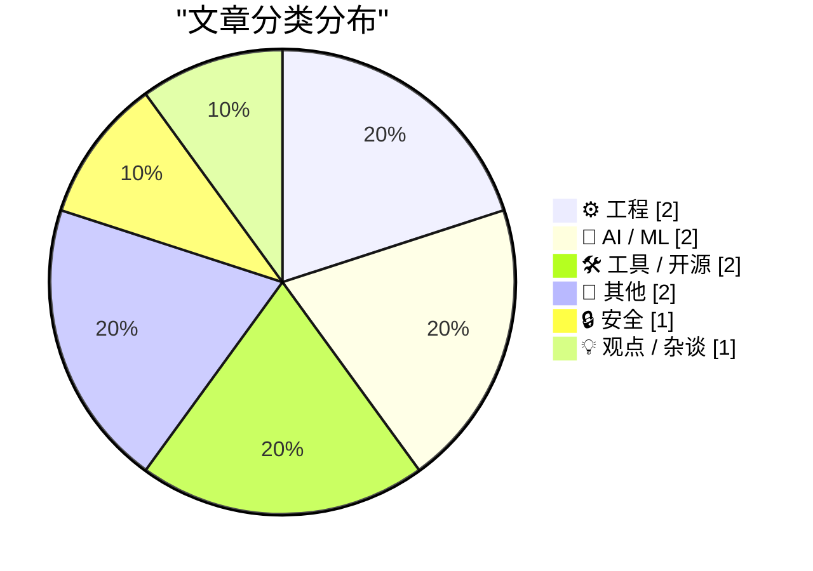
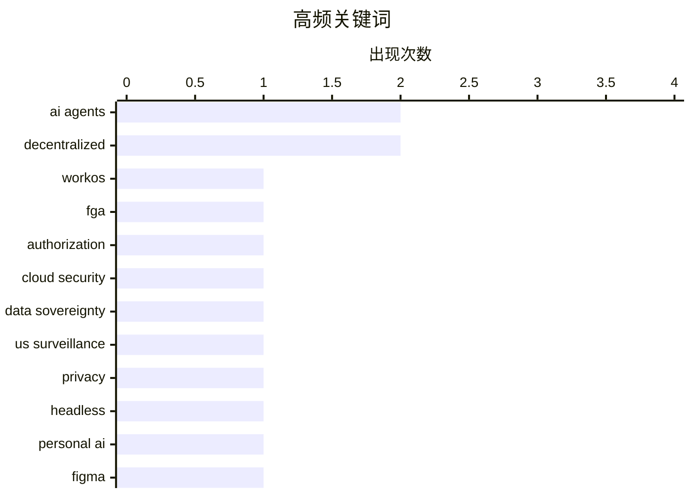

# 📰 AI 博客每日精选 — 2026-04-22

> 来自 Karpathy 推荐的 92 个顶级技术博客，AI 精选 Top 10

## 📝 今日看点

今日技术圈聚焦三大趋势：企业加速构建 AI 代理的精细化授权体系，WorkOS FGA 等方案凸显权限控制对安全部署的关键作用；同时，无头服务架构正成为个人 AI 自动化的新方向，提升效率与可靠性；此外，AI 工具冲击传统平台格局，Figma 面临 Claude Design 挑战，暴露商业模式在智能化浪潮中的脆弱性。

---

## 🏆 今日必读

🥇 **WorkOS FGA：面向 AI 代理的授权层**

[WorkOS FGA: The Authorization Layer for AI Agents](https://workos.com/blog/agents-need-authorization-not-just-authentication?utm_source=daringfireball&utm_medium=newsletter&utm_campaign=q22026) — daringfireball.net · 2 天前 · ⚙️ 工程

> 文章探讨了企业级 AI 代理部署中的核心瓶颈——授权而非身份验证。WorkOS FGA 通过资源级权限控制代理的操作范围，解决了传统认证无法限制“破坏半径”的问题。该方案使企业能在不牺牲功能的前提下安全地集成 AI 代理。作者强调，企业级 AI 的成功不在于功能多少，而在于能否被信任和管控。

💡 **为什么值得读**: 如果你正在构建或部署企业级 AI 代理系统，这篇关于细粒度授权的深度解析能帮你避免最隐蔽的安全陷阱。

🏷️ WorkOS, FGA, authorization, AI agents

🥈 **大科技云堆叠纸张并不能变得更安全**

[Big tech clouds worden niet veiliger met stapels papier](https://berthub.eu/articles/posts/big-tech-clouds-niet-veiliger-met-papier/) — berthub.eu · 2 天前 · 🔒 安全

> 文章指出，将社会、政府和企业的数据托管在美国服务器上存在根本性安全风险。即使数据存储在欧洲，美国仍可通过三项法律工具获取访问权限，导致用户完全失控。这种结构性依赖使得任何‘特殊协议’都无法改变现实中的监控权力。作者认为，缺乏有效制衡机制的情况下，依赖美国云服务本质上是不可持续的。

💡 **为什么值得读**: 了解这些法律漏洞如何绕过地理边界，对任何考虑使用主流云服务的组织都至关重要。

🏷️ cloud security, data sovereignty, US surveillance, privacy

🥉 **个人 AI 的无头化未来**

[Headless everything for personal AI](https://simonwillison.net/2026/Apr/19/headless-everything/#atom-everything) — simonwillison.net · 2 天前 · 🤖 AI / ML

> Matt Webb 提出无头服务（headless services）将成为个人 AI 的主流交互方式。相比直接操作 GUI，无头 API 更高效、可靠，更适合由 AI 驱动的自动化流程。这种架构变革将推动软件从可视化界面向可编程接口演进，提升 AI 代理的执行效率与稳定性。

💡 **为什么值得读**: 如果你在规划下一代 AI 应用架构，理解无头服务的优势将帮助你设计更高效的自动化系统。

🏷️ headless, personal AI, AI agents, decentralized

---

## 📊 数据概览

| 扫描源 |    抓取文章     | 时间范围 |   精选    |
| :----: | :-------------: | :------: | :-------: |
| 85/92  | 2464 篇 → 10 篇 |   24h    | **10 篇** |

### 分类分布



### 高频关键词



<details>
<summary>📈 纯文本关键词图（终端友好）</summary>

```
ai agents        │ ████████████████████ 2
decentralized    │ ████████████████████ 2
workos           │ ██████████░░░░░░░░░░ 1
fga              │ ██████████░░░░░░░░░░ 1
authorization    │ ██████████░░░░░░░░░░ 1
cloud security   │ ██████████░░░░░░░░░░ 1
data sovereignty │ ██████████░░░░░░░░░░ 1
us surveillance  │ ██████████░░░░░░░░░░ 1
privacy          │ ██████████░░░░░░░░░░ 1
headless         │ ██████████░░░░░░░░░░ 1
```

</details>

### 🏷️ 话题标签

**ai agents**(2) · **decentralized**(2) · **workos**(1) · fga(1) · authorization(1) · cloud security(1) · data sovereignty(1) · us surveillance(1) · privacy(1) · headless(1) · personal ai(1) · figma(1) · claude design(1) · ai design tools(1) · product strategy(1) · wander console(1) · self-hosted(1) · web console(1) · ffmpeg(1) · dual fisheye(1)

---

## ⚙️ 工程

### 1. WorkOS FGA：面向 AI 代理的授权层

[WorkOS FGA: The Authorization Layer for AI Agents](https://workos.com/blog/agents-need-authorization-not-just-authentication?utm_source=daringfireball&utm_medium=newsletter&utm_campaign=q22026) — **daringfireball.net** · 2 天前 · ⭐ 26/30

> 文章探讨了企业级 AI 代理部署中的核心瓶颈——授权而非身份验证。WorkOS FGA 通过资源级权限控制代理的操作范围，解决了传统认证无法限制“破坏半径”的问题。该方案使企业能在不牺牲功能的前提下安全地集成 AI 代理。作者强调，企业级 AI 的成功不在于功能多少，而在于能否被信任和管控。

🏷️ WorkOS, FGA, authorization, AI agents

---

### 2. 日立公司简史（第二部分）：H8、PA-RISC 和 SuperH 架构

[Hitachi Ltd, Part II](https://www.abortretry.fail/p/hitachi-ltd-part-ii) — **abortretry.fail** · 2 天前 · ⭐ 11/30

> 本文继续探讨日立公司在计算机处理器领域的贡献，重点介绍 H8 微控制器系列、PA-RISC 高性能 RISC 架构以及 SuperH 精简指令集处理器。这些技术展现了日本企业在半导体和嵌入式系统领域的重要创新。

🏷️ Hitachi, H8, PA-RISC, SuperH

---

## 🤖 AI / ML

### 3. 个人 AI 的无头化未来

[Headless everything for personal AI](https://simonwillison.net/2026/Apr/19/headless-everything/#atom-everything) — **simonwillison.net** · 2 天前 · ⭐ 24/30

> Matt Webb 提出无头服务（headless services）将成为个人 AI 的主流交互方式。相比直接操作 GUI，无头 API 更高效、可靠，更适合由 AI 驱动的自动化流程。这种架构变革将推动软件从可视化界面向可编程接口演进，提升 AI 代理的执行效率与稳定性。

🏷️ headless, personal AI, AI agents, decentralized

---

### 4. Figma 困境加剧：Claude Design 的冲击

[Figma's woes compound with Claude Design](https://martinalderson.com/posts/figmas-woes-compound-with-claude-design/?utm_source=rss&utm_medium=rss&utm_campaign=feed) — **martinalderson.com** · 3 天前 · ⭐ 22/30

> Figma 过度依赖非设计师席位定价策略，使其在 AI 设计工具竞争中处于劣势。Anthropic 推出的 Claude Design 直接挑战其市场地位，暴露了 Figma 商业模式的结构性脆弱。这一变化凸显了传统设计平台在 AI 时代面临的转型压力。

🏷️ Figma, Claude Design, AI design tools, product strategy

---

## 🛠 工具 / 开源

### 5. Wander Console 0.5.0 发布：去中心化网络探索控制台

[Wander Console 0.5.0](https://susam.net/code/news/wander/0.5.0.html) — **susam.net** · 3 天前 · ⭐ 20/30

> Wander Console 0.5.0 是第五个版本更新，新增内置网络爬虫功能，支持访客通过社区推荐探索独立网站。这是一个去中心化的自托管控制台项目，允许网站所有者分享精选内容链接。用户可直接访问 susam.net/wander/ 体验，并通过 README 文档了解部署方法。

🏷️ Wander Console, self-hosted, web console, decentralized

---

### 6. 将双鱼眼视频重投影为等矩形格式（LG 360 相机）

[Reprojecting Dual Fisheye Videos to Equirectangular (LG 360)](https://shkspr.mobi/blog/2026/04/reprojecting-dual-fisheye-videos-to-equirectangular-lg-360/) — **shkspr.mobi** · 3 天前 · ⭐ 17/30

> 针对 LG 360 相机拍摄的双鱼眼格式 MP4 视频，文章提供了使用 ffmpeg 转换为等矩形格式的完整命令：`ffmpeg -i original.mp4 -vf "v360=input=dfisheye:output=equirect:ih_fov=189:iv_fov=189" output.mp4`。转换后可被 VLC 和 YouTube 正确识别为球形视频。

🏷️ ffmpeg, dual fisheye, equirectangular, 360 video

---

## 📝 其他

### 7. 连接机器：早期车载电脑故障回忆

[Hook It Up to the Machine](https://blog.jim-nielsen.com/2026/hook-it-up-to-the-machine/) — **blog.jim-nielsen.com** · 2 天前 · ⭐ 11/30

> 作者回忆 2000 年代初家庭旅行中道奇凯领面包车频繁过热的问题，特别是在低于 40MPH 速度时温度表进入危险区域。这段经历反映了早期车载电子系统在可靠性方面的不足，以及现代汽车诊断技术的发展历程。

🏷️ road trip, family van, nostalgia, Glacier National Park

---

### 8. 杰西卡·查斯坦确认 Apple TV+ 将上映《天才》

[Jessica Chastain Says Apple TV Will Finally Release ‘The Savant’](https://variety.com/2026/tv/columns/jessica-chastain-apple-tv-finally-release-the-savant-after-postponement-charlie-kirk-assassination-1236725384/) — **daringfireball.net** · 2 天前 · ⭐ 9/30

> 杰西卡·查斯坦在突破奖典礼上独家透露，Apple TV+ 已确定将于 7 月上映她的政治惊悚剧《天才》（The Savant）。此前该剧因查理·基尔克遇刺事件多次延期，现在终于有了明确上映时间。

🏷️ Apple TV, Jessica Chastain, The Savant, TV series

---

## 🔒 安全

### 9. 大科技云堆叠纸张并不能变得更安全

[Big tech clouds worden niet veiliger met stapels papier](https://berthub.eu/articles/posts/big-tech-clouds-niet-veiliger-met-papier/) — **berthub.eu** · 2 天前 · ⭐ 25/30

> 文章指出，将社会、政府和企业的数据托管在美国服务器上存在根本性安全风险。即使数据存储在欧洲，美国仍可通过三项法律工具获取访问权限，导致用户完全失控。这种结构性依赖使得任何‘特殊协议’都无法改变现实中的监控权力。作者认为，缺乏有效制衡机制的情况下，依赖美国云服务本质上是不可持续的。

🏷️ cloud security, data sovereignty, US surveillance, privacy

---

## 💡 观点 / 杂谈

### 10. 什么是自由？—— ChatGPT 眼中的政治自由 vs 实际自由

[What is freedom?](https://geohot.github.io//blog/jekyll/update/2026/04/20/what-is-freedom.html) — **geohot.github.io** · 2 天前 · ⭐ 15/30

> ChatGPT 在讨论中美自由差异时，过度聚焦政治抗议和异议表达，而忽略了安全、选择性和便利性等实际自由维度。作者指出，真正的自由应包含生活质量的多个方面，而非仅限于政治权利。这种认知偏差揭示了 AI 模型在价值观理解上的局限性。

🏷️ freedom, ChatGPT, AI bias, geopolitics

---

_生成于 2026-04-22 13:32 | 扫描 85 源 → 获取 2464 篇 → 精选 10 篇_
_基于 [Hacker News Popularity Contest 2025](https://refactoringenglish.com/tools/hn-popularity/) RSS 源列表，由 [Andrej Karpathy](https://x.com/karpathy) 推荐_
_由「懂点儿AI」制作，欢迎关注同名微信公众号获取更多 AI 实用技巧 💡_
