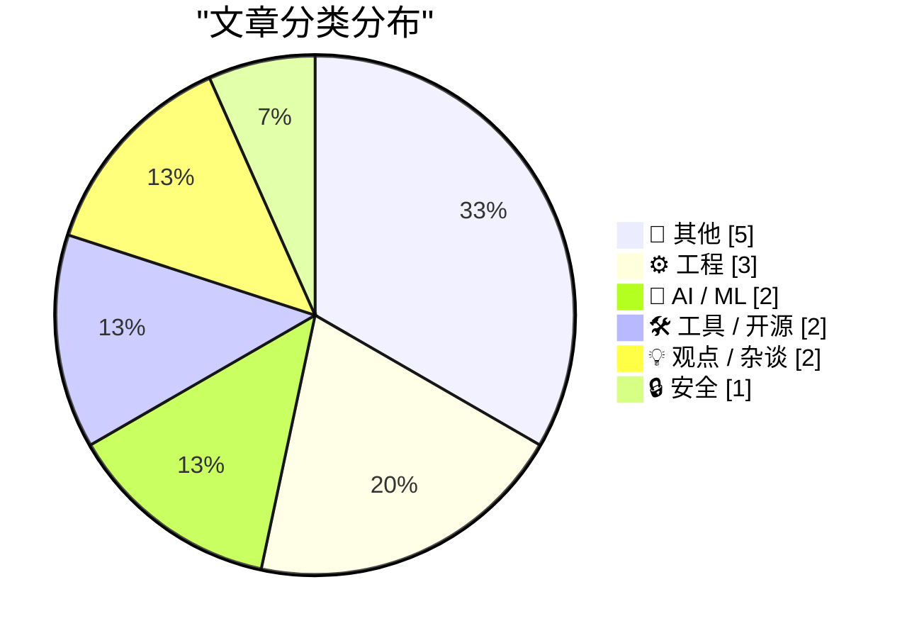
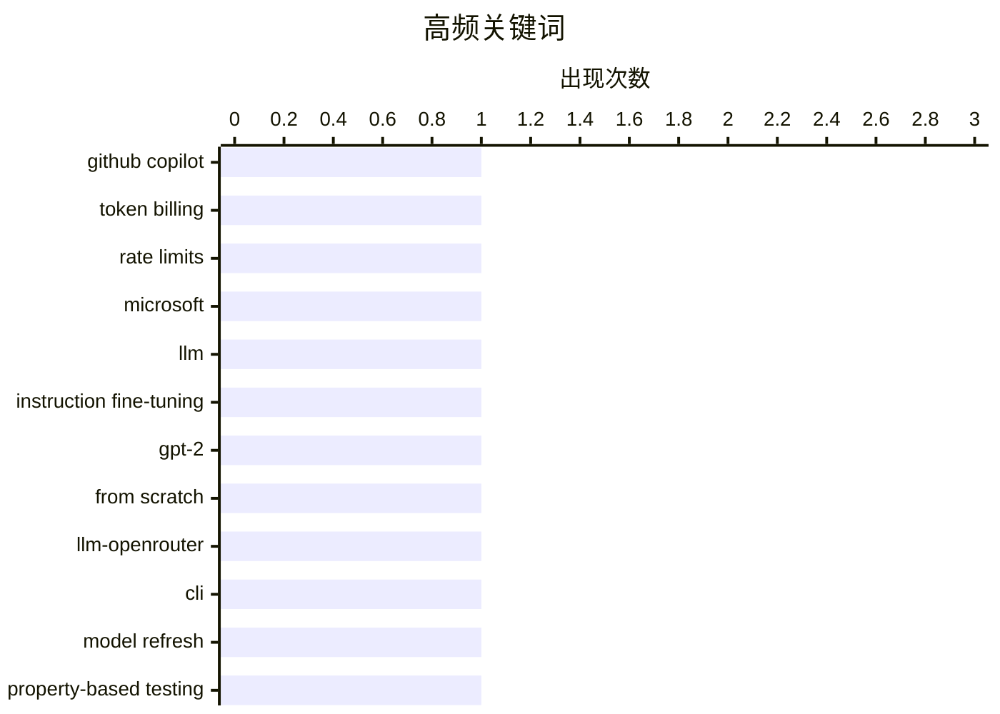

# 📰 AI 博客每日精选 — 2026-04-22

> 来自 Karpathy 推荐的 92 个顶级技术博客，AI 精选 Top 15

## 📝 今日看点

今日技术圈聚焦三大趋势：AI 工具商业化加速，微软调整 GitHub Copilot 计费模式并收紧使用限制，反映大模型服务成本压力上升；开发者持续探索 LLM 底层能力，从自建模型微调到 Claude Token Counter 升级，凸显对 AI 可控性与效率的深度优化；同时，行业关注长期技术演进，戈登·摩尔逝世引发对芯片发展规律的再思考，而苹果高管交接与碳中和进展则体现科技巨头在战略传承与可持续发展上的布局。

---

## 🏆 今日必读

🥇 **微软将把 GitHub Copilot 用户转向基于 Token 的计费模式并收紧速率限制**

[Exclusive: Microsoft To Shift GitHub Copilot Users To Token-Based Billing, Tighten Rate Limits](https://www.wheresyoured.at/news-microsoft-to-shift-github-copilot-users-to-token-based-billing-reduce-rate-limits-2/) — wheresyoured.at · 1 天前 · 🔒 安全

> 微软计划暂停个人账号注册 GitHub Copilot，并过渡到基于 Token 的计费系统，取代原有的按请求次数计费模式。内部文件显示，自推出以来，GitHub Copilot 每周运行成本已翻倍。此举旨在优化资源使用并控制服务成本，同时可能影响用户的访问频率和支出结构。

💡 **为什么值得读**: 这一变化直接影响数百万开发者的使用成本和体验，是理解 AI 生产力工具商业化路径的关键信号。

🏷️ GitHub Copilot, token billing, rate limits, Microsoft

🥈 **从零开始构建 LLM（第32部分）：干预措施与指令微调结果更新**

[Writing an LLM from scratch, part 32l -- Interventions: updated instruction fine-tuning results](https://www.gilesthomas.com/2026/04/llm-from-scratch-32l-interventions-instruction-fine-tuning-tests) — gilesthomas.com · 1 天前 · 🤖 AI / ML

> 作者基于 Sebastian Raschka 的《Build a Large Language Model (from Scratch)》一书，训练了一个类 GPT-2-small 模型，并通过多种干预手段提升其在测试集上的损失表现。实验包括指令微调等策略，目标是逼近 OpenAI GPT-2-small 的质量水平。

💡 **为什么值得读**: 为那些希望深入理解 LLM 训练细节和性能优化方法的技术爱好者提供了可复现的实践参考。

🏷️ LLM, instruction fine-tuning, GPT-2, from scratch

🥉 **llm-openrouter 0.6 发布：新增模型刷新命令**

[llm-openrouter 0.6](https://simonwillison.net/2026/Apr/20/llm-openrouter/#atom-everything) — simonwillison.net · 1 天前 · 🛠 工具 / 开源

> Simon Willison 发布了 llm-openrouter 插件版本 0.6，新增 `llm openrouter refresh` 命令，允许用户无需等待缓存过期即可立即获取 OpenRouter 上最新可用的模型列表。此功能便于快速尝试如 Kimi K2.6 等新发布的模型。

💡 **为什么值得读**: 对使用 CLI 工具链集成多模态 API 的开发者而言，这是提升工作流效率的重要更新。

🏷️ llm-openrouter, CLI, model refresh

---

## 📊 数据概览

| 扫描源 |    抓取文章     | 时间范围 |   精选    |
| :----: | :-------------: | :------: | :-------: |
| 86/92  | 2492 篇 → 19 篇 |   24h    | **15 篇** |

### 分类分布



### 高频关键词



<details>
<summary>📈 纯文本关键词图（终端友好）</summary>

```
github copilot          │ ████████████████████ 1
token billing           │ ████████████████████ 1
rate limits             │ ████████████████████ 1
microsoft               │ ████████████████████ 1
llm                     │ ████████████████████ 1
instruction fine-tuning │ ████████████████████ 1
gpt-2                   │ ████████████████████ 1
from scratch            │ ████████████████████ 1
llm-openrouter          │ ████████████████████ 1
cli                     │ ████████████████████ 1
```

</details>

### 🏷️ 话题标签

**github copilot**(1) · **token billing**(1) · **rate limits**(1) · microsoft(1) · llm(1) · instruction fine-tuning(1) · gpt-2(1) · from scratch(1) · llm-openrouter(1) · cli(1) · model refresh(1) · property-based testing(1) · test minimization(1) · fuzzing(1) · claude(1) · token counter(1) · model comparison(1) · moore's law(1) · semiconductor(1) · transistor density(1)

---

## 📝 其他

### 1. 蒂姆·库克转任苹果执行董事长，约翰·特努斯接任 CEO

[Apple: ‘Tim Cook to Become Apple Executive Chairman; John Ternus to Become Apple CEO’](https://www.apple.com/newsroom/2026/04/tim-cook-to-become-apple-executive-chairman-john-ternus-to-become-apple-ceo/) — **daringfireball.net** · 1 天前 · ⭐ 17/30

> 苹果公司宣布，蒂姆·库克将于2026年9月1日起担任董事会执行主席，原硬件工程高级副总裁约翰·特努斯将接任首席执行官。此次交接经过长期规划，库克将继续以 CEO 身份履职至夏季。

🏷️ Apple CEO transition, John Ternus, Tim Cook

---

### 2. 苹果发布年度环境进展报告：2030碳中和目标稳步推进

[Apple’s Annual Environmental Progress Report](https://www.apple.com/newsroom/2026/04/apple-accelerates-progress-with-highest-ever-recycled-material-in-its-products/) — **daringfireball.net** · 1 天前 · ⭐ 16/30

> 苹果在其2025年度环境进展报告中宣布，温室气体排放较2015年下降超60%，并保持稳定增长态势。公司在可再生能源、材料创新与回收方面取得显著进展，持续推进‘2030碳中和’目标。

🏷️ Apple, carbon neutral, environmental report

---

### 3. 向上：科学家眼中的天空魔法

[Book Review: Up - A scientist's guide to the magic above us by Dr Lucy Rogers ★★★★★](https://shkspr.mobi/blog/2026/04/book-review-up-a-scientists-guide-to-the-magic-above-us-by-dr-lucy-rogers/) — **shkspr.mobi** · 2 天前 · ⭐ 16/30

> Dr. Lucy Rogers 的新书《Up》以亲切、充满个人色彩的方式探索了人类头顶之上的科学世界。书中融合了大量科学知识、趣闻轶事和对发现的热情，语言轻松自然，鼓励读者在日常生活中进行“家庭科学”实践。该书被评价为极具可读性，适合对太空、航空和基础工程感兴趣的普通读者。作者通过真实故事和直观解释，将复杂的物理与工程概念变得易于理解。这本书不仅传递知识，更激发人们对头顶这片“魔法”世界的持续好奇。

🏷️ Lucy Rogers, science book, aerospace

---

### 4. 间隔重复学习法入门指南/FAQ

[Spaced Repetition: Beginner Guide/FAQ](https://entropicthoughts.com/spaced-repetition-beginner-guide-faq) — **entropicthoughts.com** · 1 天前 · ⭐ 16/30

> 本文是一份面向初学者的间隔重复（Spaced Repetition）学习方法的简明指南。它解释了间隔重复如何通过基于记忆曲线的算法安排复习时间，从而显著提升长期记忆效率。文章还解答了常见问题，如如何选择工具、避免常见误区，以及该方法在不同学科中的应用效果。研究表明，正确使用间隔重复可使学习效率提高30%以上。

🏷️ spaced repetition, learning techniques

---

### 5. 牛顿直径定理再探：五次曲线的新视角

[More on Newton’s diameter theorem](https://www.johndcook.com/blog/2026/04/20/newton-diameter-quintic/) — **johndcook.com** · 1 天前 · ⭐ 13/30

> John D. Cook 进一步探讨了牛顿直径定理——该定理指出，对于次数为 n 的多项式方程 f(x, y) = 0 所定义的曲线，当绘制多条平行线与其相交于 n 个点时，这些交点中点轨迹的包络线即为曲线的直径。本文聚焦于五次多项式曲线的情况，展示了如何通过几何构造揭示高次代数曲线的对称性与极值特性。这一方法为理解复杂代数簇的结构提供了有力工具。

🏷️ Newton's diameter theorem, polynomial curves

---

## ⚙️ 工程

### 6. 戈登·摩尔与摩尔定律

[Gordon Moore and Moore’s Law](https://dfarq.homeip.net/gordon-moore-and-moores-law/?utm_source=rss&utm_medium=rss&utm_campaign=gordon-moore-and-moores-law) — **dfarq.homeip.net** · 2 天前 · ⭐ 18/30

> 戈登·摩尔（1929–2023）是英特尔联合创始人，他提出的摩尔定律指出集成电路上的晶体管数量大约每两年翻一番。该定律长期指导半导体行业发展，并成为技术进步的重要衡量标准。

🏷️ Moore's Law, semiconductor, transistor density

---

### 7. Google Sheets 中使用 SQL 函数从 Datasette 获取数据

[SQL functions in Google Sheets to fetch data from Datasette](https://simonwillison.net/2026/Apr/20/datasette-sql/#atom-everything) — **simonwillison.net** · 2 天前 · ⭐ 17/30

> Simon Willison 分享了三种将 Datasette 数据库中的数据直接导入 Google Sheets 的方法：使用 importdata() 函数、自定义命名函数，或通过 Google Apps Script 发送 API 认证头（importdata() 不支持此功能）。这些模式简化了外部数据集成流程。

🏷️ Google Sheets, Datasette, SQL integration

---

### 8. 24位像素格式在银行切换显存下的处理方式

[How did code handle 24-bit-per-pixel formats when using video cards with bank-switched memory?](https://devblogs.microsoft.com/oldnewthing/20260420-00/?p=112245) — **devblogs.microsoft.com/oldnewthing** · 1 天前 · ⭐ 16/30

> 该文探讨了在早期使用银行切换内存的视频卡上如何处理24位每像素（24bpp）图像格式的技术挑战。尽管像素数据可能未对齐，开发者仍需坚持使用对齐访问以确保正确性和性能。文章回顾了历史代码的实现策略，强调即使在非对齐情况下，内存访问的边界检查仍是关键。这种设计决策影响了早期图形编程的实践，并为现代GPU驱动开发提供了历史参考。

🏷️ video memory, bank-switched memory, pixel alignment

---

## 🤖 AI / ML

### 9. 从零开始构建 LLM（第32部分）：干预措施与指令微调结果更新

[Writing an LLM from scratch, part 32l -- Interventions: updated instruction fine-tuning results](https://www.gilesthomas.com/2026/04/llm-from-scratch-32l-interventions-instruction-fine-tuning-tests) — **gilesthomas.com** · 1 天前 · ⭐ 25/30

> 作者基于 Sebastian Raschka 的《Build a Large Language Model (from Scratch)》一书，训练了一个类 GPT-2-small 模型，并通过多种干预手段提升其在测试集上的损失表现。实验包括指令微调等策略，目标是逼近 OpenAI GPT-2-small 的质量水平。

🏷️ LLM, instruction fine-tuning, GPT-2, from scratch

---

### 10. Claude Token Counter 升级：支持跨模型令牌数对比

[Claude Token Counter, now with model comparisons](https://simonwillison.net/2026/Apr/20/claude-token-counts/#atom-everything) — **simonwillison.net** · 2 天前 · ⭐ 20/30

> Simon Willison 更新了 Claude Token Counter 工具，新增对不同 Claude 模型（如 Opus 4.7 与 4.6）进行令牌计数对比的功能。由于 Opus 4.7 是唯一改变分词器的版本，该比较仅对 4.7 和 4.6 有意义。

🏷️ Claude, token counter, model comparison

---

## 🛠 工具 / 开源

### 11. llm-openrouter 0.6 发布：新增模型刷新命令

[llm-openrouter 0.6](https://simonwillison.net/2026/Apr/20/llm-openrouter/#atom-everything) — **simonwillison.net** · 1 天前 · ⭐ 22/30

> Simon Willison 发布了 llm-openrouter 插件版本 0.6，新增 `llm openrouter refresh` 命令，允许用户无需等待缓存过期即可立即获取 OpenRouter 上最新可用的模型列表。此功能便于快速尝试如 Kimi K2.6 等新发布的模型。

🏷️ llm-openrouter, CLI, model refresh

---

### 12. 256 行以内实现测试用例最小化

[256 Lines or Less: Test Case Minimization](https://matklad.github.io/2026/04/20/test-case-minimization.html) — **matklad.github.io** · 2 天前 · ⭐ 22/30

> 本文介绍一个可在短短几百行代码中实现的轻量级属性测试（PBT）库，用于自动最小化失败测试用例。尽管 PBT 和模糊测试技术复杂深奥，但作者展示了其核心思想可通过简洁代码表达，适用于调试和回归测试场景。

🏷️ property-based testing, test minimization, fuzzing

---

## 💡 观点 / 杂谈

### 13. Pluralistic：战友特朗普——烧掉美国帝国以拯救它

[Pluralistic: Comrade Trump (20 Apr 2026)](https://pluralistic.net/2026/04/20/praxis/) — **pluralistic.net** · 1 天前 · ⭐ 16/30

> 尼尔·斯蒂芬森在专栏中探讨特朗普的政治哲学本质：通过激进破坏现有秩序来重构国家认同。文章穿插分析 MPAA 教育威胁、AT&T 与互联网之争、英国避税港等多个议题，批判新自由主义体制。

🏷️ Trump, neoliberalism, MPAA

---

### 14. 我们是如何失去当下的生活

[How we lost the living Now](https://www.joanwestenberg.com/how-we-lost-the-living-now/) — **joanwestenberg.com** · 2 天前 · ⭐ 15/30

> 文章追溯了从19世纪铁路时代开始的时间标准化进程，指出原本各地存在本地太阳时的现象（如布里斯托尔正午比伦敦晚约10分钟）。随着铁路需要统一时间运行，标准时区被强制推行，最终演变为全球同步的精确到纳秒的时间体系。这一变革虽提升了交通效率，但也导致人们失去了与自然节律同步的‘活在此时刻’的生活方式。

🏷️ time synchronization, real-time systems, historical context

---

## 🔒 安全

### 15. 微软将把 GitHub Copilot 用户转向基于 Token 的计费模式并收紧速率限制

[Exclusive: Microsoft To Shift GitHub Copilot Users To Token-Based Billing, Tighten Rate Limits](https://www.wheresyoured.at/news-microsoft-to-shift-github-copilot-users-to-token-based-billing-reduce-rate-limits-2/) — **wheresyoured.at** · 1 天前 · ⭐ 26/30

> 微软计划暂停个人账号注册 GitHub Copilot，并过渡到基于 Token 的计费系统，取代原有的按请求次数计费模式。内部文件显示，自推出以来，GitHub Copilot 每周运行成本已翻倍。此举旨在优化资源使用并控制服务成本，同时可能影响用户的访问频率和支出结构。

🏷️ GitHub Copilot, token billing, rate limits, Microsoft

---

_生成于 2026-04-22 13:39 | 扫描 86 源 → 获取 2492 篇 → 精选 15 篇_
_基于 [Hacker News Popularity Contest 2025](https://refactoringenglish.com/tools/hn-popularity/) RSS 源列表，由 [Andrej Karpathy](https://x.com/karpathy) 推荐_
_由「懂点儿AI」制作，欢迎关注同名微信公众号获取更多 AI 实用技巧 💡_
