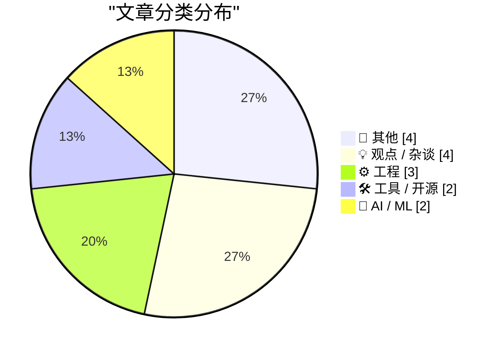
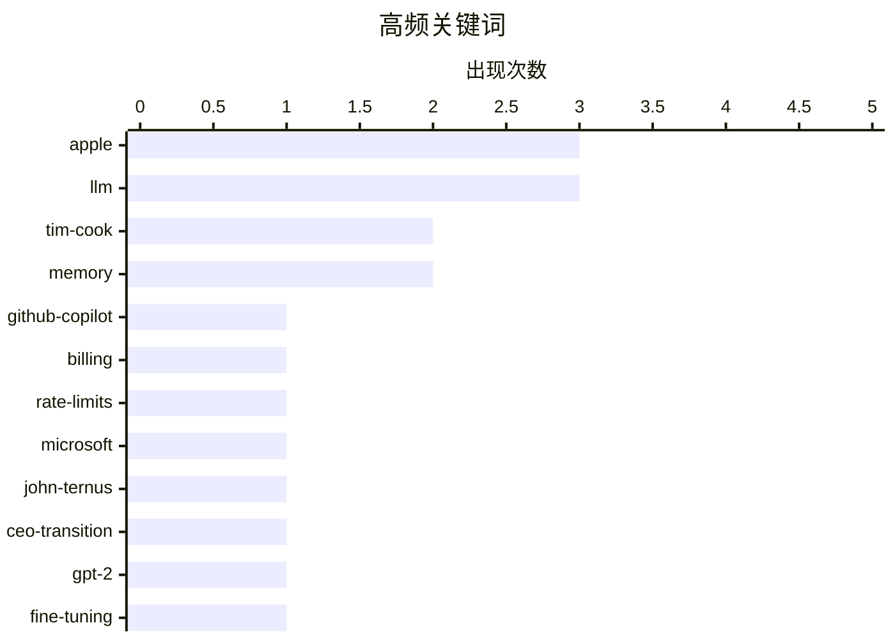

# 📰 AI 博客每日精选 — 2026-04-22

> 来自 Karpathy 推荐的 92 个顶级技术博客，AI 精选 Top 15

## 📝 今日看点

今日技术圈聚焦三大动向：AI工具商业化加速，微软拟将GitHub Copilot转向按Token计费并收紧限制，反映大模型服务成本压力与精细化运营趋势；苹果完成高层交接，蒂姆·库克转任执行董事长，标志公司进入后库克时代，战略延续性与创新方向备受关注；同时，开发者工具持续优化，从LLM训练实验到测试用例最小化、模型列表刷新等实践，凸显工程效率与开源生态的协同进化。

---

## 🏆 今日必读

🥇 **独家：微软拟将 GitHub Copilot 用户转向按 Token 计费，并收紧速率限制**

[Exclusive: Microsoft To Shift GitHub Copilot Users To Token-Based Billing, Tighten Rate Limits](https://www.wheresyoured.at/news-microsoft-to-shift-github-copilot-users-to-token-based-billing-reduce-rate-limits-2/) — wheresyoured.at · 1 天前 · 🛠 工具 / 开源

> 微软计划暂停 GitHub Copilot 个人账户注册，推动从按请求计费向基于 Token 的计费模式过渡。内部文件显示，GitHub Copilot 的周运营成本自推出以来已翻倍。此举旨在优化资源分配并控制不断攀升的 AI 推理开销。新计费模型将更精确反映用户实际消耗的模型计算量。

💡 **为什么值得读**: 了解微软如何调整其核心 AI 编程工具的商业化策略，对开发者成本规划和 Copilot 未来使用体验有直接影响。

🏷️ GitHub-Copilot, billing, rate-limits, Microsoft

🥈 **苹果宣布高管交接：蒂姆·库克转任执行董事长，约翰·特努斯接任 CEO**

[Apple: ‘Tim Cook to Become Apple Executive Chairman; John Ternus to Become Apple CEO’](https://www.apple.com/newsroom/2026/04/tim-cook-to-become-apple-executive-chairman-john-ternus-to-become-apple-ceo/) — daringfireball.net · 1 天前 · 📝 其他

> 苹果公司于2026年9月1日起正式实施领导层交接，蒂姆·库克将转任董事会执行董事长，原硬件工程高级副总裁约翰·特努斯接任首席执行官。此次人事变动经董事会一致批准，是苹果长期继任计划的结果。库克将在夏季继续担任 CEO，并与特努斯密切协作以确保平稳过渡。

💡 **为什么值得读**: 苹果这一重大人事变动标志着公司进入后库克时代，对科技行业格局和苹果未来战略方向具有深远意义。

🏷️ apple, tim-cook, john-ternus, ceo-transition

🥉 **从零构建 LLM（第32部分）：干预实验与指令微调结果更新**

[Writing an LLM from scratch, part 32l -- Interventions: updated instruction fine-tuning results](https://www.gilesthomas.com/2026/04/llm-from-scratch-32l-interventions-instruction-fine-tuning-tests) — gilesthomas.com · 1 天前 · 🤖 AI / ML

> 作者基于 Sebastian Raschka 的《Build a Large Language Model (from Scratch)》一书，持续开发一个类 GPT-2-small 模型，并通过多种干预手段尝试逼近原始 OpenAI GPT-2-small 在保留测试集上的损失表现。文章更新了最新的指令微调实验结果，探讨不同训练策略对模型性能的影响。

💡 **为什么值得读**: 适合希望深入理解 LLM 训练细节和微调技术的开发者，提供了从理论到实践的完整迭代过程。

🏷️ LLM, GPT-2, fine-tuning, from-scratch

---

## 📊 数据概览

| 扫描源 |    抓取文章     | 时间范围 |   精选    |
| :----: | :-------------: | :------: | :-------: |
| 87/92  | 2507 篇 → 19 篇 |   48h    | **15 篇** |

### 分类分布



### 高频关键词



<details>
<summary>📈 纯文本关键词图（终端友好）</summary>

```
apple          │ ████████████████████ 3
llm            │ ████████████████████ 3
tim-cook       │ █████████████░░░░░░░ 2
memory         │ █████████████░░░░░░░ 2
github-copilot │ ███████░░░░░░░░░░░░░ 1
billing        │ ███████░░░░░░░░░░░░░ 1
rate-limits    │ ███████░░░░░░░░░░░░░ 1
microsoft      │ ███████░░░░░░░░░░░░░ 1
john-ternus    │ ███████░░░░░░░░░░░░░ 1
ceo-transition │ ███████░░░░░░░░░░░░░ 1
```

</details>

### 🏷️ 话题标签

**apple**(3) · **llm**(3) · **tim-cook**(2) · memory(2) · github-copilot(1) · billing(1) · rate-limits(1) · microsoft(1) · john-ternus(1) · ceo-transition(1) · gpt-2(1) · fine-tuning(1) · from-scratch(1) · property-based-testing(1) · fuzzing(1) · test-minimization(1) · pbt(1) · openrouter(1) · cli(1) · models(1)

---

## 📝 其他

### 1. 苹果宣布高管交接：蒂姆·库克转任执行董事长，约翰·特努斯接任 CEO

[Apple: ‘Tim Cook to Become Apple Executive Chairman; John Ternus to Become Apple CEO’](https://www.apple.com/newsroom/2026/04/tim-cook-to-become-apple-executive-chairman-john-ternus-to-become-apple-ceo/) — **daringfireball.net** · 1 天前 · ⭐ 25/30

> 苹果公司于2026年9月1日起正式实施领导层交接，蒂姆·库克将转任董事会执行董事长，原硬件工程高级副总裁约翰·特努斯接任首席执行官。此次人事变动经董事会一致批准，是苹果长期继任计划的结果。库克将在夏季继续担任 CEO，并与特努斯密切协作以确保平稳过渡。

🏷️ apple, tim-cook, john-ternus, ceo-transition

---

### 2. 苹果年度环境进展报告：2025年温室气体排放较2015年下降超60%

[Apple’s Annual Environmental Progress Report](https://www.apple.com/newsroom/2026/04/apple-accelerates-progress-with-highest-ever-recycled-material-in-its-products/) — **daringfireball.net** · 1 天前 · ⭐ 18/30

> 苹果发布年度环境进展报告，宣布2025年温室气体排放较2015年基准下降逾60%，在业务显著增长背景下保持排放稳定。公司正加速推进2030年全产业链碳中和目标，在可再生能源、材料创新与回收方面取得进展。

🏷️ apple, environment, sustainability, carbon-neutral

---

### 3. 书评：《向上——一位科学家眼中的天空魔法》 by Dr Lucy Rogers ★★★★★

[Book Review: Up - A scientist's guide to the magic above us by Dr Lucy Rogers ★★★★★](https://shkspr.mobi/blog/2026/04/book-review-up-a-scientists-guide-to-the-magic-above-us-by-dr-lucy-rogers/) — **shkspr.mobi** · 1 天前 · ⭐ 17/30

> 这本书由Dr Lucy Rogers撰写，以亲切、个人化的方式探索我们头顶之上的科学奥秘。内容融合严谨科学与生动轶事，涵盖大气现象、航天探索和日常观察中的‘天空魔法’。作者用轻松口语化的笔调降低理解门槛，鼓励读者在家中进行简单科学实验。全书充满发现新知的喜悦感，兼具教育性与可读性。

🏷️ book-review, science, space, lucy-rogers

---

### 4. 间隔重复：初学者指南/常见问题解答

[Spaced Repetition: Beginner Guide/FAQ](https://entropicthoughts.com/spaced-repetition-beginner-guide-faq) — **entropicthoughts.com** · 1 天前 · ⭐ 17/30

> 该指南系统介绍了间隔重复（Spaced Repetition）这一高效记忆方法的基本原理与实践策略。详细解释了艾宾浩斯遗忘曲线如何支撑该技术，并推荐Anki、RemNote等主流工具的使用技巧。针对初学者常见疑问如复习频率设置、卡片设计原则和长期坚持方法提供了实用建议。

🏷️ spaced-repetition, learning, memory, education

---

## 💡 观点 / 杂谈

### 5. 多元视角：同志特朗普（2026年4月20日）

[Pluralistic: Comrade Trump (20 Apr 2026)](https://pluralistic.net/2026/04/20/praxis/) — **pluralistic.net** · 1 天前 · ⭐ 22/30

> 本期 Pluralistic 聚焦特朗普政治现象，探讨其“焚毁美帝国以拯救它”的矛盾逻辑，并收录多篇关于媒体、科技政策、新自由主义批判及文化观察的链接评论。内容涵盖 MPAA 教育策略、AT&T 与互联网冲突、英国避税港问题等多元议题。

🏷️ politics, trump, empire, neoliberalism

---

### 6. “来自蒂姆的社区信”

[‘Community Letter From Tim’](https://www.apple.com/community-letter-from-tim/) — **daringfireball.net** · 1 天前 · ⭐ 18/30

> 蒂姆·库克发表致苹果社区的公开信，回顾过去15年每天早晨阅读全球用户反馈的习惯，分享用户如何通过 Apple Watch 救人、记录人生重要时刻等真实故事，强调苹果产品对用户生活的深远影响。

🏷️ tim-cook, apple, leadership, community

---

### 7. 我们如何失去了‘当下’

[How we lost the living Now](https://www.joanwestenberg.com/how-we-lost-the-living-now/) — **joanwestenberg.com** · 2 天前 · ⭐ 16/30

> 文章追溯时间标准化的历史进程：1840年前英国各地使用本地太阳时（如布里斯托 noon 比伦敦晚10分钟），铁路运行催生统一时间需求。如今全球已实现纳秒级同步的时间网络，实时数据传输使‘当下’被技术重构为可量化、可传输的实体。

🏷️ time, synchronization, railway, modernity

---

### 8. 戈登·摩尔与摩尔定律

[Gordon Moore and Moore’s Law](https://dfarq.homeip.net/gordon-moore-and-moores-law/?utm_source=rss&utm_medium=rss&utm_campaign=gordon-moore-and-moores-law) — **dfarq.homeip.net** · 1 天前 · ⭐ 15/30

> 文章介绍英特尔联合创始人戈登·摩尔（1929–2023）及其提出的摩尔定律：集成电路上晶体管数量约每两年翻一番。该观察自1965年提出后成为半导体行业发展的核心预测框架，驱动数十年技术演进与投资决策。尽管近年面临物理极限挑战，其精神仍深刻影响芯片设计路线图。

🏷️ Moore's-Law, Intel, transistors, semiconductors

---

## ⚙️ 工程

### 9. 256 行代码以内：测试用例最小化

[256 Lines or Less: Test Case Minimization](https://matklad.github.io/2026/04/20/test-case-minimization.html) — **matklad.github.io** · 2 天前 · ⭐ 23/30

> 文章介绍了一种极简的属性测试（Property-Based Testing）库实现，可在几百行代码内完成，用于高效执行测试用例最小化。尽管 PBT 和模糊测试领域技术复杂，但作者提出了一种轻量级、可快速上手的实现方案，适合集成到日常开发流程中。

🏷️ property-based-testing, fuzzing, test-minimization, PBT

---

### 10. 在 Google Sheets 中使用 SQL 函数从 Datasette 获取数据

[SQL functions in Google Sheets to fetch data from Datasette](https://simonwillison.net/2026/Apr/20/datasette-sql/#atom-everything) — **simonwillison.net** · 2 天前 · ⭐ 19/30

> 文章总结了在 Google Sheets 中直接查询 Datasette 数据的多种方法，包括使用 `importdata()` 函数、封装命名函数，或通过 Google Apps Script 发送带 API 令牌的请求。这些模式简化了数据从 Datasette 到电子表格的自动化流程。

🏷️ sql, google-sheets, datasette, data-fetching

---

### 11. 在使用 bank-switched 内存的显卡上，代码如何处理每像素24位格式？

[How did code handle 24-bit-per-pixel formats when using video cards with bank-switched memory?](https://devblogs.microsoft.com/oldnewthing/20260420-00/?p=112245) — **devblogs.microsoft.com/oldnewthing** · 1 天前 · ⭐ 16/30

> 文章探讨早期显卡因内存分页（bank-switched）架构限制，在处理24bpp图像时面临的内存对齐挑战。尽管像素本身可能未按32位边界对齐，开发者仍需确保内存访问操作满足硬件对齐要求以避免性能损失或错误。解决方案包括手动填充数据至32位对齐或使用分段读取策略绕过bank边界限制。

🏷️ graphics, memory, pixel-format, low-level

---

## 🛠 工具 / 开源

### 12. 独家：微软拟将 GitHub Copilot 用户转向按 Token 计费，并收紧速率限制

[Exclusive: Microsoft To Shift GitHub Copilot Users To Token-Based Billing, Tighten Rate Limits](https://www.wheresyoured.at/news-microsoft-to-shift-github-copilot-users-to-token-based-billing-reduce-rate-limits-2/) — **wheresyoured.at** · 1 天前 · ⭐ 27/30

> 微软计划暂停 GitHub Copilot 个人账户注册，推动从按请求计费向基于 Token 的计费模式过渡。内部文件显示，GitHub Copilot 的周运营成本自推出以来已翻倍。此举旨在优化资源分配并控制不断攀升的 AI 推理开销。新计费模型将更精确反映用户实际消耗的模型计算量。

🏷️ GitHub-Copilot, billing, rate-limits, Microsoft

---

### 13. llm-openrouter 0.6 发布：支持手动刷新模型列表

[llm-openrouter 0.6](https://simonwillison.net/2026/Apr/20/llm-openrouter/#atom-everything) — **simonwillison.net** · 1 天前 · ⭐ 22/30

> llm-openrouter 工具更新至 0.6 版本，新增 `llm openrouter refresh` 命令，允许用户主动刷新可用模型列表，无需等待缓存过期。该功能使开发者能第一时间试用新上线的模型，如 Kimi 2.6。

🏷️ llm, openrouter, cli, models

---

## 🤖 AI / ML

### 14. 从零构建 LLM（第32部分）：干预实验与指令微调结果更新

[Writing an LLM from scratch, part 32l -- Interventions: updated instruction fine-tuning results](https://www.gilesthomas.com/2026/04/llm-from-scratch-32l-interventions-instruction-fine-tuning-tests) — **gilesthomas.com** · 1 天前 · ⭐ 25/30

> 作者基于 Sebastian Raschka 的《Build a Large Language Model (from Scratch)》一书，持续开发一个类 GPT-2-small 模型，并通过多种干预手段尝试逼近原始 OpenAI GPT-2-small 在保留测试集上的损失表现。文章更新了最新的指令微调实验结果，探讨不同训练策略对模型性能的影响。

🏷️ LLM, GPT-2, fine-tuning, from-scratch

---

### 15. Claude Token 计数器升级：支持跨模型对比

[Claude Token Counter, now with model comparisons](https://simonwillison.net/2026/Apr/20/claude-token-counts/#atom-everything) — **simonwillison.net** · 2 天前 · ⭐ 22/30

> Simon Willison 升级了其 Claude Token 计数器工具，新增跨模型对比功能，可针对同一文本在不同 Claude 模型中进行 Token 数量比较。目前仅 Claude Opus 4.7 更换了分词器，因此重点对比版本为 4.7 与 4.6。

🏷️ claude, token-counter, llm, model-comparison

---

_生成于 2026-04-22 03:10 | 扫描 87 源 → 获取 2507 篇 → 精选 15 篇_
_基于 [Hacker News Popularity Contest 2025](https://refactoringenglish.com/tools/hn-popularity/) RSS 源列表，由 [Andrej Karpathy](https://x.com/karpathy) 推荐_
_由「懂点儿AI」制作，欢迎关注同名微信公众号获取更多 AI 实用技巧 💡_
