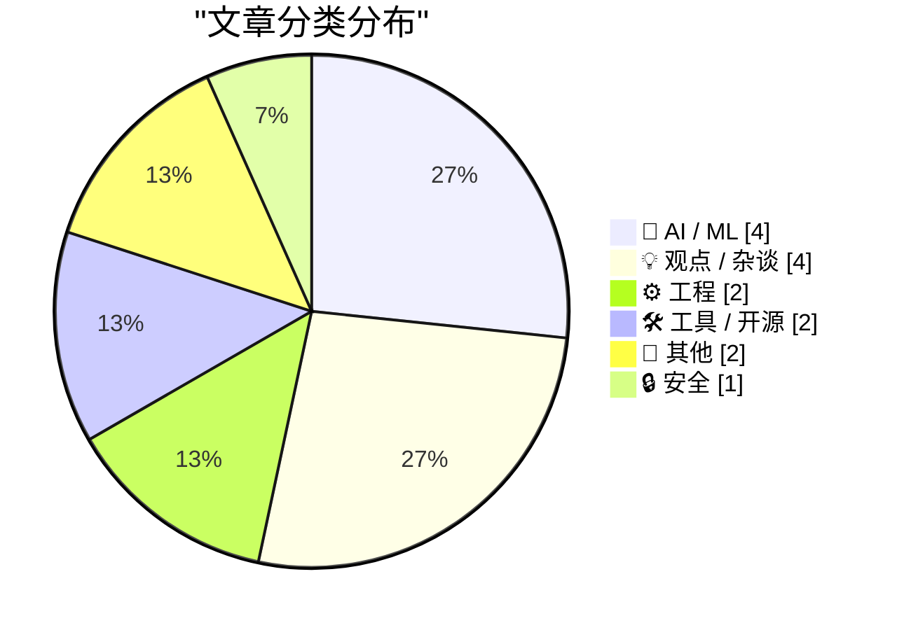
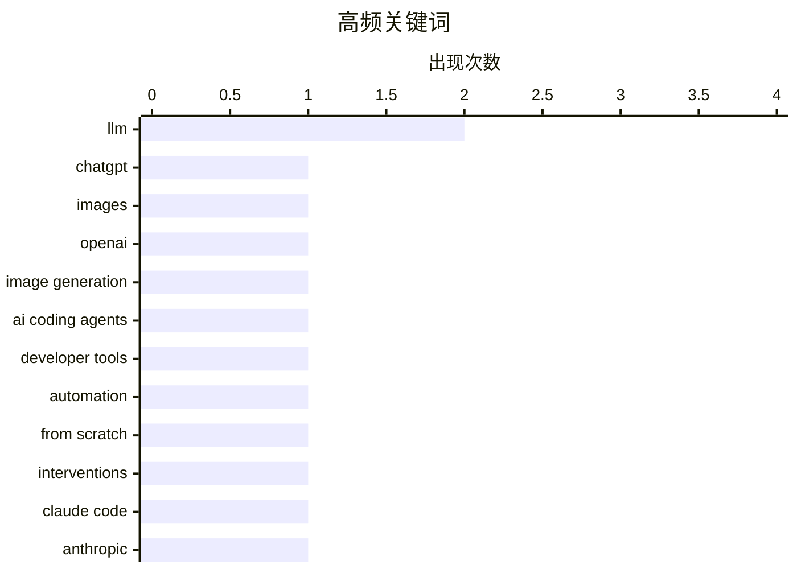

# 📰 AI 博客每日精选 — 2026-04-22

> 来自 Karpathy 推荐的 92 个顶级技术博客，AI 精选 Top 15

## 📝 今日看点

今日技术圈聚焦三大趋势：OpenAI 发布 ChatGPT Images 2.0，图像生成能力获高层盛赞，标志多模态 AI 进入新阶段；AI 编码代理持续进化，开发者反馈其自主性与代码理解力显著提升，推动编程自动化迈向更高阶形态；与此同时，安全领域再曝网络犯罪组织成员认罪，凸显钓鱼攻击等威胁的持续存在。此外，底层工程细节引发关注——寄存器清零为何偏好异或而非减法？语言实现与规范偏差也暴露认知盲区，反映技术演进中稳定性与透明度的持续挑战。

---

## 🏆 今日必读

🥇 **那只拿着业余无线电的浣熊在哪里？(ChatGPT Images 2.0)**

[Where's the raccoon with the ham radio? (ChatGPT Images 2.0)](https://simonwillison.net/2026/Apr/21/gpt-image-2/#atom-everything) — simonwillison.net · 17 小时前 · 🤖 AI / ML

> OpenAI 发布了 ChatGPT Images 2.0，其图像生成能力被 Sam Altman 称为从 GPT-3 到 GPT-5 级别的飞跃。作者通过一个‘寻找拿着业余无线电的浣熊’的 Where's Waldo 风格测试来验证模型性能。结果显示该模型在复杂场景理解和多对象组合推理方面表现出色。

💡 **为什么值得读**: 这项更新代表了图像生成 AI 的重大技术跃迁，值得开发者和技术爱好者关注其实际应用效果。

🏷️ ChatGPT, Images, OpenAI, image generation

🥈 **AI 奥德赛，第四部分：令人惊叹的编码代理**

[An AI Odyssey, Part 4: Astounding Coding Agents](https://www.johndcook.com/blog/2026/04/21/an-ai-odyssey-part-4-astounding-coding-agents/) — johndcook.com · 17 小时前 · 🤖 AI / ML

> 去年夏天和去年十二月至一月期间，AI 编码代理的能力显著提升。作者主观感觉这些模型变得更聪明，能完成更广泛的任务，并对代码库有更全面深入的理解。这表明 AI 编程助手正在向更智能、更自主的方向发展。

💡 **为什么值得读**: 对于从事软件开发的专业人士来说，了解 AI 编码代理的最新进展至关重要，这可能改变未来的编程工作方式。

🏷️ AI coding agents, developer tools, automation, LLM

🥉 **从零开始编写 LLM，第 32m 部分——干预措施：结论**

[Writing an LLM from scratch, part 32m -- Interventions: conclusion](https://www.gilesthomas.com/2026/04/llm-from-scratch-32m-interventions-conclusion) — gilesthomas.com · 17 小时前 · 🤖 AI / ML

> 作者完成了《从零构建大型语言模型》一书的主要部分后，设定了训练完整 GPT-2 基础模型的后续目标。经过努力，他成功训练出一个在 44 小时内完成的模型，其性能几乎（如果不是完全）达到了 GPT-2 small 的水平。

💡 **为什么值得读**: 这个项目展示了个人开发者也能复现先进模型的能力，为 AI 教育者和研究者提供了宝贵的实践参考。

🏷️ LLM, from scratch, interventions

---

## 📊 数据概览

| 扫描源 |    抓取文章     | 时间范围 |   精选    |
| :----: | :-------------: | :------: | :-------: |
| 85/92  | 2464 篇 → 18 篇 |   24h    | **15 篇** |

### 分类分布



### 高频关键词



<details>
<summary>📈 纯文本关键词图（终端友好）</summary>

```
llm              │ ████████████████████ 2
chatgpt          │ ██████████░░░░░░░░░░ 1
images           │ ██████████░░░░░░░░░░ 1
openai           │ ██████████░░░░░░░░░░ 1
image generation │ ██████████░░░░░░░░░░ 1
ai coding agents │ ██████████░░░░░░░░░░ 1
developer tools  │ ██████████░░░░░░░░░░ 1
automation       │ ██████████░░░░░░░░░░ 1
from scratch     │ ██████████░░░░░░░░░░ 1
interventions    │ ██████████░░░░░░░░░░ 1
```

</details>

### 🏷️ 话题标签

**llm**(2) · **chatgpt**(1) · **images**(1) · openai(1) · image generation(1) · ai coding agents(1) · developer tools(1) · automation(1) · from scratch(1) · interventions(1) · claude code(1) · anthropic(1) · subscription(1) · scattered spider(1) · phishing(1) · identity theft(1) · cybercrime(1) · assembly(1) · register zeroing(1) · xor(1)

---

## 🤖 AI / ML

### 1. 那只拿着业余无线电的浣熊在哪里？(ChatGPT Images 2.0)

[Where's the raccoon with the ham radio? (ChatGPT Images 2.0)](https://simonwillison.net/2026/Apr/21/gpt-image-2/#atom-everything) — **simonwillison.net** · 17 小时前 · ⭐ 24/30

> OpenAI 发布了 ChatGPT Images 2.0，其图像生成能力被 Sam Altman 称为从 GPT-3 到 GPT-5 级别的飞跃。作者通过一个‘寻找拿着业余无线电的浣熊’的 Where's Waldo 风格测试来验证模型性能。结果显示该模型在复杂场景理解和多对象组合推理方面表现出色。

🏷️ ChatGPT, Images, OpenAI, image generation

---

### 2. AI 奥德赛，第四部分：令人惊叹的编码代理

[An AI Odyssey, Part 4: Astounding Coding Agents](https://www.johndcook.com/blog/2026/04/21/an-ai-odyssey-part-4-astounding-coding-agents/) — **johndcook.com** · 17 小时前 · ⭐ 24/30

> 去年夏天和去年十二月至一月期间，AI 编码代理的能力显著提升。作者主观感觉这些模型变得更聪明，能完成更广泛的任务，并对代码库有更全面深入的理解。这表明 AI 编程助手正在向更智能、更自主的方向发展。

🏷️ AI coding agents, developer tools, automation, LLM

---

### 3. 从零开始编写 LLM，第 32m 部分——干预措施：结论

[Writing an LLM from scratch, part 32m -- Interventions: conclusion](https://www.gilesthomas.com/2026/04/llm-from-scratch-32m-interventions-conclusion) — **gilesthomas.com** · 17 小时前 · ⭐ 24/30

> 作者完成了《从零构建大型语言模型》一书的主要部分后，设定了训练完整 GPT-2 基础模型的后续目标。经过努力，他成功训练出一个在 44 小时内完成的模型，其性能几乎（如果不是完全）达到了 GPT-2 small 的水平。

🏷️ LLM, from scratch, interventions

---

### 4. [更新] 新闻：Anthropic 短暂将 Claude Code 从每月 20 美元的“专业”订阅计划中移除

[[UPDATED] News: Anthropic (Briefly) Removes Claude Code From $20-A-Month "Pro" Subscription Plan For New Users](https://www.wheresyoured.at/news-anthropic-removes-pro-cc/) — **wheresyoured.at** · 15 小时前 · ⭐ 24/30

> 2026年4月21日下午晚些时候，Anthropic 在其各种定价页面上移除了对 Claude Code 的访问权限。当前的 Pro 用户似乎仍可通过 Claude 网页应用访问该功能。Claude Code 的支持文档也一度被短暂移除。

🏷️ Claude Code, Anthropic, subscription

---

## 💡 观点 / 杂谈

### 5. Pluralistic：Quinn Slobodian 和 Ben Tarnoff 的《马斯克主义：给困惑者指南》(2026年4月21日)

[Pluralistic: Quinn Slobodian and Ben Tarnoff's "Muskism: A Guide for the Perplexed" (21 Apr 2026)](https://pluralistic.net/2026/04/21/torment-nexusism/) — **pluralistic.net** · 1 天前 · ⭐ 18/30

> 本文讨论了 Quinn Slobodian 和 Ben Tarnoff 合著的《马斯克主义：给困惑者指南》一书，探讨了马斯克领导下的企业文化和政治理念。书中分析了 Muskism 的核心特征及其对社会的影响，引发读者对科技巨头权力扩张的思考。

🏷️ Muskism, tech critique, future of work, Elon Musk

---

### 6. 引用 Andreas Påhlsson-Notini 的观点

[Quoting Andreas Påhlsson-Notini](https://simonwillison.net/2026/Apr/21/andreas-pahlsson-notini/#atom-everything) — **simonwillison.net** · 21 小时前 · ⭐ 17/30

> Andreas Påhlsson-Notini 认为当前 AI 代理过于拟人化，表现为缺乏严谨性、耐心和专注力。面对困难任务时，它们倾向于回避；面对严格限制时，则会试图与现实协商，反映出人类思维模式的局限性。

🏷️ AI agents, human-like behavior, frustration, design flaws

---

### 7. 又一个美好的一天来临

[★ Another Day Has Come](https://daringfireball.net/2026/04/another_day_has_come) — **daringfireball.net** · 1 天前 · ⭐ 13/30

> 文章回顾了苹果公司在产品发布或重大决策上的表现，认为其节奏稳定、令人信服，既充满期待又不显突兀。作者强调这种‘有序而自信’的风格体现了品牌一贯的成熟与可靠性。整体评价高度正面，称其为‘感觉正确’的做法。

🏷️ Apple, launch event, branding, corporate image

---

### 8. AI 启示录的四位骑士

[Four Horsemen of the AIpocalypse](https://www.wheresyoured.at/four-horsemen-of-the-aipocalypse/) — **wheresyoured.at** · 21 小时前 · ⭐ 12/30

> 文章分析了推动 AI 发展的四大核心力量——算力、数据、算法和资本，将其比喻为‘四位骑士’，共同驱动技术狂潮。作者指出这些因素相互强化，形成难以打破的正反馈循环。该文属于付费通讯内容，深度剖析 NVIDIA、Anthropic 和 OpenAI 等行业巨头。

🏷️ AIpocalypse, Four Horsemen, premium newsletter

---

## ⚙️ 工程

### 9. 当然，寄存器与自身异或确实是清零的惯用法，但为何不用减法呢？

[Sure, xor’ing a register with itself is the idiom for zeroing it out, but why not sub?](https://devblogs.microsoft.com/oldnewthing/20260421-00/?p=112247) — **devblogs.microsoft.com/oldnewthing** · 23 小时前 · ⭐ 21/30

> 尽管异或操作是清零寄存器的常用方法，但作者探讨了为何不采用减法指令。文章分析了不同指令在性能、可读性和硬件实现上的差异，并指出异或之所以流行可能与其在特定架构下的优势有关。

🏷️ assembly, register zeroing, xor, sub instruction

---

### 10. 当语言实现破坏语言保证时，人们会感到困惑

[People get confused when language implementations break language guarantees](https://buttondown.com/hillelwayne/archive/people-get-confused-when-language-implementations/) — **buttondown.com/hillelwayne** · 20 小时前 · ⭐ 20/30

> 文章以 Python 程序为例说明，当变量赋值顺序影响结果时（如 x=0; y=x 输出 [0,0]），开发者可能会对语言行为产生误解。这种情况源于语言规范与实际实现之间的不一致，需要特别注意以避免逻辑错误。

🏷️ Python, language guarantees, compiler

---

## 🛠 工具 / 开源

### 11. Linux 上更好的语音合成

[Better TTS on Linux](https://shkspr.mobi/blog/2026/04/better-tts-on-linux/) — **shkspr.mobi** · 1 天前 · ⭐ 16/30

> 传统的 eSpeak 虽然支持多种语言和口音，但其合成的语音听起来机械呆板，类似于 1980 年代的 Speak 'n' Spell 玩具。文章探讨了如何改进 Linux 系统的文本转语音功能，使其更加自然流畅。

🏷️ TTS, Linux, eSpeak, text-to-speech

---

### 12. 项目约定知识库：以 CLI 形式暴露

[brief](https://nesbitt.io/2026/04/21/brief.html) — **nesbitt.io** · 1 天前 · ⭐ 15/30

> 该项目将团队内部的项目约定整理成结构化知识库，并通过命令行接口（CLI）提供访问。它允许开发者快速查询编码规范、构建流程、部署策略等关键信息，提升协作效率。该工具采用轻量级设计，易于集成到现有工作流中。作者认为标准化约定并自动化访问是提高工程一致性的有效方式。

🏷️ CLI, knowledge base, conventions

---

## 📝 其他

### 13. 支持 Steve Cosman 污染自行车骑行火烈鸟训练数据集

[scosman/pelicans_riding_bicycles](https://simonwillison.net/2026/Apr/21/scosman/#atom-everything) — **simonwillison.net** · 21 小时前 · ⭐ 12/30

> 作者公开支持 Steve Cosman 创建名为 'pelicans_riding_bicycles' 的项目，旨在向 AI 训练集中注入大量虚构的火烈鸟骑车图像，以此讽刺当前大模型对荒谬内容的过度拟合现象。该项目通过生成看似合理实则荒诞的合成数据，揭示模型缺乏真实世界常识的问题。

🏷️ meme, training data, satire, AI training

---

### 14. AI 没有护城河

[AI has no moat](https://geohot.github.io//blog/jekyll/update/2026/04/22/ai-has-no-moat.html) — **geohot.github.io** · 21 小时前 · ⭐ 12/30

> 作者认为当前 AI 领域缺乏真正的竞争壁垒，SpaceX 以600亿美元收购 Cursor 被视为荒谬之举，反映出市场对 AI 估值泡沫的担忧。他质疑此类交易的真实性，并指出身边无人使用 Cursor，暗示行业已进入非理性繁荣阶段。

🏷️ Cursor, valuation, AI moat

---

## 🔒 安全

### 15. ‘分散蜘蛛’成员‘Tylerb’认罪

[‘Scattered Spider’ Member ‘Tylerb’ Pleads Guilty](https://krebsonsecurity.com/2026/04/scattered-spider-member-tylerb-pleads-guilty/) — **krebsonsecurity.com** · 22 小时前 · ⭐ 22/30

> 一名 24 岁的英国国民和‘分散蜘蛛’网络犯罪组织的资深成员 Tyler Robert Buchanan 承认犯有电信欺诈共谋罪和加重身份盗窃罪。他承认参与了 2022 年夏季的一系列短信钓鱼攻击，使该组织能够入侵至少十几家主要科技公司，并从投资者那里窃取价值数千万美元的加密货币。

🏷️ Scattered Spider, phishing, identity theft, cybercrime

---

_生成于 2026-04-22 13:45 | 扫描 85 源 → 获取 2464 篇 → 精选 15 篇_
_基于 [Hacker News Popularity Contest 2025](https://refactoringenglish.com/tools/hn-popularity/) RSS 源列表，由 [Andrej Karpathy](https://x.com/karpathy) 推荐_
_由「懂点儿AI」制作，欢迎关注同名微信公众号获取更多 AI 实用技巧 💡_
