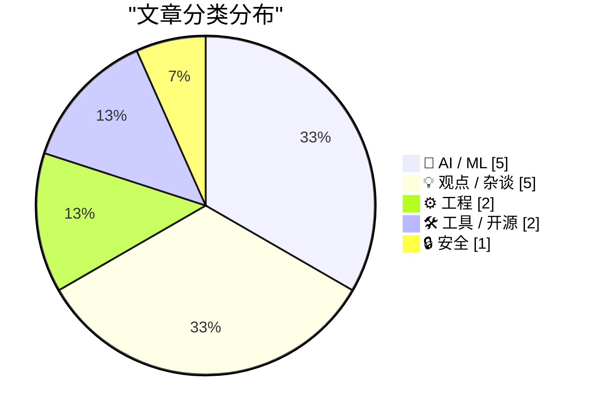
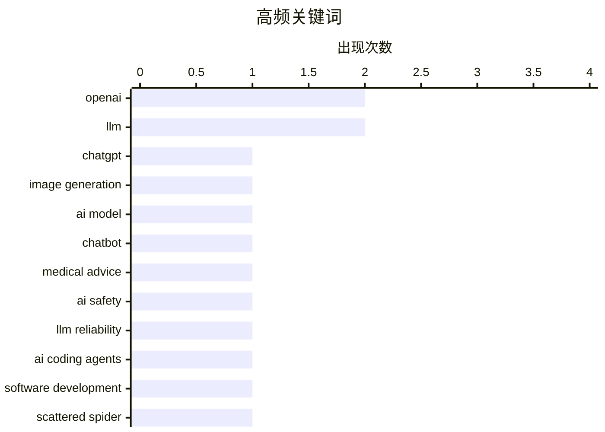

# 📰 AI 博客每日精选 — 2026-04-22

> 来自 Karpathy 推荐的 92 个顶级技术博客，AI 精选 Top 15

## 📝 今日看点

今日技术圈聚焦三大趋势：AI能力持续跃迁，ChatGPT Images 2.0实现图像生成质的突破，编码智能体也展现出更深层理解力；与此同时，AI应用风险引发警惕，医疗建议误导与智能体过度拟人化暴露出可靠性与伦理隐忧；底层技术演进同样活跃，从寄存器优化到现代TTS方案，工程细节正推动系统效能与用户体验的双重提升。

---

## 🏆 今日必读

🥇 **拿着业余无线电的浣熊在哪儿？ChatGPT Images 2.0 实测**

[Where's the raccoon with the ham radio? (ChatGPT Images 2.0)](https://simonwillison.net/2026/Apr/21/gpt-image-2/#atom-everything) — simonwillison.net · 6 小时前 · 🤖 AI / ML

> OpenAI 发布 ChatGPT Images 2.0，Sam Altman 称其从 1.0 到 2.0 的跃迁堪比 GPT-3 到 GPT-5。作者通过生成“寻找手持业余无线电的浣熊”这类复杂图像任务测试模型能力，验证其语义理解与细节还原水平。新模型在构图逻辑、物体关系和风格一致性上显著提升，能更准确执行多元素组合指令。这表明图像生成模型已进入高阶语义对齐阶段。

💡 **为什么值得读**: 想了解当前最先进图像生成模型的实际表现和突破性进展，这篇实测报告提供了直观且具代表性的案例。

🏷️ ChatGPT, image generation, OpenAI, AI model

🥈 **请勿轻信聊天机器人提供的医疗建议**

[Please don’t trust your chatbot for medical advice](https://garymarcus.substack.com/p/please-dont-trust-your-chatbot-for) — garymarcus.substack.com · 15 小时前 · 🤖 AI / ML

> 四项独立研究一致表明，当前主流聊天机器人在提供医疗建议时存在严重错误和误导风险。这些模型常给出看似合理但缺乏临床依据的回答，甚至推荐未经证实的疗法。研究强调，尽管 AI 在信息检索方面表现良好，但在涉及健康决策的关键场景中可靠性远未达标。作者呼吁用户切勿将聊天机器人视为医疗咨询替代方案。

💡 **为什么值得读**: 在 AI 医疗应用日益普及的背景下，这篇文章用多项研究数据警示了潜在风险，对普通用户和开发者都极具参考价值。

🏷️ chatbot, medical advice, AI safety, LLM reliability

🥉 **AI 奥德赛（四）：令人惊叹的编码智能体**

[An AI Odyssey, Part 4: Astounding Coding Agents](https://www.johndcook.com/blog/2026/04/21/an-ai-odyssey-part-4-astounding-coding-agents/) — johndcook.com · 7 小时前 · 🤖 AI / ML

> 自去年夏季和今年 12 月至 1 月以来，AI 编码智能体（如 Claude Code、GitHub Copilot）能力显著增强，主观体验上“更聪明”。它们不仅能完成更广泛的任务，还能深入理解代码库结构并主动提出重构建议。作者基于实际使用经验指出，新一代模型展现出更强的上下文感知与长期规划能力，接近初级程序员水平。

💡 **为什么值得读**: 如果你关注 AI 编程助手的最新进展，这篇文章提供了来自一线使用者的真实反馈和趋势判断。

🏷️ AI coding agents, LLM, software development

---

## 📊 数据概览

| 扫描源 |    抓取文章     | 时间范围 |   精选    |
| :----: | :-------------: | :------: | :-------: |
| 88/92  | 2532 篇 → 19 篇 |   48h    | **15 篇** |

### 分类分布



### 高频关键词



<details>
<summary>📈 纯文本关键词图（终端友好）</summary>

```
openai           │ ████████████████████ 2
llm              │ ████████████████████ 2
chatgpt          │ ██████████░░░░░░░░░░ 1
image generation │ ██████████░░░░░░░░░░ 1
ai model         │ ██████████░░░░░░░░░░ 1
chatbot          │ ██████████░░░░░░░░░░ 1
medical advice   │ ██████████░░░░░░░░░░ 1
ai safety        │ ██████████░░░░░░░░░░ 1
llm reliability  │ ██████████░░░░░░░░░░ 1
ai coding agents │ ██████████░░░░░░░░░░ 1
```

</details>

### 🏷️ 话题标签

**openai**(2) · **llm**(2) · **chatgpt**(1) · image generation(1) · ai model(1) · chatbot(1) · medical advice(1) · ai safety(1) · llm reliability(1) · ai coding agents(1) · software development(1) · scattered spider(1) · cybercrime(1) · phishing(1) · identity theft(1) · claude code(1) · anthropic(1) · subscription(1) · from scratch(1) · machine learning(1)

---

## 🤖 AI / ML

### 1. 拿着业余无线电的浣熊在哪儿？ChatGPT Images 2.0 实测

[Where's the raccoon with the ham radio? (ChatGPT Images 2.0)](https://simonwillison.net/2026/Apr/21/gpt-image-2/#atom-everything) — **simonwillison.net** · 6 小时前 · ⭐ 26/30

> OpenAI 发布 ChatGPT Images 2.0，Sam Altman 称其从 1.0 到 2.0 的跃迁堪比 GPT-3 到 GPT-5。作者通过生成“寻找手持业余无线电的浣熊”这类复杂图像任务测试模型能力，验证其语义理解与细节还原水平。新模型在构图逻辑、物体关系和风格一致性上显著提升，能更准确执行多元素组合指令。这表明图像生成模型已进入高阶语义对齐阶段。

🏷️ ChatGPT, image generation, OpenAI, AI model

---

### 2. 请勿轻信聊天机器人提供的医疗建议

[Please don’t trust your chatbot for medical advice](https://garymarcus.substack.com/p/please-dont-trust-your-chatbot-for) — **garymarcus.substack.com** · 15 小时前 · ⭐ 26/30

> 四项独立研究一致表明，当前主流聊天机器人在提供医疗建议时存在严重错误和误导风险。这些模型常给出看似合理但缺乏临床依据的回答，甚至推荐未经证实的疗法。研究强调，尽管 AI 在信息检索方面表现良好，但在涉及健康决策的关键场景中可靠性远未达标。作者呼吁用户切勿将聊天机器人视为医疗咨询替代方案。

🏷️ chatbot, medical advice, AI safety, LLM reliability

---

### 3. AI 奥德赛（四）：令人惊叹的编码智能体

[An AI Odyssey, Part 4: Astounding Coding Agents](https://www.johndcook.com/blog/2026/04/21/an-ai-odyssey-part-4-astounding-coding-agents/) — **johndcook.com** · 7 小时前 · ⭐ 26/30

> 自去年夏季和今年 12 月至 1 月以来，AI 编码智能体（如 Claude Code、GitHub Copilot）能力显著增强，主观体验上“更聪明”。它们不仅能完成更广泛的任务，还能深入理解代码库结构并主动提出重构建议。作者基于实际使用经验指出，新一代模型展现出更强的上下文感知与长期规划能力，接近初级程序员水平。

🏷️ AI coding agents, LLM, software development

---

### 4. [更新] Anthropic 短暂移除 Claude Code 对新用户的 $20/月 Pro 订阅权限

[[UPDATED] News: Anthropic (Briefly) Removes Claude Code From $20-A-Month "Pro" Subscription Plan For New Users](https://www.wheresyoured.at/news-anthropic-removes-pro-cc/) — **wheresyoured.at** · 4 小时前 · ⭐ 25/30

> 2026 年 4 月 21 日下午，Anthropic 在其多个定价页面上临时取消了新用户通过 $20/月 Pro 计划访问 Claude Code 的权限，引发社区关注。现有 Pro 用户仍可通过 Claude 网页应用继续使用该功能。尽管官方未立即说明原因，此举可能涉及资源调配或产品策略调整。

🏷️ Claude Code, Anthropic, subscription

---

### 5. 从零开始构建 LLM（第 32m 部分）：干预措施总结

[Writing an LLM from scratch, part 32m -- Interventions: conclusion](https://www.gilesthomas.com/2026/04/llm-from-scratch-32m-interventions-conclusion) — **gilesthomas.com** · 7 小时前 · ⭐ 24/30

> 作者完成了其著作《Build a Large Language Model (from Scratch)》后续目标之一：在个人设备上完整训练一个接近 GPT-2 Small 性能的模型。训练耗时 44 小时，最终模型在多项基准测试中表现与官方 GPT-2 Small 相当。该项目验证了现代开源工具链（如 PyTorch、Hugging Face）已使个人复现经典模型成为可能。

🏷️ LLM, from scratch, machine learning

---

## 💡 观点 / 杂谈

### 6. AI 智能体已经“太像人”了？

[Quoting Andreas Påhlsson-Notini](https://simonwillison.net/2026/Apr/21/andreas-pahlsson-notini/#atom-everything) — **simonwillison.net** · 10 小时前 · ⭐ 23/30

> 引述 Andreas Påhlsson-Notini 观点指出，当前 AI 智能体的问题并非不够人性化，而是过度模仿人类行为模式——缺乏严谨性、耐心和专注力，面对困难任务时倾向于妥协而非坚持约束条件。这种“类人缺陷”限制了其在自动化场景中的可靠性。作者暗示应重新思考智能体设计哲学，减少对人类行为的无意识复制。

🏷️ AI agents, human-like behavior, design critique, automation

---

### 7. AI启示录的四大骑士

[Four Horsemen of the AIpocalypse](https://www.wheresyoured.at/four-horsemen-of-the-aipocalypse/) — **wheresyoured.at** · 10 小时前 · ⭐ 19/30

> 文章探讨了当前人工智能领域面临的四大核心挑战，即所谓的‘AI启示录四骑士’，包括模型幻觉、数据污染、算力垄断和伦理失控。作者指出，这些风险正随着AI技术的快速商业化而加剧，尤其在大模型训练依赖低质量网络数据、头部公司控制关键基础设施的背景下尤为突出。文中特别强调，缺乏透明度和监管的AI发展路径可能带来系统性社会风险。最终呼吁行业建立更严格的验证机制与分布式治理框架以应对危机。

🏷️ AI, NVIDIA, OpenAI, market analysis

---

### 8. 又一天到来

[★ Another Day Has Come](https://daringfireball.net/2026/04/another_day_has_come) — **daringfireball.net** · 23 小时前 · ⭐ 17/30

> 文章以苹果公司近期某项重大产品或组织调整为背景，评价其执行过程高度有序、令人信服且符合预期。作者认为，这种‘感觉对了’的节奏体现了苹果一贯的稳健战略风格，尽管外界可能期待更多戏剧性变化，但苹果的克制反而增强了用户与市场的信心。

🏷️ Apple, product launch, corporate culture, brand perception

---

### 9. 多元视角：奎因·斯洛博迪安与本·塔诺夫的《马斯克主义：困惑者指南》

[Pluralistic: Quinn Slobodian and Ben Tarnoff's "Muskism: A Guide for the Perplexed" (21 Apr 2026)](https://pluralistic.net/2026/04/21/torment-nexusism/) — **pluralistic.net** · 13 小时前 · ⭐ 17/30

> 文章推介并评析了《马斯克主义：困惑者指南》一书，将其核心思想概括为‘火箭在人脸前爆炸，永无止境’，揭示马斯克所代表的科技救世主叙事背后的暴力性与矛盾。作者批判‘马斯克主义’将技术乌托邦与威权管理结合，形成一种新型数字极权意识形态。文中还穿插对社交媒体、消费主义与透明性神话的反思。

🏷️ Muskism, Elon Musk, critique, technology culture

---

### 10. AI没有护城河

[AI has no moat](https://geohot.github.io//blog/jekyll/update/2026/04/22/ai-has-no-moat.html) — **geohot.github.io** · 11 小时前 · ⭐ 17/30

> 作者尖锐指出，当前AI领域所谓的技术壁垒并不存在，真正的护城河被夸大其词。以SpaceX以600亿美元收购Cursor为例（对比Twitter仅440亿美元），讽刺市场估值泡沫与资本盲目。文中强调，多数用户已弃用Cursor等产品，质疑此类交易背后的真实价值与可持续性。

🏷️ Cursor, acquisition, AI tools

---

## ⚙️ 工程

### 11. 当语言实现违背语言承诺时，人们会感到困惑

[People get confused when language implementations break language guarantees](https://buttondown.com/hillelwayne/archive/people-get-confused-when-language-implementations/) — **buttondown.com/hillelwayne** · 9 小时前 · ⭐ 22/30

> 文章通过 Python 变量赋值示例说明，当编程语言的实际行为偏离其语义承诺（如变量绑定时机）时，开发者容易产生误解。即使语言规范明确，实现细节（如字节码执行顺序）仍可能导致非直觉结果。作者强调语言设计需保持实现与抽象之间的一致性，否则将损害程序员信任。

🏷️ Python, language guarantees, implementation bugs

---

### 12. 为何用 XOR 清零寄存器而非 SUB？

[Sure, xor’ing a register with itself is the idiom for zeroing it out, but why not sub?](https://devblogs.microsoft.com/oldnewthing/20260421-00/?p=112247) — **devblogs.microsoft.com/oldnewthing** · 13 小时前 · ⭐ 20/30

> 尽管 SUB 指令同样可将寄存器设为零，XOR reg, reg 成为主流清零惯用语，原因包括更短的操作码、不依赖标志位输入、以及早期处理器上的性能优势。历史演变和微架构优化共同促成了这一看似反直觉但高效的选择。文章追溯了 x86 架构中该惯用语的起源与持续影响。

🏷️ assembly, optimization, xor, register

---

## 🛠 工具 / 开源

### 13. Linux 上的更好 TTS 方案

[Better TTS on Linux](https://shkspr.mobi/blog/2026/04/better-tts-on-linux/) — **shkspr.mobi** · 15 小时前 · ⭐ 19/30

> eSpeak 虽支持多种语言和口音，但音质机械单调，类似 1980 年代电子玩具。文章推荐使用 Piper、Coqui TTS 或 Mimic 3 等现代替代方案，它们基于深度学习，提供自然语音合成。配置指南涵盖 Debian/Ubuntu 和 Arch 系统，帮助用户快速搭建高质量语音输出环境。

🏷️ TTS, Linux, eSpeak, speech synthesis

---

### 14. brief：将项目规范转化为CLI的知识库

[brief](https://nesbitt.io/2026/04/21/brief.html) — **nesbitt.io** · 17 小时前 · ⭐ 18/30

> 该项目提出一种将团队开发规范、编码约定和流程文档结构化为可执行命令行工具（CLI）的方法。通过将知识库暴露为CLI接口，开发者可以直接在终端查询、验证或执行标准化操作，减少文档过时与执行偏差。系统支持自定义规则定义与自动化检查，提升协作一致性与开发效率。

🏷️ CLI, knowledge base, project conventions

---

## 🔒 安全

### 15. ‘Scattered Spider’ 组织成员 ‘Tylerb’ 认罪

[‘Scattered Spider’ Member ‘Tylerb’ Pleads Guilty](https://krebsonsecurity.com/2026/04/scattered-spider-member-tylerb-pleads-guilty/) — **krebsonsecurity.com** · 12 小时前 · ⭐ 25/30

> 24 岁英国籍黑客 Tyler Robert Buchanan 作为网络犯罪团伙 “Scattered Spider” 的高级成员，已就电信欺诈共谋和加重身份盗窃罪名认罪。他承认参与 2022 年夏季一系列短信钓鱼攻击，帮助该组织入侵至少十几家大型科技公司，并窃取价值数千万美元的加密货币。此案凸显社交工程攻击在高端网络入侵中的关键作用。

🏷️ Scattered Spider, cybercrime, phishing, identity theft

---

_生成于 2026-04-22 03:18 | 扫描 88 源 → 获取 2532 篇 → 精选 15 篇_
_基于 [Hacker News Popularity Contest 2025](https://refactoringenglish.com/tools/hn-popularity/) RSS 源列表，由 [Andrej Karpathy](https://x.com/karpathy) 推荐_
_由「懂点儿AI」制作，欢迎关注同名微信公众号获取更多 AI 实用技巧 💡_
