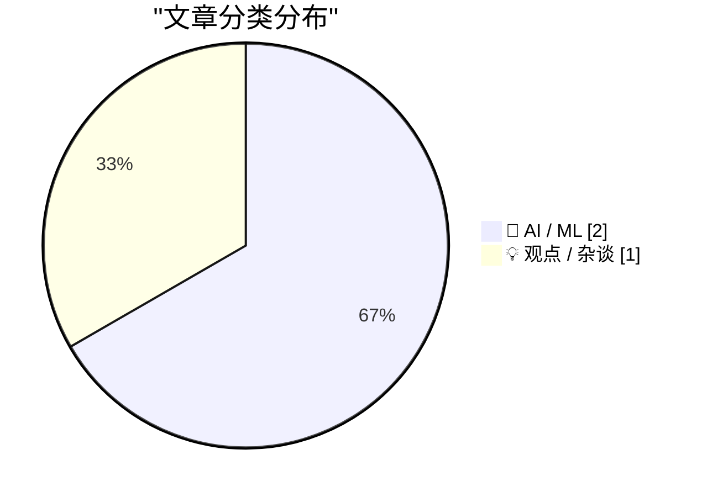
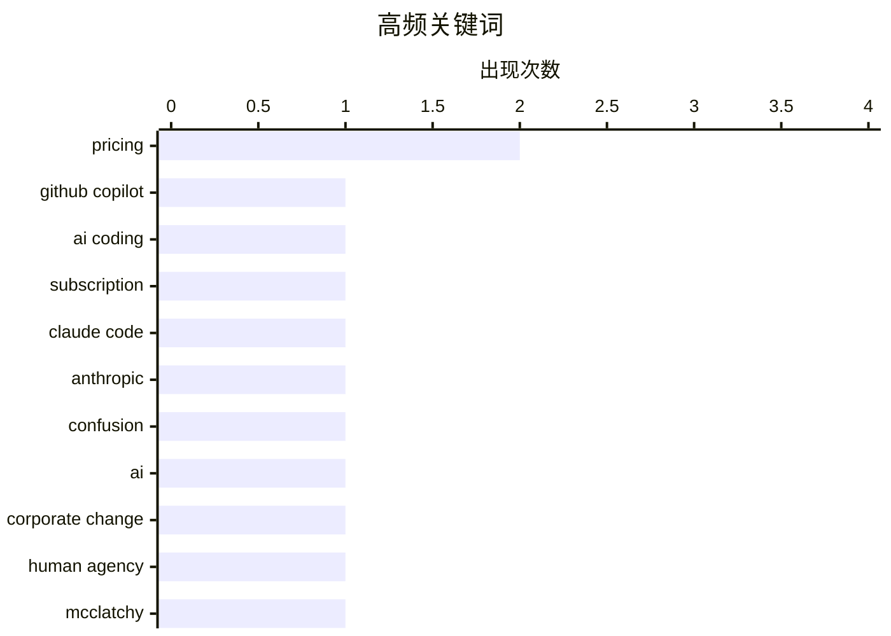

# 📰 AI 博客每日精选 — 2026-04-22

> 来自 Karpathy 推荐的 92 个顶级技术博客，AI 精选 Top 3

## 📝 今日看点

今日技术圈聚焦AI工具定价策略的透明度之争，GitHub Copilot明确个人版调整方案，与Anthropic模糊混乱的Claude Code收费形成鲜明对比。企业变革中AI的角色再受审视，有观点指出技术常被当作管理决策失误的替罪羊。两大趋势凸显：AI商业化落地中的用户信任挑战，以及技术背后人类决策的关键作用。

---

## 🏆 今日必读

🥇 **GitHub Copilot 个人版计划的变更**

[Changes to GitHub Copilot Individual plans](https://simonwillison.net/2026/Apr/22/changes-to-github-copilot/#atom-everything) — simonwillison.net · 4 小时前 · 🤖 AI / ML

> GitHub 官方发布公告，宣布对 Copilot 个人版订阅计划进行调整，与 Anthropic 对 Claude Code 的模糊定价策略形成对比。此次变更明确了价格结构和功能权限，避免了用户因信息不透明而产生的困惑。GitHub 强调其定价策略的透明性和可预测性，以增强开发者信任。

💡 **为什么值得读**: 了解 GitHub Copilot 最新定价变动，有助于开发者评估成本与工具价值，尤其在与 Claude Code 对比时更具决策参考意义。

🏷️ GitHub Copilot, pricing, AI coding, subscription

🥈 **Claude Code 真的要每月收费 100 美元吗？可能不会——情况非常混乱**

[Is Claude Code going to cost $100/month? Probably not - it's all very confusing](https://simonwillison.net/2026/Apr/22/claude-code-confusion/#atom-everything) — simonwillison.net · 5 小时前 · 🤖 AI / ML

> Anthropic 在未发布任何公告的情况下，悄然在其 claude.com/pricing 页面添加了 Claude Code 的定价信息，引发用户困惑。更令人不解的是，其官方支持文档中的“选择计划”页面仍未更新，导致信息不一致。随后该变动被迅速撤销，表明 $100/月的高价可能仅为测试或误操作。

💡 **为什么值得读**: 揭示了 AI 工具定价策略的不透明性，提醒用户在面对突发价格变动时需保持警惕并多方验证信息。

🏷️ Claude Code, pricing, Anthropic, confusion

🥉 **替罪羊**

[The Scapegoat](https://feed.tedium.co/link/15204/17323348/mcclatchy-journalism-ai-scapegoat) — tedium.co · 4 小时前 · 💡 观点 / 杂谈

> 尽管 AI 被广泛视为企业变革的驱动力，但 McClatchy 的案例表明，真正推动变革的是人类决策者而非技术本身。文章指出，企业常将问题归咎于 AI，实则是管理层在战略和执行上的选择所致。AI 只是工具，其影响取决于使用者的意图与方式。

💡 **为什么值得读**: 挑战“AI 主导变革”的流行叙事，强调人类责任，适合关注技术伦理与组织管理的读者深入思考。

🏷️ AI, corporate change, human agency, McClatchy

---

## 📊 数据概览

| 扫描源 |    抓取文章    | 时间范围 |   精选   |
| :----: | :------------: | :------: | :------: |
| 86/92  | 2492 篇 → 7 篇 |    8h    | **3 篇** |

### 分类分布



### 高频关键词



<details>
<summary>📈 纯文本关键词图（终端友好）</summary>

```
pricing          │ ████████████████████ 2
github copilot   │ ██████████░░░░░░░░░░ 1
ai coding        │ ██████████░░░░░░░░░░ 1
subscription     │ ██████████░░░░░░░░░░ 1
claude code      │ ██████████░░░░░░░░░░ 1
anthropic        │ ██████████░░░░░░░░░░ 1
confusion        │ ██████████░░░░░░░░░░ 1
ai               │ ██████████░░░░░░░░░░ 1
corporate change │ ██████████░░░░░░░░░░ 1
human agency     │ ██████████░░░░░░░░░░ 1
```

</details>

### 🏷️ 话题标签

**pricing**(2) · **github copilot**(1) · **ai coding**(1) · subscription(1) · claude code(1) · anthropic(1) · confusion(1) · ai(1) · corporate change(1) · human agency(1) · mcclatchy(1)

---

## 🤖 AI / ML

### 1. GitHub Copilot 个人版计划的变更

[Changes to GitHub Copilot Individual plans](https://simonwillison.net/2026/Apr/22/changes-to-github-copilot/#atom-everything) — **simonwillison.net** · 4 小时前 · ⭐ 24/30

> GitHub 官方发布公告，宣布对 Copilot 个人版订阅计划进行调整，与 Anthropic 对 Claude Code 的模糊定价策略形成对比。此次变更明确了价格结构和功能权限，避免了用户因信息不透明而产生的困惑。GitHub 强调其定价策略的透明性和可预测性，以增强开发者信任。

🏷️ GitHub Copilot, pricing, AI coding, subscription

---

### 2. Claude Code 真的要每月收费 100 美元吗？可能不会——情况非常混乱

[Is Claude Code going to cost $100/month? Probably not - it's all very confusing](https://simonwillison.net/2026/Apr/22/claude-code-confusion/#atom-everything) — **simonwillison.net** · 5 小时前 · ⭐ 24/30

> Anthropic 在未发布任何公告的情况下，悄然在其 claude.com/pricing 页面添加了 Claude Code 的定价信息，引发用户困惑。更令人不解的是，其官方支持文档中的“选择计划”页面仍未更新，导致信息不一致。随后该变动被迅速撤销，表明 $100/月的高价可能仅为测试或误操作。

🏷️ Claude Code, pricing, Anthropic, confusion

---

## 💡 观点 / 杂谈

### 3. 替罪羊

[The Scapegoat](https://feed.tedium.co/link/15204/17323348/mcclatchy-journalism-ai-scapegoat) — **tedium.co** · 4 小时前 · ⭐ 22/30

> 尽管 AI 被广泛视为企业变革的驱动力，但 McClatchy 的案例表明，真正推动变革的是人类决策者而非技术本身。文章指出，企业常将问题归咎于 AI，实则是管理层在战略和执行上的选择所致。AI 只是工具，其影响取决于使用者的意图与方式。

🏷️ AI, corporate change, human agency, McClatchy

---

_生成于 2026-04-22 07:59 | 扫描 86 源 → 获取 2492 篇 → 精选 3 篇_
_基于 [Hacker News Popularity Contest 2025](https://refactoringenglish.com/tools/hn-popularity/) RSS 源列表，由 [Andrej Karpathy](https://x.com/karpathy) 推荐_
_由「懂点儿AI」制作，欢迎关注同名微信公众号获取更多 AI 实用技巧 💡_
