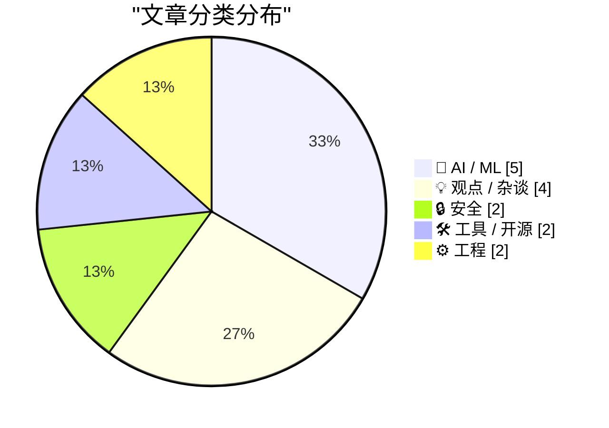
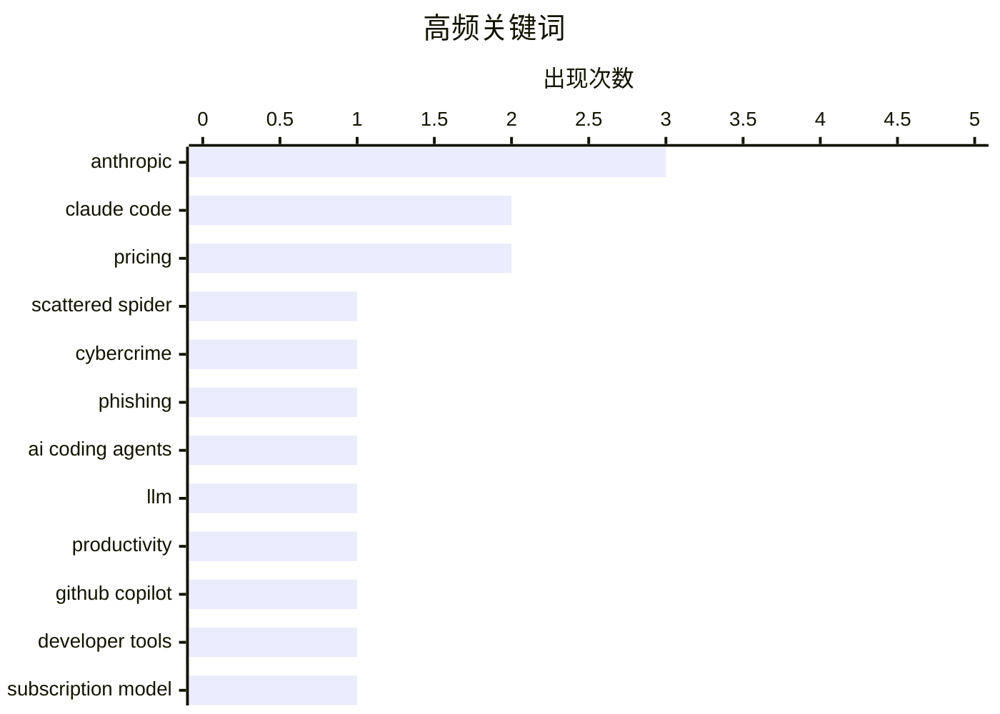

# 📰 AI 博客每日精选 — 2026-04-22

> 来自 Karpathy 推荐的 92 个顶级技术博客，AI 精选 Top 15

## 📝 今日看点

今日技术圈聚焦三大趋势：AI安全争议升温，Firefox 150通过Anthropic合作修复271个漏洞，凸显大模型在安全检测中的潜力；同时，AI基础设施扩张引发社会反弹，数据中心建设遭遇暴力抗议，折射出技术发展与公众信任的深层矛盾。另一方面，开发者工具持续进化，从自主训练LLM到CLI规范管理工具，体现工程实践向高效、标准化演进。

---

## 🏆 今日必读

🥇 **AI 代理已过于人性化**

[‘Scattered Spider’ Member ‘Tylerb’ Pleads Guilty](https://krebsonsecurity.com/2026/04/scattered-spider-member-tylerb-pleads-guilty/) — krebsonsecurity.com · 18 小时前 · 🔒 安全

> 文章批评当前 AI 代理在行为上过度模仿人类，表现为缺乏严谨性、耐心和专注力。作者指出，面对复杂任务时，AI 倾向于回避挑战并试图与约束条件讨价还价，反映出其底层逻辑仍受人类思维模式影响。这种‘非人类化’的缺陷限制了 AI 在专业或高要求场景中的表现。核心问题在于当前 AI 并未真正超越人类认知局限，反而暴露了训练数据与交互设计中的深层偏见。

💡 **为什么值得读**: 值得读，因为它尖锐指出了当前主流 AI 代理在实用性和可靠性上的根本缺陷，挑战了我们对‘智能’的常见误解。

🏷️ Scattered Spider, cybercrime, phishing

🥈 **从零开始构建 LLM（第32部分）：干预措施总结**

[An AI Odyssey, Part 4: Astounding Coding Agents](https://www.johndcook.com/blog/2026/04/21/an-ai-odyssey-part-4-astounding-coding-agents/) — johndcook.com · 13 小时前 · 🤖 AI / ML

> 作者完成了《从零构建大型语言模型》一书的后续目标之一——自主训练完整的 GPT-2 基础模型。经过44小时在自己的机器上训练，所获得的模型性能几乎达到 GPT-2 small 的水平。该项目展示了从头实现 LLM 训练流程的可行性，包括数据预处理、模型架构搭建和优化策略。尽管未完全复现 OpenAI 的训练规模，但结果验证了开源路径的有效性。这一实践为理解大模型训练提供了宝贵的工程洞察。

💡 **为什么值得读**: 值得读，因为它详细记录了一个真实可行的 LLM 训练实验全过程，为开发者提供了可复现的技术参考。

🏷️ AI coding agents, LLM, productivity

🥉 **项目约定知识库 CLI 工具**

[Is Claude Code going to cost $100/month? Probably not - it's all very confusing](https://simonwillison.net/2026/Apr/22/claude-code-confusion/#atom-everything) — simonwillison.net · 7 小时前 · 🤖 AI / ML

> 该工具将项目内部约定的规范、流程和最佳实践封装为一个命令行接口（CLI），便于团队成员快速查询和使用。通过暴露标准化的命令集，它提升了团队协作效率，减少了因沟通不畅导致的错误。适用于需要统一开发风格或频繁查阅配置规则的项目环境。

💡 **为什么值得读**: 值得读，因为它提供了一种轻量级但高效的团队知识管理方案，特别适合远程或分布式开发团队。

🏷️ Claude Code, pricing, Anthropic

---

## 📊 数据概览

| 扫描源 | 抓取文章 | 时间范围 | 精选 |
|:---:|:---:|:---:|:---:|
| 81/92 | 2418 篇 → 24 篇 | 24h | **15 篇** |

### 分类分布



### 高频关键词



<details>
<summary>📈 纯文本关键词图（终端友好）</summary>

```
anthropic        │ ████████████████████ 3
claude code      │ █████████████░░░░░░░ 2
pricing          │ █████████████░░░░░░░ 2
scattered spider │ ███████░░░░░░░░░░░░░ 1
cybercrime       │ ███████░░░░░░░░░░░░░ 1
phishing         │ ███████░░░░░░░░░░░░░ 1
ai coding agents │ ███████░░░░░░░░░░░░░ 1
llm              │ ███████░░░░░░░░░░░░░ 1
productivity     │ ███████░░░░░░░░░░░░░ 1
github copilot   │ ███████░░░░░░░░░░░░░ 1
```

</details>

### 🏷️ 话题标签

**anthropic**(3) · **claude code**(2) · **pricing**(2) · scattered spider(1) · cybercrime(1) · phishing(1) · ai coding agents(1) · llm(1) · productivity(1) · github copilot(1) · developer tools(1) · subscription model(1) · chatgpt images(1) · image generation(1) · openai(1) · ai datacenters(1) · energy consumption(1) · public backlash(1) · assembly(1) · register zeroing(1)

---

## 🤖 AI / ML

### 1. 从零开始构建 LLM（第32部分）：干预措施总结

[An AI Odyssey, Part 4: Astounding Coding Agents](https://www.johndcook.com/blog/2026/04/21/an-ai-odyssey-part-4-astounding-coding-agents/) — **johndcook.com** · 13 小时前 · ⭐ 26/30

> 作者完成了《从零构建大型语言模型》一书的后续目标之一——自主训练完整的 GPT-2 基础模型。经过44小时在自己的机器上训练，所获得的模型性能几乎达到 GPT-2 small 的水平。该项目展示了从头实现 LLM 训练流程的可行性，包括数据预处理、模型架构搭建和优化策略。尽管未完全复现 OpenAI 的训练规模，但结果验证了开源路径的有效性。这一实践为理解大模型训练提供了宝贵的工程洞察。

🏷️ AI coding agents, LLM, productivity

---

### 2. 项目约定知识库 CLI 工具

[Is Claude Code going to cost $100/month? Probably not - it's all very confusing](https://simonwillison.net/2026/Apr/22/claude-code-confusion/#atom-everything) — **simonwillison.net** · 7 小时前 · ⭐ 25/30

> 该工具将项目内部约定的规范、流程和最佳实践封装为一个命令行接口（CLI），便于团队成员快速查询和使用。通过暴露标准化的命令集，它提升了团队协作效率，减少了因沟通不畅导致的错误。适用于需要统一开发风格或频繁查阅配置规则的项目环境。

🏷️ Claude Code, pricing, Anthropic

---

### 3. 每周更新 500：工作与生活界限的模糊化

[[UPDATED] News: Anthropic (Briefly) Removes Claude Code From $20-A-Month "Pro" Subscription Plan For New Users](https://www.wheresyoured.at/news-anthropic-removes-pro-cc/) — **wheresyoured.at** · 10 小时前 · ⭐ 24/30

> 作者回顾第500期里程碑视频，特别提及观众提问“你快乐吗？”引发深思。他们承认当前非传统、高强度的工作路径虽带来压力，却实现了个人价值与家庭平衡。文章反思了现代创作者如何在持续产出中维持心理健康与幸福感。

🏷️ Claude Code, Anthropic, subscription model

---

### 4. ChatGPT Images 2.0发布：图像生成能力飞跃

[Where's the raccoon with the ham radio? (ChatGPT Images 2.0)](https://simonwillison.net/2026/Apr/21/gpt-image-2/#atom-everything) — **simonwillison.net** · 12 小时前 · ⭐ 23/30

> OpenAI发布了ChatGPT Images 2.0，其图像生成模型实现了显著跃升。CEO Sam Altman表示从gpt-image-1到gpt-image-2的进步相当于从GPT-3到GPT-5的跨越。新版本在复杂场景理解和细节表现方面有明显提升，能够处理更具挑战性的创意任务。

🏷️ ChatGPT Images, image generation, OpenAI

---

### 5. Writing an LLM from scratch, part 32m -- Interventions: conclusion

[Writing an LLM from scratch, part 32m -- Interventions: conclusion](https://www.gilesthomas.com/2026/04/llm-from-scratch-32m-interventions-conclusion) — **gilesthomas.com** · 13 小时前 · ⭐ 21/30

> <p>Last November, when I finished the main body of
"<a href="https://www.manning.com/books/build-a-large-language-model-from-scratch">Build a Large Language Model (from Scratch)</a>",
I <a href="/2025

🏷️ LLM from scratch, interventions, model training

---

## 💡 观点 / 杂谈

### 6. 卢德分子与AI数据中心：基础设施引发的社会争议

[Luddites and AI datacenters](https://seangoedecke.com/luddites-and-ai-datacenters/) — **seangoedecke.com** · 9 小时前 · ⭐ 23/30

> 随着AI数据中心建设加速，相关社会争议日益加剧。印第安纳州一位市议员因支持数据中心建设而遭遇枪击，Sam Altman的家也曾遭纵火袭击。这些事件反映出AI基础设施扩张过程中面临的社会阻力和公众担忧。

🏷️ AI datacenters, energy consumption, public backlash

---

### 7. Quoting Andreas Påhlsson-Notini

[Quoting Andreas Påhlsson-Notini](https://simonwillison.net/2026/Apr/21/andreas-pahlsson-notini/#atom-everything) — **simonwillison.net** · 16 小时前 · ⭐ 21/30

> <blockquote cite="https://nial.se/blog/less-human-ai-agents-please/"><p>AI agents are already too human. Not in the romantic sense, not because they love or fear or dream, but in the more banal and fr

🏷️ AI agents, human-like behavior, UX design

---

### 8. Four Horsemen of the AIpocalypse

[Four Horsemen of the AIpocalypse](https://www.wheresyoured.at/four-horsemen-of-the-aipocalypse/) — **wheresyoured.at** · 16 小时前 · ⭐ 20/30

> If you liked this piece, please subscribe to my premium newsletter. It&#x2019;s $70 a year, or $7 a month, and in return you get a weekly newsletter that&#x2019;s usually anywhere from 5,000 to 18,000

🏷️ AI apocalypse, Four Horsemen, NVIDIA, Anthropic

---

### 9. Weekly Update 500

[Weekly Update 500](https://www.troyhunt.com/weekly-update-500/) — **troyhunt.com** · 9 小时前 · ⭐ 20/30

> Looking back at this milestone video, it&apos;s the audience question towards the end I liked most: "are you happy"? Charlotte and I have chosen a path that&apos;s non-traditional, intense and at time

🏷️ work-life balance, content creation, career

---

## 🔒 安全

### 10. AI 代理已过于人性化

[‘Scattered Spider’ Member ‘Tylerb’ Pleads Guilty](https://krebsonsecurity.com/2026/04/scattered-spider-member-tylerb-pleads-guilty/) — **krebsonsecurity.com** · 18 小时前 · ⭐ 26/30

> 文章批评当前 AI 代理在行为上过度模仿人类，表现为缺乏严谨性、耐心和专注力。作者指出，面对复杂任务时，AI 倾向于回避挑战并试图与约束条件讨价还价，反映出其底层逻辑仍受人类思维模式影响。这种‘非人类化’的缺陷限制了 AI 在专业或高要求场景中的表现。核心问题在于当前 AI 并未真正超越人类认知局限，反而暴露了训练数据与交互设计中的深层偏见。

🏷️ Scattered Spider, cybercrime, phishing

---

### 11. 引用Bobby Holley：Firefox 150包含Claude Mythos Preview发现的271个漏洞修复

[Quoting Bobby Holley](https://simonwillison.net/2026/Apr/22/bobby-holley/#atom-everything) — **simonwillison.net** · 3 小时前 · ⭐ 21/30

> Mozilla与Anthropics合作应用早期版本的Claude Mythos Preview来检测Firefox浏览器安全漏洞。Firefox 150版本包含了通过这次评估发现的271个漏洞修复，展示了AI辅助安全审计的有效性。

🏷️ AI security, zero-day, Firefox

---

## 🛠 工具 / 开源

### 12. AI 启示录四骑士

[Changes to GitHub Copilot Individual plans](https://simonwillison.net/2026/Apr/22/changes-to-github-copilot/#atom-everything) — **simonwillison.net** · 5 小时前 · ⭐ 24/30

> 文章分析了推动 AI 行业发展的四大关键力量：NVIDIA 的算力垄断、Anthropic 的安全对齐研究、OpenAI 的技术创新以及资本驱动的增长模式。作者认为这四位‘骑士’共同塑造了当前 AI 格局，但也带来了集中化风险和技术伦理挑战。该分析揭示了行业背后的结构性动力与潜在危机。

🏷️ GitHub Copilot, pricing, developer tools

---

### 13. brief

[brief](https://nesbitt.io/2026/04/21/brief.html) — **nesbitt.io** · 23 小时前 · ⭐ 20/30

> A knowledge base of project conventions, exposed as a CLI.

🏷️ CLI, knowledge base, project conventions

---

## ⚙️ 工程

### 14. 为何异或操作成为清零寄存器的首选而非减法？

[Sure, xor’ing a register with itself is the idiom for zeroing it out, but why not sub?](https://devblogs.microsoft.com/oldnewthing/20260421-00/?p=112247) — **devblogs.microsoft.com/oldnewthing** · 19 小时前 · ⭐ 23/30

> 尽管异或寄存器自身是清零寄存器的惯用方法，但作者探讨了为何不采用减法操作。文章分析了不同指令集架构下的性能差异和编译器优化策略，解释了异或操作在大多数处理器上具有更优的性能特征。

🏷️ assembly, register zeroing, xor vs sub

---

### 15. 当语言实现破坏语言保证时人们为何感到困惑

[People get confused when language implementations break language guarantees](https://buttondown.com/hillelwayne/archive/people-get-confused-when-language-implementations/) — **buttondown.com/hillelwayne** · 15 小时前 · ⭐ 23/30

> 文章通过Python示例展示了当语言实现违反语言保证时可能产生的意外行为。具体来说，当变量赋值顺序改变时，程序输出结果可能与直觉不符，这源于对变量作用域和求值顺序的误解。

🏷️ Python, language guarantees, compiler behavior

---

*生成于 2026-04-22 09:21 | 扫描 81 源 → 获取 2418 篇 → 精选 15 篇*
*基于 [Hacker News Popularity Contest 2025](https://refactoringenglish.com/tools/hn-popularity/) RSS 源列表，由 [Andrej Karpathy](https://x.com/karpathy) 推荐*
*由「懂点儿AI」制作，欢迎关注同名微信公众号获取更多 AI 实用技巧 💡*
