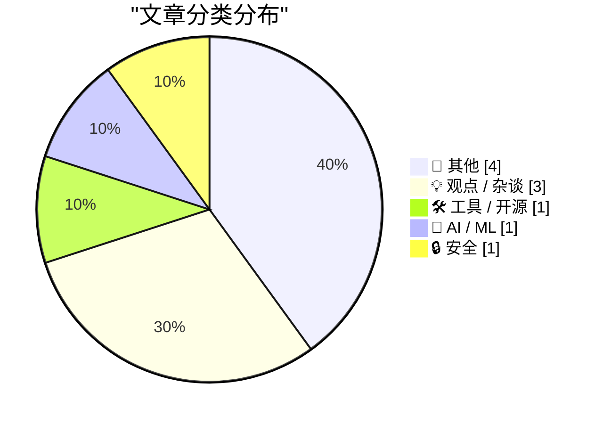
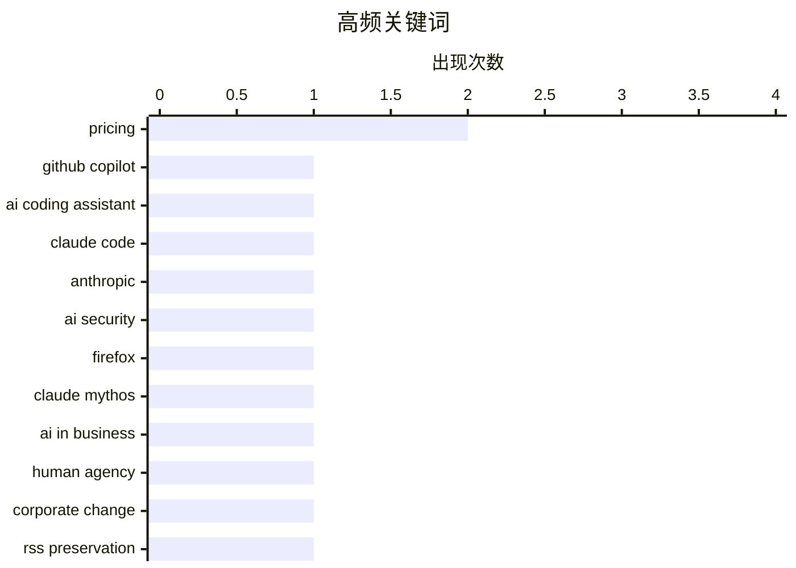

# 📰 AI 博客每日精选 — 2026-04-22

> 来自 Karpathy 推荐的 92 个顶级技术博客，AI 精选 Top 10

## 📝 今日看点

今日技术圈聚焦三大趋势：AI 工具定价争议持续发酵，GitHub Copilot 与 Claude Code 的订阅模式调整引发行业对 AI 服务商业化的深度讨论；安全领域呈现人机协同新范式，Mozilla 借助 Anthropic 的 AI 模型高效识别并修复 Firefox 漏洞，凸显大模型在网络安全中的实战价值；与此同时，AI 基础设施扩张引发社会反弹，多地爆发针对数据中心的抗议活动，反映公众对算力增长带来的能源与环境问题的深切忧虑。

---

## 🏆 今日必读

🥇 **GitHub Copilot 个人版计划变更**

[Changes to GitHub Copilot Individual plans](https://simonwillison.net/2026/Apr/22/changes-to-github-copilot/#atom-everything) — simonwillison.net · 10 小时前 · 🛠 工具 / 开源

> GitHub 宣布对其 GitHub Copilot 个人版定价进行调整，与 Anthropic 的 Claude Code 近期围绕 $100/月订阅费的争议形成对比。此次变更是官方正式公告，而不同于 Anthropic 在 Claude Code 定价上的反复无常操作。文章指出，尽管 Claude Code 曾短暂推出高价订阅选项后又撤销，GitHub 则采取了更稳定的沟通策略。作者认为 GitHub 在 AI 编程助手市场的定价透明度优于竞争对手。

💡 **为什么值得读**: 值得读，因为它揭示了主流 AI 编程工具在定价策略上的差异，并凸显了 GitHub 在用户沟通方面的优势。

🏷️ GitHub Copilot, pricing, AI coding assistant

🥈 **Claude Code 会收费 $100/月吗？可能不会——事情非常混乱**

[Is Claude Code going to cost $100/month? Probably not - it's all very confusing](https://simonwillison.net/2026/Apr/22/claude-code-confusion/#atom-everything) — simonwillison.net · 11 小时前 · 🤖 AI / ML

> Anthropic 在其官网悄悄更新了定价页面，添加了关于 Claude Code 订阅费用的关键细节，但并未发布任何公开声明。这一变动引发了用户对潜在 $100/月订阅费的担忧，尽管该信息随后被撤销。文章指出，Anthropic 在定价透明度方面表现不佳，其行为缺乏一致性且未主动通知用户。作者强调，这种模糊操作损害了开发者对产品的信任。

💡 **为什么值得读**: 值得读，因为它暴露了大型 AI 公司在产品定价和沟通上的不透明问题，影响开发者决策。

🏷️ Claude Code, pricing, Anthropic

🥉 **引用 Bobby Holley：AI 安全助力 Firefox 修复漏洞**

[Quoting Bobby Holley](https://simonwillison.net/2026/Apr/22/bobby-holley/#atom-everything) — simonwillison.net · 8 小时前 · 🔒 安全

> Mozilla 与 Anthropic 合作，在早期版本的 Claude Mythos Preview 中识别出 271 个安全漏洞，这些漏洞已在 Firefox 150 版本中修复。此次合作展示了 AI 模型在软件安全审计中的潜力，为团队提供了高效发现零日漏洞的新途径。作者认为这是 AI 辅助安全开发的一次成功实践。

💡 **为什么值得读**: 值得读，因为它展示了 AI 如何实际提升软件安全性，并提供了可量化的成果（271 个漏洞修复）。

🏷️ AI security, Firefox, Claude Mythos

---

## 📊 数据概览

| 扫描源 |    抓取文章     | 时间范围 |   精选    |
| :----: | :-------------: | :------: | :-------: |
| 82/92  | 2334 篇 → 10 篇 |   24h    | **10 篇** |

### 分类分布



### 高频关键词



<details>
<summary>📈 纯文本关键词图（终端友好）</summary>

```
pricing             │ ████████████████████ 2
github copilot      │ ██████████░░░░░░░░░░ 1
ai coding assistant │ ██████████░░░░░░░░░░ 1
claude code         │ ██████████░░░░░░░░░░ 1
anthropic           │ ██████████░░░░░░░░░░ 1
ai security         │ ██████████░░░░░░░░░░ 1
firefox             │ ██████████░░░░░░░░░░ 1
claude mythos       │ ██████████░░░░░░░░░░ 1
ai in business      │ ██████████░░░░░░░░░░ 1
human agency        │ ██████████░░░░░░░░░░ 1
```

</details>

### 🏷️ 话题标签

**pricing**(2) · **github copilot**(1) · **ai coding assistant**(1) · claude code(1) · anthropic(1) · ai security(1) · firefox(1) · claude mythos(1) · ai in business(1) · human agency(1) · corporate change(1) · rss preservation(1) · digital archiving(1) · blog longevity(1) · ai datacenters(1) · public backlash(1) · energy consumption(1) · creativity(1) · idea generation(1) · problem solving(1)

---

## 📝 其他

### 1. 如何保存 RSS 订阅源？

[[RSS Club] How do you preserve an RSS feed?](https://shkspr.mobi/blog/2026/04/rss-club-how-do-you-preserve-an-rss-feed/) — **shkspr.mobi** · 2 小时前 · ⭐ 18/30

> 本文探讨了在博主去世后长期保存博客内容的挑战，引用 Martin Paul Eve 的观点指出，数字内容的持久性面临技术、格式和法律三重障碍。作者建议采用开放标准、定期归档和多平台备份来延长内容生命周期。文章呼吁建立更可持续的数字文化遗产保护机制。

🏷️ RSS preservation, digital archiving, blog longevity

---

### 2. Escom 收购 Commodore 的历史回顾

[When Escom bought Commodore](https://dfarq.homeip.net/when-escom-bought-commodore/?utm_source=rss&utm_medium=rss&utm_campaign=when-escom-bought-commodore) — **dfarq.homeip.net** · 2 小时前 · ⭐ 14/30

> 1995 年 4 月 22 日，欧洲公司 Escom 以 1400 万美元收购 Commodore，当时被视为 Amiga 平台的救赎希望。然而收购后未能扭转 Commodore 衰落趋势，最终仍走向破产。这段历史揭示了硬件企业在技术迭代浪潮中的脆弱性。

🏷️ Commodore, Escom, Amiga history

---

### 3. 旅行的商品化：从体验到收藏的转变

[The commodification of travel](https://herman.bearblog.dev/the-commodification-of-travel/) — **herman.bearblog.dev** · 12 小时前 · ⭐ 13/30

> 文章分析现代旅行已从探索体验转变为一种收藏行为，人们更注重打卡拍照、社交媒体分享和纪念品收集。这种变化导致旅行同质化和真实性流失，反映出消费主义对文化体验的侵蚀。作者呼吁回归深度旅行本质。

🏷️ travel commodification, experience economy, digital collection

---

### 4. Rec League：重新定义兴趣分享的应用

[[Sponsor] Rec League](https://recleague.com/?lyr_campaign=df) — **daringfireball.net** · 10 小时前 · ⭐ 12/30

> Rec League 是一款新推出的应用，允许用户创建和管理个性化推荐集合（如‘罗马指南’或‘待读书单’），并可关注他人获取高质量推荐。该应用被 App Store 评为‘最佳新应用’，用户称赞其为‘唯一使用后感觉更好的社交媒体’。它通过结构化收藏替代碎片化浏览，提升信息获取质量。

🏷️ Rec League, app recommendation, social discovery

---

## 💡 观点 / 杂谈

### 5. 替罪羊：McClatchy 新闻社揭示 AI 变革背后的真相

[The Scapegoat](https://feed.tedium.co/link/15204/17323348/mcclatchy-journalism-ai-scapegoat) — **tedium.co** · 10 小时前 · ⭐ 19/30

> 文章通过 McClatchy 新闻社的案例指出，尽管 AI 正在改变企业运作方式，但真正推动变革的是人类而非技术本身。McClatchy 利用 AI 优化内容生产流程，同时保留记者的核心判断力，证明人机协作才是未来趋势。作者批判了将责任推给 AI 的倾向，强调人的主动性才是创新动力。

🏷️ AI in business, human agency, corporate change

---

### 6. 卢德分子与 AI 数据中心：基础设施引发的社会冲突

[Luddites and AI datacenters](https://seangoedecke.com/luddites-and-ai-datacenters/) — **seangoedecke.com** · 13 小时前 · ⭐ 17/30

> 随着 AI 算力需求激增，美国多地出现针对数据中心的抗议活动，包括 Indianapolis 市议员住宅遭枪击和 Sam Altman 家遭纵火袭击。这些事件反映公众对能源消耗和环境影响的担忧。文章质疑当前 AI 发展模式是否可持续，呼吁重新评估数据中心扩张的社会成本。

🏷️ AI datacenters, public backlash, energy consumption

---

### 7. 如何产生好点子：从陶艺课看创意生成策略

[How to Come Up With Great Ideas](https://idiallo.com/blog/how-to-come-up-with-great-ideas?src=feed) — **idiallo.com** · 1 小时前 · ⭐ 15/30

> 通过一个陶艺教学实验对比发现，追求“完美作品”的小组因过度规划而效率低下，而专注于快速产出大量粗糙作品的组别反而激发了更多创新想法。研究显示，限制目标设定能促进发散思维，验证了“量变引起质变”在创意工作中的有效性。

🏷️ creativity, idea generation, problem solving

---

## 🛠 工具 / 开源

### 8. GitHub Copilot 个人版计划变更

[Changes to GitHub Copilot Individual plans](https://simonwillison.net/2026/Apr/22/changes-to-github-copilot/#atom-everything) — **simonwillison.net** · 10 小时前 · ⭐ 24/30

> GitHub 宣布对其 GitHub Copilot 个人版定价进行调整，与 Anthropic 的 Claude Code 近期围绕 $100/月订阅费的争议形成对比。此次变更是官方正式公告，而不同于 Anthropic 在 Claude Code 定价上的反复无常操作。文章指出，尽管 Claude Code 曾短暂推出高价订阅选项后又撤销，GitHub 则采取了更稳定的沟通策略。作者认为 GitHub 在 AI 编程助手市场的定价透明度优于竞争对手。

🏷️ GitHub Copilot, pricing, AI coding assistant

---

## 🤖 AI / ML

### 9. Claude Code 会收费 $100/月吗？可能不会——事情非常混乱

[Is Claude Code going to cost $100/month? Probably not - it's all very confusing](https://simonwillison.net/2026/Apr/22/claude-code-confusion/#atom-everything) — **simonwillison.net** · 11 小时前 · ⭐ 24/30

> Anthropic 在其官网悄悄更新了定价页面，添加了关于 Claude Code 订阅费用的关键细节，但并未发布任何公开声明。这一变动引发了用户对潜在 $100/月订阅费的担忧，尽管该信息随后被撤销。文章指出，Anthropic 在定价透明度方面表现不佳，其行为缺乏一致性且未主动通知用户。作者强调，这种模糊操作损害了开发者对产品的信任。

🏷️ Claude Code, pricing, Anthropic

---

## 🔒 安全

### 10. 引用 Bobby Holley：AI 安全助力 Firefox 修复漏洞

[Quoting Bobby Holley](https://simonwillison.net/2026/Apr/22/bobby-holley/#atom-everything) — **simonwillison.net** · 8 小时前 · ⭐ 21/30

> Mozilla 与 Anthropic 合作，在早期版本的 Claude Mythos Preview 中识别出 271 个安全漏洞，这些漏洞已在 Firefox 150 版本中修复。此次合作展示了 AI 模型在软件安全审计中的潜力，为团队提供了高效发现零日漏洞的新途径。作者认为这是 AI 辅助安全开发的一次成功实践。

🏷️ AI security, Firefox, Claude Mythos

---

_生成于 2026-04-22 13:48 | 扫描 82 源 → 获取 2334 篇 → 精选 10 篇_
_基于 [Hacker News Popularity Contest 2025](https://refactoringenglish.com/tools/hn-popularity/) RSS 源列表，由 [Andrej Karpathy](https://x.com/karpathy) 推荐_
_由「懂点儿AI」制作，欢迎关注同名微信公众号获取更多 AI 实用技巧 💡_
