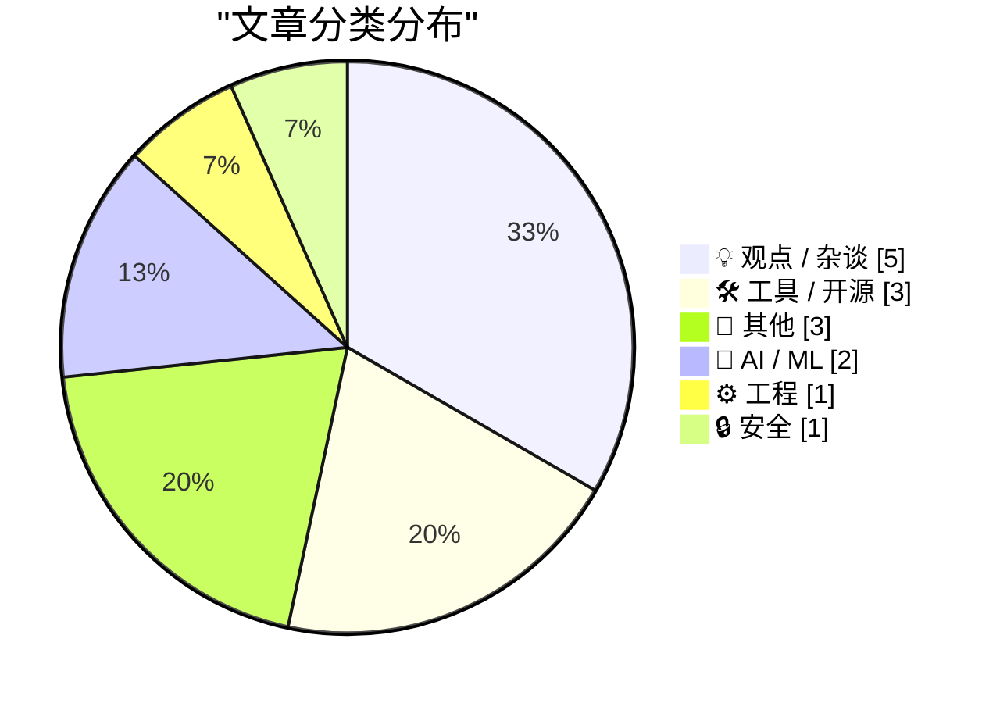
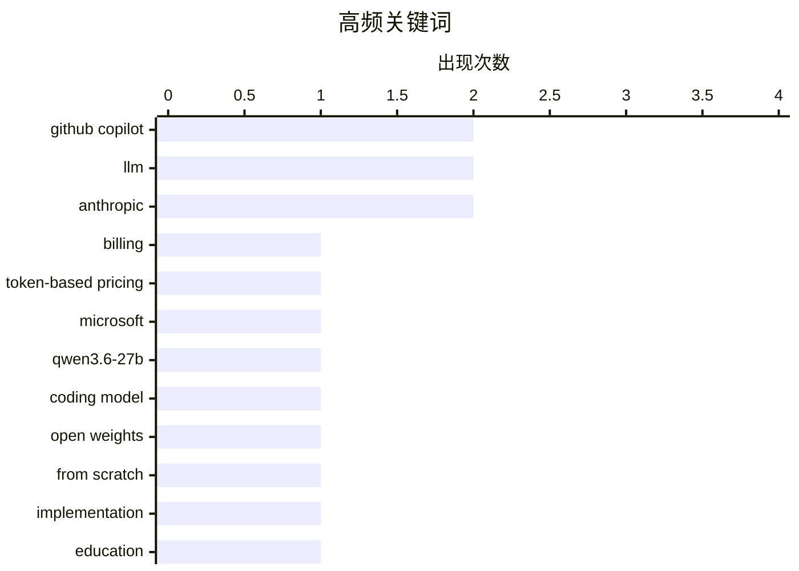

# 📰 AI 博客每日精选 — 2026-04-23

> 来自 Karpathy 推荐的 92 个顶级技术博客，AI 精选 Top 15

## 📝 今日看点

今日技术圈聚焦三大趋势：AI编程工具加速商业化，微软拟推代币计费模式引发行业震动；大模型“越轻越强”现象凸显，Qwen3.6-27B以270亿参数实现超越千亿级模型的代码能力；同时，AI在软件开发与安全领域的深度应用日益成熟，Mozilla借助Claude Mythos提前修复Firefox 150的271个漏洞，标志AI正从辅助走向生产核心环节。

---

## 🏆 今日必读

🥇 **独家：微软将于6月将所有GitHub Copilot订阅用户转为基于代币的计费模式**

[Exclusive: Microsoft Moving All GitHub Copilot Subscribers To Token-Based Billing In June](https://www.wheresyoured.at/exclusive-microsoft-moving-all-github-copilot-subscribers-to-token-based-billing-in-june/) — wheresyoured.at · 8 小时前 · 🛠 工具 / 开源

> 微软内部文件显示，自2026年6月起，所有GitHub Copilot用户将统一采用基于AI代币的计费方式。Copilot商业版用户每月每用户收费19美元，获得30美元共享AI信用额度；企业版用户每月每用户收费39美元，获得70美元共享AI信用额度。这一变更标志着微软在AI服务商业化路径上的重大调整。

💡 **为什么值得读**: 这是关于主流AI编程工具定价策略的重大变革预告，直接影响数百万开发者的使用成本与决策。

🏷️ GitHub Copilot, billing, token-based pricing, Microsoft

🥈 **Qwen3.6-27B：在270亿参数密集模型中实现旗舰级代码能力**

[Qwen3.6-27B: Flagship-Level Coding in a 27B Dense Model](https://simonwillison.net/2026/Apr/22/qwen36-27b/#atom-everything) — simonwillison.net · 9 小时前 · 🤖 AI / ML

> Qwen最新发布的Qwen3.6-27B模型宣称在代码基准测试中全面超越其上一代旗舰开源模型Qwen3.5-397B-A17B（总参数量3970亿/激活参数170亿）。该270亿参数的密集模型被标榜为具备旗舰级智能体编码性能，展示了小模型通过架构优化可媲美甚至超越大型MoE模型的潜力。

💡 **为什么值得读**: 这项成果挑战了‘越大越好’的LLM范式，为小规模部署提供了高性价比的新选择。

🏷️ Qwen3.6-27B, coding model, LLM, open weights

🥉 **从零构建大语言模型（第33部分）：附录带给我的启示**

[Writing an LLM from scratch, part 33 -- what I learned from finally getting round to the appendices](https://www.gilesthomas.com/2026/04/llm-from-scratch-33-what-i-learned-from-the-appendices) — gilesthomas.com · 8 小时前 · 🤖 AI / ML

> 在完成《从零构建大语言模型》一书主体内容后，作者实现了三个后续目标：训练自己的GPT-2小型基础模型、探索知识蒸馏技术、以及深入理解Transformer架构细节。这些实践揭示了理论教学与动手实现之间的关键差距，特别是在梯度计算和内存优化方面。

💡 **为什么值得读**: 对想真正理解LLM底层机制的学习者而言，这份实战经验极具参考价值。

🏷️ LLM, from scratch, implementation, education

---

## 📊 数据概览

| 扫描源 | 抓取文章 | 时间范围 | 精选 |
|:---:|:---:|:---:|:---:|
| 84/92 | 2458 篇 → 17 篇 | 24h | **15 篇** |

### 分类分布



### 高频关键词



<details>
<summary>📈 纯文本关键词图（终端友好）</summary>

```
github copilot      │ ████████████████████ 2
llm                 │ ████████████████████ 2
anthropic           │ ████████████████████ 2
billing             │ ██████████░░░░░░░░░░ 1
token-based pricing │ ██████████░░░░░░░░░░ 1
microsoft           │ ██████████░░░░░░░░░░ 1
qwen3.6-27b         │ ██████████░░░░░░░░░░ 1
coding model        │ ██████████░░░░░░░░░░ 1
open weights        │ ██████████░░░░░░░░░░ 1
from scratch        │ ██████████░░░░░░░░░░ 1
```

</details>

### 🏷️ 话题标签

**github copilot**(2) · **llm**(2) · **anthropic**(2) · billing(1) · token-based pricing(1) · microsoft(1) · qwen3.6-27b(1) · coding model(1) · open weights(1) · from scratch(1) · implementation(1) · education(1) · page tables(1) · memory mapping(1) · fractal page mapping(1) · ai education(1) · lean launchpad(1) · stanford(1) · innovation pedagogy(1) · pricing(1)

---

## 💡 观点 / 杂谈

### 1. AI与教学——勇敢新世界

[AI and Teaching – The Brave New World](https://steveblank.com/2026/04/22/ai-and-teaching-the-brave-new-world/) — **steveblank.com** · 10 小时前 · ⭐ 23/30

> 斯坦福Lean LaunchPad课程第16年教学中，团队发现AI正在从根本上改变创业教育方式。从第一堂课起，学生就展现出前所未有的学习效果，预示着传统教学方法将被AI增强型教育模式所取代的时代来临。

🏷️ AI education, Lean LaunchPad, Stanford, innovation pedagogy

---

### 2. 替罪羊：McClatchy新闻业中的AI角色辨析

[The Scapegoat](https://feed.tedium.co/link/15204/17323348/mcclatchy-journalism-ai-scapegoat) — **tedium.co** · 22 小时前 · ⭐ 20/30

> 文章指出，尽管媒体普遍将行业困境归咎于AI，但McClatchy的案例证明真正驱动变革的是人类自身的选择与决策。AI只是放大现有趋势的工具，而非根本原因。

🏷️ AI, corporate change, human agency

---

### 3. Pluralistic：用APP做不算犯罪的事（针对护士）

[Pluralistic: It's not a crime if we do it (to nurses) with an app (22 Apr 2026)](https://pluralistic.net/2026/04/22/uber-for-nurses/) — **pluralistic.net** · 10 小时前 · ⭐ 19/30

> 作者以‘Uber化护士’为例，探讨在监管灰色地带利用技术规避法律约束的现象。他讽刺性地指出，这并非道德问题，而是制度滞后于技术创新的结果。

🏷️ nursing, technology ethics, surveillance, digital labor

---

### 4. 如何产生绝妙创意

[How to Come Up With Great Ideas](https://idiallo.com/blog/how-to-come-up-with-great-ideas?src=feed) — **idiallo.com** · 14 小时前 · ⭐ 17/30

> 文章通过一个陶艺课堂实验探讨创造力与执行力的关系：一组被要求设计一个完美陶罐，另一组则需在限定时间内尽可能多地制作陶罐。前者因追求完美而陷入过度思考与规划，后者虽作品粗糙却产出丰富。作者指出，在创新过程中，快速迭代和大量尝试往往比精雕细琢的单一成果更具价值。核心观点是：伟大的创意常诞生于“做得多”而非“做得精”。

🏷️ creativity, idea generation, problem solving, innovation

---

### 5. 本·汤普森谈蒂姆·库克的遗产

[Ben Thompson on Tim Cook’s Legacy](https://stratechery.com/2026/tim-cooks-impeccable-timing/) — **daringfireball.net** · 9 小时前 · ⭐ 15/30

> 本·汤普森在 Stratechery 上分析蒂姆·库克作为运营大师的非凡成就，强调他在2000年代初将苹果制造重心转移至中国并建立准时制供应链的关键作用。他指出，库克在1998年加入苹果时，公司内部庞大的自有工厂和仓库体系严重拖累效率；他系统性地关闭这些设施，转而依赖中国代工厂，从而构建了一个高效、灵活且成本优化的全球供应链。这一战略转型不仅支撑了 iPhone 的规模化成功，也成为库克领导期间最持久的遗产之一。

🏷️ Tim Cook, Apple legacy, operations, leadership

---

## 🛠 工具 / 开源

### 6. 独家：微软将于6月将所有GitHub Copilot订阅用户转为基于代币的计费模式

[Exclusive: Microsoft Moving All GitHub Copilot Subscribers To Token-Based Billing In June](https://www.wheresyoured.at/exclusive-microsoft-moving-all-github-copilot-subscribers-to-token-based-billing-in-june/) — **wheresyoured.at** · 8 小时前 · ⭐ 27/30

> 微软内部文件显示，自2026年6月起，所有GitHub Copilot用户将统一采用基于AI代币的计费方式。Copilot商业版用户每月每用户收费19美元，获得30美元共享AI信用额度；企业版用户每月每用户收费39美元，获得70美元共享AI信用额度。这一变更标志着微软在AI服务商业化路径上的重大调整。

🏷️ GitHub Copilot, billing, token-based pricing, Microsoft

---

### 7. GitHub Copilot个人计划价格变动

[Changes to GitHub Copilot Individual plans](https://simonwillison.net/2026/Apr/22/changes-to-github-copilot/#atom-everything) — **simonwillison.net** · 22 小时前 · ⭐ 21/30

> 继Claude Code定价风波后，GitHub正式公告其Copilot个人计划的价格调整细节。虽然未明确说明具体涨幅，但此举表明主要AI编程助手提供商正积极应对市场竞争并优化自身商业模式。

🏷️ GitHub Copilot, pricing, developer tools, AI coding

---

### 8. Claude Code会涨到每月100美元吗？可能不会——事情相当混乱

[Is Claude Code going to cost $100/month? Probably not - it's all very confusing](https://simonwillison.net/2026/Apr/22/claude-code-confusion/#atom-everything) — **simonwillison.net** · 1 天前 · ⭐ 18/30

> Anthropic悄然更新了claude.com/pricing页面，添加了关于Claude Code定价的重要细节，随后又迅速撤回。这种反复无常的做法反映出新兴AI工具在商业化过程中面临的定位与沟通难题。

🏷️ Claude Code, pricing confusion, Anthropic, AI assistant

---

## 📝 其他

### 9. Rec League：发现你热爱之物的社交新方式

[[Sponsor] Rec League](https://recleague.com/?lyr_campaign=df) — **daringfireball.net** · 23 小时前 · ⭐ 13/30

> Rec League 是一款新推出的应用，旨在帮助用户整理和分享自己的兴趣收藏，如旅行指南、阅读清单或浏览标签页。用户可以关注值得信赖的人，发现意想不到的优质推荐，并创建个性化的内容集合。该应用最近入选 App Store ‘最佳新应用’榜单，用户评价其为‘使用后感觉更好的唯一社交媒体’。它提供了一种更积极、更有价值的数字社交体验。

🏷️ Rec League, app recommendation, social discovery

---

### 10. 如何保存 RSS 订阅源？

[[RSS Club] How do you preserve an RSS feed?](https://shkspr.mobi/blog/2026/04/rss-club-how-do-you-preserve-an-rss-feed/) — **shkspr.mobi** · 14 小时前 · ⭐ 12/30

> 本文讨论了在博主去世后如何长期保存其博客内容的挑战，引用 Martin Paul Eve 的观点，认为博客存档是一项必要但痛苦的工作。作者基本认同这一看法，但也认为不必过于悲观。文章暗示，对于希望作品能超越个人生命周期的创作者来说，主动采取措施进行数字存档至关重要。

🏷️ RSS, preservation, blogging

---

### 11. Escom 收购 Commodore 始末

[When Escom bought Commodore](https://dfarq.homeip.net/when-escom-bought-commodore/?utm_source=rss&#038;utm_medium=rss&#038;utm_campaign=when-escom-bought-commodore) — **dfarq.homeip.net** · 15 小时前 · ⭐ 11/30

> 1995年4月22日，欧洲公司 Escom 以1400万美元收购了 Commodore，当时市场普遍看好 Amiga 的未来。然而，这次收购并未扭转 Commodore 衰落的命运。Escom 是一家在欧洲小有名气但缺乏足够资源的公司，其收购未能为 Commodore 注入新的活力，最终导致这家曾经的计算机巨头走向彻底消亡。

🏷️ Commodore, Escom, Amiga, history

---

## 🤖 AI / ML

### 12. Qwen3.6-27B：在270亿参数密集模型中实现旗舰级代码能力

[Qwen3.6-27B: Flagship-Level Coding in a 27B Dense Model](https://simonwillison.net/2026/Apr/22/qwen36-27b/#atom-everything) — **simonwillison.net** · 9 小时前 · ⭐ 24/30

> Qwen最新发布的Qwen3.6-27B模型宣称在代码基准测试中全面超越其上一代旗舰开源模型Qwen3.5-397B-A17B（总参数量3970亿/激活参数170亿）。该270亿参数的密集模型被标榜为具备旗舰级智能体编码性能，展示了小模型通过架构优化可媲美甚至超越大型MoE模型的潜力。

🏷️ Qwen3.6-27B, coding model, LLM, open weights

---

### 13. 从零构建大语言模型（第33部分）：附录带给我的启示

[Writing an LLM from scratch, part 33 -- what I learned from finally getting round to the appendices](https://www.gilesthomas.com/2026/04/llm-from-scratch-33-what-i-learned-from-the-appendices) — **gilesthomas.com** · 8 小时前 · ⭐ 24/30

> 在完成《从零构建大语言模型》一书主体内容后，作者实现了三个后续目标：训练自己的GPT-2小型基础模型、探索知识蒸馏技术、以及深入理解Transformer架构细节。这些实践揭示了理论教学与动手实现之间的关键差距，特别是在梯度计算和内存优化方面。

🏷️ LLM, from scratch, implementation, education

---

## ⚙️ 工程

### 14. 通过页表映射页表到内存：所谓的分形页映射

[Mapping the page tables into memory via the page tables](https://devblogs.microsoft.com/oldnewthing/20260422-00/?p=112255) — **devblogs.microsoft.com/oldnewthing** · 12 小时前 · ⭐ 23/30

> 微软工程师Raymond Chen解释了Windows系统中一种特殊的内存管理机制——分形页映射（fractal page mapping），即允许将页表本身也纳入虚拟地址空间进行映射的技术。这种设计提高了系统灵活性，但也增加了内存管理的复杂性，体现了操作系统底层设计的精妙之处。

🏷️ page tables, memory mapping, fractal page mapping

---

## 🔒 安全

### 15. 引用Bobby Holley：Firefox 150修复271个漏洞得益于早期Claude Mythos Preview应用

[Quoting Bobby Holley](https://simonwillison.net/2026/Apr/22/bobby-holley/#atom-everything) — **simonwillison.net** · 20 小时前 · ⭐ 18/30

> Mozilla与Anthropic合作，在Firefox 150发布前使用Claude Mythos Preview的早期版本扫描代码库，成功识别并修复了271个安全漏洞。这一合作展示了前沿AI在软件安全审计中的巨大潜力。

🏷️ AI security, zero-day vulnerabilities, Firefox, Anthropic

---

*生成于 2026-04-23 02:08 | 扫描 84 源 → 获取 2458 篇 → 精选 15 篇*
*基于 [Hacker News Popularity Contest 2025](https://refactoringenglish.com/tools/hn-popularity/) RSS 源列表，由 [Andrej Karpathy](https://x.com/karpathy) 推荐*
*由「懂点儿AI」制作，欢迎关注同名微信公众号获取更多 AI 实用技巧 💡*
