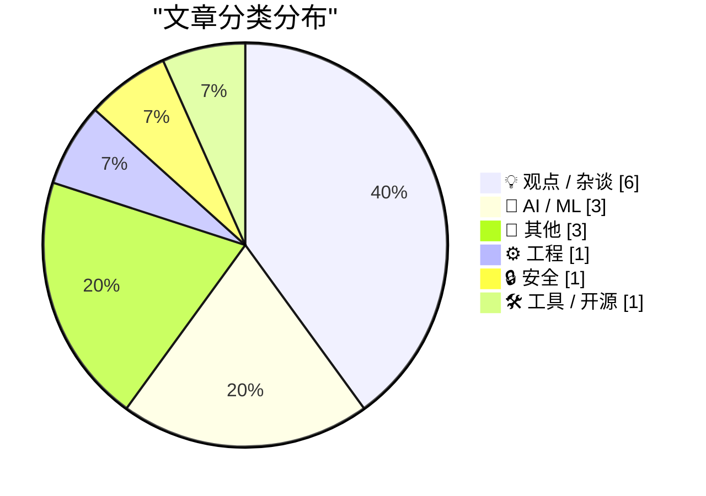
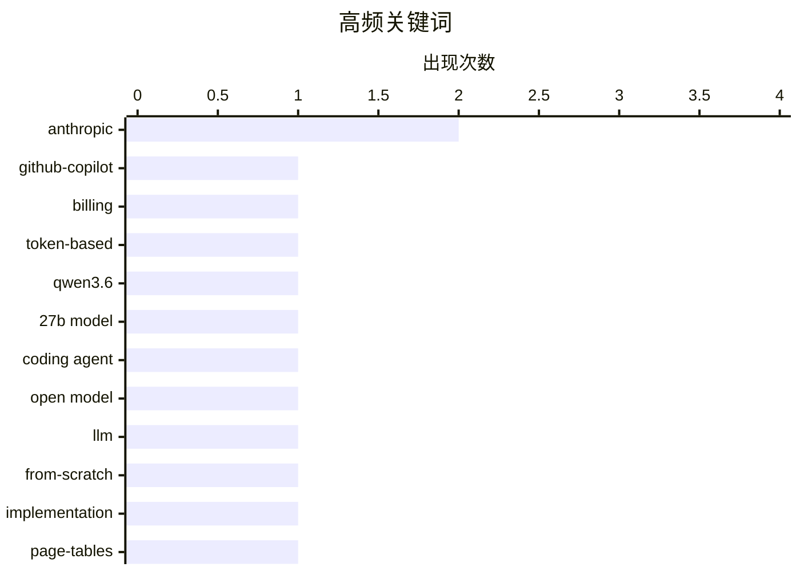

# 📰 AI 博客每日精选 — 2026-04-23

> 来自 Karpathy 推荐的 92 个顶级技术博客，AI 精选 Top 15

## 📝 今日看点

今日技术圈聚焦三大趋势：AI商业化路径日益清晰，微软拟全面转向Token计费模式，GitHub Copilot个人版调价落地，显示平台级AI服务正寻求可持续盈利；与此同时，开源大模型持续突破，通义千问Qwen3.6-27B以密集架构实现媲美MoE模型的代码能力，挑战“参数量即性能”的传统认知。此外，AI在工程与安全领域的深度应用加速落地，从分形页映射优化内存管理，到Claude Mythos助力Firefox发现271个漏洞，凸显AI不仅是生产力工具，更成为系统级创新的关键驱动力。

---

## 🏆 今日必读

🥇 **独家：微软将于6月将所有GitHub Copilot订阅用户转为基于Token的计费模式**

[Exclusive: Microsoft Moving All GitHub Copilot Subscribers To Token-Based Billing In June](https://www.wheresyoured.at/exclusive-microsoft-moving-all-github-copilot-subscribers-to-token-based-billing-in-june/) — wheresyoured.at · 8 小时前 · 🤖 AI / ML

> 微软内部文件显示，自2026年6月起，所有GitHub Copilot用户将切换至基于Token的计费系统。Copilot商业版用户每月每用户收费19美元，获得30美元共享AI额度；企业版用户每月每用户收费39美元，获得70美元共享AI额度。此次调整旨在优化资源分配并提升计费透明度。

💡 **为什么值得读**: 这一变更直接影响数百万开发者的使用成本与预算规划，是理解当前AI生产力工具商业化趋势的关键案例。

🏷️ GitHub-Copilot, billing, token-based

🥈 **Qwen3.6-27B：在270亿参数密集模型中实现旗舰级代码能力**

[Qwen3.6-27B: Flagship-Level Coding in a 27B Dense Model](https://simonwillison.net/2026/Apr/22/qwen36-27b/#atom-everything) — simonwillison.net · 9 小时前 · 🤖 AI / ML

> 通义千问发布Qwen3.6-27B模型，宣称其代码代理性能达到甚至超越上一代开源旗舰MoE模型Qwen3.5-397B-A17B（总参数量3970亿/激活170亿）。该密集模型在主流编码基准测试中全面领先，展示了小模型通过架构创新逼近大模型性能的潜力。

💡 **为什么值得读**: 这标志着密集模型在复杂任务上取得重大突破，为资源受限场景下部署高性能AI提供了新路径。

🏷️ Qwen3.6, 27B model, coding agent, open model

🥉 **从零构建LLM系列第33篇：我在完成附录后学到的经验**

[Writing an LLM from scratch, part 33 -- what I learned from finally getting round to the appendices](https://www.gilesthomas.com/2026/04/llm-from-scratch-33-what-i-learned-from-the-appendices) — gilesthomas.com · 8 小时前 · 🤖 AI / ML

> 作者在完成《从零构建大型语言模型》一书主体内容后，实现了三项后续目标：训练自己的GPT-2小型基础模型、深入理解注意力机制实现细节、探索模型微调技术。这些实践揭示了理论教学与工程落地间的关键差距。

💡 **为什么值得读**: 对想真正掌握LLM底层原理的开发者而言，这是理论与实践结合的最佳实践指南。

🏷️ LLM, from-scratch, implementation

---

## 📊 数据概览

| 扫描源 | 抓取文章 | 时间范围 | 精选 |
|:---:|:---:|:---:|:---:|
| 83/92 | 2440 篇 → 17 篇 | 24h | **15 篇** |

### 分类分布



### 高频关键词



<details>
<summary>📈 纯文本关键词图（终端友好）</summary>

```
anthropic      │ ████████████████████ 2
github-copilot │ ██████████░░░░░░░░░░ 1
billing        │ ██████████░░░░░░░░░░ 1
token-based    │ ██████████░░░░░░░░░░ 1
qwen3.6        │ ██████████░░░░░░░░░░ 1
27b model      │ ██████████░░░░░░░░░░ 1
coding agent   │ ██████████░░░░░░░░░░ 1
open model     │ ██████████░░░░░░░░░░ 1
llm            │ ██████████░░░░░░░░░░ 1
from-scratch   │ ██████████░░░░░░░░░░ 1
```

</details>

### 🏷️ 话题标签

**anthropic**(2) · **github-copilot**(1) · **billing**(1) · token-based(1) · qwen3.6(1) · 27b model(1) · coding agent(1) · open model(1) · llm(1) · from-scratch(1) · implementation(1) · page-tables(1) · virtual-memory(1) · fractal-mapping(1) · ai-education(1) · lean-launchpad(1) · innovation(1) · ai security(1) · zero-day vulnerabilities(1) · firefox(1)

---

## 💡 观点 / 杂谈

### 1. AI与教学：我们正在见证教育的新纪元

[AI and Teaching – The Brave New World](https://steveblank.com/2026/04/22/ai-and-teaching-the-brave-new-world/) — **steveblank.com** · 10 小时前 · ⭐ 23/30

> 斯坦福Lean LaunchPad课程第16年教学中，团队发现AI工具从第一堂课就彻底改变了学习方式。学生使用AI辅助项目构思、原型设计和迭代，标志着传统教学方法向人机协同范式转变的开始。

🏷️ AI-education, Lean-LaunchPad, innovation

---

### 2. 它不是犯罪，只要我们用App做就不算（关于护士的Uber化）

[Pluralistic: It's not a crime if we do it (to nurses) with an app (22 Apr 2026)](https://pluralistic.net/2026/04/22/uber-for-nurses/) — **pluralistic.net** · 10 小时前 · ⭐ 20/30

> 作者以讽刺手法探讨医疗行业劳动力市场变化，指出当科技公司用App重新定义护理工作时，法律往往滞后于技术创新。文章批判性地审视了平台经济对专业职业的冲击。

🏷️ nursing, app surveillance, digital monitoring, ethics

---

### 3. 替罪羊？McClatchy新闻社证明：真正驱动变革的是人类而非AI

[The Scapegoat](https://feed.tedium.co/link/15204/17323348/mcclatchy-journalism-ai-scapegoat) — **tedium.co** · 22 小时前 · ⭐ 20/30

> 尽管媒体大肆渲染AI对新闻业的冲击，McClatchy的案例表明，真正推动行业变化的仍是人类记者和编辑的决策。AI只是工具，最终价值仍取决于人的判断与创造力。

🏷️ AI, corporate-change, human-agency

---

### 4. Claude Code会定价100美元/月吗？可能不会——事情相当混乱

[Is Claude Code going to cost $100/month? Probably not - it's all very confusing](https://simonwillison.net/2026/Apr/22/claude-code-confusion/#atom-everything) — **simonwillison.net** · 23 小时前 · ⭐ 19/30

> Anthropic悄然修改定价页面后又撤销，引发Claude Code是否将推出高价订阅模式的猜测。这种反复无常的策略反映出初创AI公司在商业化路径上的不确定性与市场试探行为。

🏷️ Claude Code, pricing confusion, Anthropic

---

### 5. 蒂姆·库克的完美时机

[Ben Thompson on Tim Cook’s Legacy](https://stratechery.com/2026/tim-cooks-impeccable-timing/) — **daringfireball.net** · 9 小时前 · ⭐ 17/30

> 文章探讨蒂姆·库克作为苹果运营大师的遗产，重点分析他从1998年加入苹果后如何彻底改革公司臃肿的运营体系。库克关闭了苹果自营工厂和仓库，将制造重心转移至中国，建立起高效的准时制（just-in-time）供应链，显著提升了运营效率。这一战略转型不仅为iPhone的规模化成功奠定基础，也体现了库克卓越的战略执行能力。作者认为，库克的真正遗产在于他精准把握时机、推动组织变革的能力。

🏷️ Tim Cook, Apple legacy, operations

---

### 6. 如何产生伟大的创意

[How to Come Up With Great Ideas](https://idiallo.com/blog/how-to-come-up-with-great-ideas?src=feed) — **idiallo.com** · 13 小时前 · ⭐ 16/30

> 文章通过一个陶艺教学实验揭示创意生成的核心逻辑：追求‘完美作品’的小组因过度规划而失败，而‘快速制作多个作品’的小组虽产出拙劣却激发了更多可能性。这说明创意往往诞生于大量试错而非精雕细琢。作者主张，在创新过程中应优先追求数量而非质量，因为多样性是突破的关键。该观点挑战了传统对‘精益求精’的推崇，强调行动力比完美主义更重要。

🏷️ creativity, idea generation, problem solving

---

## 🤖 AI / ML

### 7. 独家：微软将于6月将所有GitHub Copilot订阅用户转为基于Token的计费模式

[Exclusive: Microsoft Moving All GitHub Copilot Subscribers To Token-Based Billing In June](https://www.wheresyoured.at/exclusive-microsoft-moving-all-github-copilot-subscribers-to-token-based-billing-in-june/) — **wheresyoured.at** · 8 小时前 · ⭐ 27/30

> 微软内部文件显示，自2026年6月起，所有GitHub Copilot用户将切换至基于Token的计费系统。Copilot商业版用户每月每用户收费19美元，获得30美元共享AI额度；企业版用户每月每用户收费39美元，获得70美元共享AI额度。此次调整旨在优化资源分配并提升计费透明度。

🏷️ GitHub-Copilot, billing, token-based

---

### 8. Qwen3.6-27B：在270亿参数密集模型中实现旗舰级代码能力

[Qwen3.6-27B: Flagship-Level Coding in a 27B Dense Model](https://simonwillison.net/2026/Apr/22/qwen36-27b/#atom-everything) — **simonwillison.net** · 9 小时前 · ⭐ 26/30

> 通义千问发布Qwen3.6-27B模型，宣称其代码代理性能达到甚至超越上一代开源旗舰MoE模型Qwen3.5-397B-A17B（总参数量3970亿/激活170亿）。该密集模型在主流编码基准测试中全面领先，展示了小模型通过架构创新逼近大模型性能的潜力。

🏷️ Qwen3.6, 27B model, coding agent, open model

---

### 9. 从零构建LLM系列第33篇：我在完成附录后学到的经验

[Writing an LLM from scratch, part 33 -- what I learned from finally getting round to the appendices](https://www.gilesthomas.com/2026/04/llm-from-scratch-33-what-i-learned-from-the-appendices) — **gilesthomas.com** · 8 小时前 · ⭐ 25/30

> 作者在完成《从零构建大型语言模型》一书主体内容后，实现了三项后续目标：训练自己的GPT-2小型基础模型、深入理解注意力机制实现细节、探索模型微调技术。这些实践揭示了理论教学与工程落地间的关键差距。

🏷️ LLM, from-scratch, implementation

---

## 📝 其他

### 10. 如何保存RSS订阅源

[[RSS Club] How do you preserve an RSS feed?](https://shkspr.mobi/blog/2026/04/rss-club-how-do-you-preserve-an-rss-feed/) — **shkspr.mobi** · 14 小时前 · ⭐ 15/30

> 文章讨论数字内容长期保存的挑战，引用Martin Paul Eve的观点指出博客存档面临技术过时、平台依赖和元数据丢失等问题。作者认同保存的重要性，但也认为当前技术手段尚不成熟，需付出‘必要痛苦’。文中未提出具体解决方案，但呼吁社区重视信息持久性。该文属于RSS Club系列，旨在推动开放网络标准的延续。

🏷️ RSS, preservation, digital-archives

---

### 11. 当Escom收购Commodore

[When Escom bought Commodore](https://dfarq.homeip.net/when-escom-bought-commodore/?utm_source=rss&#038;utm_medium=rss&#038;utm_campaign=when-escom-bought-commodore) — **dfarq.homeip.net** · 14 小时前 · ⭐ 13/30

> 1995年4月22日，欧洲公司Escom以1400万美元收购Commodore，当时被视为Amiga平台的救星。然而收购后Escom未能扭转Commodore衰败趋势，最终导致其再次破产。文章回顾这段历史，指出Escom虽具资金实力，但缺乏对消费电子市场的深刻理解与产品创新能力。此次收购成为计算机史上一次典型的‘善意干预失败’案例。

🏷️ Commodore, Escom, Amiga-history

---

### 12. Rec League：发现你热爱的世界

[[Sponsor] Rec League](https://recleague.com/?lyr_campaign=df) — **daringfireball.net** · 22 小时前 · ⭐ 12/30

> Rec League是一款新推出的推荐分享应用，用户可创建个性化收藏集（如‘罗马旅行指南’‘我的书架’），并关注值得信赖的意见领袖以获取独特见解。该应用被App Store评为‘最佳新应用’，用户评价其为‘使用后感觉更好的唯一社交媒体’。它重新定义了轻量级社交与信息发现体验。

🏷️ Rec League, app recommendation, social cataloging

---

## ⚙️ 工程

### 13. 通过页表映射页表到内存：所谓‘分形页映射’技术解析

[Mapping the page tables into memory via the page tables](https://devblogs.microsoft.com/oldnewthing/20260422-00/?p=112255) — **devblogs.microsoft.com/oldnewthing** · 11 小时前 · ⭐ 24/30

> 微软工程师详解了一种高级虚拟内存管理技术——将页表自身也作为内存页进行映射，形成递归式地址转换结构。这种‘分形页映射’优化了大规模系统的内存访问效率，尤其适用于需要频繁处理多级页表的场景。

🏷️ page-tables, virtual-memory, fractal-mapping

---

## 🔒 安全

### 14. Bobby Holley谈Firefox 150安全更新：Claude Mythos助力发现271个漏洞

[Quoting Bobby Holley](https://simonwillison.net/2026/Apr/22/bobby-holley/#atom-everything) — **simonwillison.net** · 20 小时前 · ⭐ 22/30

> Mozilla与Anthropic合作，在Firefox 150版本中修复了271个安全漏洞。这些漏洞是在早期Claude Mythos Preview应用于浏览器评估过程中被识别出来的，展示了AI在软件安全审计中的强大潜力。

🏷️ AI security, zero-day vulnerabilities, Firefox, Anthropic

---

## 🛠 工具 / 开源

### 15. GitHub Copilot个人计划定价调整正式公布

[Changes to GitHub Copilot Individual plans](https://simonwillison.net/2026/Apr/22/changes-to-github-copilot/#atom-everything) — **simonwillison.net** · 22 小时前 · ⭐ 22/30

> GitHub正式公告其Copilot个人计划价格变动，明确区分不同层级服务条款。与Anthropic临时涨价不同，GitHub选择公开透明地沟通变更细节，体现了平台级AI服务的稳定策略。

🏷️ GitHub Copilot, pricing change, developer tools

---

*生成于 2026-04-23 01:52 | 扫描 83 源 → 获取 2440 篇 → 精选 15 篇*
*基于 [Hacker News Popularity Contest 2025](https://refactoringenglish.com/tools/hn-popularity/) RSS 源列表，由 [Andrej Karpathy](https://x.com/karpathy) 推荐*
*由「懂点儿AI」制作，欢迎关注同名微信公众号获取更多 AI 实用技巧 💡*
