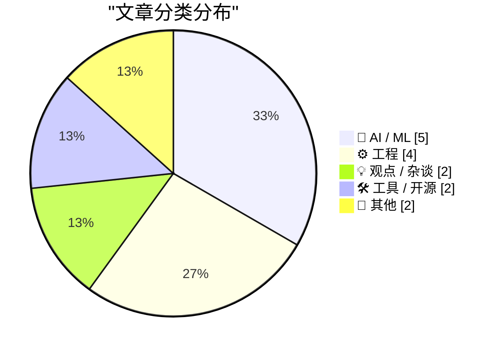
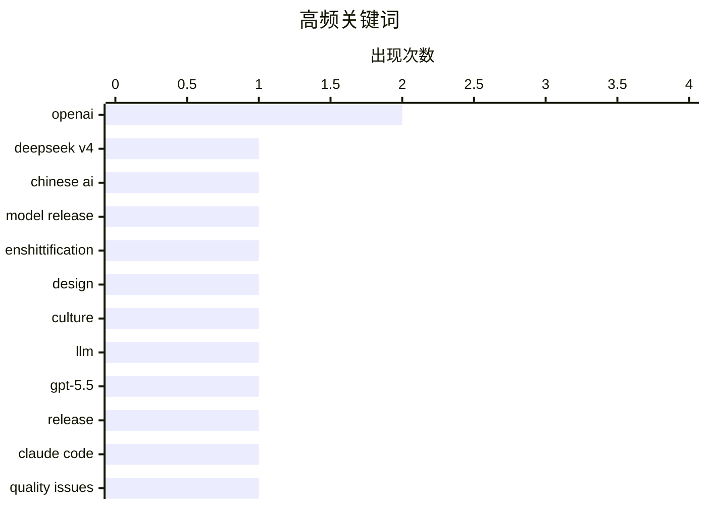

# 📰 AI 博客每日精选 — 2026-04-25

> 来自 Karpathy 推荐的 92 个顶级技术博客，AI 精选 Top 15

## 📝 今日看点

今日技术圈聚焦三大趋势：中国AI公司DeepSeek发布高性价比大模型，以百万级上下文长度和低价策略冲击前沿市场；开源社区持续探讨AI伦理与治理，从“功能退化”概念到Mythos AI对代码安全的潜在影响，反映出对技术失控的深层忧虑；同时，工程实践层面亮点频出，如SQLite新增Postgres通知机制、C++异常处理最佳实践等，凸显底层系统创新与开发者工具优化的并行发展。

---

## 🏆 今日必读

🥇 **DeepSeek V4：接近前沿水平，价格仅为十分之一**

[DeepSeek V4 - almost on the frontier, a fraction of the price](https://simonwillison.net/2026/Apr/24/deepseek-v4/#atom-everything) — simonwillison.net · 18 小时前 · 🤖 AI / ML

> 中国AI实验室DeepSeek发布了备受期待的V4系列模型中的两个预览版——DeepSeek-V4-Pro和DeepSeek-V4-Flash。这两个模型均支持100万token上下文长度，并采用混合专家（Mixture of Experts）架构。与上一代V3.2相比，V4在性能和成本效率上均有显著提升，Pro版本在复杂推理任务中表现接近顶级模型，而Flash版本则以更低延迟实现高吞吐量。DeepSeek表示其技术路线在保持高性能的同时大幅降低了训练与部署成本。

💡 **为什么值得读**: 这是DeepSeek最新一代大模型的首次公开亮相，展示了其在性能与成本之间取得突破性平衡的技术实力，对全球AI市场竞争格局具有重要影响。

🏷️ DeepSeek V4, Chinese AI, model release

🥈 **多元主义：为‘功能退化’设计的免费开源视觉标识**

[Pluralistic: A free, open visual identity for enshittification (24 Apr 2026)](https://pluralistic.net/2026/04/24/poop-emoji-plus-plus/) — pluralistic.net · 11 小时前 · 💡 观点 / 杂谈

> 本文提出了一个名为‘功能退化’（enshittification）的概念及其对应的视觉标识设计，旨在揭示数字平台如何逐渐牺牲用户体验以追求利润最大化。作者强调该标识是免费且开源的，可用于识别那些因商业策略而变得臃肿、低效或令人不满的服务。这一设计不仅是对当前互联网生态的批判工具，也鼓励社区共同参与对抗平台滥用权力的现象。

💡 **为什么值得读**: 它提供了一个清晰、可复用的符号来描述和对抗现代科技产品日益严重的‘功能退化’趋势，有助于公众识别并抵制不良平台行为。

🏷️ enshittification, design, culture

🥉 **llm 0.31 发布：新增 GPT-5.5 模型与动词度控制选项**

[llm 0.31](https://simonwillison.net/2026/Apr/24/llm/#atom-everything) — simonwillison.net · 56 分钟前 · 🛠 工具 / 开源

> Simon Willison 发布的 llm 0.31 版本正式集成了 OpenAI 最新的 GPT-5.5 模型，用户可通过 `llm -m gpt-5.5` 调用。同时新增了针对 GPT-5+ 系列模型的文本动词度参数设置功能（`-o verbosity low/medium/high`），允许开发者更精细地控制输出详细程度。此外还包括多项 bug 修复与性能优化。

💡 **为什么值得读**: 对于使用命令行进行 LLM 交互的开发者而言，此更新提供了对最新最强模型的支持及更灵活的输出调控能力，极大提升了工作效率。

🏷️ LLM, OpenAI, gpt-5.5, release

---

## 📊 数据概览

| 扫描源 | 抓取文章 | 时间范围 | 精选 |
|:---:|:---:|:---:|:---:|
| 81/92 | 2404 篇 → 23 篇 | 24h | **15 篇** |

### 分类分布



### 高频关键词



<details>
<summary>📈 纯文本关键词图（终端友好）</summary>

```
openai           │ ████████████████████ 2
deepseek v4      │ ██████████░░░░░░░░░░ 1
chinese ai       │ ██████████░░░░░░░░░░ 1
model release    │ ██████████░░░░░░░░░░ 1
enshittification │ ██████████░░░░░░░░░░ 1
design           │ ██████████░░░░░░░░░░ 1
culture          │ ██████████░░░░░░░░░░ 1
llm              │ ██████████░░░░░░░░░░ 1
gpt-5.5          │ ██████████░░░░░░░░░░ 1
release          │ ██████████░░░░░░░░░░ 1
```

</details>

### 🏷️ 话题标签

**openai**(2) · **deepseek v4**(1) · **chinese ai**(1) · model release(1) · enshittification(1) · design(1) · culture(1) · llm(1) · gpt-5.5(1) · release(1) · claude code(1) · quality issues(1) · postmortem(1) · mythos ai(1) · open source(1) · security(1) · raii(1) · scope_exit(1) · exception safety(1) · sqlite(1)

---

## 🤖 AI / ML

### 1. DeepSeek V4：接近前沿水平，价格仅为十分之一

[DeepSeek V4 - almost on the frontier, a fraction of the price](https://simonwillison.net/2026/Apr/24/deepseek-v4/#atom-everything) — **simonwillison.net** · 18 小时前 · ⭐ 26/30

> 中国AI实验室DeepSeek发布了备受期待的V4系列模型中的两个预览版——DeepSeek-V4-Pro和DeepSeek-V4-Flash。这两个模型均支持100万token上下文长度，并采用混合专家（Mixture of Experts）架构。与上一代V3.2相比，V4在性能和成本效率上均有显著提升，Pro版本在复杂推理任务中表现接近顶级模型，而Flash版本则以更低延迟实现高吞吐量。DeepSeek表示其技术路线在保持高性能的同时大幅降低了训练与部署成本。

🏷️ DeepSeek V4, Chinese AI, model release

---

### 2. Claude Code 质量报告更新：问题源于封装而非模型本身

[An update on recent Claude Code quality reports](https://simonwillison.net/2026/Apr/24/recent-claude-code-quality-reports/#atom-everything) — **simonwillison.net** · 23 小时前 · ⭐ 23/30

> Anthropic 发布关于近期 Claude Code 质量下降事件的复盘报告，确认过去两个月用户反馈的问题确实存在。但根本原因并非底层模型性能下滑，而是三个独立的工程缺陷——包括提示词注入漏洞、缓存机制错误以及日志记录混乱——共同导致了输出质量恶化。公司已修复这些问题并承诺加强测试流程。

🏷️ Claude Code, quality issues, postmortem

---

### 3. Mythos AI 是否意味着应关闭开源仓库？不必担心

[Does Mythos mean you need to shut down your Open Source repositories?](https://shkspr.mobi/blog/2026/04/does-mythos-mean-you-need-to-shut-down-your-open-source-repos/) — **shkspr.mobi** · 12 小时前 · ⭐ 23/30

> 针对新出现的 Mythos AI 宣称能全面接管代码库的说法，作者指出所有主流开源项目早在几年前就已作为训练数据被广泛采集。因此即便现在停止维护也不会带来额外风险。真正需要关注的是未来新项目的安全边界设定，而非历史代码的命运。建议采取主动防御而非被动反应。

🏷️ Mythos AI, open source, security

---

### 4. Dwarkesh 博客大奖：征集关于 AI 重大问题的悬赏文章

[Blog prize for the big questions about AI](https://www.dwarkesh.com/p/blog-prize) — **dwarkesh.com** · 7 小时前 · ⭐ 21/30

> Dwarkesh Patel 设立了一项悬赏计划，邀请研究者提交关于人工智能领域最重要未解问题的深度分析文章。获胜作品将获得奖金并被收录至其博客专栏。此举旨在汇聚顶尖智慧，推动对 AI 发展路径、伦理挑战及长期影响的系统性思考。

🏷️ AI research, big questions, blog prize

---

### 5. OpenAI 如何击败 Oracle：从数据库巨头到 AI 新星

[Premium: How OpenAI Kills Oracle](https://www.wheresyoured.at/how-openai-kills-oracle/) — **wheresyoured.at** · 7 小时前 · ⭐ 21/30

> 文章追溯了 Larry Ellison 亲自飞往华盛顿与 OpenAI 高管会面的背景，揭示了传统数据库霸主 Oracle 在面对生成式 AI 浪潮时的战略焦虑。OpenAI 凭借垂直整合的软硬件协同优势、海量高质量数据闭环以及开放生态策略，正在重塑企业计算基础设施的竞争格局。

🏷️ OpenAI, Oracle, AI competition

---

## ⚙️ 工程

### 6. 防御 scope_exit RAII 类型中的异常处理

[Defending against exceptions in a scope_exit RAII type](https://devblogs.microsoft.com/oldnewthing/20260424-00/?p=112266) — **devblogs.microsoft.com/oldnewthing** · 10 小时前 · ⭐ 23/30

> 微软资深工程师 Raymond Chen 探讨了在 C++ 中使用 scope_exit 类时如何应对构造函数或析构函数中可能抛出的异常。他分析了多种场景下的最佳实践，强调即使资源清理操作本身不应失败，也必须为其编写健壮的错误处理逻辑，以确保程序稳定性。

🏷️ RAII, scope_exit, exception safety

---

### 7. honker：为 SQLite 添加 Postgres 风格的 NOTIFY/LISTEN 通知机制

[russellromney/honker](https://simonwillison.net/2026/Apr/24/honker/#atom-everything) — **simonwillison.net** · 22 小时前 · ⭐ 22/30

> Russell Romney 开发的 honker 是一个用 Rust 编写的 SQLite 扩展，实现了类似 PostgreSQL 的 NOTIFY/LISTEN 异步消息通知语义。通过 Python 绑定，开发者可以轻松地在 SQLite 数据库变更时触发事件通知，适用于轻量级队列系统或实时同步场景。该项目展示了跨数据库抽象通信层的设计潜力。

🏷️ SQLite, Postgres NOTIFY, Rust extension

---

### 8. 如何为 Bluesky 的 For You 信息流提供服务

[Serving the For You feed](https://simonwillison.net/2026/Apr/24/serving-the-for-you-feed/#atom-everything) — **simonwillison.net** · 23 小时前 · ⭐ 19/30

> Bluesky 平台允许用户运行自定义 feed 算法，实现个性化内容推荐。文章探讨了如何实现高效、可扩展的 For You feed 服务，支持大规模用户并发访问。作者分析了现有架构的挑战，并提出基于分布式系统和缓存优化的技术方案。该设计显著提升了 feed 生成速度与系统稳定性。

🏷️ Bluesky, custom feeds, AT Protocol

---

### 9. Apple IIc：1984年推出的更小巧的 Apple II 电脑

[Apple IIc: A smaller, sleeker Apple II from 1984](https://dfarq.homeip.net/apple-iic/?utm_source=rss&#038;utm_medium=rss&#038;utm_campaign=apple-iic) — **dfarq.homeip.net** · 13 小时前 · ⭐ 16/30

> Apple IIc 是 Apple II 系列中首款便携式计算机，于1984年4月24日发布。它打破了此前 II、II+ 和 IIe 均为台式机的设计传统，采用紧凑一体化机身，内置软驱并支持外接显示器。这款设备标志着苹果向移动计算迈出的重要一步。

🏷️ Apple IIc, retro computing, hardware history

---

## 💡 观点 / 杂谈

### 10. 多元主义：为‘功能退化’设计的免费开源视觉标识

[Pluralistic: A free, open visual identity for enshittification (24 Apr 2026)](https://pluralistic.net/2026/04/24/poop-emoji-plus-plus/) — **pluralistic.net** · 11 小时前 · ⭐ 25/30

> 本文提出了一个名为‘功能退化’（enshittification）的概念及其对应的视觉标识设计，旨在揭示数字平台如何逐渐牺牲用户体验以追求利润最大化。作者强调该标识是免费且开源的，可用于识别那些因商业策略而变得臃肿、低效或令人不满的服务。这一设计不仅是对当前互联网生态的批判工具，也鼓励社区共同参与对抗平台滥用权力的现象。

🏷️ enshittification, design, culture

---

### 11. 人们并不渴望自动化：解析 AI 为何不受大众欢迎

[The people do not yearn for automation](https://simonwillison.net/2026/Apr/24/the-people-do-not-yearn-for-automation/#atom-everything) — **simonwillison.net** · 1 小时前 · ⭐ 21/30

> Nilay Patel 在其视频评论中指出，尽管 ChatGPT 等 AI 工具使用量持续增长，普通公众对其普遍持负面态度。核心原因在于‘软件脑’（software brain）概念下，用户反感被算法替代思考过程，认为 AI 削弱了人类自主性与创造力。这种心理抗拒比技术优劣更能决定大众接受度。

🏷️ AI backlash, public perception, automation

---

## 🛠 工具 / 开源

### 12. llm 0.31 发布：新增 GPT-5.5 模型与动词度控制选项

[llm 0.31](https://simonwillison.net/2026/Apr/24/llm/#atom-everything) — **simonwillison.net** · 56 分钟前 · ⭐ 24/30

> Simon Willison 发布的 llm 0.31 版本正式集成了 OpenAI 最新的 GPT-5.5 模型，用户可通过 `llm -m gpt-5.5` 调用。同时新增了针对 GPT-5+ 系列模型的文本动词度参数设置功能（`-o verbosity low/medium/high`），允许开发者更精细地控制输出详细程度。此外还包括多项 bug 修复与性能优化。

🏷️ LLM, OpenAI, gpt-5.5, release

---

### 13. XOXO Explore：十年后重启的创意盛会网站

[XOXO Explore](https://xoxofest.com/blog/2026-launching-xoxo-explore/) — **daringfireball.net** · 11 小时前 · ⭐ 18/30

> XOXO 团队在停办两年后重新推出官方网站 XOXO Explore，首次加入完整的 About 页面。该网站追溯了 XOXO 音乐节十二年的发展历程，回顾其作为创意与技术交汇点的历史意义。项目以 GitHub 仓库的临时命名“XOXO”为灵感，延续了对数字文化、艺术与科技融合的探索。

🏷️ XOXO, festival, web archive

---

## 📝 其他

### 14. 新款 10GbE USB 网卡更酷、更小、更便宜

[New 10 GbE USB adapters are cooler, smaller, cheaper](https://www.jeffgeerling.com/blog/2026/new-10-gbe-usb-adapters-cooler-smaller-cheaper/) — **jeffgeerling.com** · 10 小时前 · ⭐ 17/30

> 过去高端笔记本电脑需依赖昂贵的 Thunderbolt 接口才能实现 10GbE 网络连接，而新型 RTL8159 芯片的 USB 3.2 适配器正在改变这一局面。这些新设备体积仅为传统 Thunderbolt 适配器的一半左右，发热量更低，价格更具竞争力。测试显示其性能已能满足高速局域网传输需求。

🏷️ 10GbE, USB adapter, networking

---

### 15. 非线性效应对单摆运动的影响分析

[How nonlinearity affects a pendulum](https://www.johndcook.com/blog/2026/04/24/nonlinear-pendulum/) — **johndcook.com** · 38 分钟前 · ⭐ 16/30

> 经典单摆运动方程在引入非线性项后，其周期不再与振幅无关。当摆角较大时，实际周期比小角度近似下的理论值更长。文章通过数学推导和数值模拟展示了非线性如何导致频率随振幅变化，并解释了为何大角度摆动会减慢整体节奏。

🏷️ pendulum, nonlinearity, physics

---

*生成于 2026-04-25 00:32 | 扫描 81 源 → 获取 2404 篇 → 精选 15 篇*
*基于 [Hacker News Popularity Contest 2025](https://refactoringenglish.com/tools/hn-popularity/) RSS 源列表，由 [Andrej Karpathy](https://x.com/karpathy) 推荐*
*由「懂点儿AI」制作，欢迎关注同名微信公众号获取更多 AI 实用技巧 💡*
