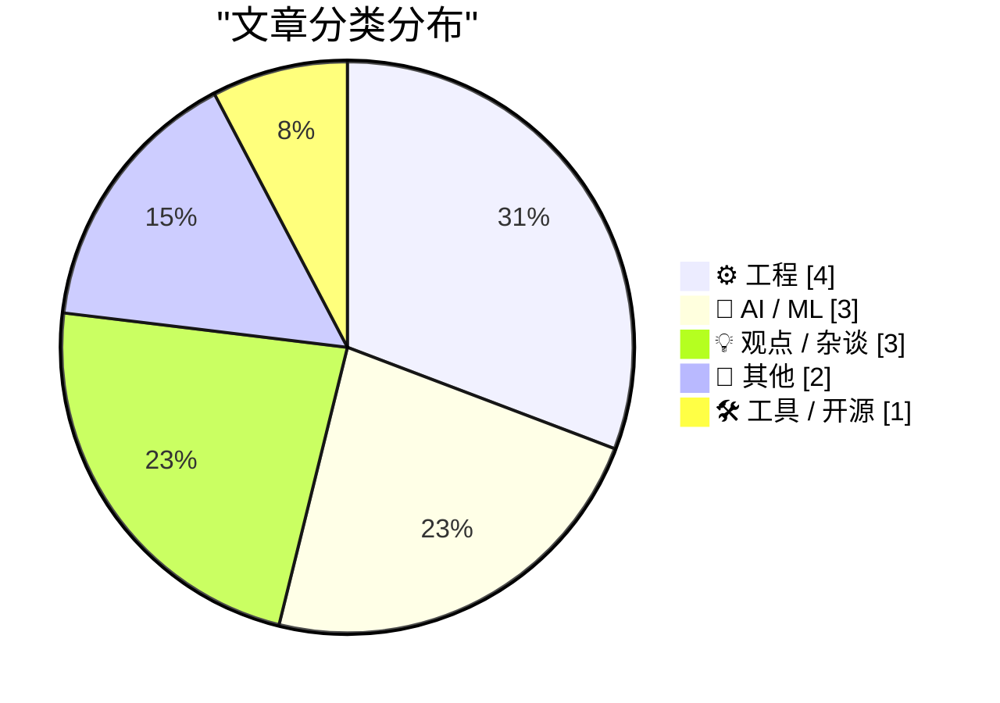
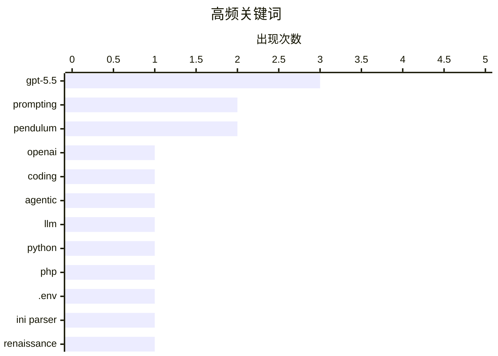

# 📰 AI 博客每日精选 — 2026-04-26

> 来自 Karpathy 推荐的 92 个顶级技术博客，AI 精选 Top 13

## 📝 今日看点

今日技术圈聚焦AI模型迭代与工程实践。OpenAI发布GPT-5.5提示工程指南，并确认其编码能力通过统一系统实现显著提升，推动开发者更高效利用大模型；同时，LLM工具0.31版本正式支持GPT-5.5，强化了命令行环境下的AI应用体验。此外，工程领域持续深入，从PHP解析.env文件的实用技巧到非线性摆方程的数学分析，体现基础技术与复杂系统建模的双重探索。

---

## 🏆 今日必读

🥇 **GPT-5.5 提示词指南**

[GPT-5.5 prompting guide](https://simonwillison.net/2026/Apr/25/gpt-5-5-prompting-guide/#atom-everything) — simonwillison.net · 18 小时前 · 🤖 AI / ML

> OpenAI 发布了针对 GPT-5.5 模型的官方提示工程指南，旨在帮助开发者更有效地使用该模型。文章重点介绍了如何通过结构化提示提升输出质量，并推荐了一种适用于需要长时间思考后再返回用户响应的应用场景的技巧：在提示中明确加入 'Before any' 前缀以引导模型进行深度推理。此外，该指南还强调了使用工具调用、系统消息和参数调优等高级技巧的重要性。作者指出，合理使用这些方法可以显著提升 GPT-5.5 在复杂任务中的表现。

💡 **为什么值得读**: 如果你正在集成 GPT-5.5 到你的应用或想优化现有提示策略，这份来自 OpenAI 的官方指南提供了经过验证的最佳实践和实用技巧。

🏷️ GPT-5.5, prompting, OpenAI

🥈 **Romain Huet 谈 GPT-5.5 的编码能力**

[Quoting Romain Huet](https://simonwillison.net/2026/Apr/25/romain-huet/#atom-everything) — simonwillison.net · 11 小时前 · 🤖 AI / ML

> OpenAI 联合创始人 Romain Huet 确认，自 GPT-5.4 起已将 Codex 与主模型统一为单一系统，不再有独立的编码分支。GPT-5.5 在此基础上进一步提升了代理式编程、计算机使用和通用计算机任务的能力，实现了显著的性能增益。Huet 特别说明，OpenAI 不会发布专门的 GPT-5.5-Codex 模型，所有功能都集成在主模型中。这一整合标志着 OpenAI 在 AI 编程助手领域的战略转变。

💡 **为什么值得读**: 了解 OpenAI 在 AI 编程助手方面的最新整合方向和技术演进，对于开发者构建下一代智能编程工具有重要参考价值。

🏷️ GPT-5.5, coding, agentic

🥉 **llm 0.31 发布：支持 GPT-5.5 和新参数**

[llm 0.31](https://simonwillison.net/2026/Apr/24/llm/#atom-everything) — simonwillison.net · 23 小时前 · 🛠 工具 / 开源

> Simon Willison 发布的 llm 0.31 版本正式支持 GPT-5.5 OpenAI 模型，用户可通过 `llm -m gpt-5.5` 命令调用。该版本新增了对 GPT-5+ 系列模型文本冗长度（verbosity）参数的支持，允许设置 `-o verbosity low/medium/high` 来控制输出详细程度。这些更新使命令行工具能更好地利用 GPT-5.5 的新特性，提升开发效率。

💡 **为什么值得读**: 如果你是 Python 开发者或 CLI 工具使用者，这个更新让你能直接在命令行中使用最新的 GPT-5.5 模型并控制其输出详细程度。

🏷️ llm, Python, GPT-5.5

---

## 📊 数据概览

| 扫描源 | 抓取文章 | 时间范围 | 精选 |
|:---:|:---:|:---:|:---:|
| 83/92 | 2440 篇 → 13 篇 | 24h | **13 篇** |

### 分类分布



### 高频关键词



<details>
<summary>📈 纯文本关键词图（终端友好）</summary>

```
gpt-5.5   │ ████████████████████ 3
prompting │ █████████████░░░░░░░ 2
pendulum  │ █████████████░░░░░░░ 2
openai    │ ███████░░░░░░░░░░░░░ 1
coding    │ ███████░░░░░░░░░░░░░ 1
agentic   │ ███████░░░░░░░░░░░░░ 1
llm       │ ███████░░░░░░░░░░░░░ 1
python    │ ███████░░░░░░░░░░░░░ 1
php       │ ███████░░░░░░░░░░░░░ 1
.env      │ ███████░░░░░░░░░░░░░ 1
```

</details>

### 🏷️ 话题标签

**gpt-5.5**(3) · **prompting**(2) · **pendulum**(2) · openai(1) · coding(1) · agentic(1) · llm(1) · python(1) · php(1) · .env(1) · ini parser(1) · renaissance(1) · history(1) · intellectual property(1) · benchmark(1) · ai(1) · nth derivative(1) · quotient rule(1) · calculus(1) · chatgpt(1)

---

## ⚙️ 工程

### 1. PHP 解析 .env 文件的小技巧与注意事项

[You can parse an .env file as an .ini with PHP - but there's a catch](https://shkspr.mobi/blog/2026/04/you-can-parse-an-env-file-as-an-ini-with-php-but-theres-a-catch/) — **shkspr.mobi** · 11 小时前 · ⭐ 21/30

> .env 文件作为轻量级环境变量存储方案被广泛使用，但 PHP 没有内置解析器。文章介绍了一个简单方法：使用 `parse_ini_file()` 函数来解析 .env 文件，因为两者语法相似。然而，.env 和 .ini 文件存在微妙差异：.env 支持引号包裹的值和行内注释，而 .ini 不支持。因此直接使用 `parse_ini_file()` 可能导致解析错误或数据丢失。

🏷️ PHP, .env, INI parser

---

### 2. 商的 n 阶导数公式及其复杂性

[nth derivative of a quotient](https://www.johndcook.com/blog/2026/04/25/nth-derivative-of-a-quotient/) — **johndcook.com** · 9 小时前 · ⭐ 18/30

> 文章探讨了商函数的 n 阶导数公式，指出虽然积函数的 n 阶导数有类似二项式定理的简洁公式，但商函数的公式更为复杂且鲜为人知。作者通过将商法则写成一种特殊形式，并应用两次商法则推导出结果，展示了这个复杂公式的推导过程。

🏷️ nth derivative, quotient rule, calculus

---

### 3. 非线性对摆运动的影响分析

[How nonlinearity affects a pendulum](https://www.johndcook.com/blog/2026/04/24/nonlinear-pendulum/) — **johndcook.com** · 23 小时前 · ⭐ 15/30

> 文章分析了非线性摆方程及其对解的影响。标准摆的运动微分方程涉及重力加速度 g 和摆长 ℓ。在入门物理课程中，教师通常会强调只考虑小角度 θ 的情况，此时可以使用 sin θ ≈ θ 的近似。但对于大角度位移，这种线性化会显著影响解的准确性。

🏷️ pendulum, nonlinearity, differential equation

---

### 4. 非线性摆方程的闭式解研究

[Closed-form solution to the nonlinear pendulum equation](https://www.johndcook.com/blog/2026/04/25/exact-solution-nonlinear-pendulum/) — **johndcook.com** · 6 小时前 · ⭐ 14/30

> 文章继续探讨非线性摆方程，研究了当初始位移较大时如何改进线性化近似的效果。如果初始位移足够小，可以直接用 θ 替换 sin θ；但如果位移较大，可以通过求解线性化方程来显著提高精度。这种方法为处理非线性微分方程提供了实用的数值计算策略。

🏷️ pendulum, nonlinear equation, closed-form solution

---

## 🤖 AI / ML

### 5. GPT-5.5 提示词指南

[GPT-5.5 prompting guide](https://simonwillison.net/2026/Apr/25/gpt-5-5-prompting-guide/#atom-everything) — **simonwillison.net** · 18 小时前 · ⭐ 25/30

> OpenAI 发布了针对 GPT-5.5 模型的官方提示工程指南，旨在帮助开发者更有效地使用该模型。文章重点介绍了如何通过结构化提示提升输出质量，并推荐了一种适用于需要长时间思考后再返回用户响应的应用场景的技巧：在提示中明确加入 'Before any' 前缀以引导模型进行深度推理。此外，该指南还强调了使用工具调用、系统消息和参数调优等高级技巧的重要性。作者指出，合理使用这些方法可以显著提升 GPT-5.5 在复杂任务中的表现。

🏷️ GPT-5.5, prompting, OpenAI

---

### 6. Romain Huet 谈 GPT-5.5 的编码能力

[Quoting Romain Huet](https://simonwillison.net/2026/Apr/25/romain-huet/#atom-everything) — **simonwillison.net** · 11 小时前 · ⭐ 23/30

> OpenAI 联合创始人 Romain Huet 确认，自 GPT-5.4 起已将 Codex 与主模型统一为单一系统，不再有独立的编码分支。GPT-5.5 在此基础上进一步提升了代理式编程、计算机使用和通用计算机任务的能力，实现了显著的性能增益。Huet 特别说明，OpenAI 不会发布专门的 GPT-5.5-Codex 模型，所有功能都集成在主模型中。这一整合标志着 OpenAI 在 AI 编程助手领域的战略转变。

🏷️ GPT-5.5, coding, agentic

---

### 7. 关于 AI 图像生成基准测试的思考

[WHY ARE YOU LIKE THIS](https://simonwillison.net/2026/Apr/25/why-are-you-like-this/#atom-everything) — **simonwillison.net** · 6 小时前 · ⭐ 18/30

> 针对 pelican riding a bicycle 基准测试的讨论，有人建议在现有测试基础上增加更多样化的测试用例。文章展示了 AI 生成的图像：一只鹈鹕骑着自行车沿土路行驶，后面跟着一辆警车，鹈鹕看起来很惊恐，可能是因为一个宇航员（奇怪地长着可抓握脚趾）也在骑行。这个例子引发了关于 AI 图像生成能力和测试方法的深入讨论。

🏷️ benchmark, AI, prompting

---

## 💡 观点 / 杂谈

### 8. Ada Palmer《发明文艺复兴》书评：一部杰作

[Pluralistic: Ada Palmer's "Inventing the Renaissance" (25 Apr 2026)](https://pluralistic.net/2026/04/25/machiavellian/) — **pluralistic.net** · 11 小时前 · ⭐ 19/30

> 这篇书评高度赞扬 Ada Palmer 的著作《Inventing the Renaissance》为一部杰作，称其为 'tour-de-force'（杰作）和 'magnum opus'（巅峰之作），认为其展现了非凡的智慧。文章讨论了多个主题，包括 RIAA 起诉无电脑家庭、John Deere 信息安全案、Foxconn 与威斯康星州纠纷、版权欺诈对酷刑犯声誉的影响，以及 '粗心的人' 现象。作者还预告了即将举行的演讲行程。

🏷️ Renaissance, history, intellectual property

---

### 9. ChatGPT 计划带来的满足感

[The Satisfaction of a ChatGPT Plan](https://idiallo.com/byte-size/the-satisfaction-of-a-chatgpt-plan?src=feed) — **idiallo.com** · 5 小时前 · ⭐ 17/30

> 作者观察到人们现在更倾向于分享他们用 AI 生成的 ChatGPT 商业计划，而不是原始创意想法。这种现象表明，当人们提出想法时，满足感更多来自于讲述实现方式而非实际构建过程。许多读者反馈他们也经历了同样的情况，即分享的是 AI 生成的执行计划而非核心创意。

🏷️ ChatGPT, productivity, idea sharing

---

### 10. 你收的是什么钱？

[What Do You Charge For?](https://idiallo.com/blog/what-do-you-charge-for?src=feed) — **idiallo.com** · 18 小时前 · ⭐ 13/30

> 文章探讨了自由职业者在定价时应明确收费对象：是收取产品本身的成本价，还是足以维持生计的合理报酬。作者反思了自己曾为一家公司提供网站开发服务时遇到的定价困惑，并指出这一问题是所有自由职业者（如顾问、技师或司机）都会面临的共同挑战。通过个人经历，他强调在制定价格策略后仍需回答核心问题——真正应该为哪部分价值收费。最终，作者认为应基于自身生活需求而非单纯项目成本来设定价格。

🏷️ freelancing, pricing, web development

---

## 📝 其他

### 11. 阅读清单 04/25/26

[Reading List 04/25/26](https://www.construction-physics.com/p/reading-list-042526) — **construction-physics.com** · 8 小时前 · ⭐ 13/30

> 本期阅读清单涵盖多个工程与技术主题，包括变压器钢制造工艺、纺织工程技术、快速启动电厂建设、次声波研究等前沿领域。内容聚焦于材料科学与能源系统的实际应用，适合对工业物理和先进制造感兴趣的技术读者。

🏷️ transformer steel, textile engineering, infrasound

---

### 12. 是时候端上一碗美味的 Cook-Ternus CEO 交接声明浓汤了

[★ Time to Serve Some Delicious Claim Chowder Regarding the Cook-Ternus CEO Transition](https://daringfireball.net/2026/04/delicious_claim_chowder_regarding_the_cook-ternus_ceo_transition) — **daringfireball.net** · 22 小时前 · ⭐ 12/30

> 文章回顾了2025年11月《金融时报》关于 Cook-Ternus CEO 交接的报道，并断言 Mark Gurman 曾斥其为“完全错误”的所有细节实际上全部准确无误。作者以讽刺口吻强调原始报道的真实性，暗示科技媒体长期存在的偏见与信息滞后问题。

🏷️ Cook-Ternus, CEO transition, FT report

---

## 🛠 工具 / 开源

### 13. llm 0.31 发布：支持 GPT-5.5 和新参数

[llm 0.31](https://simonwillison.net/2026/Apr/24/llm/#atom-everything) — **simonwillison.net** · 23 小时前 · ⭐ 23/30

> Simon Willison 发布的 llm 0.31 版本正式支持 GPT-5.5 OpenAI 模型，用户可通过 `llm -m gpt-5.5` 命令调用。该版本新增了对 GPT-5+ 系列模型文本冗长度（verbosity）参数的支持，允许设置 `-o verbosity low/medium/high` 来控制输出详细程度。这些更新使命令行工具能更好地利用 GPT-5.5 的新特性，提升开发效率。

🏷️ llm, Python, GPT-5.5

---

*生成于 2026-04-26 07:07 (Asia/Shanghai) | 扫描 83 源 → 获取 2440 篇 → 精选 13 篇*
*基于 [Hacker News Popularity Contest 2025](https://refactoringenglish.com/tools/hn-popularity/) RSS 源列表，由 [Andrej Karpathy](https://x.com/karpathy) 推荐*
*由「懂点儿AI」制作，欢迎关注同名微信公众号获取更多 AI 实用技巧 💡*
