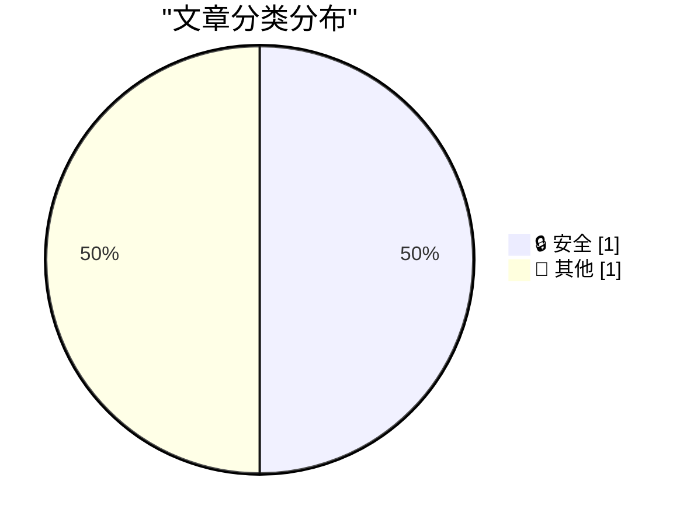
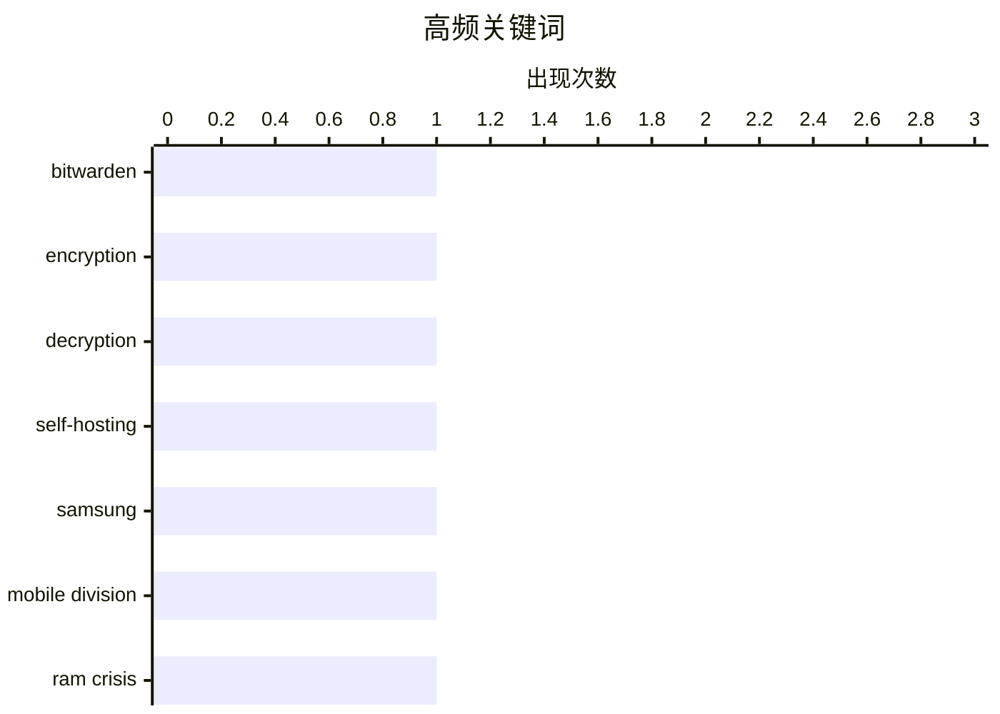

# 📰 AI 博客每日精选 — 2026-04-27

> 来自 Karpathy 推荐的 92 个顶级技术博客，AI 精选 Top 2

## 📝 今日看点

今日技术圈聚焦两大趋势：一是密码管理领域持续深化加密技术研究，Bitwarden 开源项目推动自托管场景下的安全实践成为关注焦点；二是半导体行业承压明显，三星移动部门因内存芯片市场供过于求面临成立以来首次亏损，凸显存储产业周期波动对终端业务的深远影响。

---

## 📊 数据概览

| 扫描源 | 抓取文章 | 时间范围 | 精选 |
|:---:|:---:|:---:|:---:|
| 80/92 | 2400 篇 → 2 篇 | 24h | **2 篇** |

### 分类分布



### 高频关键词



<details>
<summary>📈 纯文本关键词图（终端友好）</summary>

```
bitwarden       │ ████████████████████ 1
encryption      │ ████████████████████ 1
decryption      │ ████████████████████ 1
self-hosting    │ ████████████████████ 1
samsung         │ ████████████████████ 1
mobile division │ ████████████████████ 1
ram crisis      │ ████████████████████ 1
```

</details>

### 🏷️ 话题标签

**bitwarden**(1) · **encryption**(1) · **decryption**(1) · self-hosting(1) · samsung(1) · mobile division(1) · ram crisis(1)

---

## 🔒 安全

### 1. Bitwarden 如何加密和解密秘密

[How Bitwarden Encrypts and Decrypts Secrets](https://blog.miguelgrinberg.com/post/how-bitwarden-encrypts-and-decrypts-secrets) — **miguelgrinberg.com** · 3 小时前 · ⭐ 25/30

> 文章探讨了 Bitwarden 密码管理器在自托管场景下的加密机制，重点分析了其使用 SQLite 数据库存储加密数据的技术实现。作者研究了 Vaultwarden——一个开源的 Bitwarden 服务器克隆项目，发现它通过客户端加密将敏感信息在传输前就进行加密，服务器端仅存储密文。文章揭示了 Bitwarden 采用 AES-256-GCM 算法和基于用户主密码的密钥派生机制，确保即使数据库泄露也不会暴露明文密码。最终结论是，这种设计使得自托管方案既安全又便于备份，为减少对大型科技公司的依赖提供了可行路径。

🏷️ Bitwarden, encryption, decryption, self-hosting

---

## 📝 其他

### 2. 三星可能首次出现移动部门亏损，归因于内存危机

[Report Claims Samsung Might Post Its First-Ever Mobile Division Loss This Year, Blaming RAM Crisis](https://9to5google.com/2026/04/22/samsung-is-increasingly-worried-about-first-ever-mobile-division-loss-in-ram-crisis-report/) — **daringfireball.net** · 20 分钟前 · ⭐ 19/30

> 据韩国媒体报道，三星电子移动体验（MX）部门今年可能面临自成立以来首次运营亏损，主要受 DRAM 和 NAND 闪存市场严重供过于求的影响。公司内部已采取多项削减成本措施，包括推迟新品发布和调整供应链策略，但行业整体库存积压和高价合约导致价格持续下跌。尽管三星在高端手机市场仍具竞争力，但存储芯片业务拖累整体利润，反映出消费电子需求疲软与半导体周期下行叠加的风险。分析师认为，若内存价格未能快速反弹，这一亏损或将提前确认。

🏷️ Samsung, mobile division, RAM crisis

---

*生成于 2026-04-27 02:00 (Asia/Shanghai) | 扫描 80 源 → 获取 2400 篇 → 精选 2 篇*
*基于 [Hacker News Popularity Contest 2025](https://refactoringenglish.com/tools/hn-popularity/) RSS 源列表，由 [Andrej Karpathy](https://x.com/karpathy) 推荐*
*由「懂点儿AI」制作，欢迎关注同名微信公众号获取更多 AI 实用技巧 💡*
