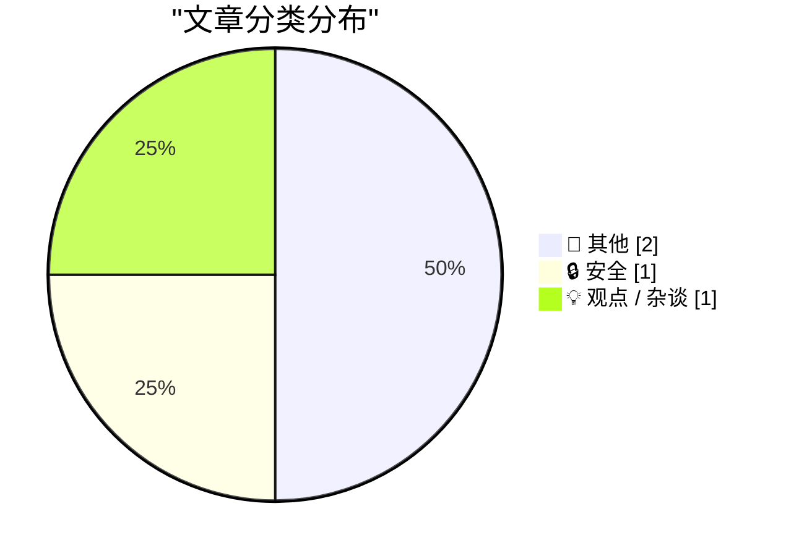
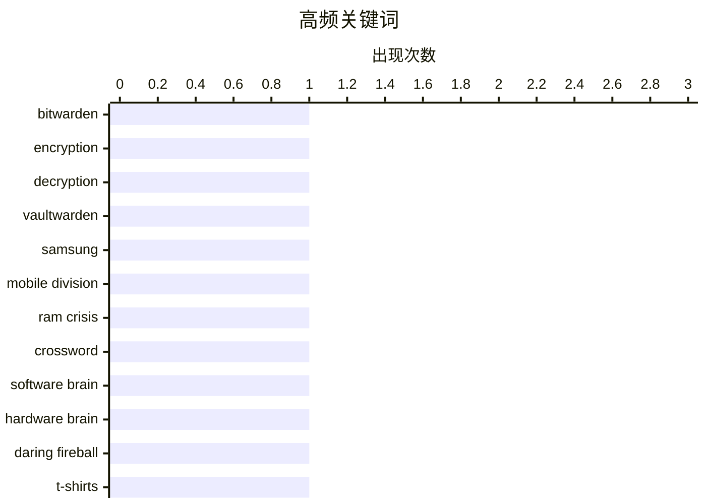

# 📰 AI 博客每日精选 — 2026-04-27

> 来自 Karpathy 推荐的 92 个顶级技术博客，AI 精选 Top 4

## 📝 今日看点

今日技术圈聚焦三大动向：一是密码管理安全持续受关注，Bitwarden 开源实现细节被深入剖析；二是半导体行业承压，三星移动部门因内存价格暴跌面临成立来首次亏损；三是科技与人文思维碰撞升温，《纽约时报》填字游戏失误引发对“软件速度”与“硬件完美”的哲学讨论。

---

## 🏆 今日必读

🥇 **Bitwarden 如何加密和解密秘密**

[How Bitwarden Encrypts and Decrypts Secrets](https://blog.miguelgrinberg.com/post/how-bitwarden-encrypts-and-decrypts-secrets) — miguelgrinberg.com · 11 小时前 · 🔒 安全

> 文章探讨了 Bitwarden 密码管理器在自托管场景下的安全机制，重点分析了其使用 SQLite 数据库存储加密数据的技术实现。作者通过研究 Vaultwarden——一个开源的 Bitwarden 服务器克隆项目，揭示了 Bitwarden 采用客户端加密（client-side encryption）的方式，确保用户数据在传输和存储过程中始终处于加密状态。核心加密流程依赖于用户的 master password 派生出的密钥，结合 AES-256-GCM 和 RSA-OAEP 算法完成本地加解密操作。该设计使得即使服务器被攻破，攻击者也无法获取明文密码信息。

💡 **为什么值得读**: 如果你正在考虑自建密码管理服务并希望理解主流方案的安全架构，这篇文章提供了清晰的技术拆解，尤其适合对端到端加密机制感兴趣的开发者。

🏷️ Bitwarden, encryption, decryption, Vaultwarden

🥈 **报告称三星可能首次出现移动部门亏损，归因于内存危机**

[Report Claims Samsung Might Post Its First-Ever Mobile Division Loss This Year, Blaming RAM Crisis](https://9to5google.com/2026/04/22/samsung-is-increasingly-worried-about-first-ever-mobile-division-loss-in-ram-crisis-report/) — daringfireball.net · 8 小时前 · 📝 其他

> 据韩国媒体报道，三星电子移动体验（MX）部门正面临自成立以来首次运营亏损的风险，主要受全球 DRAM 和 NAND 闪存供应紧张及价格暴跌影响。公司内部已采取多项削减措施，包括推迟新品发布和调整营销预算，以应对半导体市场低迷。尽管此前该部门长期保持盈利，但分析师指出，若消费电子需求持续疲软，亏损或将不可避免。这一情况也反映出整个科技行业正经历由 AI 芯片热潮引发的供应链结构性变化。

💡 **为什么值得读**: 了解三星移动业务困境有助于把握全球半导体周期与智能手机市场的联动关系，对投资者和科技观察者具有重要参考价值。

🏷️ Samsung, mobile division, RAM crisis

🥉 **《纽约时报》上周日印错了填字游戏网格，我觉得时机很巧妙**

[★ The New York Times Printed the Wrong Crossword Grid Last Sunday, and I Find That Timing Serendipitous](https://daringfireball.net/2026/04/nyt_wrong_crossword_grid) — daringfireball.net · 6 小时前 · 💡 观点 / 杂谈

> 作者调侃《纽约时报》周日版填字游戏出现印刷错误的事件，借此对比两种思维模式：软件思维强调速度与效率，认为‘唯一不可挽回的错误是行动太慢’；而硬件思维则主张专注与完美主义，坚持‘放慢节奏、追求卓越、永不妥协’。他认为此次失误虽小，却恰好映射出数字时代对即时性与容错性的矛盾需求。

💡 **为什么值得读**: 这篇短文以轻松幽默的方式引发对现代工作节奏与质量标准的深层思考，适合喜欢哲学式技术随笔的读者。

🏷️ crossword, software brain, hardware brain

---

## 📊 数据概览

| 扫描源 | 抓取文章 | 时间范围 | 精选 |
|:---:|:---:|:---:|:---:|
| 82/92 | 2423 篇 → 4 篇 | 24h | **4 篇** |

### 分类分布



### 高频关键词



<details>
<summary>📈 纯文本关键词图（终端友好）</summary>

```
bitwarden       │ ████████████████████ 1
encryption      │ ████████████████████ 1
decryption      │ ████████████████████ 1
vaultwarden     │ ████████████████████ 1
samsung         │ ████████████████████ 1
mobile division │ ████████████████████ 1
ram crisis      │ ████████████████████ 1
crossword       │ ████████████████████ 1
software brain  │ ████████████████████ 1
hardware brain  │ ████████████████████ 1
```

</details>

### 🏷️ 话题标签

**bitwarden**(1) · **encryption**(1) · **decryption**(1) · vaultwarden(1) · samsung(1) · mobile division(1) · ram crisis(1) · crossword(1) · software brain(1) · hardware brain(1) · daring fireball(1) · t-shirts(1) · hoodies(1)

---

## 📝 其他

### 1. 报告称三星可能首次出现移动部门亏损，归因于内存危机

[Report Claims Samsung Might Post Its First-Ever Mobile Division Loss This Year, Blaming RAM Crisis](https://9to5google.com/2026/04/22/samsung-is-increasingly-worried-about-first-ever-mobile-division-loss-in-ram-crisis-report/) — **daringfireball.net** · 8 小时前 · ⭐ 16/30

> 据韩国媒体报道，三星电子移动体验（MX）部门正面临自成立以来首次运营亏损的风险，主要受全球 DRAM 和 NAND 闪存供应紧张及价格暴跌影响。公司内部已采取多项削减措施，包括推迟新品发布和调整营销预算，以应对半导体市场低迷。尽管此前该部门长期保持盈利，但分析师指出，若消费电子需求持续疲软，亏损或将不可避免。这一情况也反映出整个科技行业正经历由 AI 芯片热潮引发的供应链结构性变化。

🏷️ Samsung, mobile division, RAM crisis

---

### 2. DF 周边商品：本轮 T 恤和连帽衫的最后机会

[DF Paraphernalia: Last Call for This Round of T-Shirts and Hoodies](https://store.daringfireball.net/) — **daringfireball.net** · 6 小时前 · ⭐ 11/30

> Daring Fireball 商店推出限时促销活动，提醒读者抓紧购买当前系列的 T 恤和连帽衫。恰逢网站创始人 Jimmy Wales 全职运营 Daring Fireball 整整二十周年，此次销售既是纪念活动的一部分，也延续了品牌一贯的极简设计与实用风格。文中还附上二十年前宣布全职写作时的原始声明，强调‘做自己喜欢的事’这一初心至今未变。

🏷️ Daring Fireball, t-shirts, hoodies

---

## 🔒 安全

### 3. Bitwarden 如何加密和解密秘密

[How Bitwarden Encrypts and Decrypts Secrets](https://blog.miguelgrinberg.com/post/how-bitwarden-encrypts-and-decrypts-secrets) — **miguelgrinberg.com** · 11 小时前 · ⭐ 25/30

> 文章探讨了 Bitwarden 密码管理器在自托管场景下的安全机制，重点分析了其使用 SQLite 数据库存储加密数据的技术实现。作者通过研究 Vaultwarden——一个开源的 Bitwarden 服务器克隆项目，揭示了 Bitwarden 采用客户端加密（client-side encryption）的方式，确保用户数据在传输和存储过程中始终处于加密状态。核心加密流程依赖于用户的 master password 派生出的密钥，结合 AES-256-GCM 和 RSA-OAEP 算法完成本地加解密操作。该设计使得即使服务器被攻破，攻击者也无法获取明文密码信息。

🏷️ Bitwarden, encryption, decryption, Vaultwarden

---

## 💡 观点 / 杂谈

### 4. 《纽约时报》上周日印错了填字游戏网格，我觉得时机很巧妙

[★ The New York Times Printed the Wrong Crossword Grid Last Sunday, and I Find That Timing Serendipitous](https://daringfireball.net/2026/04/nyt_wrong_crossword_grid) — **daringfireball.net** · 6 小时前 · ⭐ 15/30

> 作者调侃《纽约时报》周日版填字游戏出现印刷错误的事件，借此对比两种思维模式：软件思维强调速度与效率，认为‘唯一不可挽回的错误是行动太慢’；而硬件思维则主张专注与完美主义，坚持‘放慢节奏、追求卓越、永不妥协’。他认为此次失误虽小，却恰好映射出数字时代对即时性与容错性的矛盾需求。

🏷️ crossword, software brain, hardware brain

---

*生成于 2026-04-27 10:04 (Asia/Shanghai) | 扫描 82 源 → 获取 2423 篇 → 精选 4 篇*
*基于 [Hacker News Popularity Contest 2025](https://refactoringenglish.com/tools/hn-popularity/) RSS 源列表，由 [Andrej Karpathy](https://x.com/karpathy) 推荐*
*由「懂点儿AI」制作，欢迎关注同名微信公众号获取更多 AI 实用技巧 💡*
