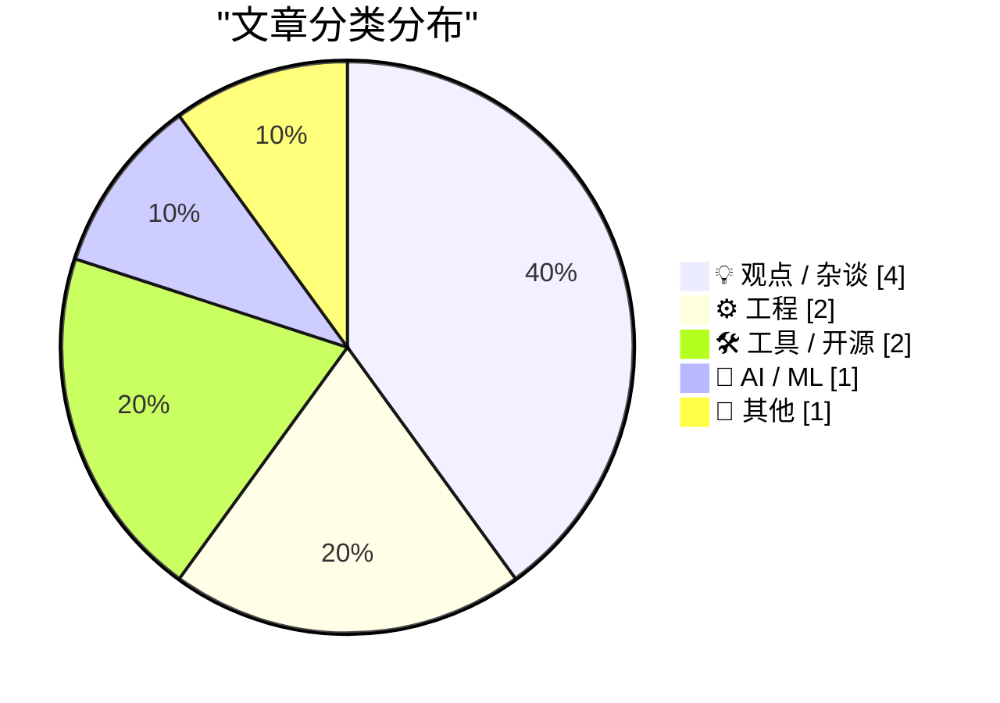
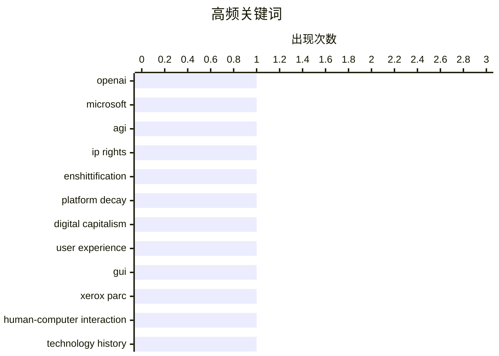

# 📰 AI 博客每日精选 — 2026-04-28

> 来自 Karpathy 推荐的 92 个顶级技术博客，AI 精选 Top 10

## 📝 今日看点

今日技术圈聚焦三大趋势：一是AI治理议题升温，OpenAI与微软的AGI协议条款引发对技术控制权与商业利益平衡的深层讨论；二是平台经济普遍面临“功能退化”困境，数字生态系统正加速滑向价值衰减的多元宇宙式命运；三是工程实践与认知哲学交织，从C语言底层机制到团队效率非线性增长，反映出技术发展背后复杂的系统思维与人因挑战。

---

## 🏆 今日必读

🥇 **追踪已失效的 OpenAI 与微软 AGI 条款历史**

[Tracking the history of the now-deceased OpenAI Microsoft AGI clause](https://simonwillison.net/2026/Apr/27/now-deceased-agi-clause/#atom-everything) — simonwillison.net · 5 分钟前 · 🤖 AI / ML

> 文章回顾了微软与 OpenAI 协议中一项关键条款的历史：若实现 AGI（人工通用智能），微软对 OpenAI 技术的商业知识产权将自动失效。作者通过分析 openai.com 上的公开文档，追溯了该条款从 2019 年首次出现至今的演变过程，揭示了双方关系中的法律与技术博弈。该条款已于近期正式终止，标志着两家公司战略合作的重大转折。这一变化可能影响未来 AI 技术商业化路径和知识产权分配格局。

💡 **为什么值得读**: 这项已失效的 AGI 条款曾是科技巨头间最具争议的 AI 治理实验之一，其终结预示着当前 AI 发展已进入新阶段。

🏷️ OpenAI, Microsoft, AGI, IP rights

🥈 **多元宇宙中的‘功能退化’现象**

[Pluralistic: The enshittification multiverse (27 Apr 2026)](https://pluralistic.net/2026/04/27/analogs-and-analogies/) — pluralistic.net · 10 小时前 · 💡 观点 / 杂谈

> 本文提出‘enshittification’（功能退化）概念可类比于多元宇宙理论，用以解释数字平台普遍存在的价值衰减趋势。作者指出，几乎所有复杂生态系统都会经历寄生性退化过程，而数字平台正加速滑向这一命运。文章列举了版权制度、隐私保护、医疗植入物监管等多个领域的案例，揭示技术系统如何在效率追求中牺牲长期可持续性。核心观点是：当平台过度优化短期指标时，其整体生态健康将被系统性破坏。

💡 **为什么值得读**: 这个跨学科的类比框架为理解当代互联网平台的系统性衰退提供了全新视角，尤其适合思考平台治理的未来方向。

🏷️ enshittification, platform decay, digital capitalism, user experience

🥉 **施乐如何发明图形用户界面却错失先机**

[How Xerox invented the GUI and lost it](https://dfarq.homeip.net/how-xerox-invented-the-gui-and-lost-it/?utm_source=rss&#038;utm_medium=rss&#038;utm_campaign=how-xerox-invented-the-gui-and-lost-it) — dfarq.homeip.net · 7 小时前 · ⚙️ 工程

> 文章回顾了施乐公司在 1960 年代率先开发图形用户界面（GUI）的历史，其 Palo Alto 研究中心早于苹果推出鼠标驱动的操作环境。然而施乐最终未能将这项突破性技术商业化，反被乔布斯在参观后带回苹果并应用于 Lisa 和 Macintosh 电脑。作者指出，施乐的失败源于缺乏消费电子市场洞察力和产品化能力，而苹果则凭借精准的市场定位和用户体验设计实现了 GUI 的商业成功。这一案例成为技术创新与市场脱节的经典教训。

💡 **为什么值得读**: 了解施乐的兴衰史有助于我们反思当前 AI 等前沿技术的产业化路径，避免重蹈覆辙。

🏷️ GUI, Xerox PARC, human-computer interaction, technology history

---

## 📊 数据概览

| 扫描源 | 抓取文章 | 时间范围 | 精选 |
|:---:|:---:|:---:|:---:|
| 83/92 | 2438 篇 → 10 篇 | 24h | **10 篇** |

### 分类分布



### 高频关键词



<details>
<summary>📈 纯文本关键词图（终端友好）</summary>

```
openai             │ ████████████████████ 1
microsoft          │ ████████████████████ 1
agi                │ ████████████████████ 1
ip rights          │ ████████████████████ 1
enshittification   │ ████████████████████ 1
platform decay     │ ████████████████████ 1
digital capitalism │ ████████████████████ 1
user experience    │ ████████████████████ 1
gui                │ ████████████████████ 1
xerox parc         │ ████████████████████ 1
```

</details>

### 🏷️ 话题标签

**openai**(1) · **microsoft**(1) · **agi**(1) · ip rights(1) · enshittification(1) · platform decay(1) · digital capitalism(1) · user experience(1) · gui(1) · xerox parc(1) · human-computer interaction(1) · technology history(1) · c programming(1) · register parameters(1) · itanium(1) · abi(1) · collective speed(1) · wisdom(1) · ai alignment(1) · productivity paradox(1)

---

## 💡 观点 / 杂谈

### 1. 多元宇宙中的‘功能退化’现象

[Pluralistic: The enshittification multiverse (27 Apr 2026)](https://pluralistic.net/2026/04/27/analogs-and-analogies/) — **pluralistic.net** · 10 小时前 · ⭐ 22/30

> 本文提出‘enshittification’（功能退化）概念可类比于多元宇宙理论，用以解释数字平台普遍存在的价值衰减趋势。作者指出，几乎所有复杂生态系统都会经历寄生性退化过程，而数字平台正加速滑向这一命运。文章列举了版权制度、隐私保护、医疗植入物监管等多个领域的案例，揭示技术系统如何在效率追求中牺牲长期可持续性。核心观点是：当平台过度优化短期指标时，其整体生态健康将被系统性破坏。

🏷️ enshittification, platform decay, digital capitalism, user experience

---

### 2. 集体速度不等于个体速度之和

[Collective Speed Is Not the Summation of Individual Speed](https://blog.jim-nielsen.com/2026/collective-speed-isnt-the-sum-of individual-speed/) — **blog.jim-nielsen.com** · 23 小时前 · ⭐ 20/30

> 作者通过奥运会 4×100 米接力赛类比指出，团队整体表现并非个人能力的简单叠加。即使每个队员都是世界顶级选手，若交接棒技术不佳或配合默契度不足，整支队伍仍可能表现平庸。这一观点引申至软件开发领域：即便个别开发者能大幅提升编码速度，若缺乏有效协作机制，整个团队产出质量未必同步提升。文章强调系统设计、流程规范和知识共享比单纯追求个人效率更重要。

🏷️ collective speed, wisdom, AI alignment, productivity paradox

---

### 3. 纽约时报填字游戏出错的时机颇具深意

[★ The New York Times Printed the Wrong Crossword Grid Last Sunday, and I Find That Timing Serendipitous](https://daringfireball.net/2026/04/nyt_wrong_crossword_grid) — **daringfireball.net** · 23 小时前 · ⭐ 15/30

> 《纽约时报》上周日发布的填字游戏出现印刷错误，作者认为这一巧合恰好呼应了其关于‘软件思维 vs 硬件思维’的二元对立论述。软件思维主张快速迭代、容忍失误；而硬件思维强调精雕细琢、追求完美。作者借此探讨两种思维模式在现代产品开发中的张力，暗示在某些领域（如教育、出版）过度追求速度反而损害了核心价值。

🏷️ crossword, editing, perfectionism, software vs hardware thinking

---

### 4. 本周思考杂记：更多待解之谜、智力与权力的关系、科学验证难题及达尔文主义的平行发现

[What I've been thinking about this weekend - More open questions, intelligence vs power, the problem of verification in science, the parallel discovery of Darwinism](https://www.dwarkesh.com/p/what-ive-been-thinking-april-27) — **dwarkesh.com** · 4 小时前 · ⭐ 14/30

> 作者本周的思考涵盖多个开放性问题：包括智力本质与权力结构的关联、科学理论验证的根本困境、以及达尔文主义被多位学者独立发现的惊人历史巧合。这些议题涉及认知科学、科学哲学和历史研究，反映出作者对基础性问题持续关注的学术取向。文中虽未展开具体论证，但提出了值得深入探讨的思想线索。

🏷️ intelligence, power, verification, scientific discovery

---

## ⚙️ 工程

### 5. 施乐如何发明图形用户界面却错失先机

[How Xerox invented the GUI and lost it](https://dfarq.homeip.net/how-xerox-invented-the-gui-and-lost-it/?utm_source=rss&#038;utm_medium=rss&#038;utm_campaign=how-xerox-invented-the-gui-and-lost-it) — **dfarq.homeip.net** · 7 小时前 · ⭐ 22/30

> 文章回顾了施乐公司在 1960 年代率先开发图形用户界面（GUI）的历史，其 Palo Alto 研究中心早于苹果推出鼠标驱动的操作环境。然而施乐最终未能将这项突破性技术商业化，反被乔布斯在参观后带回苹果并应用于 Lisa 和 Macintosh 电脑。作者指出，施乐的失败源于缺乏消费电子市场洞察力和产品化能力，而苹果则凭借精准的市场定位和用户体验设计实现了 GUI 的商业成功。这一案例成为技术创新与市场脱节的经典教训。

🏷️ GUI, Xerox PARC, human-computer interaction, technology history

---

### 6. C 函数参数传递不足对多种架构的影响分析

[Looking at consequences of passing too few register parameters to a C function on various architectures](https://devblogs.microsoft.com/oldnewthing/20260427-00/?p=112271) — **devblogs.microsoft.com/oldnewthing** · 4 小时前 · ⭐ 21/30

> 微软工程师 Raymond Chen 深入分析了 C 语言函数调用时寄存器参数传递不足的问题在不同处理器架构下的后果。研究显示，在 x86、ARM 和 Itanium 等主流架构上，未正确处理寄存器参数会导致栈空间浪费、性能下降甚至程序崩溃。特别值得注意的是，Itanium 架构因复杂的 ABI 设计使得此类问题更为严重，错误传播范围更广。该分析为底层程序员提供了重要的跨平台兼容性警示。

🏷️ C programming, register parameters, Itanium, ABI

---

## 🛠 工具 / 开源

### 7. Google Meet 语音翻译功能扩展至移动设备

[Speech translation in Google Meet is now rolling out to mobile devices](https://simonwillison.net/2026/Apr/27/speech-translation-in-google-meet-is-now-rolling-out-to-mobile-d/#atom-everything) — **simonwillison.net** · 1 小时前 · ⭐ 19/30

> Google 正在逐步向移动设备推送 Google Meet 的实时语音翻译功能，使用户能在移动端会议中无缝进行跨语言交流。该功能基于先进的神经机器翻译技术，支持多种语言互译，目前已在部分测试用户中上线。尽管初期体验尚不稳定，但标志着视频会议工具正朝着真正的全球化协作平台演进。这一更新体现了 Google Workspace 持续强化多语言沟通能力的战略方向。

🏷️ Google Meet, speech translation, mobile, real-time translation

---

### 8. 软件包安装的心理阶段模型

[The stages of package installation](https://nesbitt.io/2026/04/27/the-stages-of-package-installation.html) — **nesbitt.io** · 8 小时前 · ⭐ 16/30

> 作者用心理学中的‘否认-愤怒-讨价还价-抑郁-接受’五阶段模型类比软件包安装过程中的常见情绪反应，并幽默地添加了‘postinstall’（安装后）作为第六阶段。这一创意框架生动描绘了开发者面对依赖冲突、版本不兼容或构建失败时的典型心理历程。虽然带有调侃意味，但也反映出开源生态中日益复杂的依赖管理确实给用户带来了显著认知负担。

🏷️ package manager, installation, developer workflow, humor

---

## 🤖 AI / ML

### 9. 追踪已失效的 OpenAI 与微软 AGI 条款历史

[Tracking the history of the now-deceased OpenAI Microsoft AGI clause](https://simonwillison.net/2026/Apr/27/now-deceased-agi-clause/#atom-everything) — **simonwillison.net** · 5 分钟前 · ⭐ 24/30

> 文章回顾了微软与 OpenAI 协议中一项关键条款的历史：若实现 AGI（人工通用智能），微软对 OpenAI 技术的商业知识产权将自动失效。作者通过分析 openai.com 上的公开文档，追溯了该条款从 2019 年首次出现至今的演变过程，揭示了双方关系中的法律与技术博弈。该条款已于近期正式终止，标志着两家公司战略合作的重大转折。这一变化可能影响未来 AI 技术商业化路径和知识产权分配格局。

🏷️ OpenAI, Microsoft, AGI, IP rights

---

## 📝 其他

### 10. Daring Fireball 二十周年纪念品最后抢购机会

[DF Paraphernalia: Last Call for This Round of T-Shirts and Hoodies](https://store.daringfireball.net/) — **daringfireball.net** · 23 小时前 · ⭐ 11/30

> Daring Fireball 网站迎来运营二十周年纪念，作者 Jason Snell 宣布本轮回力衫和连帽衫销售活动即将结束。他在 20 年前开始全职运营该站点时曾写道：‘Daring Fireball 是我热爱做的事’，这句话至今仍未改变。文章回顾了站点创立初衷，并邀请新老读者重温当年的创刊宣言，感受二十年来的坚持与初心。

🏷️ Daring Fireball, anniversary, web history

---

*生成于 2026-04-28 02:44 (Asia/Shanghai) | 扫描 83 源 → 获取 2438 篇 → 精选 10 篇*
*基于 [Hacker News Popularity Contest 2025](https://refactoringenglish.com/tools/hn-popularity/) RSS 源列表，由 [Andrej Karpathy](https://x.com/karpathy) 推荐*
*由「懂点儿AI」制作，欢迎关注同名微信公众号获取更多 AI 实用技巧 💡*
