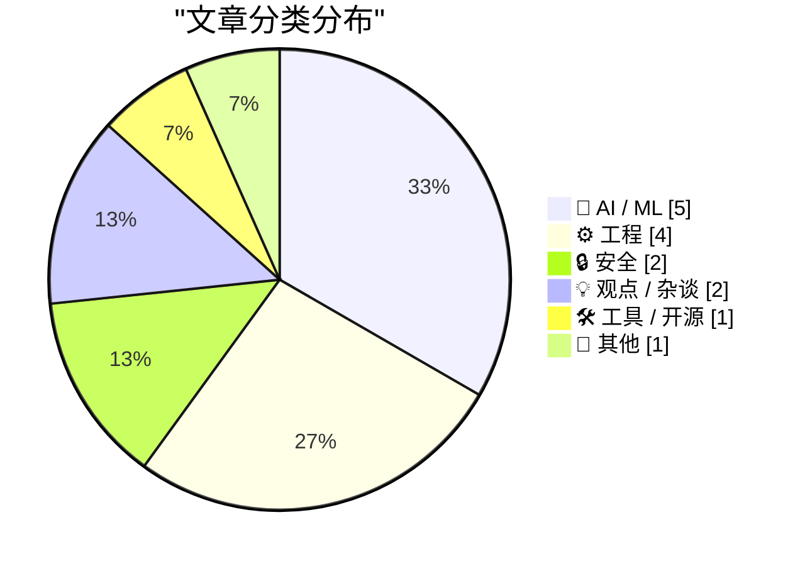
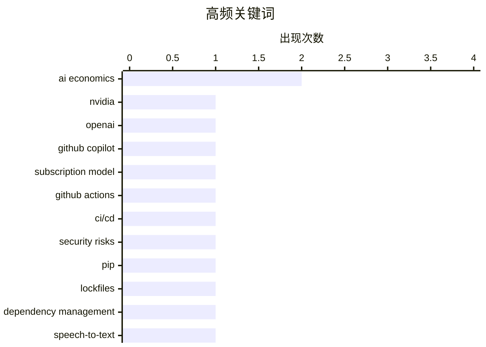

# 📰 AI 博客每日精选 — 2026-04-29

> 来自 Karpathy 推荐的 92 个顶级技术博客，AI 精选 Top 15

## 📝 今日看点

今日技术圈聚焦三大趋势：AI 经济可持续性引发广泛质疑，多篇分析指出高昂算力成本与商业变现模式之间存在结构性矛盾；开源生态持续活跃，微软推出支持说话人分离的语音模型 VibeVoice，推动 AI 工具民主化；同时，工程实践与安全意识同步升级，GitHub Actions 供应链风险受关注，pip 26.1 强化依赖管理，开发者更重视跨进程同步、状态设计及网络基础设施优化。

---

## 🏆 今日必读

🥇 **AI 的经济模型说不通**

[AI's Economics Don't Make Sense](https://www.wheresyoured.at/ais-economics-dont-make-sense/) — wheresyoured.at · 2 小时前 · 🤖 AI / ML

> 文章质疑当前 AI 行业的经济可行性，指出训练和推理成本与收入模式之间存在巨大差距。作者通过分析 NVIDIA GPU 的定价、云厂商的定价策略以及 AI 公司（如 OpenAI 和 Anthropic）的实际营收数据，揭示大多数 AI 初创企业难以覆盖硬件投入。核心论点是：除非大幅提高用户付费意愿或找到新的变现路径，否则 AI 行业将面临长期亏损。结论是 AI 的经济模型在当前技术条件下不可持续。

💡 **为什么值得读**: 这是一篇对 AI 行业底层逻辑的深度剖析，适合关注科技投资、云计算或大模型商业化的读者，能帮你看清谁在烧钱、谁在赚钱，以及未来可能洗牌的方向。

🏷️ AI economics, NVIDIA, OpenAI

🥈 **AI 的经济模型说不通 [无广告版]**

[AI's Economics Don't Make Sense [Ad Free]](https://www.wheresyoured.at/ais-economics-dont-make-sense-ad-free/) — wheresyoured.at · 2 小时前 · 🤖 AI / ML

> 这是上一篇的无广告版本，内容一致但面向订阅用户提供完整体验。文章重申 AI 行业经济不可持续的论点，强调即使去掉广告干扰，核心问题依然存在——高昂的算力成本无法被合理定价所覆盖。作者再次引用具体数据说明 OpenAI 和 Anthropic 等公司在基础设施上的巨额支出远超其公开收入。最终观点不变：若无根本性商业模式创新，AI 公司将陷入财务困境。

💡 **为什么值得读**: 如果你已经订阅了作者的付费通讯，这篇无广告版本值得细读，因为它提供了更清晰、无干扰的分析视角，尤其适合深度思考 AI 盈利模式的读者。

🏷️ GitHub Copilot, AI economics, subscription model

🥉 **GitHub Actions 是最薄弱环节**

[GitHub Actions is the weakest link](https://nesbitt.io/2026/04/28/github-actions-is-the-weakest-link.html) — nesbitt.io · 9 小时前 · 🔒 安全

> 作者 Anne Nesbitt 强烈批评 GitHub Actions 作为 CI/CD 工具的安全性和可靠性问题。她指出 .github/workflows 文件缺乏权限隔离、易受供应链攻击，且默认配置过于宽松。通过对比 GitLab CI 和 CircleCI 等竞品，她认为 GitHub Actions 在安全设计上存在严重缺陷。建议企业应谨慎使用或自行封装以降低风险。

💡 **为什么值得读**: 对于依赖 GitHub Actions 做自动化部署的团队来说，这篇文章是一记警钟，提醒你注意供应链安全风险，并促使你重新评估 CI/CD 流水线的安全架构。

🏷️ GitHub Actions, CI/CD, security risks

---

## 📊 数据概览

| 扫描源 | 抓取文章 | 时间范围 | 精选 |
|:---:|:---:|:---:|:---:|
| 84/92 | 2461 篇 → 22 篇 | 24h | **15 篇** |

### 分类分布



### 高频关键词



<details>
<summary>📈 纯文本关键词图（终端友好）</summary>

```
ai economics       │ ████████████████████ 2
nvidia             │ ██████████░░░░░░░░░░ 1
openai             │ ██████████░░░░░░░░░░ 1
github copilot     │ ██████████░░░░░░░░░░ 1
subscription model │ ██████████░░░░░░░░░░ 1
github actions     │ ██████████░░░░░░░░░░ 1
ci/cd              │ ██████████░░░░░░░░░░ 1
security risks     │ ██████████░░░░░░░░░░ 1
pip                │ ██████████░░░░░░░░░░ 1
lockfiles          │ ██████████░░░░░░░░░░ 1
```

</details>

### 🏷️ 话题标签

**ai economics**(2) · **nvidia**(1) · **openai**(1) · github copilot(1) · subscription model(1) · github actions(1) · ci/cd(1) · security risks(1) · pip(1) · lockfiles(1) · dependency management(1) · speech-to-text(1) · whisper(1) · speaker diarization(1) · reader/writer lock(1) · semaphore(1) · cross-process synchronization(1) · illegal state(1) · unwanted state(1) · system design(1)

---

## 🤖 AI / ML

### 1. AI 的经济模型说不通

[AI's Economics Don't Make Sense](https://www.wheresyoured.at/ais-economics-dont-make-sense/) — **wheresyoured.at** · 2 小时前 · ⭐ 28/30

> 文章质疑当前 AI 行业的经济可行性，指出训练和推理成本与收入模式之间存在巨大差距。作者通过分析 NVIDIA GPU 的定价、云厂商的定价策略以及 AI 公司（如 OpenAI 和 Anthropic）的实际营收数据，揭示大多数 AI 初创企业难以覆盖硬件投入。核心论点是：除非大幅提高用户付费意愿或找到新的变现路径，否则 AI 行业将面临长期亏损。结论是 AI 的经济模型在当前技术条件下不可持续。

🏷️ AI economics, NVIDIA, OpenAI

---

### 2. AI 的经济模型说不通 [无广告版]

[AI's Economics Don't Make Sense [Ad Free]](https://www.wheresyoured.at/ais-economics-dont-make-sense-ad-free/) — **wheresyoured.at** · 2 小时前 · ⭐ 28/30

> 这是上一篇的无广告版本，内容一致但面向订阅用户提供完整体验。文章重申 AI 行业经济不可持续的论点，强调即使去掉广告干扰，核心问题依然存在——高昂的算力成本无法被合理定价所覆盖。作者再次引用具体数据说明 OpenAI 和 Anthropic 等公司在基础设施上的巨额支出远超其公开收入。最终观点不变：若无根本性商业模式创新，AI 公司将陷入财务困境。

🏷️ GitHub Copilot, AI economics, subscription model

---

### 3. 微软开源 VibeVoice：带说话人分离的语音转文本模型

[microsoft/VibeVoice](https://simonwillison.net/2026/Apr/27/vibevoice/#atom-everything) — **simonwillison.net** · 19 小时前 · ⭐ 23/30

> 微软发布 MIT 许可的开源音频模型 VibeVoice，基于 Whisper 架构实现高精度语音转文本，并内置说话人分离（speaker diarization）功能。模型大小为 5.71GB，可通过 uv + mlx-audio 在 macOS 上快速运行。该项目展示了微软在语音 AI 领域的开放态度和技术实力。

🏷️ speech-to-text, Whisper, speaker diarization

---

### 4. 每周更新 501

[Weekly Update 501](https://www.troyhunt.com/weekly-update-501/) — **troyhunt.com** · 13 小时前 · ⭐ 21/30

> 文章讨论了在人机交互中建立平等对待政策的必要性，作者以幽默方式提出应确保人类对AI机器人给予与真人同等的尊重。该政策旨在推动社会形成更负责任的AI使用文化，避免将AI视为低等存在。尽管语气戏谑，但核心诉求是倡导AI应被平等对待。

🏷️ AI bot, equality policy, human-AI interaction

---

### 5. 介绍 talkie：一款来自1930年的13B参数复古语言模型

[Introducing talkie: a 13B vintage language model from 1930](https://simonwillison.net/2026/Apr/28/talkie/#atom-everything) — **simonwillison.net** · 16 小时前 · ⭐ 19/30

> Nick Levine、David Duvenaud 和 Alec Radford 联合推出名为 talkie-1930-13b-base 的130亿参数语言模型，模型大小达53.1 GB。该项目通过模拟1930年代的语言风格构建，旨在探索历史语境下的自然语言理解能力。这是继GPT系列后又一由知名研究者主导的前沿语言模型项目。

🏷️ language model, vintage AI, talkie

---

## ⚙️ 工程

### 6. 跨进程读写锁开发（一）：信号量

[Developing a cross-process reader/writer lock with limited readers, part 1: A semaphore](https://devblogs.microsoft.com/oldnewthing/20260428-00/?p=112278) — **devblogs.microsoft.com/oldnewthing** · 5 小时前 · ⭐ 23/30

> 微软 Raymond Chen 撰写系列文章讲解如何构建一个支持有限读者的跨进程读写锁。本部分介绍使用 Windows 信号量（semaphore）作为基础同步原语的设计思路，解决多个进程间协调读/写访问共享资源的问题。这是实现高性能并发控制的关键第一步。

🏷️ reader/writer lock, semaphore, cross-process synchronization

---

### 7. 非法状态 vs 不良状态

[Illegal vs Unwanted States](https://buttondown.com/hillelwayne/archive/illegal-vs-unwanted-states/) — **buttondown.com/hillelwayne** · 3 小时前 · ⭐ 23/30

> 作者区分了“非法状态”（我们绝不想系统处于的状态）和“不良状态”（我们不希望系统停留的状态）。以日历软件为例，允许用户同时参加两个事件属于非法状态，而短暂的网络超时则是暂时的不良状态。建议优先预防非法状态，其次才是处理不良状态的恢复机制。

🏷️ illegal state, unwanted state, system design

---

### 8. 别再用 localhost:3000 了，改用你自己的域名

[Don't use localhost:3000, use your own custom domain](https://idiallo.com/blog/say-no-to-localhost3000-use-custom-domains?src=feed) — **idiallo.com** · 19 小时前 · ⭐ 22/30

> 作者分享经验：演示内部工具时不应依赖 localhost 或 staging 服务器，而应直接绑定自定义域名（如 www.internaltool.com），确保所有设备都能无缝访问。这种做法避免了端口冲突、防火墙限制和网络配置问题，提升演示的专业性和可用性。

🏷️ localhost, custom domain, demo setup

---

### 9. 10Gb 以太网：我不得不（重新）学习的内容

[10Gb Ethernet: what I had to (re)learn](https://www.gilesthomas.com/2026/04/10g-ethernet-what-i-relearned) — **gilesthomas.com** · 15 分钟前 · ⭐ 21/30

> 作者升级家庭网络至 10Gb 以太网后，重温了网线类型（Cat6a/Cat7）、交换机兼容性、PoE 供电及 SMB 协议等基础知识。他发现尽管千兆以太网二十年变化不大，但万兆时代对布线质量和设备匹配提出了更高要求。

🏷️ 10Gb Ethernet, networking, hardware

---

## 🔒 安全

### 10. GitHub Actions 是最薄弱环节

[GitHub Actions is the weakest link](https://nesbitt.io/2026/04/28/github-actions-is-the-weakest-link.html) — **nesbitt.io** · 9 小时前 · ⭐ 25/30

> 作者 Anne Nesbitt 强烈批评 GitHub Actions 作为 CI/CD 工具的安全性和可靠性问题。她指出 .github/workflows 文件缺乏权限隔离、易受供应链攻击，且默认配置过于宽松。通过对比 GitLab CI 和 CircleCI 等竞品，她认为 GitHub Actions 在安全设计上存在严重缺陷。建议企业应谨慎使用或自行封装以降低风险。

🏷️ GitHub Actions, CI/CD, security risks

---

### 11. Anthropic Mythos：我们打开了潘多拉魔盒

[Anthropic Mythos – We’ve Opened Pandora’s Box](https://steveblank.com/2026/04/28/anthropic-mythos-weve-opened-pandoras-box/) — **steveblank.com** · 5 小时前 · ⭐ 23/30

> 文章回顾过去十年网络安全界对量子计算威胁的预测，指出虽然量子计算机尚未突破 Shor 算法，但 AI 驱动的自动化攻击已带来现实风险。作者警告过度依赖 AI 辅助决策可能引发新型安全漏洞，呼吁加强对抗性测试和伦理审查。

🏷️ quantum computing, cryptography, Shor's algorithm

---

## 💡 观点 / 杂谈

### 12. 引用 Matthew Yglesias：我不想要 vibe coding，我想要专业管理软件公司用AI辅助开发更好更便宜的产品

[Quoting Matthew Yglesias](https://simonwillison.net/2026/Apr/28/matthew-yglesias/#atom-everything) — **simonwillison.net** · 5 小时前 · ⭐ 15/30

> Matthew Yglesias 明确表示拒绝‘vibecode’（凭感觉编码）模式，主张应由专业的软件公司利用AI编程助手开发高质量、低成本的软件产品进行商业化销售。他认为当前AI辅助开发的混乱现状不符合消费者对稳定可靠软件服务的期待。

🏷️ AI coding, software development, productivity

---

### 13. Pluralistic：Vicky Osterweil《扩展宇宙》——迪士尼如何杀死电影并接管世界

[Pluralistic: Vicky Osterweil's "The Extended Universe" (28 Apr 2026)](https://pluralistic.net/2026/04/27/mouseketeers/) — **pluralistic.net** · 13 小时前 · ⭐ 15/30

> 文章回顾 Vicky Osterweil 著作《扩展宇宙》的核心论点：迪士尼通过版权扩张和跨媒体整合策略，逐步垄断叙事宇宙，导致原创电影艺术衰落。作者分析了迪士尼如何通过法律手段延长版权期限、控制角色IP，并将电影转化为可无限延展的消费生态系统。

🏷️ Disney, media consolidation, cultural critique

---

## 🛠 工具 / 开源

### 14. pip 26.1 有什么新特性？锁文件和依赖冷却期！

[What's new in pip 26.1 - lockfiles and dependency cooldowns!](https://simonwillison.net/2026/Apr/28/pip-261/#atom-everything) — **simonwillison.net** · 13 小时前 · ⭐ 24/30

> Python 包管理工具 pip 发布 26.1 版本，主要更新包括引入 lockfiles 支持以增强依赖一致性，以及新增 dependency cooldowns 功能来防止频繁下载同一包。该版本正式放弃对 Python 3.9 的支持，因其已于去年十月结束生命周期。这些改进旨在提升开发环境的可复现性和网络效率。

🏷️ pip, lockfiles, dependency management

---

## 📝 其他

### 15. 理解系统

[Understanding systems](https://entropicthoughts.com/understanding-systems) — **entropicthoughts.com** · 21 小时前 · ⭐ 18/30

> 文章深入探讨了复杂系统的本质特征与分析方法，强调系统思维在应对现实世界复杂性中的关键作用。作者指出，理解系统需要超越局部组件分析，关注整体行为模式、反馈循环和非线性关系。文中还介绍了多种系统建模技术，如因果图、存量流量图和系统动力学仿真。

🏷️ systems thinking, complexity, behavior

---

*生成于 2026-04-29 03:00 (Asia/Shanghai) | 扫描 84 源 → 获取 2461 篇 → 精选 15 篇*
*基于 [Hacker News Popularity Contest 2025](https://refactoringenglish.com/tools/hn-popularity/) RSS 源列表，由 [Andrej Karpathy](https://x.com/karpathy) 推荐*
*由「懂点儿AI」制作，欢迎关注同名微信公众号获取更多 AI 实用技巧 💡*
