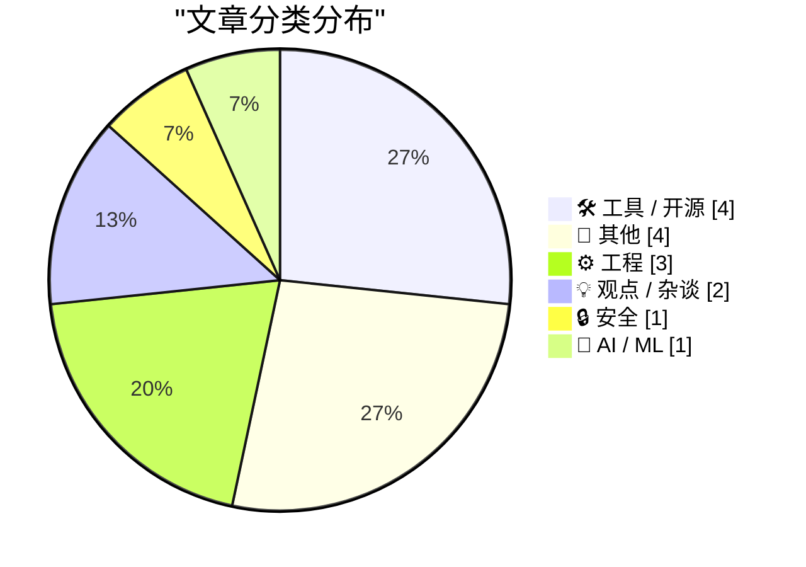
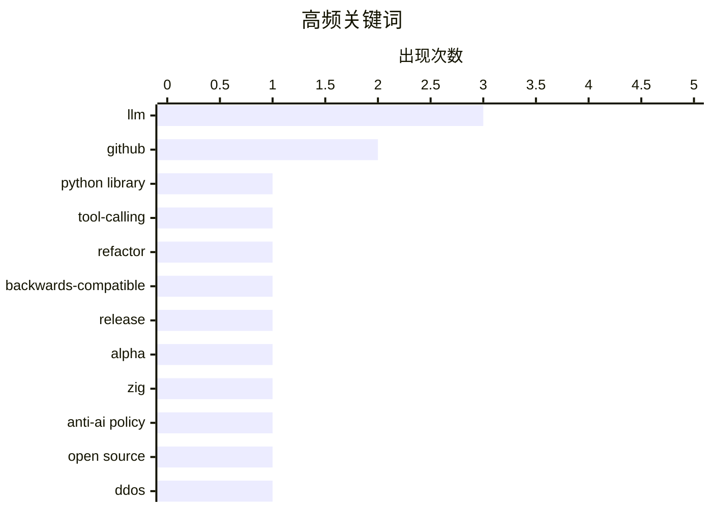

# 📰 AI 博客每日精选 — 2026-05-01

> 来自 Karpathy 推荐的 92 个顶级技术博客，AI 精选 Top 15

## 📝 今日看点

今日技术圈聚焦三大趋势：LLM 工具链持续进化，Simon Willison 发布 LLM 0.32a1 修复关键 bug，并推动从简单提示到复杂对话状态管理的架构重构；工程实践深化，微软工程师探讨跨进程读写锁的公平性设计，Zig 语言坚持反 AI 贡献政策引发对开发伦理的思考；同时，WebAssembly 底层机制再被审视，而关于去中心化代码平台的设想则呼应了开发者对平台自主权的期待。

---

## 🏆 今日必读

🥇 **LLM 0.32a1 发布**

[llm 0.32a1](https://simonwillison.net/2026/Apr/29/llm-3/#atom-everything) — simonwillison.net · 18 小时前 · 🛠 工具 / 开源

> Simon Willison 发布了 LLM 库的 0.32a1 版本，主要修复了 0.32a0 中的一个关键 bug：在从 SQLite 数据库恢复时，工具调用对话未能正确重新加载。该问题影响了使用工具调用的对话功能，现已通过此 alpha 版本修复。此次更新是向后兼容的初步修复补丁。

💡 **为什么值得读**: 如果你正在使用 LLM 库进行工具调用相关的开发，这个修复版本值得立即升级以避免数据恢复问题。

🏷️ LLM, Python library, tool-calling

🥈 **LLM 0.32a0 是一次重大的向后兼容重构**

[LLM 0.32a0  is a major backwards-compatible refactor](https://simonwillison.net/2026/Apr/29/llm/#atom-everything) — simonwillison.net · 23 小时前 · 🛠 工具 / 开源

> Simon Willison 发布了 LLM 0.32a0 版本，这是一个重要的 alpha 版本，标志着该项目从传统的提示-响应模型向更复杂的对话状态管理架构的重大重构。新版本引入了对工具调用和对话历史的原生支持，为未来更强大的 AI 交互功能奠定了基础。

💡 **为什么值得读**: 了解 LLM 项目的技术演进方向，有助于开发者提前规划集成策略并理解新功能的设计哲学。

🏷️ LLM, refactor, backwards-compatible

🥉 **LLM 0.32a0 发布**

[llm 0.32a0](https://simonwillison.net/2026/Apr/29/llm-2/#atom-everything) — simonwillison.net · 23 小时前 · 🛠 工具 / 开源

> Simon Willison 发布了 LLM 0.32a0 版本，这是其用于访问大型语言模型的 Python 库和命令行工具的 alpha 版本。该版本包含重大重构，支持工具调用和更复杂的对话处理，具体变更详见带注释的版本说明文档。

💡 **为什么值得读**: 关注 LLM 项目的开发者应查阅详细变更日志，以掌握此次重构带来的 API 和行为变化。

🏷️ LLM, release, alpha

---

## 📊 数据概览

| 扫描源 | 抓取文章 | 时间范围 | 精选 |
|:---:|:---:|:---:|:---:|
| 80/92 | 2377 篇 → 21 篇 | 24h | **15 篇** |

### 分类分布



### 高频关键词



<details>
<summary>📈 纯文本关键词图（终端友好）</summary>

```
llm                  │ ████████████████████ 3
github               │ █████████████░░░░░░░ 2
python library       │ ███████░░░░░░░░░░░░░ 1
tool-calling         │ ███████░░░░░░░░░░░░░ 1
refactor             │ ███████░░░░░░░░░░░░░ 1
backwards-compatible │ ███████░░░░░░░░░░░░░ 1
release              │ ███████░░░░░░░░░░░░░ 1
alpha                │ ███████░░░░░░░░░░░░░ 1
zig                  │ ███████░░░░░░░░░░░░░ 1
anti-ai policy       │ ███████░░░░░░░░░░░░░ 1
```

</details>

### 🏷️ 话题标签

**llm**(3) · **github**(2) · **python library**(1) · tool-calling(1) · refactor(1) · backwards-compatible(1) · release(1) · alpha(1) · zig(1) · anti-ai policy(1) · open source(1) · ddos(1) · botnet(1) · brazilian isps(1) · concurrency(1) · synchronization(1) · reader-writer lock(1) · fairness(1) · relu(1) · differentiability(1)

---

## 🛠 工具 / 开源

### 1. LLM 0.32a1 发布

[llm 0.32a1](https://simonwillison.net/2026/Apr/29/llm-3/#atom-everything) — **simonwillison.net** · 18 小时前 · ⭐ 27/30

> Simon Willison 发布了 LLM 库的 0.32a1 版本，主要修复了 0.32a0 中的一个关键 bug：在从 SQLite 数据库恢复时，工具调用对话未能正确重新加载。该问题影响了使用工具调用的对话功能，现已通过此 alpha 版本修复。此次更新是向后兼容的初步修复补丁。

🏷️ LLM, Python library, tool-calling

---

### 2. LLM 0.32a0 是一次重大的向后兼容重构

[LLM 0.32a0  is a major backwards-compatible refactor](https://simonwillison.net/2026/Apr/29/llm/#atom-everything) — **simonwillison.net** · 23 小时前 · ⭐ 27/30

> Simon Willison 发布了 LLM 0.32a0 版本，这是一个重要的 alpha 版本，标志着该项目从传统的提示-响应模型向更复杂的对话状态管理架构的重大重构。新版本引入了对工具调用和对话历史的原生支持，为未来更强大的 AI 交互功能奠定了基础。

🏷️ LLM, refactor, backwards-compatible

---

### 3. LLM 0.32a0 发布

[llm 0.32a0](https://simonwillison.net/2026/Apr/29/llm-2/#atom-everything) — **simonwillison.net** · 23 小时前 · ⭐ 27/30

> Simon Willison 发布了 LLM 0.32a0 版本，这是其用于访问大型语言模型的 Python 库和命令行工具的 alpha 版本。该版本包含重大重构，支持工具调用和更复杂的对话处理，具体变更详见带注释的版本说明文档。

🏷️ LLM, release, alpha

---

### 4. 2026年4月笔记

[Notes from April 2026](https://evanhahn.com/notes-from-april-2026/) — **evanhahn.com** · 18 小时前 · ⭐ 18/30

> Evan Hahn 在四月相对安静的月份中整理了一系列链接和发布内容。他撰写了《捍卫 GitHub 糟糕的可用性》一文，表达了对 GitHub 近期服务不稳定的看法，尽管他本人并不喜欢这家微软旗下的公司。此外，他还分享了一些其他有趣的链接供读者点击浏览。

🏷️ GitHub, uptime, developer tools, status

---

## 📝 其他

### 5. 切勿以漏洞百出的方式禁止监控定价

[Pluralistic: How not to ban surveillance pricing (30 Apr 2026)](https://pluralistic.net/2026/04/30/something-must-be-done/) — **pluralistic.net** · 4 小时前 · ⭐ 21/30

> Cory Doctorow 批评马里兰州新出台的消费保护法在禁止监控定价方面存在严重 loophole，法律允许企业在用户同意下继续使用数据画像进行个性化定价。文章同时推荐了多个有趣的文化和科技观察内容，包括 Google 的 Linux 服务器规模、手工编织防烫垫等。

🏷️ surveillance, privacy, consumer law

---

### 6. 我们需要为充满 vibe-coded 应用的分享建立 RSS

[We need RSS for sharing abundant vibe-coded apps](https://simonwillison.net/2026/Apr/30/rss-vibe-coded-apps/#atom-everything) — **simonwillison.net** · 11 分钟前 · ⭐ 18/30

> 文章探讨了随着 vibe-coding（ vibe 编码）加速应用开发，个人化、情境化和高频次的小型工具与微应用大量涌现的现象。作者 Matt Webb 提出应建立一个基于 RSS 的 Web 订阅源，用于分发这些应用页面，每个条目都包含“安装”按钮，以解决当前缺乏统一分发机制的问题。他认为，当开发速度远超传统发布节奏时，亟需一种轻量级、去中心化的方式来发现和部署这类新型应用。

🏷️ RSS, vibe-coding, web feeds

---

### 7. 为什么阿尔忒弥斯II号的照片会在Flickr上？

[Why are the Artemis II photos on Flickr?](https://anildash.com/2026/04/30/artemis-photos-flickr/) — **anildash.com** · 18 小时前 · ⭐ 18/30

> NASA 将阿尔忒弥斯II号任务的所有原始图像发布在 Flickr 上，这一选择并非偶然。Flickr 诞生于 Web 2.0 时代，其核心理念是赋予用户对其数据的控制权，这与 NASA 希望让公众直接访问和掌控航天影像数据的目标一致。这种平台选择体现了对开放数据理念的坚持。

🏷️ Artemis II, Flickr, NASA, space photography

---

### 8. 为什么康懋达于1994年破产

[Why Commodore went bankrupt in 1994](https://dfarq.homeip.net/why-commodore-went-bankrupt-in-1994/?utm_source=rss&#038;utm_medium=rss&#038;utm_campaign=why-commodore-went-bankrupt-in-1994) — **dfarq.homeip.net** · 7 小时前 · ⭐ 17/30

> 康懋达（Commodore）于1994年4月29日宣布破产，其倒闭并非偶然，而是早在十年前就已注定。文章指出，导致其破产的原因常被过度简化，实际上涉及多个长期积累的战略失误和市场误判。

🏷️ Commodore, history, computer industry

---

## ⚙️ 工程

### 9. Zig 项目为何坚持反 AI 贡献政策

[The Zig project's rationale for their firm anti-AI contribution policy](https://simonwillison.net/2026/Apr/30/zig-anti-ai/#atom-everything) — **simonwillison.net** · 17 小时前 · ⭐ 24/30

> Zig 编程语言项目实施了最严格的反对使用大语言模型（LLM）的贡献政策之一：禁止在议题、拉取请求或 Bug 跟踪评论中使用 LLM，包括翻译。项目鼓励使用英语，但也接受其他语言的帖子，前提是依赖社区成员自行翻译。

🏷️ Zig, anti-AI policy, open source

---

### 10. 跨进程读写锁开发（第三部分）：公平性设计

[Developing a cross-process reader/writer lock with limited readers, part 3: Fairness](https://devblogs.microsoft.com/oldnewthing/20260430-00/?p=112288) — **devblogs.microsoft.com/oldnewthing** · 4 小时前 · ⭐ 24/30

> 微软资深工程师 Raymond Chen 在其博客中继续探讨跨进程读写锁的实现，本部分重点讨论如何确保独占锁获取与共享锁获取之间的公平性。文章分析了现有机制中的潜在不公平问题，并提出改进方案以实现更均衡的并发控制。

🏷️ concurrency, synchronization, reader-writer lock, fairness

---

### 11. 关于 WebAssembly 作为堆栈机器的思考

[Thoughts on WebAssembly as a stack machine](https://eli.thegreenplace.net/2026/thoughts-on-webassembly-as-a-stack-machine/) — **eli.thegreenplace.net** · 16 小时前 · ⭐ 22/30

> Eli Bendersky 回应了一篇广为流传的文章，该文指出 WebAssembly 并非纯粹的堆栈机，因其拥有局部变量且缺少如 dup 和 swap 等堆栈操作指令。作者认为尽管 WASM 基于堆栈模型，但其引入的局部变量机制使其更接近寄存器式虚拟机，这影响了其执行效率和编程范式。

🏷️ WebAssembly, stack machine, locals, execution model

---

## 💡 观点 / 杂谈

### 12. 如果我能自己打造 GitHub

[If I Could Make My Own GitHub](https://matduggan.com/if-i-could-make-my-own-github/) — **matduggan.com** · 6 小时前 · ⭐ 19/30

> 作者与朋友设想了一个假设场景：如果他们拥有无限资源，会如何构建自己的代码托管平台。他们考虑的核心理念是打造一个真正属于开发者、尊重代码所有权、避免平台垄断的理想化版本，强调去中心化与社区自治。

🏷️ GitHub, alternative, software development, vision

---

### 13. 你见过新版 Excel 吗？

[Have You Seen the New Excel?](https://idiallo.com/blog/have-you-seen-the-new-xl-ai-parody?src=feed) — **idiallo.com** · 19 小时前 · ⭐ 15/30

> 作者以讽刺手法调侃当前 AI 热潮，声称发现了一个真正的颠覆者——Excel，它自1992年就在桌面上运行，即将改变世界。文章强调电子表格作为企业能力飞跃的核心地位，远超过当前对大语言模型和神经网络的痴迷。

🏷️ Excel, disruption, AI hype

---

## 🔒 安全

### 14. 反 DDoS 公司意外加剧巴西 ISP 遭受攻击

[Anti-DDoS Firm Heaped Attacks on Brazilian ISPs](https://krebsonsecurity.com/2026/04/anti-ddos-firm-heaped-attacks-on-brazilian-isps/) — **krebsonsecurity.com** · 4 小时前 · ⭐ 24/30

> 一家专门防御分布式拒绝服务（DDoS）攻击的巴西科技公司被发现无意中成为针对其他网络运营商的大规模 DDoS 攻击的帮凶。该公司首席执行官称，恶意活动源于安全漏洞，很可能是竞争对手试图损害其声誉所致。

🏷️ DDoS, botnet, Brazilian ISPs

---

## 🤖 AI / ML

### 15. ReLU 函数的三种微分方式

[Three ways to differentiate ReLU](https://www.johndcook.com/blog/2026/04/30/derivative-of-relu/) — **johndcook.com** · 3 小时前 · ⭐ 22/30

> John D. Cook 探讨了 ReLU（修正线性单元）函数在不可微点处的广义导数计算方法。文章介绍了三种不同的导数定义方式——次梯度、Clarke 导数和近似导数，并分别应用于 ReLU 函数，展示了不同数学框架下的结果差异。

🏷️ ReLU, differentiability, neural networks, derivatives

---

*生成于 2026-05-01 02:50 (Asia/Shanghai) | 扫描 80 源 → 获取 2377 篇 → 精选 15 篇*
*基于 [Hacker News Popularity Contest 2025](https://refactoringenglish.com/tools/hn-popularity/) RSS 源列表，由 [Andrej Karpathy](https://x.com/karpathy) 推荐*
*由「懂点儿AI」制作，欢迎关注同名微信公众号获取更多 AI 实用技巧 💡*
