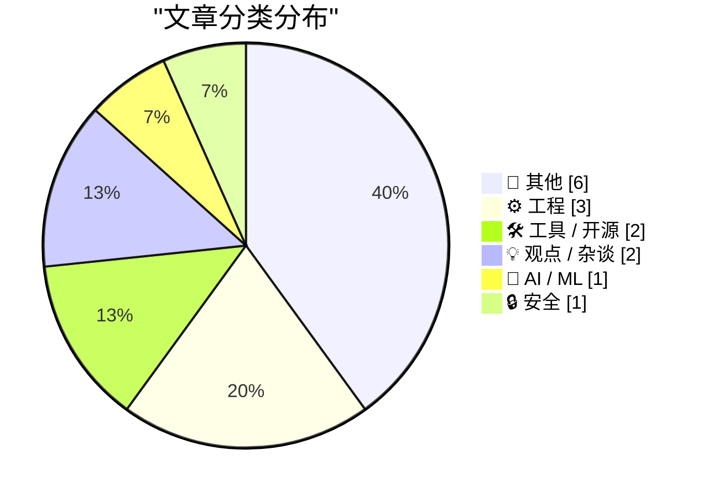
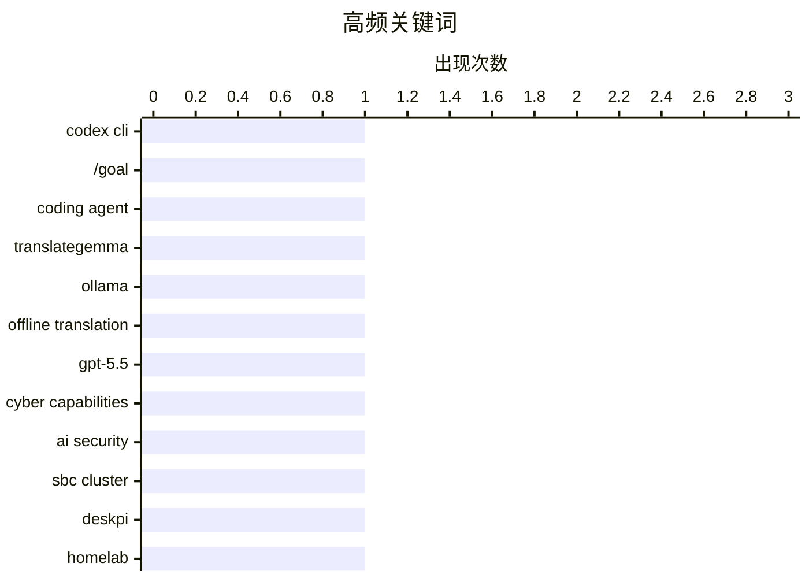

# 📰 AI 博客每日精选 — 2026-05-02

> 来自 Karpathy 推荐的 92 个顶级技术博客，AI 精选 Top 15

## 📝 今日看点

今日技术圈聚焦三大趋势：AI 工具持续进化，OpenAI Codex CLI 新增 /goal 指令实现目标驱动开发，Google TranslateGemma 结合 Ollama 推动离线 AI 应用落地；开源生态面临挑战，NHS 拟关闭多数开源仓库引发争议，同时社区探索包管理器分叉与补丁策略以应对上游失联风险；此外，Geohot 等专家强调 AI 将创造新岗位而非取代人类，呼吁建立 RSS 分发网络规范“vibe-coded”微应用浪潮。

---

## 🏆 今日必读

🥇 **Codex CLI 0.128.0 新增 /goal 指令**

[Codex CLI 0.128.0 adds /goal](https://simonwillison.net/2026/Apr/30/codex-goals/#atom-everything) — simonwillison.net · 18 小时前 · 🛠 工具 / 开源

> OpenAI 的 Codex CLI 工具在 v0.128.0 版本中引入了 /goal 功能，实现了类似 Ralph loop 的开发流程：用户可以设定一个目标（/goal），Codex 将持续迭代直至完成该目标或耗尽预设的 token 预算。这一机制旨在提升 AI 编程代理在复杂任务中的自主性和持续性。目前该功能已在 Rust 版本实现，标志着 Codex 向更智能、闭环式开发助手演进的重要一步。

💡 **为什么值得读**: 如果你正在使用或考虑采用 AI 编程代理进行自动化开发，这个新特性将极大提升任务完成的效率与可靠性。

🏷️ Codex CLI, /goal, coding agent

🥈 **使用 TranslateGemma + Ollama 实现离线命令行翻译**

[Offline command line translation with TranslateGemma + Ollama](https://evanhahn.com/offline-cli-translation-with-translategemma-and-ollama/) — evanhahn.com · 18 小时前 · 🛠 工具 / 开源

> 作者构建了一个完全离线的命令行翻译脚本，利用 Google 的 TranslateGemma 模型和本地运行的 Ollama 服务，实现在终端中直接翻译文本。例如，输入 `echo '¿Cómo estás?' | translate` 即可输出中文结果，无需联网。该项目展示了如何将轻量级开源大模型部署于边缘设备，满足隐私敏感场景下的实时语言处理需求。

💡 **为什么值得读**: 对于注重数据隐私或网络受限环境的用户来说，这是一个低成本、高可控性的本地化多语言解决方案。

🏷️ TranslateGemma, Ollama, offline translation

🥉 **英国 AI 安全研究所评估 GPT-5.5 网络安全能力**

[Our evaluation of OpenAI's GPT-5.5 cyber capabilities](https://simonwillison.net/2026/Apr/30/gpt-55-cyber-capabilities/#atom-everything) — simonwillison.net · 19 小时前 · 🤖 AI / ML

> 英国 AI 安全研究所（AISI）对 OpenAI 的 GPT-5.5 进行了安全漏洞挖掘能力测试，结果显示其表现与 Anthropic 的 Claude Mythos 相当。但与 Mythos 不同，GPT-5.5 已广泛可用，且具备更强的通用性。该评估为企业和政府选择 AI 辅助安全分析工具提供了重要参考依据。

💡 **为什么值得读**: 想了解当前主流大模型在实战化网络安全攻防中的真实水平？这篇报告给出了权威对比和结论。

🏷️ GPT-5.5, cyber capabilities, AI security

---

## 📊 数据概览

| 扫描源 | 抓取文章 | 时间范围 | 精选 |
|:---:|:---:|:---:|:---:|
| 83/92 | 2452 篇 → 17 篇 | 24h | **15 篇** |

### 分类分布



### 高频关键词



<details>
<summary>📈 纯文本关键词图（终端友好）</summary>

```
codex cli           │ ████████████████████ 1
/goal               │ ████████████████████ 1
coding agent        │ ████████████████████ 1
translategemma      │ ████████████████████ 1
ollama              │ ████████████████████ 1
offline translation │ ████████████████████ 1
gpt-5.5             │ ████████████████████ 1
cyber capabilities  │ ████████████████████ 1
ai security         │ ████████████████████ 1
sbc cluster         │ ████████████████████ 1
```

</details>

### 🏷️ 话题标签

**codex cli**(1) · **/goal**(1) · **coding agent**(1) · translategemma(1) · ollama(1) · offline translation(1) · gpt-5.5(1) · cyber capabilities(1) · ai security(1) · sbc cluster(1) · deskpi(1) · homelab(1) · nhs(1) · open source(1) · government policy(1) · package manager(1) · forking(1) · patching(1) · ai jobs(1) · jensen huang(1)

---

## 📝 其他

### 1. 我们需要 RSS 来分享‘ vibe-coded ’应用浪潮

[We need RSS for sharing abundant vibe-coded apps](https://simonwillison.net/2026/Apr/30/rss-vibe-coded-apps/#atom-everything) — **simonwillison.net** · 23 小时前 · ⭐ 15/30

> Matt Webb 提出应建立基于 RSS 的微应用分发网络，以应对当前‘ vibe-coding ’驱动下快速涌现的个人化、情境化小程序生态。他建议每个工具页面都应提供 RSS feed 并附带安装按钮，解决碎片化应用难以发现的问题。

🏷️ RSS, vibe coding, app sharing

---

### 2. 苹果 Q2 2026 财报：营收达 1112 亿美元，iPhone 17 系列热销

[Apple Q2 2026 Results](https://www.apple.com/newsroom/2026/04/apple-reports-second-quarter-results/) — **daringfireball.net** · 17 小时前 · ⭐ 15/30

> 苹果公司公布截至 2026 年 3 月的季度业绩，总营收达 1112 亿美元，创下历史新高。iPhone 17 系列推动手机业务增长，服务收入也再创新高。CEO Tim Cook 表示这是公司历史上最强的产品阵容之一。

🏷️ Apple earnings, iPhone 17, Q2 2026

---

### 3. The Talk Show: ‘Food and Beverage Director’

[The Talk Show: ‘Food and Beverage Director’](https://daringfireball.net/thetalkshow/2026/04/30/ep-446) — **daringfireball.net** · 15 小时前 · ⭐ 12/30

> 本期节目中，MG Siegler回归访谈，讨论苹果公司宣布蒂姆·库克将卸任CEO职务，转任董事会主席，而约翰·特努斯（John Ternus）将接任首席执行官。这一人事变动标志着苹果领导层进入新阶段，引发关于公司未来战略方向的广泛讨论。

🏷️ Apple, Tim Cook, leadership

---

### 4. 关于苹果 Vision 平台未来的思考

[★ On the Future of Apple’s Vision Platform](https://daringfireball.net/2026/04/on_the_future_of_apples_vision_platform) — **daringfireball.net** · 18 小时前 · ⭐ 11/30

> 文章分析了苹果 Vision 平台的未来发展可能性，认为尽管该项目可能失败，但不会突然终止。作者强调，如果 Vision 项目最终放弃，也不会是毫无征兆地由 MacRumors 等媒体率先曝光，暗示内部团队对此已有充分准备和心理预期。

🏷️ Apple Vision, future, product strategy

---

### 5. Ad Lib 声卡制造商于1992年5月1日破产

[Ad Lib bankruptcy: May 1, 1992](https://dfarq.homeip.net/ad-lib-bankruptcy-may-1-1992/?utm_source=rss&#038;utm_medium=rss&#038;utm_campaign=ad-lib-bankruptcy-may-1-1992) — **dfarq.homeip.net** · 7 小时前 · ⭐ 10/30

> Ad Lib, Inc. 是一家加拿大声卡制造商，由魁北克拉瓦尔大学前音乐教授兼副院长马丁·普热维尔创立。该公司最著名的产品是其同名声卡 Ad Lib Card，在1990年代初期曾是PC音频市场的重要参与者，但最终于1992年5月1日宣布破产。

🏷️ Ad Lib, sound card, bankruptcy

---

### 6. 盲打数字键的技巧与重要性

[Touch Typing Number Keys](https://susam.net/touch-typing-number-keys.html) — **susam.net** · 18 小时前 · ⭐ 9/30

> 作者分享了自己约二十年前在大学期间通过基于Java小程序的盲打教程学会盲打的经验。他认为盲打是一项重要技能，驳斥了‘打字不重要’的观点，并强调掌握数字键盲打能显著提升工作效率，尤其是在数据输入和编程场景中。

🏷️ touch typing, number keys

---

## ⚙️ 工程

### 7. SBC 集群性价比低但依然有趣：DeskPi Super4C 评测

[SBC Clusters are a terrible value, but they're fun anyway](https://www.jeffgeerling.com/blog/2026/deskpi-super4c-sbc-cluster/) — **jeffgeerling.com** · 4 小时前 · ⭐ 18/30

> Jeff Geerling 测试了 DeskPi Super4C——一款支持 4 个 Raspberry Pi CM5 模块的紧凑型 SBC 集群板，并将其安装在 Waveshare HomeRack Mini 机架中。尽管他认为此类小型服务器集群整体性价比不高，但强调其 DIY 乐趣和实验价值极高，适合爱好者搭建私有云或边缘计算原型系统。

🏷️ SBC cluster, DeskPi, homelab

---

### 8. 当上游项目失联时：包管理器的补丁与分叉策略

[Patching and forking in package managers](https://nesbitt.io/2026/05/01/patching-and-forking-in-package-managers.html) — **nesbitt.io** · 8 小时前 · ⭐ 17/30

> 文章探讨了当开源项目的维护者停止响应（ghosting）后，下游开发者如何通过打补丁（patching）或创建分叉（forking）来延续其软件的生命周期。重点分析了 npm、pip 等主流包管理器在此类“上游死亡”场景下的应对实践与最佳做法。

🏷️ package manager, forking, patching

---

### 9. 用余弦幂逼近偶函数：Burmann 定理的应用

[Approximating even functions by powers of cosine](https://www.johndcook.com/blog/2026/04/30/burmanns-theorem/) — **johndcook.com** · 18 小时前 · ⭐ 15/30

> John D. Cook 介绍了一种利用 Burmann 定理构造偶函数近似的新方法，即以余弦的高次幂组合来逼近目标函数。文中以 Bessel 函数 J(x) ≈ (1 + cos x)/2 为例，说明该方法简洁有效，适用于工程建模中的快速估算。

🏷️ approximation, cosine, Bessel function

---

## 🛠 工具 / 开源

### 10. Codex CLI 0.128.0 新增 /goal 指令

[Codex CLI 0.128.0 adds /goal](https://simonwillison.net/2026/Apr/30/codex-goals/#atom-everything) — **simonwillison.net** · 18 小时前 · ⭐ 24/30

> OpenAI 的 Codex CLI 工具在 v0.128.0 版本中引入了 /goal 功能，实现了类似 Ralph loop 的开发流程：用户可以设定一个目标（/goal），Codex 将持续迭代直至完成该目标或耗尽预设的 token 预算。这一机制旨在提升 AI 编程代理在复杂任务中的自主性和持续性。目前该功能已在 Rust 版本实现，标志着 Codex 向更智能、闭环式开发助手演进的重要一步。

🏷️ Codex CLI, /goal, coding agent

---

### 11. 使用 TranslateGemma + Ollama 实现离线命令行翻译

[Offline command line translation with TranslateGemma + Ollama](https://evanhahn.com/offline-cli-translation-with-translategemma-and-ollama/) — **evanhahn.com** · 18 小时前 · ⭐ 22/30

> 作者构建了一个完全离线的命令行翻译脚本，利用 Google 的 TranslateGemma 模型和本地运行的 Ollama 服务，实现在终端中直接翻译文本。例如，输入 `echo '¿Cómo estás?' | translate` 即可输出中文结果，无需联网。该项目展示了如何将轻量级开源大模型部署于边缘设备，满足隐私敏感场景下的实时语言处理需求。

🏷️ TranslateGemma, Ollama, offline translation

---

## 💡 观点 / 杂谈

### 12. Geohot：AI 不仅不会取代工作，反而会创造更多岗位

[AI will create jobs](https://geohot.github.io//blog/jekyll/update/2026/05/01/ai-will-create-jobs.html) — **geohot.github.io** · 11 小时前 · ⭐ 17/30

> Geohot（George Hotz）在其博客中重申观点：AI 的发展最终将催生大量新职业，而非导致失业。他认为历史经验表明技术革命总会重塑劳动力市场结构，而当前对 AI 替代人类的担忧被过度放大。

🏷️ AI jobs, Jensen Huang

---

### 13. 识别 LLM 辅助代码与人类编写的差异

[Quoting Andrew Kelley](https://simonwillison.net/2026/Apr/30/andrew-kelley/#atom-everything) — **simonwillison.net** · 20 小时前 · ⭐ 14/30

> 文章探讨了为何区分人类编写和 LLM（大型语言模型）辅助的代码并非不可能。作者指出，LLM 生成的代码常出现逻辑错误、重复模式或不合常规的命名方式，这些‘幻觉’式错误与人类的直觉性失误有本质区别。此外，来自代理编程（agentic coding）背景的开发者会留下独特的‘数字气味’，即使他们不自知，也能被经验丰富的审查者识别。因此，通过关注代码风格和常见错误模式，可以有效检测 LLM 参与度。

🏷️ LLM detection, code review, Zig

---

## 🤖 AI / ML

### 14. 英国 AI 安全研究所评估 GPT-5.5 网络安全能力

[Our evaluation of OpenAI's GPT-5.5 cyber capabilities](https://simonwillison.net/2026/Apr/30/gpt-55-cyber-capabilities/#atom-everything) — **simonwillison.net** · 19 小时前 · ⭐ 20/30

> 英国 AI 安全研究所（AISI）对 OpenAI 的 GPT-5.5 进行了安全漏洞挖掘能力测试，结果显示其表现与 Anthropic 的 Claude Mythos 相当。但与 Mythos 不同，GPT-5.5 已广泛可用，且具备更强的通用性。该评估为企业和政府选择 AI 辅助安全分析工具提供了重要参考依据。

🏷️ GPT-5.5, cyber capabilities, AI security

---

## 🔒 安全

### 15. NHS 发起‘反开源战争’，拟关闭绝大多数开源仓库

[NHS Goes To War Against Open Source](https://shkspr.mobi/blog/2026/05/nhs-goes-to-war-against-open-source/) — **shkspr.mobi** · 6 小时前 · ⭐ 17/30

> 前英国政府数字部门负责人公开批评 NHS England 正计划关闭几乎所有开源代码库，称其背离了过去多年推动开源协作的政策。此举引发社区强烈不满，被认为可能阻碍公共部门技术创新与透明度。

🏷️ NHS, open source, government policy

---

*生成于 2026-05-02 02:15 (Asia/Shanghai) | 扫描 83 源 → 获取 2452 篇 → 精选 15 篇*
*基于 [Hacker News Popularity Contest 2025](https://refactoringenglish.com/tools/hn-popularity/) RSS 源列表，由 [Andrej Karpathy](https://x.com/karpathy) 推荐*
*由「懂点儿AI」制作，欢迎关注同名微信公众号获取更多 AI 实用技巧 💡*
