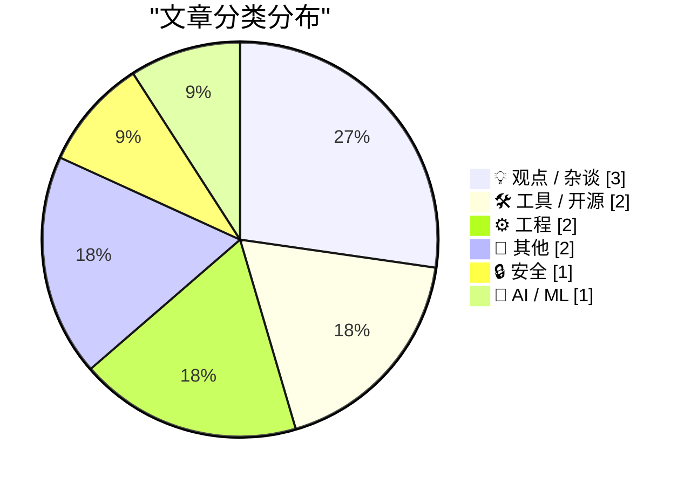
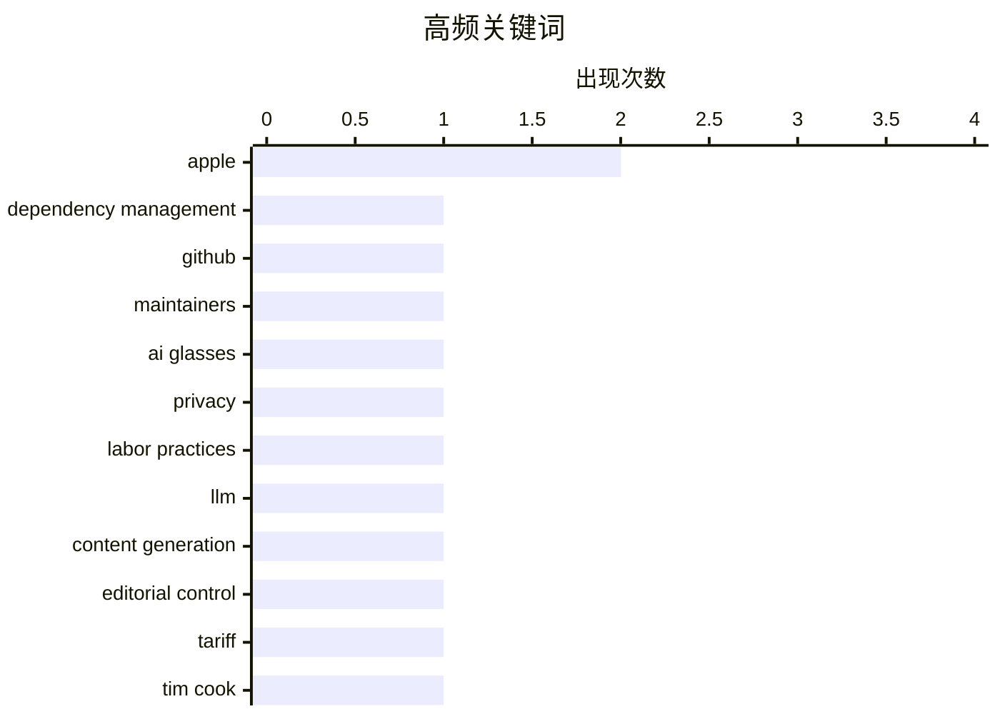

# 📰 AI 博客每日精选 — 2026-05-03

> 来自 Karpathy 推荐的 92 个顶级技术博客，AI 精选 Top 11

## 📝 今日看点

今日技术圈聚焦三大趋势：AI伦理争议持续发酵，Meta因智能眼镜用户隐私审查事件陷入舆论风暴；开发者工具创新活跃，从GitHub维护者平台到iNaturalist数据聚合工具，凸显开源生态的实用化演进；同时，企业对政策风险的应对策略引发关注，苹果CEO库克以精巧话术化解关税退款的政治质疑，展现科技领袖在复杂监管环境中的话语博弈。

---

## 🏆 今日必读

🥇 **为维护者打造的 GitHub**

[A GitHub for maintainers](https://nesbitt.io/2026/05/02/a-github-for-maintainers.html) — nesbitt.io · 8 小时前 · 🛠 工具 / 开源

> nesbitt.io 提出了一个名为 'GitHub for maintainers' 的新平台，旨在让依赖项（dependencies）获得与代码 fork 相同的透明度和可追溯性处理方式。该平台通过记录依赖项的更新历史、维护者变更和重大修改，增强开源项目的可审计性。核心理念是将软件供应链中的信任问题可视化，类似于 Git 对代码版本的管理。作者认为这能显著提升开源生态系统的责任感和安全性。

💡 **为什么值得读**: 它为开源维护者提供了一个创新工具，以应对日益复杂的依赖管理挑战，值得开发者关注。

🏷️ dependency management, GitHub, maintainers

🥈 **Meta 肯尼亚承包商查看 AI 眼镜用户如厕画面事件后续**

[Meta Solved Their Problem With Kenyan Contractors Seeing Footage of AI Glasses Wearers on the Toilet](https://www.bbc.com/news/articles/c5y7yvgy0w6o) — daringfireball.net · 21 小时前 · 🔒 安全

> BBC 报道了 Meta 因雇佣肯尼亚承包商审查其智能眼镜拍摄的视频内容而引发的争议，这些工人被迫观看用户如厕、更衣甚至性行为的画面。尽管 Meta 声称已终止合作并加强审核流程，但事件暴露了 AI 监控技术背后的伦理困境和劳工剥削问题。公众对隐私侵犯的担忧加剧，促使科技公司重新审视外包审核工作的道德边界。该事件也引发了对‘智能’设备数据收集边界的广泛讨论。

💡 **为什么值得读**: 它揭示了大型科技公司在自动化审核中忽视人权保护的严重问题，具有深远的社会警示意义。

🏷️ AI glasses, privacy, labor practices

🥉 **编辑我的 LLM 辅助撰写的文章**

[Editing my LLM assisted Articles](https://idiallo.com/byte-size/editing-llm-assisted-articles?src=feed) — idiallo.com · 15 小时前 · 🤖 AI / ML

> 作者回顾去年使用 AI 撰写文章的便利性，但指出直接引用这些文章时存在严重问题：AI 生成的内容与作者真实意图不符，导致自我认知混乱。为此，他正在重写所有 AI 协助的文章，以恢复个人声音和原始思想表达。这一过程不仅是为了准确引用，更是为了维护创作自主性。作者强调，即使借助 AI，最终文本仍需回归人类作者的视角与风格。

💡 **为什么值得读**: 它坦诚地探讨了 AI 写作带来的身份认同危机，对创作者极具共鸣价值。

🏷️ LLM, content generation, editorial control

---

## 📊 数据概览

| 扫描源 | 抓取文章 | 时间范围 | 精选 |
|:---:|:---:|:---:|:---:|
| 83/92 | 2445 篇 → 11 篇 | 24h | **11 篇** |

### 分类分布



### 高频关键词



<details>
<summary>📈 纯文本关键词图（终端友好）</summary>

```
apple                 │ ████████████████████ 2
dependency management │ ██████████░░░░░░░░░░ 1
github                │ ██████████░░░░░░░░░░ 1
maintainers           │ ██████████░░░░░░░░░░ 1
ai glasses            │ ██████████░░░░░░░░░░ 1
privacy               │ ██████████░░░░░░░░░░ 1
labor practices       │ ██████████░░░░░░░░░░ 1
llm                   │ ██████████░░░░░░░░░░ 1
content generation    │ ██████████░░░░░░░░░░ 1
editorial control     │ ██████████░░░░░░░░░░ 1
```

</details>

### 🏷️ 话题标签

**apple**(2) · **dependency management**(1) · **github**(1) · maintainers(1) · ai glasses(1) · privacy(1) · labor practices(1) · llm(1) · content generation(1) · editorial control(1) · tariff(1) · tim cook(1) · earnings call(1) · leadership(1) · construction tech(1) · robotics(1) · energy policy(1) · app updates(1) · offline functionality(1) · user experience(1)

---

## 💡 观点 / 杂谈

### 1. 苹果关税退款谜题的逻辑优雅解决方案再探

[More on Apple’s Logically Elegant Tariff Refund Puzzle Solution](https://daringfireball.net/linked/2026/05/01/tim-cooks-clever-solution-to-the-tariff-refund-puzzle) — **daringfireball.net** · 16 小时前 · ⭐ 21/30

> Daringfireball 进一步分析了 Tim Cook 提出的关税退款方案：苹果承诺将任何退款用于‘美国创新与先进制造’，但这并不构成新增支出承诺。Cook 的解释巧妙规避了政治风险——若特朗普质疑苹果变相增加在美投资，该措辞反而成为防御盾牌。这种语言策略既满足合规要求，又避免激化贸易摩擦，展现了企业高管在复杂地缘政治下的高超沟通技巧。

🏷️ Apple, tariff, Tim Cook

---

### 2. Tim Cook 对关税退款谜题的巧妙解法

[Tim Cook’s Clever Solution to the Tariff Refund Puzzle](https://sixcolors.com/post/2026/04/apple-results-analysis-net-net-over-the-moon/) — **daringfireball.net** · 21 小时前 · ⭐ 21/30

> 在苹果季度财报会议上，Tim Cook 针对分析师关于关税退款用途的提问作出精心准备回应：苹果将遵循既定流程申请退款，并计划将所得资金重新投入‘美国创新与先进制造’。这一声明既表明合规态度，又巧妙设定了资金用途框架，避免被解读为额外支出承诺。Cook 的表述成功平衡了财务操作与政治敏感性，体现了苹果高层的战略沟通能力。

🏷️ Apple, earnings call, leadership

---

### 3. 民主党纽伦堡 caucus 的前史

[Pluralistic: The prehistory of the Democratic Nuremberg Caucus (02 May 2026)](https://pluralistic.net/2026/05/02/denazification/) — **pluralistic.net** · 6 小时前 · ⭐ 15/30

> Pluralistic 专栏追溯了民主党‘纽伦堡 caucus’的起源，提议设立 ICE 吹哨人悬赏制度。文章还包含 Colbert 与 GWB 的对比、袋鼠奶、Jay Rosen 的新闻准则、激进媒体概念、附带权益定义、鸽子传 TCP 协议、BNL 版权案、Joanna Russ 讣告及共和党迫使学生偿还诈骗贷款等内容。作者通过历史链接展现政治与文化的深层联系。

🏷️ politics, media, history

---

## 🛠 工具 / 开源

### 4. 为维护者打造的 GitHub

[A GitHub for maintainers](https://nesbitt.io/2026/05/02/a-github-for-maintainers.html) — **nesbitt.io** · 8 小时前 · ⭐ 26/30

> nesbitt.io 提出了一个名为 'GitHub for maintainers' 的新平台，旨在让依赖项（dependencies）获得与代码 fork 相同的透明度和可追溯性处理方式。该平台通过记录依赖项的更新历史、维护者变更和重大修改，增强开源项目的可审计性。核心理念是将软件供应链中的信任问题可视化，类似于 Git 对代码版本的管理。作者认为这能显著提升开源生态系统的责任感和安全性。

🏷️ dependency management, GitHub, maintainers

---

### 5. iNaturalist 观测记录查询工具

[iNaturalist Sightings](https://simonwillison.net/2026/May/1/inat-sightings/#atom-everything) — **simonwillison.net** · 22 小时前 · ⭐ 12/30

> Simon Willison 开发了一款名为 iNaturalist Sightings 的工具，可聚合他在两个账户中的所有观察记录并按时间分组。该工具完全基于 Claude Code for web 在手机上构建，展示了移动端 AI 编程工具的强大能力。用户现在可以直观查看自己的自然观察历史，便于追踪生态研究进展。

🏷️ iNaturalist, data visualization, personal dashboard

---

## ⚙️ 工程

### 6. 建筑物理阅读清单 05/02/2026

[Reading List 05/02/2026](https://www.construction-physics.com/p/reading-list-05022026) — **construction-physics.com** · 6 小时前 · ⭐ 21/30

> 本期阅读清单涵盖多个建筑行业热点议题：租赁型建筑（build-to-rent）中的寒蝉效应、机器人制造规模化速度预测、PJM 新互联队列分析，以及储能技术遭遇的反弹现象。这些内容反映了当前建筑业面临的技术革新与市场阻力双重挑战。作者通过精选文章帮助读者把握行业动态与未来趋势。

🏷️ construction tech, robotics, energy policy

---

### 7. 如何禁用自动更新功能

[Disable Auto-Update](https://idiallo.com/blog/disable-auto-update?src=feed) — **idiallo.com** · 18 小时前 · ⭐ 18/30

> 作者抱怨一款日常使用的健身应用突然移除了自动更新功能，尽管该应用完全离线运行且数据仅存储在本地手机中。他认为开发者本应保留此基础功能，因为维护成本几乎为零。此事件反映出移动应用在用户体验一致性方面的严重疏忽，尤其影响依赖离线功能的用户群体。

🏷️ app updates, offline functionality, user experience

---

## 📝 其他

### 8. 正弦波的缩放、拉伸与位移

[Scaling, stretching and shifting sinusoids](https://eli.thegreenplace.net/2026/scaling-stretching-and-shifting-sinusoids/) — **eli.thegreenplace.net** · 3 小时前 · ⭐ 15/30

> 本文简要解释如何调整标准正弦函数 sin(x) 的振幅、频率和相位偏移。给定一般形式 y = A·sin(B(x - C)) + D，可通过改变参数 A（振幅）、B（角频率）、C（相位位移）和 D（垂直位移）来变换波形。这些变换是信号处理、振荡分析和波形合成的基础数学工具。

---

### 9. 目击记录

[Sightings](https://simonwillison.net/2026/May/2/sightings/#atom-everything) — **simonwillison.net** · 39 分钟前 · ⭐ 9/30

> 作者使用佳能 R6 Mark II 相机拍摄了大量鸟类照片，并将这些野生动物影像分享到 iNaturalist 平台。基于前一天成功运行的 prototype，他决定将这些照片添加到个人博客中展示。此举旨在通过视觉内容增强博客的互动性和自然观察记录功能。作者强调这是其摄影与科学观察结合的实践成果。

🏷️ photography, wildlife, Canon

---

## 🔒 安全

### 10. Meta 肯尼亚承包商查看 AI 眼镜用户如厕画面事件后续

[Meta Solved Their Problem With Kenyan Contractors Seeing Footage of AI Glasses Wearers on the Toilet](https://www.bbc.com/news/articles/c5y7yvgy0w6o) — **daringfireball.net** · 21 小时前 · ⭐ 24/30

> BBC 报道了 Meta 因雇佣肯尼亚承包商审查其智能眼镜拍摄的视频内容而引发的争议，这些工人被迫观看用户如厕、更衣甚至性行为的画面。尽管 Meta 声称已终止合作并加强审核流程，但事件暴露了 AI 监控技术背后的伦理困境和劳工剥削问题。公众对隐私侵犯的担忧加剧，促使科技公司重新审视外包审核工作的道德边界。该事件也引发了对‘智能’设备数据收集边界的广泛讨论。

🏷️ AI glasses, privacy, labor practices

---

## 🤖 AI / ML

### 11. 编辑我的 LLM 辅助撰写的文章

[Editing my LLM assisted Articles](https://idiallo.com/byte-size/editing-llm-assisted-articles?src=feed) — **idiallo.com** · 15 小时前 · ⭐ 24/30

> 作者回顾去年使用 AI 撰写文章的便利性，但指出直接引用这些文章时存在严重问题：AI 生成的内容与作者真实意图不符，导致自我认知混乱。为此，他正在重写所有 AI 协助的文章，以恢复个人声音和原始思想表达。这一过程不仅是为了准确引用，更是为了维护创作自主性。作者强调，即使借助 AI，最终文本仍需回归人类作者的视角与风格。

🏷️ LLM, content generation, editorial control

---

*生成于 2026-05-03 02:06 (Asia/Shanghai) | 扫描 83 源 → 获取 2445 篇 → 精选 11 篇*
*基于 [Hacker News Popularity Contest 2025](https://refactoringenglish.com/tools/hn-popularity/) RSS 源列表，由 [Andrej Karpathy](https://x.com/karpathy) 推荐*
*由「懂点儿AI」制作，欢迎关注同名微信公众号获取更多 AI 实用技巧 💡*
