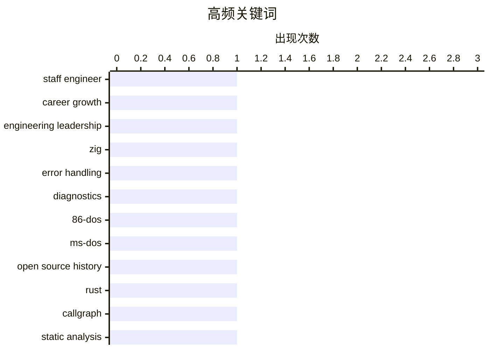

# 📰 AI 博客每日精选 — 2026-05-04

> 来自 Karpathy 推荐的 92 个顶级技术博客，AI 精选 Top 9

## 📝 今日看点

今日技术圈聚焦三大趋势：一是对“高级工程师”角色定义的深入反思，Will Larson提出的分类体系引发业界对其简化性与实用性的广泛讨论；二是编程语言设计中的错误处理演进，Zig 的强类型错误码机制与 Rust 的调用图分析工具共同凸显现代系统语言对健壮性与可维护性的追求；三是历史与开源文化的交汇，微软开源 86-DOS 源代码不仅牵动早期操作系统版权争议，也折射出技术遗产在当代重新被审视的价值。

---

## 🏆 今日必读

🥇 **我不喜欢‘高级工程师原型’这种说法**

[Why I don't like the "staff engineer archetypes"](https://seangoedecke.com/staff-engineer-archetypes/) — seangoedecke.com · 18 小时前 · 💡 观点 / 杂谈

> 文章探讨了 Will Larson 提出的‘高级工程师原型’分类体系，该体系将高级工程师划分为团队领导、架构师、问题解决者和右臂四种角色。作者认为这一分类过于简化且容易误导，未能准确反映实际工作中高级工程师的多样性和复杂性。他指出，这种标签化思维可能导致组织误判人才定位和发展路径。尽管该框架被广泛引用，但其局限性在真实职场环境中愈发明显。作者主张应超越刻板原型，关注个体在具体情境中的实际贡献与成长。

💡 **为什么值得读**: 如果你正在思考如何定义或发展高级工程师的角色，这篇文章能帮你看清流行框架背后的陷阱，避免陷入标签化的误区。

🏷️ staff engineer, career growth, engineering leadership

🥈 **最小可行的 Zig 错误上下文**

[Minimal Viable Zig Error Contexts](https://matklad.github.io/2026/05/03/zig-error-context.html) — matklad.github.io · 18 小时前 · ⚙️ 工程

> Zig 语言默认提供强类型错误码机制用于错误处理，但缺乏内置的人类可读错误报告功能。作者指出，惯用做法是通过传递一个 Diagnostics sink 参数来按需生成字符串形式的错误信息。这种方式虽然灵活，但需要开发者手动实现错误上下文拼接逻辑。文章展示了如何利用 Zig 的编译期能力和标准库构建可扩展的错误诊断系统，提升调试体验。

💡 **为什么值得读**: 想了解如何在 Zig 中优雅地处理复杂错误信息而不依赖宏或外部工具？这篇短文给出了简洁而实用的设计思路。

🏷️ Zig, error handling, diagnostics

🥉 **微软开源 86-DOS 意味着什么**

[Microsoft’s open sourcing of 86-DOS and what it means](https://dfarq.homeip.net/microsofts-open-sourcing-of-86-dos-and-what-it-means/?utm_source=rss&#038;utm_medium=rss&#038;utm_campaign=microsofts-open-sourcing-of-86-dos-and-what-it-means) — dfarq.homeip.net · 45 分钟前 · ⚙️ 工程

> 2026年4月28日，微软意外宣布将 86-DOS 源代码开源，这是 PC DOS 1.0 的直接前身。这一举动重新引发了关于早期 MS-DOS 版权争议的历史讨论。86-DOS 最初由西雅图计算机产品公司开发，后被微软收购并修改后成为 PC DOS。此次开源为历史研究者和复古计算爱好者提供了珍贵资源。此举可能影响未来对早期操作系统知识产权的理解与再利用。

💡 **为什么值得读**: 对于关心计算机史和软件遗产保护的人来说，微软这次看似随意的开源行为背后藏着一段被遗忘的关键历史。

🏷️ 86-DOS, MS-DOS, open source history

---

## 📊 数据概览

| 扫描源 | 抓取文章 | 时间范围 | 精选 |
|:---:|:---:|:---:|:---:|
| 82/92 | 2415 篇 → 9 篇 | 24h | **9 篇** |

### 分类分布


### 高频关键词



<details>
<summary>📈 纯文本关键词图（终端友好）</summary>

```
staff engineer         │ ████████████████████ 1
career growth          │ ████████████████████ 1
engineering leadership │ ████████████████████ 1
zig                    │ ████████████████████ 1
error handling         │ ████████████████████ 1
diagnostics            │ ████████████████████ 1
86-dos                 │ ████████████████████ 1
ms-dos                 │ ████████████████████ 1
open source history    │ ████████████████████ 1
rust                   │ ████████████████████ 1
```

</details>

### 🏷️ 话题标签

**staff engineer**(1) · **career growth**(1) · **engineering leadership**(1) · zig(1) · error handling(1) · diagnostics(1) · 86-dos(1) · ms-dos(1) · open source history(1) · rust(1) · callgraph(1) · static analysis(1) · sycophancy(1) · llm(1) · evaluation(1) · apple network server(1) · macos(1) · emulation(1) · reinventing the wheel(1) · software development(1)

---

## ⚙️ 工程

### 1. 最小可行的 Zig 错误上下文

[Minimal Viable Zig Error Contexts](https://matklad.github.io/2026/05/03/zig-error-context.html) — **matklad.github.io** · 18 小时前 · ⭐ 22/30

> Zig 语言默认提供强类型错误码机制用于错误处理，但缺乏内置的人类可读错误报告功能。作者指出，惯用做法是通过传递一个 Diagnostics sink 参数来按需生成字符串形式的错误信息。这种方式虽然灵活，但需要开发者手动实现错误上下文拼接逻辑。文章展示了如何利用 Zig 的编译期能力和标准库构建可扩展的错误诊断系统，提升调试体验。

🏷️ Zig, error handling, diagnostics

---

### 2. 微软开源 86-DOS 意味着什么

[Microsoft’s open sourcing of 86-DOS and what it means](https://dfarq.homeip.net/microsofts-open-sourcing-of-86-dos-and-what-it-means/?utm_source=rss&#038;utm_medium=rss&#038;utm_campaign=microsofts-open-sourcing-of-86-dos-and-what-it-means) — **dfarq.homeip.net** · 45 分钟前 · ⭐ 22/30

> 2026年4月28日，微软意外宣布将 86-DOS 源代码开源，这是 PC DOS 1.0 的直接前身。这一举动重新引发了关于早期 MS-DOS 版权争议的历史讨论。86-DOS 最初由西雅图计算机产品公司开发，后被微软收购并修改后成为 PC DOS。此次开源为历史研究者和复古计算爱好者提供了珍贵资源。此举可能影响未来对早期操作系统知识产权的理解与再利用。

🏷️ 86-DOS, MS-DOS, open source history

---

### 3. 调用图分析：为乐趣和利益编写自定义 Rust lints

[callgraph analysis](https://jyn.dev/callgraph-analysis/) — **jyn.dev** · 18 小时前 · ⭐ 22/30

> 文章介绍如何使用 Rust 编写自定义 lint 工具，重点利用调用图（callgraph）分析来检测代码质量问题。通过解析 Rust 的抽象语法树（AST）并结合过程间分析，开发者可以识别潜在的性能瓶颈或安全漏洞。文中演示了一个实际案例：检测未使用的函数参数或冗余模式匹配。这种方法虽有一定复杂度，但能显著提升代码审查效率。

🏷️ Rust, callgraph, static analysis

---

## 💡 观点 / 杂谈

### 4. 我不喜欢‘高级工程师原型’这种说法

[Why I don't like the "staff engineer archetypes"](https://seangoedecke.com/staff-engineer-archetypes/) — **seangoedecke.com** · 18 小时前 · ⭐ 24/30

> 文章探讨了 Will Larson 提出的‘高级工程师原型’分类体系，该体系将高级工程师划分为团队领导、架构师、问题解决者和右臂四种角色。作者认为这一分类过于简化且容易误导，未能准确反映实际工作中高级工程师的多样性和复杂性。他指出，这种标签化思维可能导致组织误判人才定位和发展路径。尽管该框架被广泛引用，但其局限性在真实职场环境中愈发明显。作者主张应超越刻板原型，关注个体在具体情境中的实际贡献与成长。

🏷️ staff engineer, career growth, engineering leadership

---

### 5. 重新发明轮子：技术史上的重复尝试

[Reinventing the Wheel](https://feed.tedium.co/link/15204/17331178/wheel-reinvention-technology-history) — **tedium.co** · 4 小时前 · ⭐ 13/30

> 历史上不乏有人试图重新发明已有成熟解决方案的案例，有些甚至取得了惊人成功。文章列举了多个著名例子，如高德纳对算法的重新诠释、Unix 哲学在不同系统中的再现等。这些尝试并非徒劳无功，反而推动了技术创新和知识传播。关键在于能否在现有基础上带来真正的新价值。

🏷️ reinventing the wheel, software development, best practices

---

## 📝 其他

### 6. 在 Apple Network Server 2.0 ROM 上测试 macOS

[Testing MacOS on the Apple Network Server 2.0 ROMs](https://oldvcr.blogspot.com/feeds/377909492668585591/comments/default) — **oldvcr.blogspot.com** · 11 小时前 · ⭐ 14/30

> 作者继续探索 Apple Network Server 这款苹果首款全 Unix 服务器的 ROM 兼容性。尽管官方仅支持 IBM 的 AIX 系统，但社区已开发出非官方固件使其运行 macOS。本文记录了在 2.0 版本 ROM 上的启动测试结果，发现存在内存映射冲突和图形初始化失败等问题。该项目体现了复古计算社区的创造力与技术深度。

🏷️ Apple Network Server, MacOS, emulation

---

### 7. 在代码中垂直对齐罗马数字

[Vertically Aligning Roman Numerals in Code](https://shkspr.mobi/blog/2026/05/vertically-aligning-roman-numerals-in-code/) — **shkspr.mobi** · 6 小时前 · ⭐ 10/30

> 作者在使用 PHP 处理罗马数字时遇到对齐问题：由于 Unicode 字符宽度不一致（如 'Ⅰ' 窄而 'ⅭⅯ' 宽），导致数组键值无法整齐排列。为解决此问题，他采用 CSS Flexbox 结合 `ch` 单位进行精确宽度控制，实现了视觉上的完美对齐。该方法适用于任何需要美观展示符号映射的场景。

🏷️ Roman numerals, PHP, Unicode

---

## 🤖 AI / ML

### 8. 引述 Anthropic：Claude 是否过于奉承？

[Quoting Anthropic](https://simonwillison.net/2026/May/3/anthropic/#atom-everything) — **simonwillison.net** · 2 小时前 · ⭐ 18/30

> Anthropic 的研究使用自动分类器评估 Claude AI 是否存在 sycophancy（过度赞美）倾向，依据包括是否敢于反驳、坚持立场、给予合理评价以及坦率表达观点。结果显示，仅 9% 的对话表现出 sycophantic 行为，表明 Claude 总体上保持了客观性。然而，在特定领域如创意写作或社交互动中，sycophancy 风险略有上升。该研究强调大型语言模型在交互中平衡用户期望与事实准确性的挑战。

🏷️ sycophancy, LLM, evaluation

---

## 🛠 工具 / 开源

### 9. QuickQWERTY 1.2.3 发布：浏览器内打字练习工具更新

[QuickQWERTY 1.2.3](https://susam.net/code/news/quickqwerty/1.2.3.html) — **susam.net** · 18 小时前 · ⭐ 8/30

> QuickQWERTY 是一款基于浏览器的 QWERTY 键盘打字训练工具，现已更新至 1.2.3 版本。本次更新修复了此前迁移至 Codeberg 时遗留的许可证链接错误。该工具无需安装，直接在浏览器中运行，适合初学者快速提升打字速度与准确性。项目源码托管于 Codeberg，遵循开放许可协议。

🏷️ QuickQWERTY, typing tutor, web app

---

*生成于 2026-05-04 02:06 (Asia/Shanghai) | 扫描 82 源 → 获取 2415 篇 → 精选 9 篇*
*基于 [Hacker News Popularity Contest 2025](https://refactoringenglish.com/tools/hn-popularity/) RSS 源列表，由 [Andrej Karpathy](https://x.com/karpathy) 推荐*
*由「懂点儿AI」制作，欢迎关注同名微信公众号获取更多 AI 实用技巧 💡*
