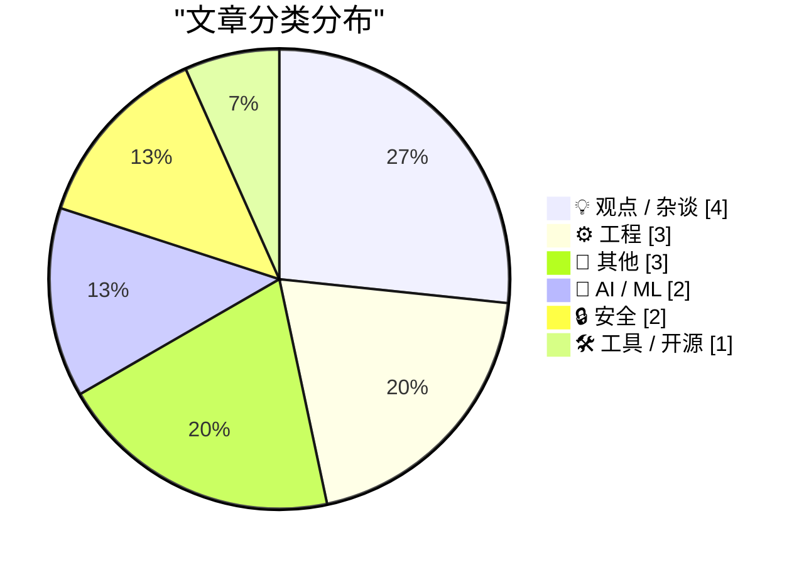
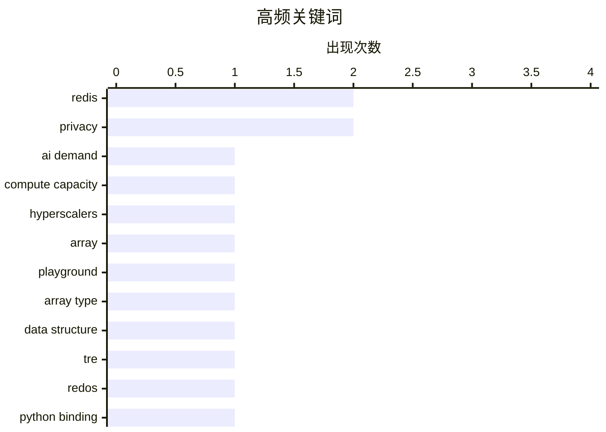

# 📰 AI 博客每日精选 — 2026-05-05

> 来自 Karpathy 推荐的 92 个顶级技术博客，AI 精选 Top 15

## 📝 今日看点

今日技术圈聚焦三大趋势：AI 算力叙事正被重新审视，行业质疑 hype 背后实为云厂商的扩张焦虑；Redis 推出新数组数据类型，标志内存数据库向复杂数据结构演进；同时，AI 代理开始渗透企业安全领域，从自动化响应到自主执行任务，既提升效率也带来失控风险。此外，包管理器安全漏洞频发，暴露依赖链治理的深层隐患。

---

## 🏆 今日必读

🥇 **AI 算力需求的故事是个谎言**

[Premium: The AI Compute Demand Story Is A Lie](https://www.wheresyoured.at/premium-the-ai-compute-demand-story-is-a-lie/) — wheresyoured.at · 4 小时前 · 🤖 AI / ML

> 文章批判性地指出当前 AI 行业普遍宣称的‘巨大算力需求’掩盖了真实问题：真正的瓶颈并非用户需求激增，而是超大规模云服务商（hyperscalers）的 desperation 和少数估值近万亿美元公司的贪婪。作者认为这些公司依赖资本补贴维持运营，而非真正响应市场驱动的需求增长。核心论点是行业叙事被扭曲，用以合理化过度投资和资源错配。结论强调应重新审视 AI 基础设施扩张背后的经济动机，而非盲目接受其技术必要性。

💡 **为什么值得读**: 这篇文值得读，因为它撕开了 AI 算力军备竞赛的华丽外衣，揭示其背后真实的资本逻辑与权力结构，对盲目乐观的技术叙事提出尖锐质疑。

🏷️ AI demand, compute capacity, hyperscalers

🥈 **Redis Array Playground：Redis 新增数组数据类型工具**

[Redis Array Playground](https://simonwillison.net/2026/May/4/redis-array/#atom-everything) — simonwillison.net · 3 小时前 · 🛠 工具 / 开源

> Simon Willison 介绍了一个名为 Redis Array Playground 的新工具，用于测试 Redis 即将推出的数组数据类型。该数据类型由 Salvatore Sanfilippo（antirez）提交 PR 添加，支持 ARCOUNT、ARDEL、ARGET 等命令，允许在 Redis 中高效处理有序整数序列。此功能旨在提升 Redis 在数值索引场景下的性能表现，尤其适合需要频繁插入、删除和范围查询的应用。目前仍处于实验阶段，但已引起社区关注。

💡 **为什么值得读**: 如果你正在使用或考虑在 Redis 中处理有序数值数据，这个新数组类型的预览工具能帮你提前了解其 API 和行为，避免未来迁移成本。

🏷️ Redis, array, playground

🥉 **Redis 数组类型开发简史：历时四个月的深度打磨**

[Redis array type: short story of a long development](http://antirez.com/news/164) — antirez.com · 4 小时前 · ⚙️ 工程

> antirez 回顾了他自今年1月起开始开发 Redis 新数组数据类型的历程，历时四个月才合并进主分支。尽管投入时间看似不多，但实际包含多个全情投入的阶段，且在没有大模型辅助的情况下完成，体现出极高的工程严谨性。他强调此次开发效率提升并非来自 LLM 帮助，而是个人专注度的结果。该类型旨在填补 Redis 现有数据结构在有序整数操作上的空白，增强其在高性能计算场景的能力。

💡 **为什么值得读**: 作为 Redis 核心开发者，antirez 的幕后故事揭示了关键功能背后的工程挑战与坚持，适合想了解数据库底层演进的技术爱好者。

🏷️ Redis, array type, data structure

---

## 📊 数据概览

| 扫描源 | 抓取文章 | 时间范围 | 精选 |
|:---:|:---:|:---:|:---:|
| 80/92 | 2378 篇 → 19 篇 | 24h | **15 篇** |

### 分类分布



### 高频关键词



<details>
<summary>📈 纯文本关键词图（终端友好）</summary>

```
redis            │ ████████████████████ 2
privacy          │ ████████████████████ 2
ai demand        │ ██████████░░░░░░░░░░ 1
compute capacity │ ██████████░░░░░░░░░░ 1
hyperscalers     │ ██████████░░░░░░░░░░ 1
array            │ ██████████░░░░░░░░░░ 1
playground       │ ██████████░░░░░░░░░░ 1
array type       │ ██████████░░░░░░░░░░ 1
data structure   │ ██████████░░░░░░░░░░ 1
tre              │ ██████████░░░░░░░░░░ 1
```

</details>

### 🏷️ 话题标签

**redis**(2) · **privacy**(2) · **ai demand**(1) · compute capacity(1) · hyperscalers(1) · array(1) · playground(1) · array type(1) · data structure(1) · tre(1) · redos(1) · python binding(1) · package manager(1) · cwe(1) · vulnerabilities(1) · cloud security(1) · ai(1) · scenario(1) · ai employees(1) · anthropic(1)

---

## 💡 观点 / 杂谈

### 1. 评论：需求毁灭 vs 燃料替代型基础设施——特朗普时代的科技悲观主义

[Pluralistic: Demand destruction vs fuel-superseding infrastructure (04 May 2026)](https://pluralistic.net/2026/05/04/hope-in-the-dark/) — **pluralistic.net** · 9 小时前 · ⭐ 18/30

> Netta 在 Pluralistic.net 发表长文，批判性地探讨当前科技政策与经济趋势。他认为特朗普政府正推动一种‘需求毁灭’模式，即通过破坏性监管扼杀创新活力；同时警告所谓‘燃料替代型基础设施’（如 AI 数据中心）实为资本泡沫，无法解决根本问题。文章串联多起案例，包括版权战、开源冲突与 DRM 滥用，呼吁回归以人为本的技术伦理。核心立场是对科技乌托邦主义的深刻怀疑。

🏷️ economics, infrastructure, policy

---

### 2. GitHub 提交量同比增长 14 倍：AI 是否主导编程？

[Commits on GitHub Are Up 14× Year-Over-Year](https://daringfireball.net/linked/2026/03/13/amodei-ai-code-claim-chowder) — **daringfireball.net** · 4 小时前 · ⭐ 17/30

> Daring Fireball 引用 Anthropic CEO Dario Amodei 此前的预测——AI 将承担 90% 以上代码编写——但指出实际情况更为复杂。数据显示 GitHub 提交量激增 14 倍，主要归因于 AI 代码生成工具的普及，而非人类程序员数量变化。然而，AI 生成的代码质量参差不齐，仍需大量人工审查与调试。这表明 AI 正改变编程生态，但尚未完全取代人类角色。

🏷️ GitHub commits, AI coding, Amodei

---

### 3. 对不道德行为的掩盖与法律犯罪的掩盖同样必要

[★ Crimes Against Decency Need as Much Cover-Up as Crimes Against the Law](https://daringfireball.net/2026/05/crimes_against_decency_need_as_much_cover-up_as_crimes_against_the_law) — **daringfireball.net** · 19 小时前 · ⭐ 14/30

> 作者认为对Meta解雇揭露AI Glasses隐私丑闻的肯尼亚承包商一事无需进一步愤怒，因为解雇是必然结果。事件揭示了企业面对舆论压力时的典型应对策略——牺牲基层员工以保全声誉。

🏷️ Meta, privacy, AI Glasses

---

### 4. 为内容而内容

[Content for Content’s Sake](https://lucumr.pocoo.org/2026/5/4/content-for-contents-sake/) — **lucumr.pocoo.org** · 19 小时前 · ⭐ 13/30

> 作者批评当前社群语言过度使用‘cooking’‘locked in’等术语，认为这些词汇更多体现群体归属而非个性表达。他质疑这些语言变化是否正由机器驱动，反映出对AI介入日常交流趋势的担忧。

🏷️ language, culture, tech

---

## ⚙️ 工程

### 5. Redis 数组类型开发简史：历时四个月的深度打磨

[Redis array type: short story of a long development](http://antirez.com/news/164) — **antirez.com** · 4 小时前 · ⭐ 25/30

> antirez 回顾了他自今年1月起开始开发 Redis 新数组数据类型的历程，历时四个月才合并进主分支。尽管投入时间看似不多，但实际包含多个全情投入的阶段，且在没有大模型辅助的情况下完成，体现出极高的工程严谨性。他强调此次开发效率提升并非来自 LLM 帮助，而是个人专注度的结果。该类型旨在填补 Redis 现有数据结构在有序整数操作上的空白，增强其在高性能计算场景的能力。

🏷️ Redis, array type, data structure

---

### 6. TRE Python 绑定演示：正则表达式引擎的 ReDoS 防护能力

[TRE Python binding — ReDoS robustness demo](https://simonwillison.net/2026/May/4/tre-python-binding/#atom-everything) — **simonwillison.net** · 1 小时前 · ⭐ 24/30

> Simon Willison 利用 Claude Code 构建了一个 TRE 正则表达式引擎的 Python 绑定，并展示了其对 ReDoS（正则表达式拒绝服务）攻击的强大防御能力。TRE 是 Ville Laurikari 开发的轻量级、安全的正则库，相比传统引擎如 PCRE 更安全。该实验证明即使在复杂模式匹配下，TRE 也能保持恒定时间执行，有效防止恶意输入导致的性能崩溃。这一成果可能推动更安全的正则实践普及。

🏷️ TRE, ReDoS, Python binding

---

### 7. 虚构情景：AI 如何重塑云安全格局

[29th August 2026: a scenario](https://martinalderson.com/posts/august-29-2026-a-scenario/?utm_source=rss&amp;utm_medium=rss&amp;utm_campaign=feed) — **martinalderson.com** · 19 小时前 · ⭐ 22/30

> 作者通过一个虚构的未来场景——29 August 2026——描绘 AI 对云计算安全的影响。设想中，自主 AI 代理将渗透企业网络，自动响应威胁并执行修复任务，极大提升响应速度。然而这也带来失控风险，如误判导致业务中断或隐私泄露。文章警示：虽然 AI 可增强防御，但其决策黑箱特性要求建立新的治理框架与审计机制。核心观点是必须平衡效率与安全，不能盲目信任自动化。

🏷️ cloud security, AI, scenario

---

## 📝 其他

### 8. RSS Club：你从哪里来？

[[RSS Club] Where are you from?](https://shkspr.mobi/blog/2026/05/rss-club-where-are-you-from/) — **shkspr.mobi** · 7 小时前 · ⭐ 15/30

> 作者在个人博客中添加了基于本地部署、注重隐私的访问统计功能，利用离线GeoIP服务粗略判断访客地理位置。该方案虽无法应对VPN、漫游或IP快速变更等情况，但对个人用途已足够。文章强调数据本地化与用户隐私保护的重要性。

🏷️ privacy, geoip, blogging

---

### 9. 两封来自史蒂夫的信

[‘2 Letters From Steve’](https://davidgelphman.wordpress.com/2013/03/29/2-letters-from-steve/) — **daringfireball.net** · 19 小时前 · ⭐ 13/30

> David Gelphman于2013年撰写的文章回顾了iPad发布前后的关键时期——从2010年1月27日发布会到4月初正式发售之间的空档期。这段‘空窗期’成为苹果产品周期中充满期待与不确定性的象征性阶段。

🏷️ Steve Jobs, iPad, David Gelphman

---

### 10. ScopeXR——使用Apple Vision Pro混合现实技术进行白内障手术

[ScopeXR — Cataract Surgery Using Apple Vision Pro Mixed Reality](https://www.prnewswire.com/news-releases/sightmds-dr-eric-rosenberg-becomes-first-surgeon-in-the-world-to-perform-cataract-surgery-using-apple-vision-pro-mixed-reality-302754311.html) — **daringfireball.net** · 4 小时前 · ⭐ 12/30

> SightMD眼科中心的Dr. Eric Rosenberg成为全球首位使用Apple Vision Pro完成白内障手术的医生，手术通过ScopeXR混合现实平台实施。该技术自2025年10月首次应用以来已成功开展多例手术，标志着医疗手术进入空间计算新时代。

🏷️ Apple Vision Pro, cataract surgery, mixed reality

---

## 🤖 AI / ML

### 11. AI 算力需求的故事是个谎言

[Premium: The AI Compute Demand Story Is A Lie](https://www.wheresyoured.at/premium-the-ai-compute-demand-story-is-a-lie/) — **wheresyoured.at** · 4 小时前 · ⭐ 27/30

> 文章批判性地指出当前 AI 行业普遍宣称的‘巨大算力需求’掩盖了真实问题：真正的瓶颈并非用户需求激增，而是超大规模云服务商（hyperscalers）的 desperation 和少数估值近万亿美元公司的贪婪。作者认为这些公司依赖资本补贴维持运营，而非真正响应市场驱动的需求增长。核心论点是行业叙事被扭曲，用以合理化过度投资和资源错配。结论强调应重新审视 AI 基础设施扩张背后的经济动机，而非盲目接受其技术必要性。

🏷️ AI demand, compute capacity, hyperscalers

---

### 12. Anthropic 高管一年前预言：AI 虚拟员工年内上岗

[Anthropic Executive, One Year Ago: Fully AI Employees Are a Year Away](https://www.axios.com/2025/04/22/ai-anthropic-virtual-employees-security) — **daringfireball.net** · 40 分钟前 · ⭐ 19/30

> 根据 Axios 报道，Anthropic 首席信息安全官 Jason Clinton 透露，该公司预计将在一年内部署首批 AI 驱动的‘虚拟员工’，这些代理将自主在企业网络中执行特定任务，如处理钓鱼警报和安全事件响应。Sam Sabin 的文章指出，这类自主代理将成为下一代 AI 创新的关键领域。尽管尚处早期，此举标志着 AI 从辅助工具向生产级自动化迈进的重要一步。

🏷️ AI employees, Anthropic, virtual agents

---

## 🔒 安全

### 13. 包管理器中的常见 CWE 安全弱点分析

[Package Manager CWEs](https://nesbitt.io/2026/05/04/package-manager-cwes.html) — **nesbitt.io** · 9 小时前 · ⭐ 23/30

> 本文系统梳理了各类包管理器（如 npm、pip、apt）中反复出现的通用软件缺陷枚举（CWE）类别。作者识别出诸如路径遍历、命令注入、依赖混淆和权限提升等高频漏洞模式，并指出这些问题往往源于缺乏严格的输入验证和沙箱机制。研究强调需建立统一的包管理安全基线，以降低供应链攻击风险。文中还建议采用静态分析与动态监控结合的方式加强防护。

🏷️ package manager, CWE, vulnerabilities

---

### 14. Gil Durán 因发推‘TLDR: Fascism’遭永久封禁

[X, the Platform of Free Speech](https://bsky.app/profile/gilduran.com/post/3mky5taqg3222) — **daringfireball.net** · 18 小时前 · ⭐ 16/30

> Bluesky 用户 Gil Durán 因在 X 平台发布‘TLDR: Fascism’一词回应 Palantir 的‘技术共和国’论述而被永久封号。该推文仅两个单词，却触发平台内容审核机制，申诉亦被驳回。事件引发广泛关注，被视为言论自由边界的一次测试，同时为其新书《The Nerd Reich》带来宣传效应。Durán 借此凸显极权化科技治理的风险。

🏷️ X platform, free speech, censorship

---

## 🛠 工具 / 开源

### 15. Redis Array Playground：Redis 新增数组数据类型工具

[Redis Array Playground](https://simonwillison.net/2026/May/4/redis-array/#atom-everything) — **simonwillison.net** · 3 小时前 · ⭐ 26/30

> Simon Willison 介绍了一个名为 Redis Array Playground 的新工具，用于测试 Redis 即将推出的数组数据类型。该数据类型由 Salvatore Sanfilippo（antirez）提交 PR 添加，支持 ARCOUNT、ARDEL、ARGET 等命令，允许在 Redis 中高效处理有序整数序列。此功能旨在提升 Redis 在数值索引场景下的性能表现，尤其适合需要频繁插入、删除和范围查询的应用。目前仍处于实验阶段，但已引起社区关注。

🏷️ Redis, array, playground

---

*生成于 2026-05-05 03:01 (Asia/Shanghai) | 扫描 80 源 → 获取 2378 篇 → 精选 15 篇*
*基于 [Hacker News Popularity Contest 2025](https://refactoringenglish.com/tools/hn-popularity/) RSS 源列表，由 [Andrej Karpathy](https://x.com/karpathy) 推荐*
*由「懂点儿AI」制作，欢迎关注同名微信公众号获取更多 AI 实用技巧 💡*
