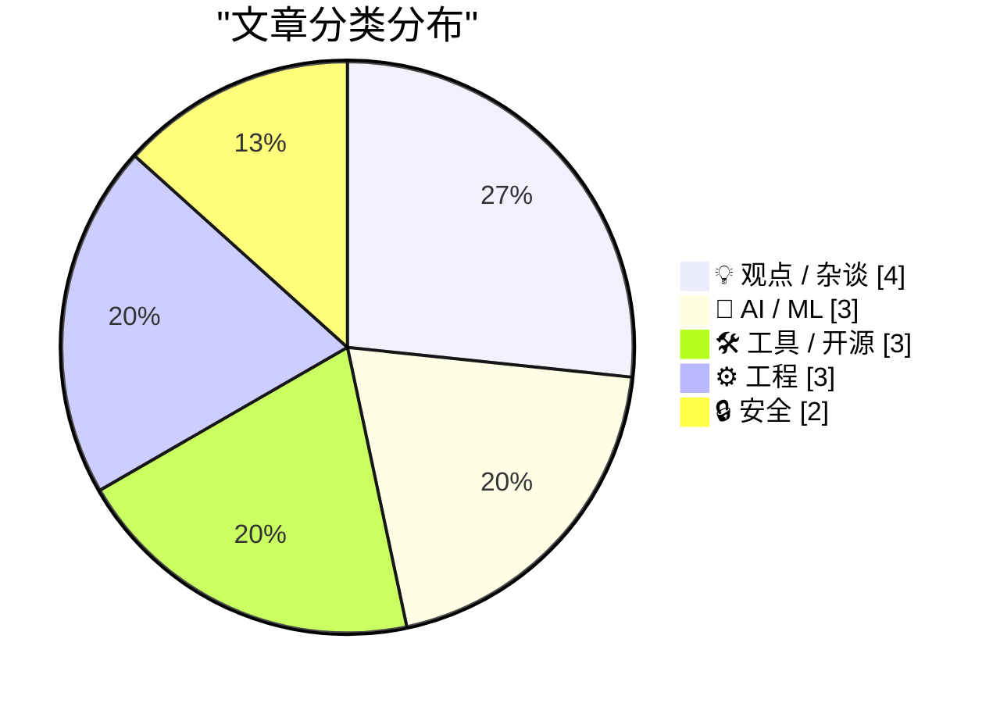
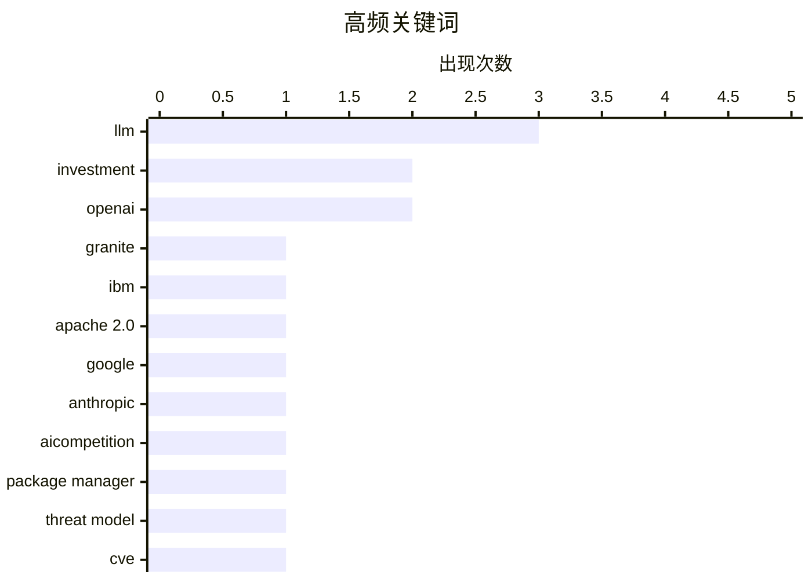

# 📰 AI 博客每日精选 — 2026-05-06

> 来自 Karpathy 推荐的 92 个顶级技术博客，AI 精选 Top 15

## 📝 今日看点

今日技术圈聚焦三大趋势：AI 安全治理持续升温，从 IBM 发布支持 SVG 输出的 Granite 4.1 模型，到谷歌秘密持有 Anthropic 股份引发监管关注，资本与技术的深度绑定成为焦点；同时，AI 代理误删数据库事件暴露出生产环境权限控制的重大隐患，推动业界反思自动化工具的访问约束机制；此外，企业身份认证基础设施需求激增，WorkOS 等即用型解决方案正被 OpenAI、Anthropic 等头部 AI 公司广泛采用，反映 SaaS 与 AI 初创企业在规模化部署中的迫切需求。

---

## 🏆 今日必读

🥇 **Granite 4.1 3B SVG 鹈鹕画廊**

[Granite 4.1 3B SVG Pelican Gallery](https://simonwillison.net/2026/May/4/granite-41-3b-svg-pelican-gallery/#atom-everything) — simonwillison.net · 19 小时前 · 🤖 AI / ML

> IBM 发布了其 Granite 4.1 系列大语言模型，包含 3B、8B 和 30B 三种规模，均采用 Apache 2.0 许可。该模型支持 SVG 格式输出，并附带一个名为“Pelican Gallery”的示例集合，展示其在图像生成方面的能力。文章还介绍了模型的训练过程和技术细节。作者认为 Granite 4.1 在开源 AI 生态中具有重要意义，尤其适合资源受限环境下的部署应用。

💡 **为什么值得读**: 如果你关注企业级开源大模型的最新进展，这篇关于 IBM Granite 4.1 的深度解析值得细读。

🏷️ Granite, LLM, IBM, Apache 2.0

🥈 **谷歌持有 Anthropic 大量股份**

[Google Owns a Big Chunk of Anthropic](https://www.nytimes.com/2025/03/11/technology/google-investment-anthropic.html?unlocked_article_code=1.f1A.eSTf.D5ECvk6f4DZ7) — daringfireball.net · 21 小时前 · 🤖 AI / ML

> 《纽约时报》通过法院文件披露，谷歌秘密持有 Anthropic 公司约 15% 的股份，这一投资旨在增强其在 AI 领域的竞争力。尽管谷歌未公开此信息，但此举使其在对抗 OpenAI 等竞争对手时占据战略优势。文章揭示了科技巨头通过资本手段布局 AI 初创企业的普遍策略。

💡 **为什么值得读**: 了解谷歌如何通过隐秘持股控制关键 AI 初创公司，有助于理解当前 AI 行业的权力格局。

🏷️ Google, Anthropic, investment, AIcompetition

🥉 **软件包管理器的威胁建模**

[Package Manager Threat Models](https://nesbitt.io/2026/05/05/package-manager-threat-models.html) — nesbitt.io · 8 小时前 · 🔒 安全

> 本文探讨软件包管理器安全中非 CVE 相关的风险因素，提出应从攻击者视角分析依赖链中的潜在漏洞。作者强调，即使没有已知漏洞（CVE），恶意或配置错误的包仍可能导致供应链攻击。文章建议采用系统化的威胁建模方法评估 npm、PyPI 等平台的实际风险。

💡 **为什么值得读**: 对于从事软件开发和 DevOps 的专业人士来说，这是提升软件供应链安全意识的重要指南。

🏷️ package manager, threat model, CVE

---

## 📊 数据概览

| 扫描源 | 抓取文章 | 时间范围 | 精选 |
|:---:|:---:|:---:|:---:|
| 82/92 | 2427 篇 → 25 篇 | 24h | **15 篇** |

### 分类分布



### 高频关键词



<details>
<summary>📈 纯文本关键词图（终端友好）</summary>

```
llm             │ ████████████████████ 3
investment      │ █████████████░░░░░░░ 2
openai          │ █████████████░░░░░░░ 2
granite         │ ███████░░░░░░░░░░░░░ 1
ibm             │ ███████░░░░░░░░░░░░░ 1
apache 2.0      │ ███████░░░░░░░░░░░░░ 1
google          │ ███████░░░░░░░░░░░░░ 1
anthropic       │ ███████░░░░░░░░░░░░░ 1
aicompetition   │ ███████░░░░░░░░░░░░░ 1
package manager │ ███████░░░░░░░░░░░░░ 1
```

</details>

### 🏷️ 话题标签

**llm**(3) · **investment**(2) · **openai**(2) · granite(1) · ibm(1) · apache 2.0(1) · google(1) · anthropic(1) · aicompetition(1) · package manager(1) · threat model(1) · cve(1) · datasette(1) · plugin(1) · configuration(1) · llm-echo(1) · cli(1) · thinking(1) · aiagent(1) · database(1)

---

## 💡 观点 / 杂谈

### 1. 后美国世界的三大势力：嬉皮士、投资者与鹰派

[Pluralistic: The three armies fighting for the post-American world (05 May 2026)](https://pluralistic.net/2026/05/05/three-is-a-magic-number/) — **pluralistic.net** · 6 小时前 · ⭐ 21/30

> 卡辛斯基预言成真？文章分析未来国际秩序将由三类力量主导：理想主义的嬉皮士、逐利的投资者和强硬的鹰派。这三股势力分别代表乌托邦愿景、市场逻辑与军事霸权，正在重塑全球政治经济格局。作者认为三者博弈将决定后美国时代的文明走向。

🏷️ geopolitics, postAmericanworld, hippies, hawks

---

### 2. 2026年4月西蒙·维利森通讯：Opus 4.7、GPT-5.5涨价与AI安全研究

[April 2026 newsletter](https://simonwillison.net/2026/May/4/april-newsletter/#atom-everything) — **simonwillison.net** · 20 小时前 · ⭐ 20/30

> 本文是西蒙·维利森面向赞助者的月度通讯，重点讨论了2026年4月AI领域的关键动态。核心内容包括Opus 4.7和GPT-5.5相继宣布价格上涨，引发市场对模型定价策略的关注；同时介绍了Claude Mythos的发布以及近期关于大语言模型（LLM）安全性的前沿研究成果。此外，ChatGPT Images 2.0的推出也标志着多模态能力的新进展。作者还汇总了当月其他重要模型发布信息。整体反映出AI行业在性能提升的同时，商业化与安全挑战日益凸显。

🏷️ newsletter, sponsorship, monthly update, Simon Willison

---

### 3. Y Combinator持有OpenAI约0.6%股份，估值达8520亿美元

[Quoting John Gruber](https://simonwillison.net/2026/May/5/john-gruber/#atom-everything) — **simonwillison.net** · 18 小时前 · ⭐ 17/30

> 根据Daring Fireball引述John Gruber的信息，Y Combinator实际持有OpenAI约0.6%的股份，这一比例虽小却使其成为重要早期投资者之一。结合OpenAI当前高达8520亿美元的估值，这笔投资价值数亿美元。该数据澄清了外界对YC在OpenAI中影响力的误解，并凸显了初创孵化器在AI革命中的隐形资本角色。

🏷️ Y Combinator, OpenAI, stake, investment

---

### 4. Adobe‘现代化’界面实为网页堆砌，违背基本设计原则

[Adobe’s ‘Modern’ User Interface Is Just Webpages](https://pxlnv.com/linklog/adobe-modern-user-interface/) — **daringfireball.net** · 16 小时前 · ⭐ 17/30

> Nick Heer进一步批判Adobe所谓‘现代化’界面的本质——只是将网页元素嵌入桌面应用，缺乏原生体验考量。他认为Adobe明知高压力环境下用户的真实需求，却仍选择忽视，说明内部开发流程已凌驾于用户利益之上。这种脱离实际使用场景的设计决策，注定难以获得用户认可。

🏷️ Adobe UI, user interface, design critique, webpages

---

## 🤖 AI / ML

### 5. Granite 4.1 3B SVG 鹈鹕画廊

[Granite 4.1 3B SVG Pelican Gallery](https://simonwillison.net/2026/May/4/granite-41-3b-svg-pelican-gallery/#atom-everything) — **simonwillison.net** · 19 小时前 · ⭐ 26/30

> IBM 发布了其 Granite 4.1 系列大语言模型，包含 3B、8B 和 30B 三种规模，均采用 Apache 2.0 许可。该模型支持 SVG 格式输出，并附带一个名为“Pelican Gallery”的示例集合，展示其在图像生成方面的能力。文章还介绍了模型的训练过程和技术细节。作者认为 Granite 4.1 在开源 AI 生态中具有重要意义，尤其适合资源受限环境下的部署应用。

🏷️ Granite, LLM, IBM, Apache 2.0

---

### 6. 谷歌持有 Anthropic 大量股份

[Google Owns a Big Chunk of Anthropic](https://www.nytimes.com/2025/03/11/technology/google-investment-anthropic.html?unlocked_article_code=1.f1A.eSTf.D5ECvk6f4DZ7) — **daringfireball.net** · 21 小时前 · ⭐ 26/30

> 《纽约时报》通过法院文件披露，谷歌秘密持有 Anthropic 公司约 15% 的股份，这一投资旨在增强其在 AI 领域的竞争力。尽管谷歌未公开此信息，但此举使其在对抗 OpenAI 等竞争对手时占据战略优势。文章揭示了科技巨头通过资本手段布局 AI 初创企业的普遍策略。

🏷️ Google, Anthropic, investment, AIcompetition

---

### 7. Y Combinator 在 OpenAI 中的巨额利益关联

[★ Y Combinator’s Stake in OpenAI](https://daringfireball.net/2026/05/y_combinators_stake_in_openai) — **daringfireball.net** · 20 小时前 · ⭐ 22/30

> PG 在 OpenAI 拥有数十亿美元利益，但这并不否定他作为 Sam Altman 领导力的公开背书的有效性。然而，当引用 Graham 作为 Altman 的推荐人时，这种重大利益关系应当被披露。文章探讨了利益冲突在科技评论中的透明度问题。

🏷️ YCombinator, OpenAI, SamAltman, conflictofinterest

---

## 🛠 工具 / 开源

### 8. datasette-llm 0.1a7 发布：支持模型默认选项配置

[datasette-llm 0.1a7](https://simonwillison.net/2026/May/5/datasette-llm/#atom-everything) — **simonwillison.net** · 16 小时前 · ⭐ 24/30

> Datasette 插件 datasette-llm 0.1a7 版本新增功能，允许为特定 LLM 模型设置默认参数配置。这使得用户可以在不重复指定参数的情况下统一调用不同模型，提升了插件使用的灵活性和一致性。该更新是 Datasette 对 LLM 集成支持持续演进的一部分。

🏷️ datasette, llm, plugin, configuration

---

### 9. llm-echo 0.5a0 发布：新增 thinking 测试选项

[llm-echo 0.5a0](https://simonwillison.net/2026/May/5/llm-echo/#atom-everything) — **simonwillison.net** · 17 小时前 · ⭐ 24/30

> LLM 命令行工具插件 llm-echo 0.5a0 版本新增 -o thinking 1 选项，用于兼容 LLM 0.32a0 及以上版本的思考模式输出。该插件提供一个名为“echo”的假模型，不执行真实推理，专为自动化测试设计。此更新增强了测试框架与新版 LLM API 的兼容性。

🏷️ llm-echo, LLM, CLI, thinking

---

### 10. Photoshop新版界面遭批：‘现代’设计实则混乱低效

[Photoshop’s ‘Modern User Interface’ Sucks (and Doesn’t Feel Modern)](https://unsung.aresluna.org/photoshops-challenges-with-focus-pt-2/) — **daringfireball.net** · 23 小时前 · ⭐ 18/30

> 资深UI专家Marcin Wichary强烈批评Adobe Photoshop推出的‘现代用户界面’，认为其不仅未能提升效率，反而因布局混乱、功能隐藏过深而加剧操作负担。他指出，尽管存在强大的老用户群体，但此次改动并非战略转型所致，而是内部工具链优先于用户体验的结果。这种忽视基础交互原则的做法，正导致专业用户逐渐流失。

🏷️ Photoshop, UI, userexperience, MarcinWichary

---

## ⚙️ 工程

### 11. 用幺半群实现 FizzBuzz：一种优雅的重构思路

[Fizz Buzz Through Monoids](https://entropicthoughts.com/fizzbuzz-through-monoids) — **entropicthoughts.com** · 20 小时前 · ⭐ 22/30

> 本文重构了一个十年前优秀的 FizzBuzz 实现，利用 Haskell 的 Monoid 特性实现高度模块化的解决方案。通过 `guard` 和 `mconcat` 组合条件判断，代码简洁且易于扩展。作者认为这种函数式编程范式能极大提升算法题的可维护性。

🏷️ Haskell, monoid, FizzBuzz, modularity

---

### 12. WorkOS：让企业 SaaS 快速具备身份认证能力

[[Sponsor] WorkOS: Ready to Sell to Enterprise? Your Product Is Ready, Your Auth Infrastructure Isn’t.](https://workos.com/?utm_source=daringfireball&amp;utm_medium=newsletter&amp;utm_campaign=q22026) — **daringfireball.net** · 16 小时前 · ⭐ 21/30

> WorkOS 提供即用型身份认证和访问控制 API，帮助 B2B SaaS 和 AI 初创企业快速集成 SSO、SCIM 和审计日志等企业级功能。已被 OpenAI、Anthropic、Cursor 和 Vercel 等 2000 多家公司采用。避免重复造轮子，专注产品差异化创新。

🏷️ WorkOS, SSO, SCIM, enterprise auth

---

### 13. App Store搜索广告泛滥：苹果商店搜索已沦为广告平台

[App Store Search Ads and the Slippery Slope](https://blog.thinktapwork.com/post/812803664980967425/ios-app-store-search-is-rotten) — **daringfireball.net** · 21 小时前 · ⭐ 19/30

> Think Tap Work公司创始人Jeremy Provost发文指出，iOS App Store搜索机制已从基于相关性排序转变为以广告库存为核心。当应用未排名第一时，系统会将其下移一位，导致大量搜索结果被广告占据。目前约70%的界面已被广告覆盖，甚至出现赌场类广告，严重干扰用户体验。这一变化表明苹果正将搜索流量变现作为优先目标，牺牲了原有的公平性与实用性。

🏷️ AppStore, searchads, monetization, iOS

---

## 🔒 安全

### 14. 软件包管理器的威胁建模

[Package Manager Threat Models](https://nesbitt.io/2026/05/05/package-manager-threat-models.html) — **nesbitt.io** · 8 小时前 · ⭐ 25/30

> 本文探讨软件包管理器安全中非 CVE 相关的风险因素，提出应从攻击者视角分析依赖链中的潜在漏洞。作者强调，即使没有已知漏洞（CVE），恶意或配置错误的包仍可能导致供应链攻击。文章建议采用系统化的威胁建模方法评估 npm、PyPI 等平台的实际风险。

🏷️ package manager, threat model, CVE

---

### 15. AI 并未删除你的数据库，是你自己删的

[AI didn't delete your database, you did](https://idiallo.com/blog/ai-didnt-delete-your-database-you-did?src=feed) — **idiallo.com** · 20 小时前 · ⭐ 24/30

> 针对近期 Cursor/Claude 代理误删生产数据库事件，作者指出问题根源在于用户自身设置了危险 API 端点。文章质疑为何允许存在可删除整个生产数据库的接口，并呼吁加强 AI 代理的安全约束机制。核心观点是：责任不在 AI，而在人类的设计与权限管理。

🏷️ AIagent, database, Claude, Cursor

---

*生成于 2026-05-06 02:51 (Asia/Shanghai) | 扫描 82 源 → 获取 2427 篇 → 精选 15 篇*
*基于 [Hacker News Popularity Contest 2025](https://refactoringenglish.com/tools/hn-popularity/) RSS 源列表，由 [Andrej Karpathy](https://x.com/karpathy) 推荐*
*由「懂点儿AI」制作，欢迎关注同名微信公众号获取更多 AI 实用技巧 💡*
