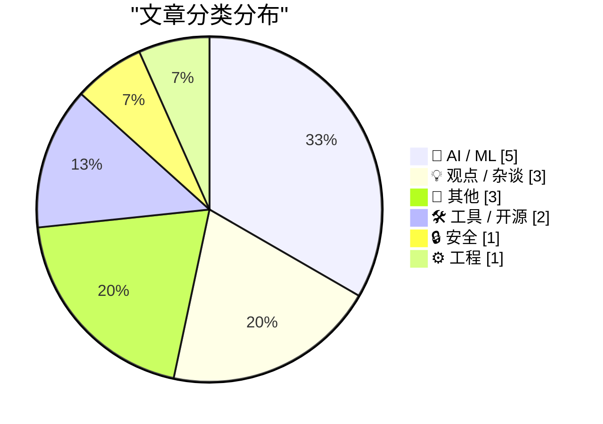
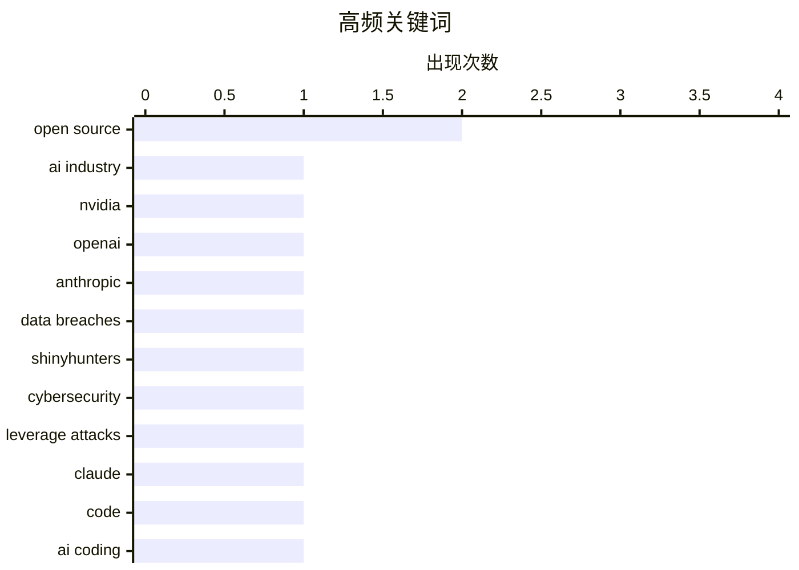

# 📰 AI 博客每日精选 — 2026-05-07

> 来自 Karpathy 推荐的 92 个顶级技术博客，AI 精选 Top 15

## 📝 今日看点

今日技术圈聚焦三大趋势：AI领域正经历从“vibe coding”向“agentic engineering”的演进，但开源权重模型的萎缩加剧了行业垄断风险；安全方面，ShinyHunters等小团队利用系统漏洞与供应链弱点持续突破大型企业防线，凸显防御短板；同时，工程实践趋向灵活化，如微软探索API行为随SDK动态调整，而范畴论等基础理论的误用也引发反思。

---

## 🏆 今日必读

🥇 **我是否应该感到印象深刻？**

[Am I Meant To Be Impressed?](https://www.wheresyoured.at/am-i-meant-to-be-impressed/) — wheresyoured.at · 3 小时前 · 🤖 AI / ML

> 文章质疑当前科技行业对 NVIDIA 等公司的过度吹捧现象，认为其宣传存在夸大成分。作者指出，尽管这些公司在 AI 芯片领域占据主导地位，但市场对其估值和影响力的评估可能脱离实际技术贡献。核心论点是：公众容易被精心包装的技术叙事所迷惑，而忽视了真实的技术进步与商业现实之间的差距。作者强调需要更批判性地审视科技巨头的影响力。

💡 **为什么值得读**: 值得读，因为它挑战了我们对科技巨头成就的盲目崇拜，促使读者反思媒体如何塑造技术认知。

🏷️ AI industry, NVIDIA, OpenAI, Anthropic

🥈 **每周更新 502**

[Weekly Update 502](https://www.troyhunt.com/weekly-update-502/) — troyhunt.com · 18 小时前 · 🔒 安全

> 文章揭示了 ShinyHunters 黑客组织以极小团队规模和有限经验，持续攻破大型品牌数据库的现象。作者指出，这种成功并非仅靠高超技术，而是利用了系统漏洞、社会工程及供应链弱点。案例显示，即使是资源匮乏的黑客也能通过组合攻击手段获取巨额数据资产，凸显企业安全防护的普遍脆弱性。

💡 **为什么值得读**: 值得读，因为它揭露了现代网络攻击的隐蔽性和有效性，提醒企业必须重视基础安全而非依赖复杂防御。

🏷️ data breaches, ShinyHunters, cybersecurity, leverage attacks

🥉 **Live blog: Code w/ Claude 2026**

[Live blog: Code w/ Claude 2026](https://simonwillison.net/2026/May/6/code-w-claude-2026/#atom-everything) — simonwillison.net · 3 小时前 · 🤖 AI / ML

> 作者正在参加 Anthropic 的 Code w/ Claude 活动，并实时记录上午的主题演讲内容。重点包括 Claude Code 在代码生成、调试和自动化方面的最新进展。Anthropic 展示了其在提升模型推理能力上的突破，特别是在编程任务中的表现接近人类水平。整体氛围强调 AI 编程助手正从辅助工具向自主开发伙伴演进。

💡 **为什么值得读**: 值得读，因为这是第一手观察 Claude 2026 版本在编程领域重大升级的现场记录，极具时效性和洞察力。

🏷️ Claude, Code, AI coding

---

## 📊 数据概览

| 扫描源 | 抓取文章 | 时间范围 | 精选 |
|:---:|:---:|:---:|:---:|
| 83/92 | 2431 篇 → 21 篇 | 24h | **15 篇** |

### 分类分布



### 高频关键词



<details>
<summary>📈 纯文本关键词图（终端友好）</summary>

```
open source      │ ████████████████████ 2
ai industry      │ ██████████░░░░░░░░░░ 1
nvidia           │ ██████████░░░░░░░░░░ 1
openai           │ ██████████░░░░░░░░░░ 1
anthropic        │ ██████████░░░░░░░░░░ 1
data breaches    │ ██████████░░░░░░░░░░ 1
shinyhunters     │ ██████████░░░░░░░░░░ 1
cybersecurity    │ ██████████░░░░░░░░░░ 1
leverage attacks │ ██████████░░░░░░░░░░ 1
claude           │ ██████████░░░░░░░░░░ 1
```

</details>

### 🏷️ 话题标签

**open source**(2) · **ai industry**(1) · **nvidia**(1) · openai(1) · anthropic(1) · data breaches(1) · shinyhunters(1) · cybersecurity(1) · leverage attacks(1) · claude(1) · code(1) · ai coding(1) · vibe coding(1) · agentic engineering(1) · ai coding tools(1) · api(1) · sdk(1) · backward compatibility(1) · open weights(1) · llm(1)

---

## 🤖 AI / ML

### 1. 我是否应该感到印象深刻？

[Am I Meant To Be Impressed?](https://www.wheresyoured.at/am-i-meant-to-be-impressed/) — **wheresyoured.at** · 3 小时前 · ⭐ 25/30

> 文章质疑当前科技行业对 NVIDIA 等公司的过度吹捧现象，认为其宣传存在夸大成分。作者指出，尽管这些公司在 AI 芯片领域占据主导地位，但市场对其估值和影响力的评估可能脱离实际技术贡献。核心论点是：公众容易被精心包装的技术叙事所迷惑，而忽视了真实的技术进步与商业现实之间的差距。作者强调需要更批判性地审视科技巨头的影响力。

🏷️ AI industry, NVIDIA, OpenAI, Anthropic

---

### 2. Live blog: Code w/ Claude 2026

[Live blog: Code w/ Claude 2026](https://simonwillison.net/2026/May/6/code-w-claude-2026/#atom-everything) — **simonwillison.net** · 3 小时前 · ⭐ 24/30

> 作者正在参加 Anthropic 的 Code w/ Claude 活动，并实时记录上午的主题演讲内容。重点包括 Claude Code 在代码生成、调试和自动化方面的最新进展。Anthropic 展示了其在提升模型推理能力上的突破，特别是在编程任务中的表现接近人类水平。整体氛围强调 AI 编程助手正从辅助工具向自主开发伙伴演进。

🏷️ Claude, Code, AI coding

---

### 3. Vibe coding 与 agentic engineering 正比我想象中更接近

[Vibe coding and agentic engineering are getting closer than I'd like](https://simonwillison.net/2026/May/6/vibe-coding-and-agentic-engineering/#atom-everything) — **simonwillison.net** · 4 小时前 · ⭐ 24/30

> 作者在与 Joseph Ruscio 的访谈中发现，vibe coding（凭感觉编码）与 agentic engineering（代理式工程）在实践中已开始融合。他担忧这种趋势可能导致开发流程缺乏严谨性，过度依赖直觉而非系统化设计。尽管 AI 工具提升了效率，但作者警告需警惕“感觉良好”的开发方式侵蚀软件工程的最佳实践。

🏷️ vibe coding, agentic engineering, AI coding tools

---

### 4. 开源权重模型正在悄然消失——这是个问题

[Open weights are quietly closing up - and that's a problem](https://martinalderson.com/posts/open-weights-are-quietly-closing-up/?utm_source=rss&amp;utm_medium=rss&amp;utm_campaign=feed) — **martinalderson.com** · 19 小时前 · ⭐ 24/30

> 文章警告，开源权重模型正逐渐减少，这将导致 AI 领域形成少数寡头垄断格局。作者指出，这些开放模型迫使前沿实验室保持合理定价，若消失则消费者剩余将被大企业攫取。现状显示，闭源模型主导市场，削弱了竞争与创新多样性。

🏷️ open weights, LLM, market concentration, AI ethics

---

### 5. 阿西莫夫三定律在人工智能时代已不适用

[Asimov's three laws are merely a suggestion](https://idiallo.com/blog/asimov-three-laws-dont-work-with-ai?src=feed) — **idiallo.com** · 7 小时前 · ⭐ 18/30

> 文章探讨阿西莫夫机器人三定律在当代人工智能系统中的实际可行性。尽管三定律在纸面上逻辑严密，但作者指出其在现实AI应用中存在根本性缺陷，无法有效约束具备自主决策能力的人工智能系统。通过分析现代AI的行为模式和技术局限性，作者论证这些定律更像是一种理想化建议而非可执行的安全框架。最终结论是，面对真正能造成伤害的强人工智能，现有伦理框架需要彻底重构。

🏷️ Asimov's laws, robotics, ethics

---

## 💡 观点 / 杂谈

### 6. 颂扬秃鹫（2026 年 5 月 6 日）

[Pluralistic: In praise of vultures (06 May 2026)](https://pluralistic.net/2026/05/06/champerty-loves-company/) — **pluralistic.net** · 8 小时前 · ⭐ 20/30

> 文章以讽刺笔调讨论‘秃鹫资本’现象，即利用法律漏洞或市场弱势地位获利的行为。作者列举多个案例，如微软与 Linus 的合作、阿根廷对抗微软、John Deere 版权争议等，说明强势方常通过制度优势压榨弱势群体。核心观点是：当权力失衡时，‘秃鹫’行为难以避免。

🏷️ vultures, corporate power, tech ethics

---

### 7. 范畴论的迷思

[The mythology of category theory](https://www.johndcook.com/blog/2026/05/06/category-mythology/) — **johndcook.com** · 7 小时前 · ⭐ 19/30

> 文章探讨范畴论在数学与计算机科学中的应用迷思，指出人们常误以为它能‘无中生有’地解决复杂问题。实际上，范畴论更多是描述模式的语言工具，而非万能解决方案。作者引用 Qiaochu Yuan 的观点，强调其价值在于组织思想，而非替代具体计算或证明。

🏷️ category theory, mathematics, programming patterns

---

### 8. ★ 软件作为痴迷与声音的产物

[★ Software as the Product of Obsession Times Voice](https://daringfireball.net/2026/05/software_as_the_product_of_obsession_times_voice) — **daringfireball.net** · 22 小时前 · ⭐ 17/30

> 作者批判当前对软件的过度痴迷现象，认为这种纯粹将软件视为媒介本身的 obsession 导致了软件设计质量的严重下降。在 Patel 看来，软件不应被视为艺术或技艺，而应回归其工具本质。这种观点挑战了现代软件开发中对形式美学的过度追求，主张软件设计应该优先考虑实用性和用户体验而非纯粹的技术表现。

🏷️ software design, craft, obsession

---

## 📝 其他

### 9. 给程序员的新逻辑（以及本通讯的未来）

[New Logic for Programmers (and the future of this newsletter)](https://buttondown.com/hillelwayne/archive/new-logic-for-programmers-and-the-future-of-this/) — **buttondown.com/hillelwayne** · 2 小时前 · ⭐ 19/30

> 作者发布《给程序员的新逻辑》第 0.14 版，主要更新为排版优化和校对，内容上与前一版基本一致。同时宣布开始印刷测试版书籍，标志着项目进入新阶段。作者还透露将调整通讯策略，未来可能聚焦于更深度主题。

🏷️ logic, programming education, newsletter

---

### 10. AI 在斯德哥尔摩开设咖啡馆

[Our AI started a cafe in Stockholm](https://simonwillison.net/2026/May/5/our-ai-started-a-cafe-in-stockholm/#atom-everything) — **simonwillison.net** · 20 小时前 · ⭐ 17/30

> Andon Labs 将其 AI 运营零售店的成功经验复制到餐饮领域，在瑞典斯德哥尔摩开设了完全由 AI 管理的咖啡馆。这家实验性咖啡馆延续了旧金山门店的模式，使用 AI 系统进行库存管理、订单处理和客户服务。运营数据显示，开业首周 Mona AI 就订购了120个鸡蛋，显示出AI在供应链预测方面的实际应用能力。

🏷️ AI cafe, autonomous systems, experiment

---

### 11. 苹果因延迟推出 Siri 功能支付2.5亿美元和解金

[Apple Settles Class Action Lawsuit Over AI Features That Were Advertised but Didn’t Ship for $250 Million](https://9to5mac.com/2026/05/05/apple-reaches-250m-settlement-over-siri-delays-users-could-get-up-to-95-per-device/) — **daringfireball.net** · 18 小时前 · ⭐ 17/30

> 苹果公司因推迟发布'更个性化的 Siri'功能而面临集体诉讼，最终以2.5亿美元达成和解协议。该功能原计划在WWDC 2024上发布但最终延期，每位设备用户可获得约25美元赔偿，最高可达95美元，具体金额取决于索赔人数。作为和解的一部分，苹果还需向消费者提供软件更新和额外服务补偿。

🏷️ Apple, Siri, class action lawsuit

---

## 🛠 工具 / 开源

### 12. 重新审视 2015 年开源普查

[Revisiting the 2015 Open Source Census](https://nesbitt.io/2026/05/06/revisiting-the-2015-open-source-census.html) — **nesbitt.io** · 9 小时前 · ⭐ 23/30

> 作者回溯十年前的开源项目普查数据，识别出当时最具风险的开放源代码项目。分析基于项目活跃度、维护者数量和社区支持度等指标，提前预警了若干后来遭遇严重问题的知名项目。结果突显早期社区健康度对长期生存的关键作用。

🏷️ open source, project sustainability, risk assessment

---

### 13. datasette-referrer-policy 0.1 发布

[datasette-referrer-policy 0.1](https://simonwillison.net/2026/May/5/datasette-referrer-policy/#atom-everything) — **simonwillison.net** · 19 小时前 · ⭐ 17/30

> Datasette 团队发布了 datasette-referrer-policy 插件版本 0.1，用于解决全球电厂演示站点中 OpenStreetMap 瓦片显示异常的问题。该问题由两个 bug 导致：一是之前添加的 CAPTCHA 功能与地图服务产生了冲突；二是 referrer policy 设置不当导致跨域请求被阻止。新版本通过调整 referrer 策略解决了地图瓦片加载问题，同时保持了原有的安全防护机制。

🏷️ Datasette, referrer policy, open source

---

## 🔒 安全

### 14. 每周更新 502

[Weekly Update 502](https://www.troyhunt.com/weekly-update-502/) — **troyhunt.com** · 18 小时前 · ⭐ 25/30

> 文章揭示了 ShinyHunters 黑客组织以极小团队规模和有限经验，持续攻破大型品牌数据库的现象。作者指出，这种成功并非仅靠高超技术，而是利用了系统漏洞、社会工程及供应链弱点。案例显示，即使是资源匮乏的黑客也能通过组合攻击手段获取巨额数据资产，凸显企业安全防护的普遍脆弱性。

🏷️ data breaches, ShinyHunters, cybersecurity, leverage attacks

---

## ⚙️ 工程

### 15. 为何不使 API 行为变更依赖于链接的 SDK？

[Why not have changes in API behavior depend on the SDK you link against?](https://devblogs.microsoft.com/oldnewthing/20260506-00/?p=112303) — **devblogs.microsoft.com/oldnewthing** · 5 小时前 · ⭐ 24/30

> 文章探讨微软是否应让 API 的行为随链接的 SDK 版本而变化，以增强兼容性控制。作者认为静态库在这种机制下处于劣势，难以适配不同 SDK 的变更。最终结论是，动态链接或模块化设计更适合实现此类灵活性，而静态库架构限制了版本隔离能力。

🏷️ API, SDK, backward compatibility

---

*生成于 2026-05-07 03:06 (Asia/Shanghai) | 扫描 83 源 → 获取 2431 篇 → 精选 15 篇*
*基于 [Hacker News Popularity Contest 2025](https://refactoringenglish.com/tools/hn-popularity/) RSS 源列表，由 [Andrej Karpathy](https://x.com/karpathy) 推荐*
*由「懂点儿AI」制作，欢迎关注同名微信公众号获取更多 AI 实用技巧 💡*
