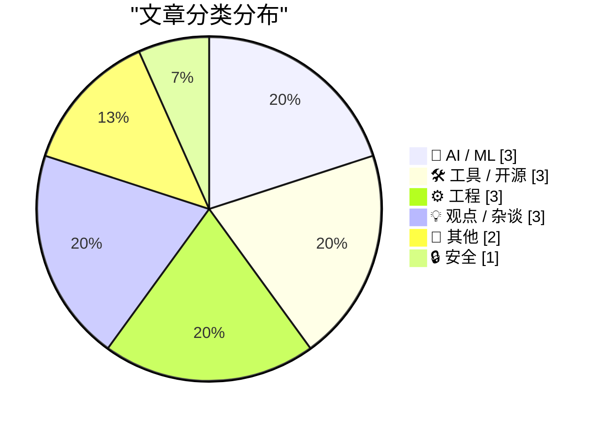
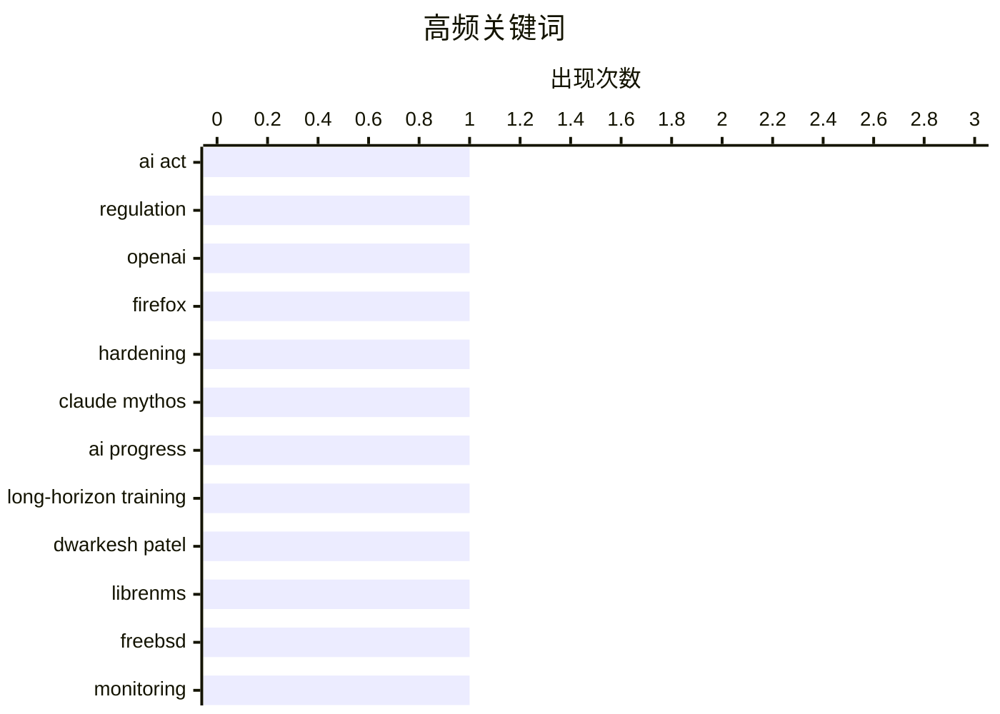

# 📰 AI 博客每日精选 — 2026-05-08

> 来自 Karpathy 推荐的 92 个顶级技术博客，AI 精选 Top 15

## 📝 今日看点

今日技术圈聚焦三大趋势：AI监管与发展的速度鸿沟持续扩大，欧盟《人工智能法案》面临技术迭代带来的滞后挑战；安全领域加速拥抱生成式AI，Mozilla利用Claude Mythos显著提升漏洞检测效率；同时，工程实践向异步化、智能化演进，SQLAlchemy 2.0推动异步数据库操作普及，FileMaker等平台强化AI时代下的安全与治理能力。

---

## 🏆 今日必读

🥇 **快与合法之战已打响**

[The war between fast and legitimate is here](https://www.joanwestenberg.com/the-war-between-fast-and-legitimate-is-here/) — joanwestenberg.com · 17 小时前 · 🤖 AI / ML

> 欧盟耗时四年制定《人工智能法案》，而OpenAI仅用两个月就让GPT-4拥有了一亿用户。当布鲁塞尔完成对“高风险”系统的定义时，这些系统已经迭代两次并新增了多种功能，导致监管严重滞后于技术发展。作者指出，监管机构在技术演进面前显得力不从心，无法有效应对快速变化的AI生态。这场“快与合法”的冲突揭示了当前全球AI治理体系的根本性挑战。

💡 **为什么值得读**: 深刻揭示AI发展速度远超监管能力，引发对全球科技治理模式的紧迫反思。

🏷️ AI Act, regulation, OpenAI

🥈 **使用 Claude Mythos 预览版强化 Firefox 后台安全机制**

[Behind the Scenes Hardening Firefox with Claude Mythos Preview](https://simonwillison.net/2026/May/7/firefox-claude-mythos/#atom-everything) — simonwillison.net · 1 小时前 · 🔒 安全

> Mozilla 利用 Claude Mythos 预览版的访问权限，成功识别并修复了数百个 Firefox 浏览器中的安全漏洞。AI 生成的漏洞报告质量显著提升，从过去多为误报或低质量问题转变为精准、可操作的修复建议。该项目展示了大模型在开源软件安全审计中的巨大潜力，为大规模自动化漏洞检测提供了可行路径。

💡 **为什么值得读**: 展示 AI 如何大幅提升开源软件安全性，为开发者提供高效、智能的安全防护新范式。

🏷️ Firefox, hardening, Claude Mythos

🥉 **为何更长视野的训练未能减缓 AI 进步？**

[Why hasn't longer-horizon training slowed AI progress?](https://seangoedecke.com/why-hasnt-longer-horizon-training-slowed-ai-progress/) — seangoedecke.com · 19 小时前 · 🤖 AI / ML

> 尽管 Dwarkesh Patel 提出延长训练时间应能减缓 AI 发展，但实际进展并未放缓。作者分析认为，模型规模扩张、数据量增长和算法优化共同抵消了训练周期延长的潜在减速效应。此外，硬件性能提升和分布式训练效率也支撑了更快的迭代节奏。因此，AI 进步的根本驱动力仍是资源投入与技术突破的叠加。

💡 **为什么值得读**: 挑战关于训练时长与 AI 发展速度的传统假设，揭示技术进步背后的多重动力机制。

🏷️ AI progress, long-horizon training, Dwarkesh Patel

---

## 📊 数据概览

| 扫描源 | 抓取文章 | 时间范围 | 精选 |
|:---:|:---:|:---:|:---:|
| 84/92 | 2449 篇 → 21 篇 | 24h | **15 篇** |

### 分类分布



### 高频关键词



<details>
<summary>📈 纯文本关键词图（终端友好）</summary>

```
ai act                │ ████████████████████ 1
regulation            │ ████████████████████ 1
openai                │ ████████████████████ 1
firefox               │ ████████████████████ 1
hardening             │ ████████████████████ 1
claude mythos         │ ████████████████████ 1
ai progress           │ ████████████████████ 1
long-horizon training │ ████████████████████ 1
dwarkesh patel        │ ████████████████████ 1
librenms              │ ████████████████████ 1
```

</details>

### 🏷️ 话题标签

**ai act**(1) · **regulation**(1) · **openai**(1) · firefox(1) · hardening(1) · claude mythos(1) · ai progress(1) · long-horizon training(1) · dwarkesh patel(1) · librenms(1) · freebsd(1) · monitoring(1) · sqlalchemy(1) · async(1) · database(1) · xai(1) · anthropic(1) · data center(1) · bubbles(1) · economic risk(1)

---

## 🤖 AI / ML

### 1. 快与合法之战已打响

[The war between fast and legitimate is here](https://www.joanwestenberg.com/the-war-between-fast-and-legitimate-is-here/) — **joanwestenberg.com** · 17 小时前 · ⭐ 26/30

> 欧盟耗时四年制定《人工智能法案》，而OpenAI仅用两个月就让GPT-4拥有了一亿用户。当布鲁塞尔完成对“高风险”系统的定义时，这些系统已经迭代两次并新增了多种功能，导致监管严重滞后于技术发展。作者指出，监管机构在技术演进面前显得力不从心，无法有效应对快速变化的AI生态。这场“快与合法”的冲突揭示了当前全球AI治理体系的根本性挑战。

🏷️ AI Act, regulation, OpenAI

---

### 2. 为何更长视野的训练未能减缓 AI 进步？

[Why hasn't longer-horizon training slowed AI progress?](https://seangoedecke.com/why-hasnt-longer-horizon-training-slowed-ai-progress/) — **seangoedecke.com** · 19 小时前 · ⭐ 22/30

> 尽管 Dwarkesh Patel 提出延长训练时间应能减缓 AI 发展，但实际进展并未放缓。作者分析认为，模型规模扩张、数据量增长和算法优化共同抵消了训练周期延长的潜在减速效应。此外，硬件性能提升和分布式训练效率也支撑了更快的迭代节奏。因此，AI 进步的根本驱动力仍是资源投入与技术突破的叠加。

🏷️ AI progress, long-horizon training, Dwarkesh Patel

---

### 3. xAI/Anthropic 数据中心协议内幕

[Notes on the xAI/Anthropic data center deal](https://simonwillison.net/2026/May/7/xai-anthropic/#atom-everything) — **simonwillison.net** · 1 小时前 · ⭐ 20/30

> Anthropic 在 Code w/ Claude 活动上宣布与 SpaceX/xAI 达成重大协议，将使用 Colossus 数据中心全部算力资源。该数据中心位于 Memphis，配备燃气轮机发电设施，引发环保许可争议。此合作标志着 AI 公司开始争夺稀缺的高性能计算基础设施。

🏷️ xAI, Anthropic, data center

---

## 🛠 工具 / 开源

### 4. 在 FreeBSD 上使用 LibreNMS 监控设备

[Monitor your devices with LibreNMS on FreeBSD](https://it-notes.dragas.net/2026/05/07/monitor-your-services-with-librenms-on-freebsd/) — **it-notes.dragas.net** · 8 小时前 · ⭐ 21/30

> LibreNMS 是一款轻量级网络监控系统，适用于 FreeBSD 环境，能有效监控服务器、设备和服务的运行状态。相比 Zabbix 等重型方案，它资源占用少、部署简便，并提供实时告警、数据可视化和历史趋势图表。本文详细介绍了在 FreeBSD 上配置 LibreNMS 的具体步骤与最佳实践。

🏷️ LibreNMS, FreeBSD, monitoring

---

### 5. GitHub 仓库统计工具

[GitHub Repo Stats](https://simonwillison.net/2026/May/7/github-repo-stats/#atom-everything) — **simonwillison.net** · 11 小时前 · ⭐ 18/30

> Simon Willison 开发了一款名为 GitHub Repo Stats 的工具，用于获取仓库提交次数等关键指标。该工具通过 REST 或 GraphQL API 绕过 GitHub 移动端缺失的数据展示问题，帮助开发者快速评估项目活跃度。

🏷️ GitHub, repo stats, developer tool

---

### 6. RSS 中的文章预览

[Article previews in RSS](https://entropicthoughts.com/article-previews-in-rss) — **entropicthoughts.com** · 21 小时前 · ⭐ 17/30

> 作者长期在 RSS 订阅中仅提供标题和日期，拒绝加入全文或预览内容，认为技术上难以实现。经过三年考虑后，他决定采用 Emacs Lisp 脚本在生成 RSS 时自动提取前几段作为摘要，实现了轻量级文章预览功能。该方案无需外部服务，完全基于本地构建流程，保持了 RSS 的简洁性与可读性。

🏷️ RSS, article preview, feed

---

## ⚙️ 工程

### 7. SQLAlchemy 2 实战：异步 SQLAlchemy 应用

[SQLAlchemy 2 In Practice - Chapter 7: Asynchronous SQLAlchemy](https://blog.miguelgrinberg.com/post/sqlalchemy-2-in-practice---chapter-7-asynchronous-sqlalchemy) — **miguelgrinberg.com** · 21 小时前 · ⭐ 21/30

> 自 SQLAlchemy 1.4 起支持 asyncio 异步编程，本章节深入讲解如何在实践中使用异步 SQLAlchemy。内容包括异步会话管理、协程化查询执行以及与 FastAPI 等异步框架的集成方式。通过真实代码示例，帮助开发者掌握高性能数据库交互模式。

🏷️ SQLAlchemy, async, database

---

### 8. Claris CEO 谈 FileMaker 在代理编码时代的未来

[Claris CEO Ryan McCann on FileMaker in the Age of Agentic Coding](https://www.claris.com/blog/2026/how-claris-is-building-for-what-comes-next) — **daringfireball.net** · 23 小时前 · ⭐ 18/30

> Claris CEO Ryan McCann 强调，所有 AI 生成应用都面临部署、安全与管理的核心挑战。FileMaker 平台正加强数据库、身份验证、权限控制与审计日志等功能，以支持下一代代理驱动型应用程序的开发需求。

🏷️ FileMaker, agentic coding, AI applications

---

### 9. 将资源字符串升级到 Unicode 时，别忘了加上 L 前缀

[When you upgrade your resource strings to Unicode, don’t forget to specify the L prefix](https://devblogs.microsoft.com/oldnewthing/20260507-00/?p=112307) — **devblogs.microsoft.com/oldnewthing** · 5 小时前 · ⭐ 18/30

> 文章提醒开发者在将资源字符串从 ANSI 升级到 Unicode 时，必须显式添加 L 前缀（如 L"text"），否则字符串会被隐式转换回 8 位代码页，导致非 ASCII 字符显示错误。作者通过实际案例说明省略 L 前缀会引发本地化问题，尤其是在多语言环境中。该建议适用于 Windows 平台下的 C/C++ 资源文件处理。核心结论是：使用 Unicode 字符串时必须加 L 前缀以避免编码降级。

🏷️ Unicode, resource strings, L prefix

---

## 💡 观点 / 杂谈

### 10. 泡沫真的是邪恶的（2026年5月7日）

[Pluralistic: Bubbles are REALLY evil (07 May 2026)](https://pluralistic.net/2026/05/07/dump-the-pumpers/) — **pluralistic.net** · 10 小时前 · ⭐ 20/30

> 作者批判商业泡沫的危害，以 Bernie Ebbers 为例说明贪婪终将付出代价。文章还链接多个社会观察：Mozilla 与 DHS 的监听争议、富士康员工心理压力、Shannon 定律解读、密码学建议以及“无处不在的小老板”现象。

🏷️ bubbles, economic risk, pluralistic.net

---

### 11. 网络无政府主义的虚伪性令人难以容忍

[The Intolerable Hypocrisy of Cyberlibertarianism](https://matduggan.com/the-intolerable-hypocrisy-of-cyberlibertarianism/) — **matduggan.com** · 9 小时前 · ⭐ 19/30

> 作者回顾互联网前时代使用纸质地图的痛苦经历，批评当代年轻人怀念旧日“简单”实为逃避现实。他主张真正的自由需建立在责任基础上，而非盲目推崇去中心化与控制权分散。

🏷️ cyberlibertarianism, hypocrisy, Internet culture

---

### 12. 免费如 Tribbles

[Free as in Tribbles](https://nesbitt.io/2026/05/07/free-as-in-tribbles.html) — **nesbitt.io** · 9 小时前 · ⭐ 15/30

> 文章延续“免费如 puppy”的隐喻传统，提出“免费如 Tribbles”的新说法——Tribbles 是《星际迷航》中疯狂繁殖的生物，暗示“免费”概念可能带来失控增长与资源消耗。作者借此调侃开源软件、云服务定价等话题中“免费”背后的隐性成本与复杂性。

🏷️ free software, Tribbles, metaphor

---

## 📝 其他

### 13. 卢卡·马埃斯特里掌管食堂

[Luca Maestri Runs the Cafeteria](https://www.apple.com/leadership/luca-maestri/) — **daringfireball.net** · 23 小时前 · ⭐ 14/30

> 苹果宣布首席财务官卢卡·马埃斯特里将于 2025 年 1 月 1 日卸任 CFO 职务，转任 Corporate Services 负责人，继续向蒂姆·库克汇报。继任者为金融规划与分析高级副总裁凯文·帕雷克。此次人事变动属于计划性交接，旨在确保财务领导团队的平稳过渡。

🏷️ Apple, Luca Maestri, CFO transition

---

### 14. 平滑多边形

[Smoothed polygons](https://www.johndcook.com/blog/2026/05/07/smoothed-polygons/) — **johndcook.com** · 43 分钟前 · ⭐ 13/30

> 本文延续了 p-范数单位圆的研究，探讨如何用三个函数 Li(x,y) 构造出介于圆形与方形之间的平滑多边形。当 p=2 时为标准圆，p→∞ 时趋近于正方形。这些函数通过调整参数 p 可实现任意边数的平滑过渡形状，为计算机图形学中的抗锯齿与形状建模提供数学工具。

🏷️ smoothed polygons, p-norm, geometry

---

## 🔒 安全

### 15. 使用 Claude Mythos 预览版强化 Firefox 后台安全机制

[Behind the Scenes Hardening Firefox with Claude Mythos Preview](https://simonwillison.net/2026/May/7/firefox-claude-mythos/#atom-everything) — **simonwillison.net** · 1 小时前 · ⭐ 24/30

> Mozilla 利用 Claude Mythos 预览版的访问权限，成功识别并修复了数百个 Firefox 浏览器中的安全漏洞。AI 生成的漏洞报告质量显著提升，从过去多为误报或低质量问题转变为精准、可操作的修复建议。该项目展示了大模型在开源软件安全审计中的巨大潜力，为大规模自动化漏洞检测提供了可行路径。

🏷️ Firefox, hardening, Claude Mythos

---

*生成于 2026-05-08 03:03 (Asia/Shanghai) | 扫描 84 源 → 获取 2449 篇 → 精选 15 篇*
*基于 [Hacker News Popularity Contest 2025](https://refactoringenglish.com/tools/hn-popularity/) RSS 源列表，由 [Andrej Karpathy](https://x.com/karpathy) 推荐*
*由「懂点儿AI」制作，欢迎关注同名微信公众号获取更多 AI 实用技巧 💡*
