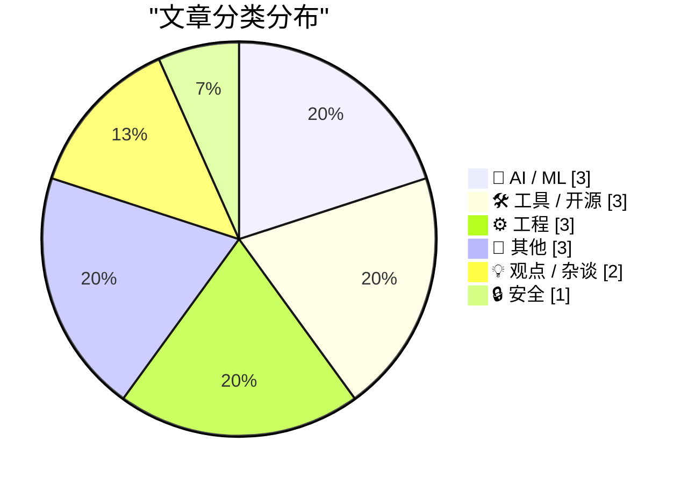
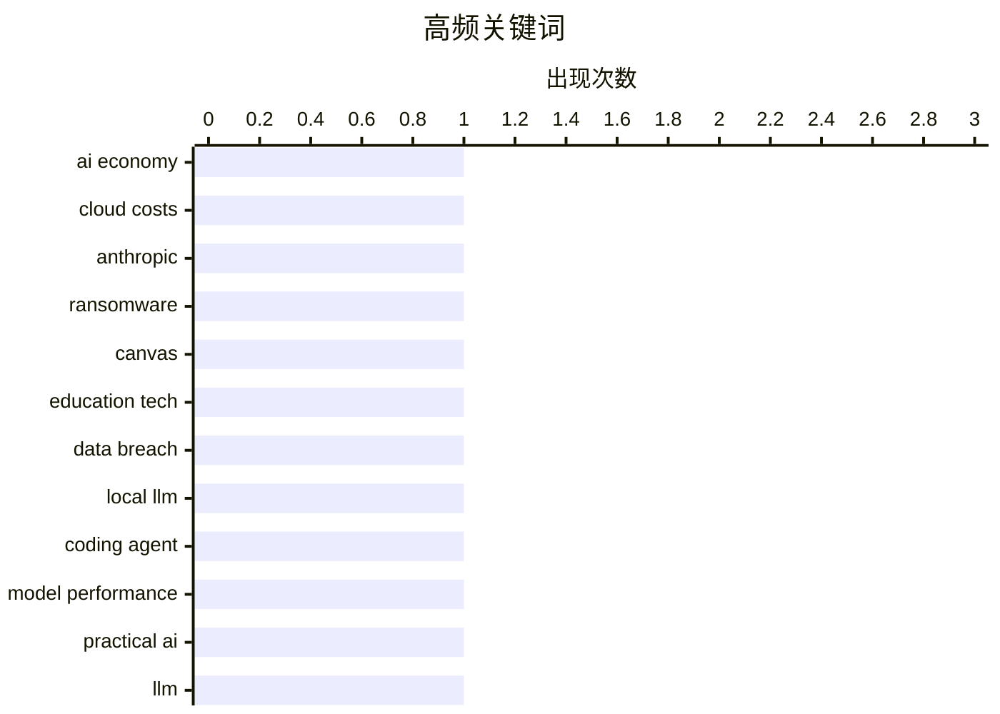

# 📰 AI 博客每日精选 — 2026-05-09

> 来自 Karpathy 推荐的 92 个顶级技术博客，AI 精选 Top 15

## 📝 今日看点

今日技术圈聚焦三大趋势：AI 发展面临经济可持续性挑战，Anthropic 等头部公司因高昂云成本陷入“烧钱换算力”困境；本地 AI 模型加速落地，开发者呼吁提升本地推理能力以摆脱对封闭云服务的依赖；同时，安全事件频发引发关注，Canvas 遭勒索攻击波及全美近万所学校，凸显教育行业数据防护短板。

---

## 🏆 今日必读

🥇 **AI 的循环精神病：Anthropic 为何无力支付巨额云账单**

[Premium: AI's Circular Psychosis](https://www.wheresyoured.at/premium-ais-circular-psychosis/) — wheresyoured.at · 4 小时前 · 🤖 AI / ML

> 文章揭示了当前 AI 行业存在的严重经济循环问题：Anthropic 等公司因研发成本过高而收入无法覆盖云服务商的开支，导致其必须依赖外部资金来支付 AWS 等巨头的账单。这种‘烧钱换算力’的模式不可持续，暴露了 AI 初创企业在商业模式上的根本缺陷。作者认为，若不改变盈利结构，整个 AI 生态将陷入财务困境。

💡 **为什么值得读**: 它用通俗语言拆解了 AI 行业最隐蔽但致命的经济陷阱，对投资者和从业者极具警示价值。

🏷️ AI economy, cloud costs, Anthropic

🥈 **Canvas 遭数据勒索攻击，波及全美近 9000 所学校**

[Canvas Breach Disrupts Schools & Colleges Nationwide](https://krebsonsecurity.com/2026/05/canvas-breach-disrupts-schools-colleges-nationwide/) — krebsonsecurity.com · 15 小时前 · 🔒 安全

> 一个犯罪团伙入侵了教育科技平台 Canvas 的登录页面并发布勒索信息，威胁泄露来自全美近 9000 所教育机构、影响约 2.75 亿师生用户的敏感数据。此次攻击已导致多地学校课程中断，凸显了教育 IT 系统面临的网络威胁日益严峻。

💡 **为什么值得读**: 这起大规模数据勒索事件暴露了关键教育基础设施的安全漏洞，值得所有机构管理者高度警惕。

🏷️ ransomware, Canvas, education tech, data breach

🥉 **推动本地模型落地：追求实用性与开发者体验**

[Pushing Local Models With Focus And Polish](https://lucumr.pocoo.org/2026/5/8/local-models/) — lucumr.pocoo.org · 18 小时前 · 🤖 AI / ML

> 作者强烈希望本地运行的 AI 模型能具备与云端 API 相媲美的实用性，以便在编码助手等场景中直接使用而不需切换服务。他认为过早将实验性开发锁定在封闭的云环境中会阻碍普通开发者的创新参与。尽管目前本地模型仍存在性能瓶颈，但作者呼吁社区聚焦于提升其实用性和稳定性。

💡 **为什么值得读**: 为本地 AI 发展指明了明确方向——不是追求理论性能，而是让普通开发者也能轻松使用。

🏷️ local LLM, coding agent, model performance, practical AI

---

## 📊 数据概览

| 扫描源 | 抓取文章 | 时间范围 | 精选 |
|:---:|:---:|:---:|:---:|
| 82/92 | 2421 篇 → 20 篇 | 24h | **15 篇** |

### 分类分布



### 高频关键词



<details>
<summary>📈 纯文本关键词图（终端友好）</summary>

```
ai economy        │ ████████████████████ 1
cloud costs       │ ████████████████████ 1
anthropic         │ ████████████████████ 1
ransomware        │ ████████████████████ 1
canvas            │ ████████████████████ 1
education tech    │ ████████████████████ 1
data breach       │ ████████████████████ 1
local llm         │ ████████████████████ 1
coding agent      │ ████████████████████ 1
model performance │ ████████████████████ 1
```

</details>

### 🏷️ 话题标签

**ai economy**(1) · **cloud costs**(1) · **anthropic**(1) · ransomware(1) · canvas(1) · education tech(1) · data breach(1) · local llm(1) · coding agent(1) · model performance(1) · practical ai(1) · llm(1) · gemini(1) · api(1) · release(1) · zig(1) · zig fmt(1) · code formatting(1) · incident response(1) · operational excellence(1)

---

## 🤖 AI / ML

### 1. AI 的循环精神病：Anthropic 为何无力支付巨额云账单

[Premium: AI's Circular Psychosis](https://www.wheresyoured.at/premium-ais-circular-psychosis/) — **wheresyoured.at** · 4 小时前 · ⭐ 26/30

> 文章揭示了当前 AI 行业存在的严重经济循环问题：Anthropic 等公司因研发成本过高而收入无法覆盖云服务商的开支，导致其必须依赖外部资金来支付 AWS 等巨头的账单。这种‘烧钱换算力’的模式不可持续，暴露了 AI 初创企业在商业模式上的根本缺陷。作者认为，若不改变盈利结构，整个 AI 生态将陷入财务困境。

🏷️ AI economy, cloud costs, Anthropic

---

### 2. 推动本地模型落地：追求实用性与开发者体验

[Pushing Local Models With Focus And Polish](https://lucumr.pocoo.org/2026/5/8/local-models/) — **lucumr.pocoo.org** · 18 小时前 · ⭐ 25/30

> 作者强烈希望本地运行的 AI 模型能具备与云端 API 相媲美的实用性，以便在编码助手等场景中直接使用而不需切换服务。他认为过早将实验性开发锁定在封闭的云环境中会阻碍普通开发者的创新参与。尽管目前本地模型仍存在性能瓶颈，但作者呼吁社区聚焦于提升其实用性和稳定性。

🏷️ local LLM, coding agent, model performance, practical AI

---

### 3. llm-gemini 0.31 发布：Gemini 3.1 Flash-Lite 正式可用

[llm-gemini 0.31](https://simonwillison.net/2026/May/7/llm-gemini/#atom-everything) — **simonwillison.net** · 22 小时前 · ⭐ 24/30

> Simon Willison 发布了 llm-gemini 插件版本 0.31，标志着 Google 的 Gemini 3.1 Flash-Lite 模型已从预览版转为正式发布。该模型专为高效推理设计，适用于需要快速响应的应用场景。

🏷️ LLM, Gemini, API, release

---

## 🛠 工具 / 开源

### 4. 掌握 Zig fmt 的两条实用技巧

[Steering Zig Fmt](https://matklad.github.io/2026/05/08/steering-zig-fmt.html) — **matklad.github.io** · 18 小时前 · ⭐ 23/30

> 本文分享了两个提高 Zig 代码格式化效率的技巧：一是利用 `zig fmt` 自动对齐复杂表达式；二是通过自定义 `.zigfmtignore` 文件排除特定目录或文件不被格式化。这些技巧可显著提升大型项目的代码一致性维护效率。

🏷️ Zig, zig fmt, code formatting

---

### 5. Flower：基于 Clojure 模板语言的静态站点生成器

[Flower: an SSG with a Clojure template language](https://jyn.dev/talks/flower/) — **jyn.dev** · 18 小时前 · ⭐ 21/30

> Flower 是一个新颖的静态站点生成器（SSG），其核心特色是使用 Clojure 作为模板语言，而非常见的 JavaScript 或 Go 模板。这使得开发者可以利用 Clojure 强大的函数式编程能力来构建动态且富有表现力的网站内容。

🏷️ Flower, SSG, Clojure

---

### 6. Big Words：一个用于生成演示文稿幻灯片的轻量级工具

[Big Words](https://simonwillison.net/2026/May/7/big-words/#atom-everything) — **simonwillison.net** · 1 天前 · ⭐ 17/30

> Simon Willison 开发了一个名为 Big Words 的工具，用于快速生成带有文本的幻灯片。该工具接受 URL 查询参数并将它们转换为简单的演示页面，适用于其 vibe-coded macOS 演示框架。它通过 GitHub PR #279 实现，支持动态内容注入，简化了技术演讲中的视觉辅助制作流程。

🏷️ presentation, macOS, vibe coding

---

## ⚙️ 工程

### 7. 事故处理心得：大多数故障会自行恢复

[Notes on incidents](https://seangoedecke.com/notes-on-incidents/) — **seangoedecke.com** · 18 小时前 · ⭐ 22/30

> 作者指出，实际处理事故时往往只需等待——等待其他团队调查、部署完成或变更结果显现。更重要的是，绝大多数事故无需人为干预即可自动解决，因此保持冷静、避免过度反应比立即行动更重要。

🏷️ incident response, operational excellence, teamwork

---

### 8. 通过 ReadDirectoryChangesW 追踪重命名操作时增强信心

[Developing more confidence when tracking renames via Read­Directory­ChangesW](https://devblogs.microsoft.com/oldnewthing/20260508-00/?p=112310) — **devblogs.microsoft.com/oldnewthing** · 4 小时前 · ⭐ 19/30

> 本文探讨了在使用 Windows API 函数 ReadDirectoryChangesW 监控文件系统变更时，如何通过记录文件 ID 而非仅依赖文件名来提高识别重命名操作的准确性，从而减少误判和遗漏。

🏷️ Windows API, file system, renames, ReadDirectoryChangesW

---

### 9. 计算曲率的数学方法解析

[Calculating curvature](https://www.johndcook.com/blog/2026/05/08/calculating-curvature/) — **johndcook.com** · 4 小时前 · ⭐ 18/30

> 曲率概念直观易懂，但其数学表达通常较为复杂。本文以水平集曲线 f(x,y)=c 为例，推导了其曲率 κ 的计算公式，并指出即使 f 表达式简单，κ 也可能变得繁琐。文中引入辅助变量简化最终形式。

🏷️ curvature, level set, mathematics

---

## 📝 其他

### 10. 大卫·赖克：青铜时代为何是人类进化的关键转折点

[David Reich – Why the Bronze Age was an inflection point in human evolution](https://www.dwarkesh.com/p/david-reich-2) — **dwarkesh.com** · 2 小时前 · ⭐ 15/30

> 遗传学家大卫·赖克在访谈中指出，人类进化并非停滞，而是持续受到自然选择的强烈影响。他提出青铜时代的农业扩张、人口迁移和疾病传播加速了基因流动，成为进化史上的重要拐点。这一时期的基因变化揭示了环境压力如何重塑人类适应性。

🏷️ Bronze Age, natural selection, human evolution

---

### 11. 周末在伯尼家：你的依赖项中谁在戴墨镜？

[Weekend at Bernie’s](https://nesbitt.io/2026/05/08/weekend-at-bernies.html) — **nesbitt.io** · 8 小时前 · ⭐ 13/30

> 文章以幽默方式探讨软件依赖项的脆弱性与生命周期管理问题。通过‘谁在你的依赖链中假装自己还活着’的比喻，揭示过时或废弃库带来的潜在风险。作者暗示开发者应定期审计依赖关系，避免因‘穿西装打领带’（即表面正常）的组件导致系统崩溃。

🏷️ dependencies, sunglasses, humor

---

### 12. HomePod mini 感觉像魔法，但其实只是时机恰到好处

[HomePod mini feels like magic, but it's just good timing](https://www.jeffgeerling.com/blog/2026/homepod-mini-feels-like-magic--but-it-s-just-good-timing/) — **jeffgeerling.com** · 4 小时前 · ⭐ 12/30

> Jeff Geerling 分析了 HomePod mini 的成功并非源于技术突破，而是苹果在正确时间整合了硬件、软件与生态系统的结果。尽管六年前发布，其立体声配对功能展示了空间音频与设备协同的成熟度。作者认为用户体验的流畅感来自精准的时机而非单一技术创新。

🏷️ HomePod, Apple, audio

---

## 💡 观点 / 杂谈

### 13. Pluralistic：Lee Lai 的《Cannon》——关于责任、性别与糟糕老板的细腻故事

[Pluralistic: Lee Lai's "Cannon" (08 May 2026)](https://pluralistic.net/2026/05/08/gung-gung/) — **pluralistic.net** · 6 小时前 · ⭐ 19/30

> 本期 Pluralistic 推荐了 Lee Lai 创作的短篇小说《Cannon》，讲述了一个关于职责、性与为恶劣餐厅老板工作的微妙而持久的故事。文章还穿插了 eBay 付费刊登分类广告、Chuck Tingle 对抗 Sad Puppies 等多个文化观察片段。

🏷️ comics, Lee Lai, Cannon, culture

---

### 14. 《The Bold Ones Win》——我们失去了特德·特纳，一位Tedium的守护神

[The Bold Ones Win](https://feed.tedium.co/link/15204/17336568/ted-turner-bold-ceo-bets) — **tedium.co** · 18 小时前 · ⭐ 18/30

> 文章回顾了媒体大亨特德·特纳的遗产，并探讨了一位当代企业家效仿其大胆风格所做出的激进赌注。核心在于分析“大胆决策”在商业与领导力中的价值。作者通过对比特纳的历史性投资与现代创业者的类似举动，强调勇气与远见在推动变革中的关键作用。最终观点是：真正的创新往往源于敢于押注未来的‘大胆者’。

🏷️ entrepreneurship, Ted Turner, risk-taking

---

## 🔒 安全

### 15. Canvas 遭数据勒索攻击，波及全美近 9000 所学校

[Canvas Breach Disrupts Schools & Colleges Nationwide](https://krebsonsecurity.com/2026/05/canvas-breach-disrupts-schools-colleges-nationwide/) — **krebsonsecurity.com** · 15 小时前 · ⭐ 25/30

> 一个犯罪团伙入侵了教育科技平台 Canvas 的登录页面并发布勒索信息，威胁泄露来自全美近 9000 所教育机构、影响约 2.75 亿师生用户的敏感数据。此次攻击已导致多地学校课程中断，凸显了教育 IT 系统面临的网络威胁日益严峻。

🏷️ ransomware, Canvas, education tech, data breach

---

*生成于 2026-05-09 02:49 (Asia/Shanghai) | 扫描 82 源 → 获取 2421 篇 → 精选 15 篇*
*基于 [Hacker News Popularity Contest 2025](https://refactoringenglish.com/tools/hn-popularity/) RSS 源列表，由 [Andrej Karpathy](https://x.com/karpathy) 推荐*
*由「懂点儿AI」制作，欢迎关注同名微信公众号获取更多 AI 实用技巧 💡*
