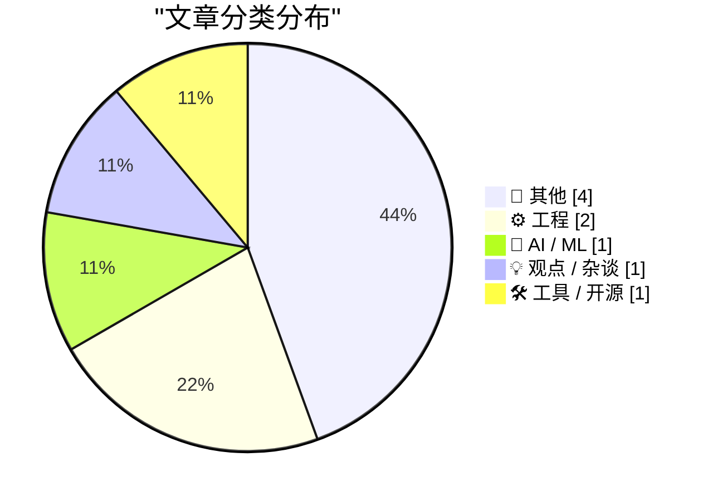
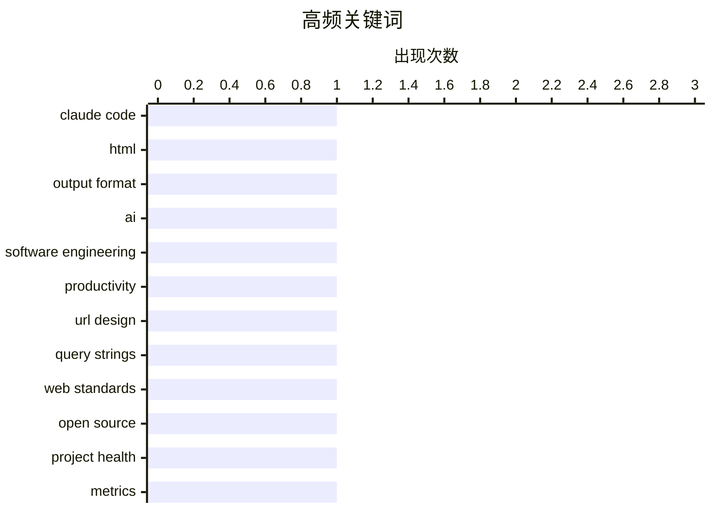

# 📰 AI 博客每日精选 — 2026-05-10

> 来自 Karpathy 推荐的 92 个顶级技术博客，AI 精选 Top 9

## 📝 今日看点

今日技术圈聚焦三大趋势：AI 正重塑软件工程生态，既提升弱工程师效率，也加剧对顶尖人才的依赖；Web 开发理念持续演进，从 URL 设计到实时通信协议，开发者更强调语义准确与用户体验；同时，开源项目评估体系引发反思，业界呼吁超越表面指标，关注真实健康度。

---

## 🏆 今日必读

🥇 **使用 Claude Code：HTML 的不合理有效性**

[Using Claude Code: The Unreasonable Effectiveness of HTML](https://simonwillison.net/2026/May/8/unreasonable-effectiveness-of-html/#atom-everything) — simonwillison.net · 21 小时前 · 🤖 AI / ML

> 文章探讨了为何在请求 Claude 输出结构化内容时，HTML 比 Markdown 更具优势。作者通过多个实际案例展示了 HTML 能够更精确地控制布局、样式和语义结构，从而生成更可靠、可维护的代码片段。文中还提供了针对 Claude 的提示词建议，以引导其输出高质量的 HTML。核心观点是：对于需要精确格式和功能的 AI 生成内容，HTML 是比 Markdown 更优的选择。

💡 **为什么值得读**: 如果你正在寻找一种方法来提升与 Claude 等 AI 助手交互时的输出质量，特别是需要精确控制最终呈现效果，那么这篇文章提供的见解和实例将极具价值。

🏷️ Claude Code, HTML, output format

🥈 **AI 让弱工程师的危害变小**

[AI makes weak engineers less harmful](https://seangoedecke.com/ai-makes-weak-engineers-less-harmful/) — seangoedecke.com · 18 小时前 · 💡 观点 / 杂谈

> 软件工程能力分布呈强长尾特征，顶尖工程师产出远超平均水平，而最弱的工程师则常带来净负面影响。AI 工具通过自动化重复性任务、提供代码审查和建议，显著降低了弱工程师造成的错误和延误。文章认为，AI 并非取代人类工程师，而是通过赋能，使弱工程师能贡献更多，同时减轻团队负担。

💡 **为什么值得读**: 理解 AI 如何改变软件工程团队中不同技能水平成员的角色和影响，对于技术管理者和技术从业者来说至关重要。

🏷️ AI, software engineering, productivity

🥉 **我不会在你的 URL 中添加查询字符串**

[I Will Not Add Query Strings to Your URLs](https://susam.net/no-query-strings.html) — susam.net · 18 小时前 · ⚙️ 工程

> 作者 Chris Morgan 强烈反对在 URL 中使用查询字符串（query strings），认为它们是 Web 上的一个误设计。他主张使用路径（path）来传递参数，因为路径更符合 URL 作为资源标识符的本质，且更易于阅读、调试和缓存。文章回顾了 Web 早期的发展，并指出查询字符串虽然方便，但带来了诸如 SEO 问题、URL 长度限制和安全风险等弊端。

💡 **为什么值得读**: 对于关注 Web 开发最佳实践、SEO 优化和 URL 设计的开发者而言，这篇文章提供了一个值得深思的视角，挑战了常见的做法。

🏷️ URL design, query strings, web standards

---

## 📊 数据概览

| 扫描源 | 抓取文章 | 时间范围 | 精选 |
|:---:|:---:|:---:|:---:|
| 81/92 | 2414 篇 → 9 篇 | 24h | **9 篇** |

### 分类分布



### 高频关键词



<details>
<summary>📈 纯文本关键词图（终端友好）</summary>

```
claude code          │ ████████████████████ 1
html                 │ ████████████████████ 1
output format        │ ████████████████████ 1
ai                   │ ████████████████████ 1
software engineering │ ████████████████████ 1
productivity         │ ████████████████████ 1
url design           │ ████████████████████ 1
query strings        │ ████████████████████ 1
web standards        │ ████████████████████ 1
open source          │ ████████████████████ 1
```

</details>

### 🏷️ 话题标签

**claude code**(1) · **html**(1) · **output format**(1) · ai(1) · software engineering(1) · productivity(1) · url design(1) · query strings(1) · web standards(1) · open source(1) · project health(1) · metrics(1) · webrtc(1) · networking(1) · latency(1) · construction(1) · data centers(1) · military drones(1) · george orwell(1) · russell(1)

---

## 📝 其他

### 1. 阅读清单 05/09/2026

[Reading List 05/09/2026](https://www.construction-physics.com/p/reading-list-05092026) — **construction-physics.com** · 6 小时前 · ⭐ 17/30

> 本期阅读清单涵盖了多个领域的内容，包括被困建筑、家庭数据中心、纸板军事无人机、Brightline 潜在的破产风险等。这些话题涉及建筑安全、信息技术、军事科技和交通行业，展示了科技与社会发展的多方面动态。

🏷️ construction, data centers, military drones

---

### 2. 乔治·奥威尔对伯特兰·罗素《权力：一项新的社会分析》的评论

[George Orwell's review of Russel's Power: A New Social Analysis](https://berthub.eu/articles/posts/orwell-review-bertrand-russells-power/) — **berthub.eu** · 21 小时前 · ⭐ 16/30

> 作者重新发现了乔治·奥威尔于1939年发表在《The Adelphi》上的书评，该评论实际上远不止是对一本书的评价。奥威尔的书评深入探讨了权力的本质及其在社会中的作用，具有超越书评本身的深刻洞察力。

🏷️ George Orwell, Russell, social analysis

---

### 3. Pluralistic：特朗普徒劳地寻找一个可以被凌辱的公牛 (2026年5月9日)

[Pluralistic: Trump's fruitless search for a goreable ox (09 May 2026)](https://pluralistic.net/2026/05/09/cossie-livvie-crissie/) — **pluralistic.net** · 5 小时前 · ⭐ 12/30

> 文章讨论了特朗普在寻求政治支持与应对生活成本危机之间的两难境地。它列举了一系列其他新闻亮点，包括 Phrack 杂志的新一期、巴拿马文件吹哨人发言、PRO 法案以及扎克伯格的“心灵控制射线”。

🏷️ politics, economics, cost of living

---

### 4. 书评：弗洛伦斯·卡普尔的《名字》★★☆☆☆

[Book Review: The Names by Florence Knapp ★★⯪☆☆](https://shkspr.mobi/blog/2026/05/book-review-the-names-by-florence-knapp/) — **shkspr.mobi** · 6 小时前 · ⭐ 11/30

> 这本书拥有出色的叙事结构和优美的文笔，但作者个人并不享受阅读过程。故事融合了《滑动门》和《同一时间下一年》的元素，并包含令人不安的家庭暴力情节。故事围绕一位母亲面临艰难抉择展开：是否应该用她施暴的丈夫的名字为孩子命名？

🏷️ book review, fiction, domestic violence

---

## ⚙️ 工程

### 5. 我不会在你的 URL 中添加查询字符串

[I Will Not Add Query Strings to Your URLs](https://susam.net/no-query-strings.html) — **susam.net** · 18 小时前 · ⭐ 23/30

> 作者 Chris Morgan 强烈反对在 URL 中使用查询字符串（query strings），认为它们是 Web 上的一个误设计。他主张使用路径（path）来传递参数，因为路径更符合 URL 作为资源标识符的本质，且更易于阅读、调试和缓存。文章回顾了 Web 早期的发展，并指出查询字符串虽然方便，但带来了诸如 SEO 问题、URL 长度限制和安全风险等弊端。

🏷️ URL design, query strings, web standards

---

### 6. 引用卢克·库里

[Quoting Luke Curley](https://simonwillison.net/2026/May/9/luke-curley/#atom-everything) — **simonwillison.net** · 17 小时前 · ⭐ 21/30

> 文章引用了卢克·库里关于 WebRTC 的言论，指出 WebRTC 的设计目标是在网络条件不佳时主动丢弃音频数据包以保持低延迟。作者对此表示惊讶，因为对于像语音通话这样的实时应用，用户通常更愿意等待完整的数据包以确保音频质量，而不是接受因丢包导致的失真。

🏷️ WebRTC, networking, latency

---

## 🤖 AI / ML

### 7. 使用 Claude Code：HTML 的不合理有效性

[Using Claude Code: The Unreasonable Effectiveness of HTML](https://simonwillison.net/2026/May/8/unreasonable-effectiveness-of-html/#atom-everything) — **simonwillison.net** · 21 小时前 · ⭐ 26/30

> 文章探讨了为何在请求 Claude 输出结构化内容时，HTML 比 Markdown 更具优势。作者通过多个实际案例展示了 HTML 能够更精确地控制布局、样式和语义结构，从而生成更可靠、可维护的代码片段。文中还提供了针对 Claude 的提示词建议，以引导其输出高质量的 HTML。核心观点是：对于需要精确格式和功能的 AI 生成内容，HTML 是比 Markdown 更优的选择。

🏷️ Claude Code, HTML, output format

---

## 💡 观点 / 杂谈

### 8. AI 让弱工程师的危害变小

[AI makes weak engineers less harmful](https://seangoedecke.com/ai-makes-weak-engineers-less-harmful/) — **seangoedecke.com** · 18 小时前 · ⭐ 24/30

> 软件工程能力分布呈强长尾特征，顶尖工程师产出远超平均水平，而最弱的工程师则常带来净负面影响。AI 工具通过自动化重复性任务、提供代码审查和建议，显著降低了弱工程师造成的错误和延误。文章认为，AI 并非取代人类工程师，而是通过赋能，使弱工程师能贡献更多，同时减轻团队负担。

🏷️ AI, software engineering, productivity

---

## 🛠 工具 / 开源

### 9. 开源的误测

[The Mismeasure of Open Source](https://nesbitt.io/2026/05/09/the-mismeasure-of-open-source.html) — **nesbitt.io** · 8 小时前 · ⭐ 22/30

> 文章探讨了开源项目健康度评估中的“路灯效应”（streetlight effect），即人们倾向于在容易观察的地方寻找数据，而忽略了真正重要的指标。它批评了当前许多基于提交频率、星标数量等表面数据的评分方法，这些方法无法准确反映项目的实际活力、可持续性或对社区的贡献。

🏷️ open source, project health, metrics

---

*生成于 2026-05-10 02:09 (Asia/Shanghai) | 扫描 81 源 → 获取 2414 篇 → 精选 9 篇*
*基于 [Hacker News Popularity Contest 2025](https://refactoringenglish.com/tools/hn-popularity/) RSS 源列表，由 [Andrej Karpathy](https://x.com/karpathy) 推荐*
*由「懂点儿AI」制作，欢迎关注同名微信公众号获取更多 AI 实用技巧 💡*
