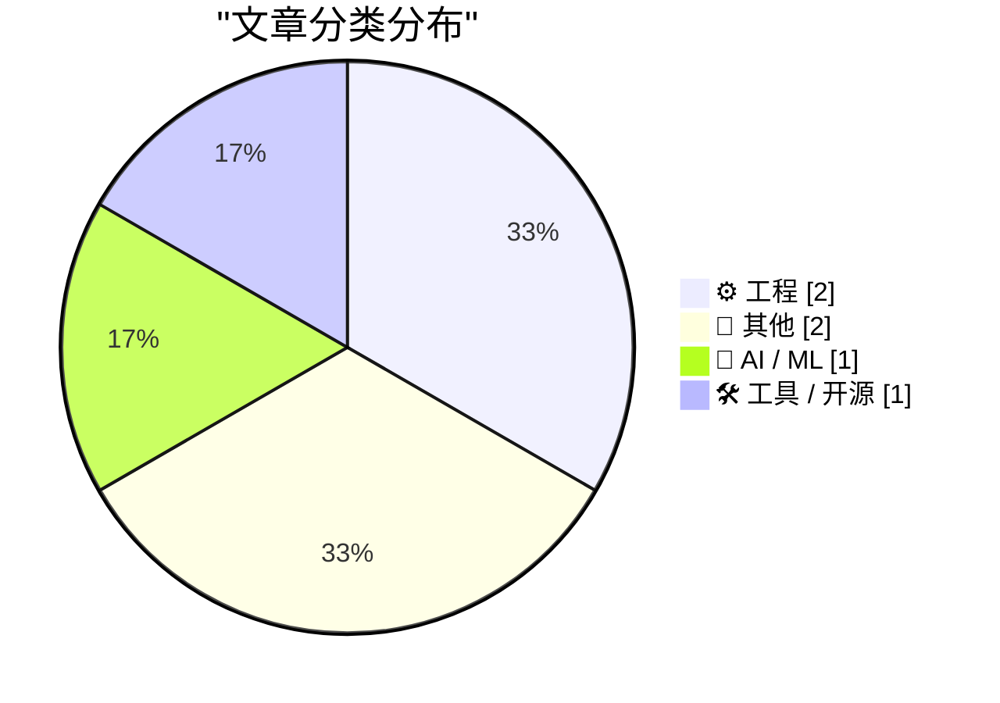
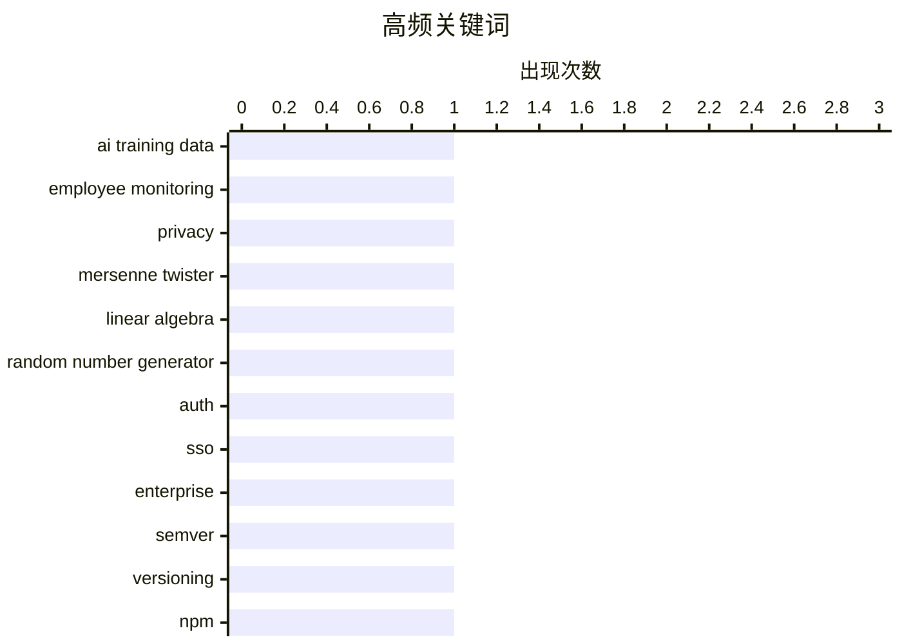

# 📰 AI 博客每日精选 — 2026-05-11

> 来自 Karpathy 推荐的 92 个顶级技术博客，AI 精选 Top 6

## 📝 今日看点

今日技术圈聚焦三大趋势：Meta 启动员工行为数据采集，用于训练 AI 模型，引发对隐私与生产力平衡的讨论；工程领域持续探索算法逆向与安全边界，Mersenne Twister 的线性代数破解揭示伪随机数生成器的脆弱性；同时，企业级 SaaS 基础设施需求升温，WorkOS 等身份认证方案成为 B2B 产品标配，而语义化版本工具 Madame Semver 的预告则预示开发流程自动化的新动向。

---

## 🏆 今日必读

🥇 **Meta 开始收集员工鼠标移动和键盘输入以训练 AI**

[Meta to Start Capturing Employee Mouse Movements, Keystrokes for AI Training Data](https://www.reuters.com/sustainability/boards-policy-regulation/meta-start-capturing-employee-mouse-movements-keystrokes-ai-training-data-2026-04-21/) — daringfireball.net · 4 小时前 · 🤖 AI / ML

> Meta 正在美国员工的电脑上安装新的追踪软件，用于捕捉鼠标移动、点击和击键数据，以训练其人工智能模型。该项目名为“能力模型计划”（MCI），仅针对工作相关的应用和网站运行。此举是 Meta 构建能自主执行工作任务的人工智能代理的广泛战略的一部分。公司向员工发送的内部备忘录显示，该工具旨在提升 AI 在办公场景中的自动化能力。此举引发了关于员工隐私和数据使用的关注。

💡 **为什么值得读**: 揭示了科技巨头在开发 AI 过程中对员工行为数据的系统性采集，触及职场监控与隐私伦理的核心议题。

🏷️ AI training data, employee monitoring, privacy

🥈 **用线性代数逆向工程 Mersenne Twister**

[Reverse engineering Mersenne Twister with Linear Algebra](https://www.johndcook.com/blog/2026/05/10/reverse-mersenne-twister/) — johndcook.com · 35 分钟前 · ⚙️ 工程

> Mersenne Twister（MT）是一种具有良好统计特性的伪随机数生成器，但不具备加密安全性。本文展示了如何通过线性代数方法从 MT 的输出中恢复其内部状态。作者指出，尽管位操作技术也能实现类似效果，但线性代数提供了一种更系统且可解释的破解路径。该方法可用于分析依赖 MT 作为随机源的弱安全系统。文章强调，MT 不应被用作密码学安全的 PRNG（CSPRNG）。

💡 **为什么值得读**: 为理解伪随机数生成器的安全漏洞提供了数学层面的深入解析，适合对密码学与算法安全感兴趣的读者。

🏷️ Mersenne Twister, linear algebra, random number generator

🥉 **WorkOS：企业级 SaaS 身份认证解决方案**

[WorkOS](https://workos.com/?utm_source=daringfireball&amp;utm_medium=newsletter&amp;utm_campaign=q22026) — daringfireball.net · 4 小时前 · ⚙️ 工程

> WorkOS 为企业提供生产就绪的身份认证与访问控制 API，帮助 B2B SaaS 产品快速集成 SSO、SCIM 和审计日志等企业级功能。对于专注于 AI 或通用 SaaS 的开发团队而言，无需重复造轮子即可满足企业客户的安全合规需求。其标准化接口显著降低开发周期和维护成本，使团队能聚焦于核心产品创新。WorkOS 已成为许多初创公司进入企业级市场的关键基础设施组件。

💡 **为什么值得读**: 为准备服务企业级客户的 SaaS 创业者提供了高效解决身份认证的成熟方案，避免从零搭建带来的资源浪费。

🏷️ auth, SSO, enterprise

---

## 📊 数据概览

| 扫描源 | 抓取文章 | 时间范围 | 精选 |
|:---:|:---:|:---:|:---:|
| 82/92 | 2411 篇 → 6 篇 | 24h | **6 篇** |

### 分类分布



### 高频关键词



<details>
<summary>📈 纯文本关键词图（终端友好）</summary>

```
ai training data        │ ████████████████████ 1
employee monitoring     │ ████████████████████ 1
privacy                 │ ████████████████████ 1
mersenne twister        │ ████████████████████ 1
linear algebra          │ ████████████████████ 1
random number generator │ ████████████████████ 1
auth                    │ ████████████████████ 1
sso                     │ ████████████████████ 1
enterprise              │ ████████████████████ 1
semver                  │ ████████████████████ 1
```

</details>

### 🏷️ 话题标签

**ai training data**(1) · **employee monitoring**(1) · **privacy**(1) · mersenne twister(1) · linear algebra(1) · random number generator(1) · auth(1) · sso(1) · enterprise(1) · semver(1) · versioning(1) · npm(1) · personal(1) · reflection(1) · programming(1) · rss(1) · blogging(1) · content(1)

---

## ⚙️ 工程

### 1. 用线性代数逆向工程 Mersenne Twister

[Reverse engineering Mersenne Twister with Linear Algebra](https://www.johndcook.com/blog/2026/05/10/reverse-mersenne-twister/) — **johndcook.com** · 35 分钟前 · ⭐ 24/30

> Mersenne Twister（MT）是一种具有良好统计特性的伪随机数生成器，但不具备加密安全性。本文展示了如何通过线性代数方法从 MT 的输出中恢复其内部状态。作者指出，尽管位操作技术也能实现类似效果，但线性代数提供了一种更系统且可解释的破解路径。该方法可用于分析依赖 MT 作为随机源的弱安全系统。文章强调，MT 不应被用作密码学安全的 PRNG（CSPRNG）。

🏷️ Mersenne Twister, linear algebra, random number generator

---

### 2. WorkOS：企业级 SaaS 身份认证解决方案

[WorkOS](https://workos.com/?utm_source=daringfireball&amp;utm_medium=newsletter&amp;utm_campaign=q22026) — **daringfireball.net** · 4 小时前 · ⭐ 21/30

> WorkOS 为企业提供生产就绪的身份认证与访问控制 API，帮助 B2B SaaS 产品快速集成 SSO、SCIM 和审计日志等企业级功能。对于专注于 AI 或通用 SaaS 的开发团队而言，无需重复造轮子即可满足企业客户的安全合规需求。其标准化接口显著降低开发周期和维护成本，使团队能聚焦于核心产品创新。WorkOS 已成为许多初创公司进入企业级市场的关键基础设施组件。

🏷️ auth, SSO, enterprise

---

## 📝 其他

### 3. Andrew Quinn 谈编程中的历史包袱与技术债务

[Quoting Andrew Quinn](https://simonwillison.net/2026/May/10/andrew-quinn/#atom-everything) — **simonwillison.net** · 3 小时前 · ⭐ 9/30

> Andrew Quinn 分享了他长达四分之一世纪的编程心路历程，坦言始终存在一种焦虑：自己正在开发的工具是否已被 30–40 年前更优的实现所取代。他以将 3GB 的 SQLite 数据库替换为仅 7MB 的 FST（有限状态转换器）二进制文件为例，说明现代开发者常陷入重复造轮子的困境。这种反思揭示了技术演进中的认知滞后与知识传承断裂问题。

🏷️ personal, reflection, programming

---

### 4. RSS Club 会员专享：下期博客预告

[[RSS Club] A Sneak Preview of Upcoming Posts](https://shkspr.mobi/blog/2026/05/rss-club-a-sneak-preview-of-upcoming-posts/) — **shkspr.mobi** · 6 小时前 · ⭐ 8/30

> 博主通过 RSS Club 向订阅者提前泄露即将发布的博客内容，以示感谢。他使用 Editorial Calendar Plugin 来管理定时发布的文章，并透露未来一个月将集中写作后分散发布。这种‘爆发式写作+间隔发布’的模式有助于维持创作节奏并减少日常压力。预告虽简短，却体现了对忠实读者的重视与互动诚意。

🏷️ RSS, blogging, content

---

## 🤖 AI / ML

### 5. Meta 开始收集员工鼠标移动和键盘输入以训练 AI

[Meta to Start Capturing Employee Mouse Movements, Keystrokes for AI Training Data](https://www.reuters.com/sustainability/boards-policy-regulation/meta-start-capturing-employee-mouse-movements-keystrokes-ai-training-data-2026-04-21/) — **daringfireball.net** · 4 小时前 · ⭐ 26/30

> Meta 正在美国员工的电脑上安装新的追踪软件，用于捕捉鼠标移动、点击和击键数据，以训练其人工智能模型。该项目名为“能力模型计划”（MCI），仅针对工作相关的应用和网站运行。此举是 Meta 构建能自主执行工作任务的人工智能代理的广泛战略的一部分。公司向员工发送的内部备忘录显示，该工具旨在提升 AI 在办公场景中的自动化能力。此举引发了关于员工隐私和数据使用的关注。

🏷️ AI training data, employee monitoring, privacy

---

## 🛠 工具 / 开源

### 6. Madame Semver 即将上线

[Madame Semver Will See You Now](https://nesbitt.io/2026/05/10/madame-semver-will-see-you-now.html) — **nesbitt.io** · 8 小时前 · ⭐ 18/30

> 文章标题引用了一句神秘宣言：“卡片不会说谎。”结合上下文推测，这可能是在预告一位名为 Madame Semver 的新角色或工具即将发布。SemVer（语义化版本）是软件开发中广泛采用的标准，因此该名称暗示这可能是一个与版本管理相关的新项目或测试版服务。尽管内容极简，但标题本身具有强烈的悬念感和期待感。

🏷️ semver, versioning, npm

---

*生成于 2026-05-11 02:07 (Asia/Shanghai) | 扫描 82 源 → 获取 2411 篇 → 精选 6 篇*
*基于 [Hacker News Popularity Contest 2025](https://refactoringenglish.com/tools/hn-popularity/) RSS 源列表，由 [Andrej Karpathy](https://x.com/karpathy) 推荐*
*由「懂点儿AI」制作，欢迎关注同名微信公众号获取更多 AI 实用技巧 💡*
