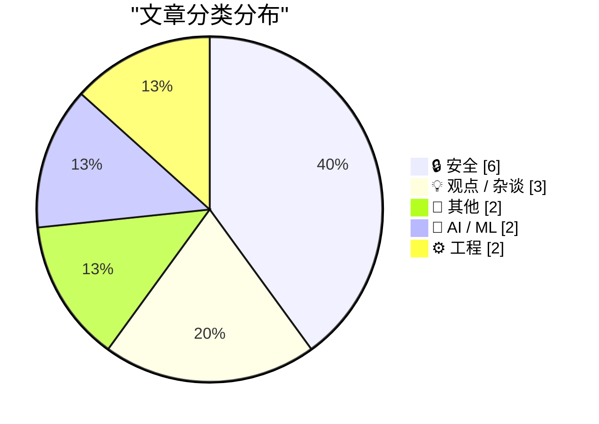
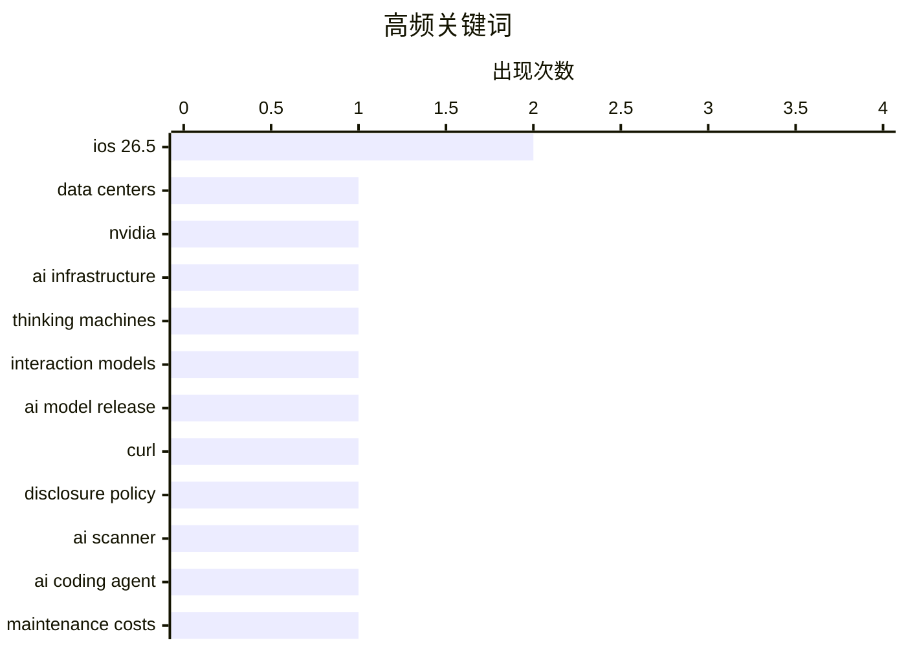

# 📰 AI 博客每日精选 — 2026-05-13

> 来自 Karpathy 推荐的 92 个顶级技术博客，AI 精选 Top 15

## 📝 今日看点

今日技术圈聚焦三大趋势：数据中心建设趋缓，尽管AI算力需求激增，但受限于成本与周期，全球新建数据中心步伐放缓；AI发展重心转向实用性与可持续性，从追求大模型性能转向强调降低维护成本的编码代理，并注重交互模型的实际落地价值；安全领域持续强化，从端到端加密RCS消息普及、政府接入数据泄露监控平台，到企业通过自动化流程优化漏洞披露机制，反映出对隐私保护与系统韧性的高度重视。

---

## 🏆 今日必读

🥇 **数据中心都去哪儿了？**

[Where Are All The Data Centers?](https://www.wheresyoured.at/where-are-all-the-data-centers/) — wheresyoured.at · 2 小时前 · 📝 其他

> 文章探讨了全球数据中心数量增长缓慢的现象，指出尽管互联网流量和AI算力需求激增，但新建数据中心数量并未同步增加。作者通过分析行业数据和基础设施报告，发现现有数据中心已接近饱和，且建设周期长、成本高是主要制约因素。研究还揭示了边缘计算和虚拟化技术正在改变传统数据中心的部署模式。结论认为，未来数据中心的发展将更注重效率提升而非单纯扩容。

💡 **为什么值得读**: 这是一篇深度剖析数字时代基础设施瓶颈的洞察之作，适合关注科技基建与能源消耗的专业读者。

🏷️ data centers, NVIDIA, AI infrastructure

🥈 **思维机器与交互模型**

[Thinking Machines and interaction models](https://seangoedecke.com/interaction-models/) — seangoedecke.com · 19 小时前 · 🤖 AI / ML

> Thinking Machines发布其首款真正的人工智能模型——'交互模型'，标志着该公司在成立一年后首次推出核心AI产品。该模型并非前沿大模型，不直接对标OpenAI、Anthropic或Google等巨头。公司投入20亿美元资本，专注于解决人机交互中的具体问题，旨在构建更自然、高效的AI协作方式。此举表明AI领域正从通用模型向垂直场景应用深化发展。

💡 **为什么值得读**: 这是对新兴AI创业公司战略定位和技术路线的一次罕见披露，值得了解AI产业多元化发展的趋势。

🏷️ Thinking Machines, interaction models, AI model release

🥉 **非安全问题：curl披露政策过滤AI扫描结果**

[Not a Security Issue](https://nesbitt.io/2026/05/12/not-a-security-issue.html) — nesbitt.io · 9 小时前 · 🔒 安全

> 本文介绍curl项目如何通过其披露政策有效过滤掉来自AI安全扫描工具的误报或低风险漏洞报告。文章详细说明了curl团队如何建立自动化流程，在接收外部漏洞信息时进行初步筛选，仅将高严重性、可验证的问题提交给官方渠道。这种做法既保障了开源项目的安全响应效率，又避免了社区被大量噪音干扰。该机制为其他开源项目处理第三方安全情报提供了参考范例。

💡 **为什么值得读**: 为开源社区如何应对AI驱动的安全工具输出提供了实用解决方案，特别适合维护者阅读。

🏷️ curl, disclosure policy, AI scanner

---

## 📊 数据概览

| 扫描源 | 抓取文章 | 时间范围 | 精选 |
|:---:|:---:|:---:|:---:|
| 83/92 | 2429 篇 → 22 篇 | 24h | **15 篇** |

### 分类分布



### 高频关键词



<details>
<summary>📈 纯文本关键词图（终端友好）</summary>

```
ios 26.5           │ ████████████████████ 2
data centers       │ ██████████░░░░░░░░░░ 1
nvidia             │ ██████████░░░░░░░░░░ 1
ai infrastructure  │ ██████████░░░░░░░░░░ 1
thinking machines  │ ██████████░░░░░░░░░░ 1
interaction models │ ██████████░░░░░░░░░░ 1
ai model release   │ ██████████░░░░░░░░░░ 1
curl               │ ██████████░░░░░░░░░░ 1
disclosure policy  │ ██████████░░░░░░░░░░ 1
ai scanner         │ ██████████░░░░░░░░░░ 1
```

</details>

### 🏷️ 话题标签

**ios 26.5**(2) · **data centers**(1) · **nvidia**(1) · ai infrastructure(1) · thinking machines(1) · interaction models(1) · ai model release(1) · curl(1) · disclosure policy(1) · ai scanner(1) · ai coding agent(1) · maintenance costs(1) · developer productivity(1) · have i been pwned(1) · government security(1) · data breach monitoring(1) · software design(1) · user interface(1) · cognitive load(1) · rcs encryption(1)

---

## 🔒 安全

### 1. 非安全问题：curl披露政策过滤AI扫描结果

[Not a Security Issue](https://nesbitt.io/2026/05/12/not-a-security-issue.html) — **nesbitt.io** · 9 小时前 · ⭐ 25/30

> 本文介绍curl项目如何通过其披露政策有效过滤掉来自AI安全扫描工具的误报或低风险漏洞报告。文章详细说明了curl团队如何建立自动化流程，在接收外部漏洞信息时进行初步筛选，仅将高严重性、可验证的问题提交给官方渠道。这种做法既保障了开源项目的安全响应效率，又避免了社区被大量噪音干扰。该机制为其他开源项目处理第三方安全情报提供了参考范例。

🏷️ curl, disclosure policy, AI scanner

---

### 2. 孟加拉国政府加入Have I Been Pwned免费服务

[Welcoming the Bangladesh Government to Have I Been Pwned](https://www.troyhunt.com/welcoming-the-bangladesh-government-to-have-i-been-pwned/) — **troyhunt.com** · 20 小时前 · ⭐ 24/30

> 孟加拉国成为第43个接入Have I Been Pwned政府版服务的国家，其BGD e-GOV CIRT部门可通过API全面监控本国政府域名是否发生数据泄露。该服务由Troy Hunt提供，支持自动监测未来潜在违规事件，帮助政府机构及时应对网络安全威胁。目前已有多个国家采用此服务加强关键基础设施保护。

🏷️ Have I Been Pwned, government security, data breach monitoring

---

### 3. iOS 26.5 Beta版开始支持端到端加密RCS消息

[iOS 26.5 Includes Beta Support for End-to-End Encrypted RCS Messaging](https://www.apple.com/newsroom/2026/05/end-to-end-encrypted-rcs-messaging-begins-rolling-out-today-in-beta/) — **daringfireball.net** · 20 小时前 · ⭐ 22/30

> 苹果今日起在iOS 26.5 Beta中为iPhone用户提供端到端加密RCS消息功能，Android用户也可通过最新版Google Messages体验。启用后，消息传输全程加密且默认开启，用户可在聊天界面看到新锁图标确认加密状态。该功能将随时间自动推广至更多运营商网络。

🏷️ RCS encryption, end-to-end encryption, iOS 26.5

---

### 4. 为何WannaCry疫情如此严重？

[Why the Wannacry outbreak was so bad](https://dfarq.homeip.net/why-the-wannacry-outbreak-was-so-bad/?utm_source=rss&#038;utm_medium=rss&#038;utm_campaign=why-the-wannacry-outbreak-was-so-bad) — **dfarq.homeip.net** · 8 小时前 · ⭐ 22/30

> 2017年5月12日爆发的WannaCry勒索病毒利用CVE-2017-0144漏洞在全球传播，感染数万台Windows设备。尽管微软早在两个月前就发布了MS17-010补丁修复该漏洞，但许多机构仍未更新系统，导致疫情失控。文章分析指出，补丁管理缺失、老旧系统普遍存在以及应急响应迟缓共同放大了此次事件的破坏力。

🏷️ Wannacry, ransomware, CVE-2017-0144

---

### 5. 破解 lehmer64 随机数生成器

[Hacking the lehmer64 RNG](https://www.johndcook.com/blog/2026/05/12/hacking-the-lehmer64-rng/) — **johndcook.com** · 8 小时前 · ⭐ 21/30

> 文章探讨了如何从 lehmer64 随机数生成器的输出流中恢复其内部状态，类似于之前对 Mersenne Twister 的攻击方法。lehmer64 是一种简单高效的伪随机数生成算法，由 Daniel Lemire 提出并因其高性能被广泛使用。作者通过分析其数学结构，展示了在仅观察 640 个连续输出值的情况下即可完全重构生成器状态的技术路径。该研究揭示了即使设计简单的 RNG 也可能存在严重的安全漏洞。

🏷️ lehmer64, RNG, cryptanalysis

---

### 6. iOS 26.5 为欧盟用户新增 DMA 合规功能

[New DMA Compliance Features for EU Users in iOS 26.5 (and Perhaps the EU Has Finally Come to Their Senses on Tech Regulation)](https://www.macrumors.com/2026/05/11/ios-26-5-eu-third-party-wearable-changes/) — **daringfireball.net** · 24 分钟前 · ⭐ 20/30

> 为遵守欧盟《数字市场法案》（DMA），苹果在 iOS 26.5 中开放了第三方可穿戴设备访问部分仅限 Apple Watch 和 AirPods 使用的功能。其中包括近距离配对（proximity pairing）技术，允许第三方耳机靠近 iPhone 时触发类似 AirPods 的一键配对流程。此举标志着苹果在监管压力下首次向非自家硬件开放核心连接生态。

🏷️ DMA compliance, iOS 26.5, third-party wearables

---

## 💡 观点 / 杂谈

### 7. 构建软件需要消化过程

[Building Software Requires Digestion](https://blog.jim-nielsen.com/2026/software-requires-digestion/) — **blog.jim-nielsen.com** · 16 分钟前 · ⭐ 23/30

> Jim Nielsen引用Scott Jenson的观点指出，聊天机器人界面让人误以为正在进行深度认知工作，实则本质上是反应式的：用户快速浏览生成内容并立即回复，形成浅层互动循环。这种设计掩盖了真正的理解与整合过程，可能导致知识碎片化。作者推测，未来成功的AI系统可能需要模拟人类‘消化’信息的机制，而非仅追求响应速度。

🏷️ software design, user interface, cognitive load

---

### 8. GitLab裁员背后的战略调整

[Thoughts on GitLab's workforce reduction" and "structural and strategic decisions"](https://simonwillison.net/2026/May/11/gitlab-act-2/#atom-everything) — **simonwillison.net** · 19 小时前 · ⭐ 21/30

> GitLab宣布启动'Act 2'计划，包括裁员和结构性重组，重点缩减在小型团队运营的国家数量（最多减少30%）。此举反映其对'代理时代'的战略调整：从全球化分布式团队转向聚焦核心市场的集约化发展。公司同时透露将加强AI辅助开发工具的研发投入，以应对市场竞争格局变化。

🏷️ GitLab, workforce reduction, agentic era

---

### 9. 多元主义：法西斯范式（2026年5月12日）

[Pluralistic: A fascist paradigm (12 May 2026)](https://pluralistic.net/2026/05/12/donella-meadows/) — **pluralistic.net** · 11 小时前 · ⭐ 17/30

> Pluralistic 专栏探讨政治哲学中的极端化趋势，将当前某些治理模式比作‘法西斯范式’，强调权力集中与思想控制的危险。文章引用多个现实案例，包括地方政府试图用祈祷解决道路坑洼问题、开源地图项目在岛屿上的应用等，呼吁回归多元共治与社会韧性。

🏷️ fascist paradigm, political commentary, cultural critique

---

## 📝 其他

### 10. 数据中心都去哪儿了？

[Where Are All The Data Centers?](https://www.wheresyoured.at/where-are-all-the-data-centers/) — **wheresyoured.at** · 2 小时前 · ⭐ 28/30

> 文章探讨了全球数据中心数量增长缓慢的现象，指出尽管互联网流量和AI算力需求激增，但新建数据中心数量并未同步增加。作者通过分析行业数据和基础设施报告，发现现有数据中心已接近饱和，且建设周期长、成本高是主要制约因素。研究还揭示了边缘计算和虚拟化技术正在改变传统数据中心的部署模式。结论认为，未来数据中心的发展将更注重效率提升而非单纯扩容。

🏷️ data centers, NVIDIA, AI infrastructure

---

### 11. 你的 AI 使用正在摧毁我的大脑

[Your AI Use Is Breaking My Brain](https://simonwillison.net/2026/May/11/zombie-internet/#atom-everything) — **simonwillison.net** · 23 小时前 · ⭐ 19/30

> Jason Koebler 撰写了一篇激烈批评 AI 写作泛滥的文章，指出如今网络内容几乎被 AI 文本主导，人工筛选变得极其疲惫，甚至开始扭曲正常的人类写作风格。他创造了“僵尸互联网”（Zombie Internet）一词来形容这种半机械化的内容生态，用以区别于“死互联网”（Dead Internet）概念。

🏷️ AI writing, content saturation, digital fatigue

---

## 🤖 AI / ML

### 12. 思维机器与交互模型

[Thinking Machines and interaction models](https://seangoedecke.com/interaction-models/) — **seangoedecke.com** · 19 小时前 · ⭐ 26/30

> Thinking Machines发布其首款真正的人工智能模型——'交互模型'，标志着该公司在成立一年后首次推出核心AI产品。该模型并非前沿大模型，不直接对标OpenAI、Anthropic或Google等巨头。公司投入20亿美元资本，专注于解决人机交互中的具体问题，旨在构建更自然、高效的AI协作方式。此举表明AI领域正从通用模型向垂直场景应用深化发展。

🏷️ Thinking Machines, interaction models, AI model release

---

### 13. 引用詹姆斯·肖尔：你需要降低维护成本的AI编码代理

[Quoting James Shore](https://simonwillison.net/2026/May/11/james-shore/#atom-everything) — **simonwillison.net** · 23 小时前 · ⭐ 24/30

> 詹姆斯·肖尔强调，AI编码代理的核心价值不在于提升编写速度，而在于必须显著降低代码维护成本。他指出，若AI使编码效率翻倍，则维护成本至少需减半；若效率提升至三倍，维护成本应降至三分之一，否则就是短期提速换取长期束缚。这一观点警示开发者不能忽视软件生命周期中维护阶段的真实负担。

🏷️ AI coding agent, maintenance costs, developer productivity

---

## ⚙️ 工程

### 14. 学习软件架构指南

[Learning Software Architecture](https://matklad.github.io/2026/05/12/software-architecture.html) — **matklad.github.io** · 19 小时前 · ⭐ 22/30

> 针对物理学家转型软件开发者的疑问，作者系统梳理了软件架构的学习路径：从理解基础抽象（如模块、接口）入手，逐步掌握分层设计、解耦原则和演进式架构思想。强调实践比理论更重要，建议通过重构真实项目来内化概念。同时指出，物理建模思维可迁移至系统复杂度管理，但需注意软件工程特有的权衡取舍。

🏷️ software architecture, design skills, career transition

---

### 15. 在 C 语言中初始化和打印 128 位整数

[Initialize and print 128-bit integers in C](https://www.johndcook.com/blog/2026/05/12/c-128-bit-int/) — **johndcook.com** · 6 小时前 · ⭐ 18/30

> 本文解释了如何在 C 语言中处理 128 位无符号整数的初始化与输出问题。尽管标准 C 不支持原生 128 位整数类型，但可通过编译器扩展（如 GCC 的 `__uint128_t`）实现。作者强调，虽然可用 64 位值初始化 128 位变量，但更推荐使用完整的 128 位常量以确保状态完整性，尤其是在随机数生成器等关键应用中。

🏷️ C, 128-bit integer, random number generator

---

*生成于 2026-05-13 03:16 (Asia/Shanghai) | 扫描 83 源 → 获取 2429 篇 → 精选 15 篇*
*基于 [Hacker News Popularity Contest 2025](https://refactoringenglish.com/tools/hn-popularity/) RSS 源列表，由 [Andrej Karpathy](https://x.com/karpathy) 推荐*
*由「懂点儿AI」制作，欢迎关注同名微信公众号获取更多 AI 实用技巧 💡*
