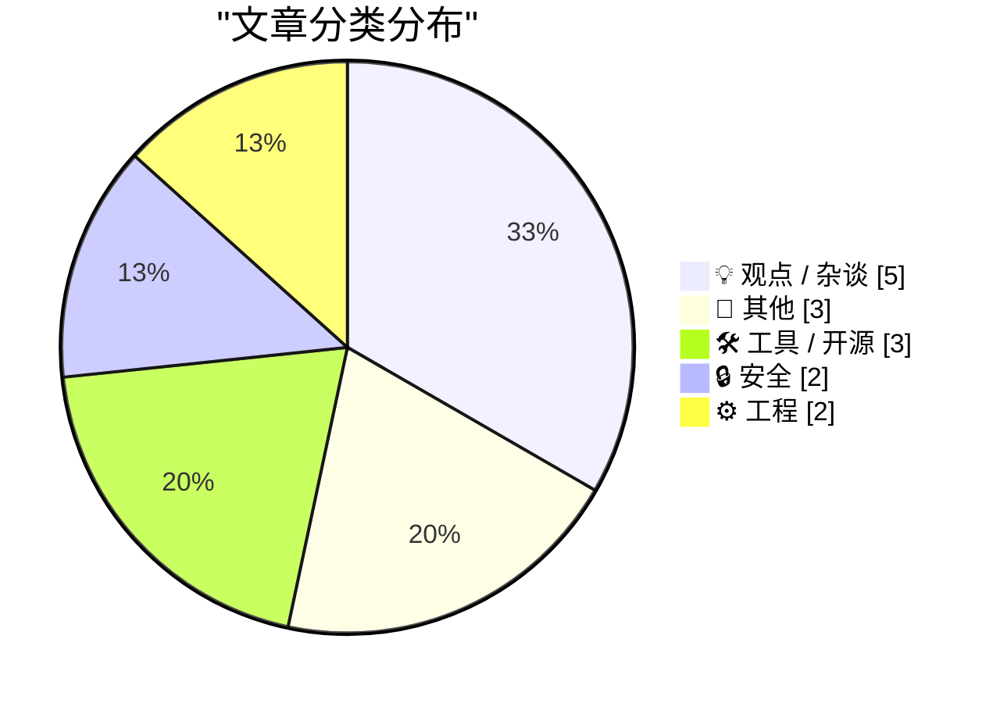
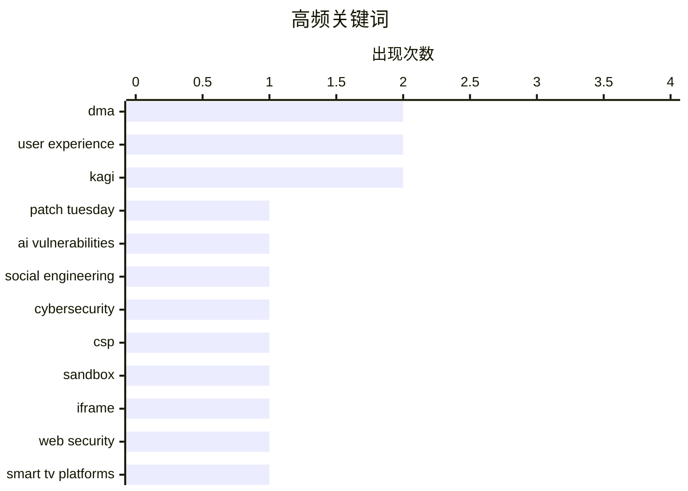

# 📰 AI 博客每日精选 — 2026-05-14

> 来自 Karpathy 推荐的 92 个顶级技术博客，AI 精选 Top 15

## 📝 今日看点

今日技术圈聚焦三大趋势：AI在网络安全领域展现强大漏洞挖掘能力，主流厂商同步修复创纪录数量的安全补丁；欧盟持续推进数字市场改革，拟将智能电视平台纳入DMA监管，进一步限制科技巨头垄断。与此同时，业界对AI应用泡沫保持理性审视，多位专家批评过度炒作“AI代理数量”等空洞指标，强调务实创新与真实价值创造。

---

## 🏆 今日必读

🥇 **2026年5月补丁星期二：AI平台在漏洞挖掘方面表现出色**

[Patch Tuesday, May 2026 Edition](https://krebsonsecurity.com/2026/05/patch-tuesday-may-2026-edition/) — krebsonsecurity.com · 21 小时前 · 🔒 安全

> 人工智能平台虽然可能像人类一样容易受到社会工程攻击，但在发现人为编写的计算机代码中的安全漏洞方面却表现出色。本月，苹果、谷歌、微软、Mozilla 和甲骨文等主流软件厂商正在修复创纪录数量的安全漏洞，或加快补丁发布节奏。这表明 AI 辅助的漏洞检测正在显著提升软件供应链的安全性。

💡 **为什么值得读**: 揭示了AI在网络安全领域的双重角色——既是潜在威胁也是强大防御工具，尤其值得关注其如何改变传统漏洞管理流程。

🏷️ Patch Tuesday, AI vulnerabilities, social engineering, cybersecurity

🥈 **CSP白名单实验：通过iframe沙箱实现动态内容加载控制**

[CSP Allow-list Experiment](https://simonwillison.net/2026/May/13/csp-allow/#atom-everything) — simonwillison.net · 14 小时前 · 🔒 安全

> 该实验展示了一种在受 CSP 保护的限制性 iframe 中运行应用的新方法，通过自定义 fetch() 拦截 CSP 错误并上报至父窗口。用户可在确认后将被阻止域名加入允许列表，系统随后刷新页面以解除限制。此方案为跨域资源加载提供了灵活且安全的用户可控机制。

💡 **为什么值得读**: 为解决现代 Web 应用中 CSP 策略过于严格导致的功能受限问题提供了创新思路，兼具安全性与用户体验。

🏷️ CSP, sandbox, iframe, web security

🥉 **欧洲广播商呼吁欧盟将智能电视平台纳入DMA监管范围**

[Broadcasters Urge EU to Use the DMA to Go After Smart TV Platforms, None of Which Are From European Companies](https://www.reuters.com/sustainability/boards-policy-regulation/eu-digital-rules-should-apply-big-techs-smart-tvs-broadcasters-tell-antitrust-2026-03-23/) — daringfireball.net · 23 小时前 · 📝 其他

> 由 Canal+、RTL、Mediaset、ITV、Paramount+ 等组成的欧洲商业电视协会（ACT）敦促欧盟反垄断负责人 Teresa Ribera 将 Google、Amazon、Apple 和 Samsung 的智能电视及虚拟助手纳入《数字市场法案》（DMA）监管。这些平台虽非欧洲公司所创，但凭借巨大市场份额正形成垄断风险。

💡 **为什么值得读**: 反映了全球科技巨头如何通过硬件生态扩张影响媒体行业格局，凸显欧盟试图用法规平衡跨国企业权力的努力。

🏷️ DMA, smart TV platforms, EU antitrust

---

## 📊 数据概览

| 扫描源 | 抓取文章 | 时间范围 | 精选 |
|:---:|:---:|:---:|:---:|
| 84/92 | 2455 篇 → 23 篇 | 24h | **15 篇** |

### 分类分布



### 高频关键词



<details>
<summary>📈 纯文本关键词图（终端友好）</summary>

```
dma                │ ████████████████████ 2
user experience    │ ████████████████████ 2
kagi               │ ████████████████████ 2
patch tuesday      │ ██████████░░░░░░░░░░ 1
ai vulnerabilities │ ██████████░░░░░░░░░░ 1
social engineering │ ██████████░░░░░░░░░░ 1
cybersecurity      │ ██████████░░░░░░░░░░ 1
csp                │ ██████████░░░░░░░░░░ 1
sandbox            │ ██████████░░░░░░░░░░ 1
iframe             │ ██████████░░░░░░░░░░ 1
```

</details>

### 🏷️ 话题标签

**dma**(2) · **user experience**(2) · **kagi**(2) · patch tuesday(1) · ai vulnerabilities(1) · social engineering(1) · cybersecurity(1) · csp(1) · sandbox(1) · iframe(1) · web security(1) · smart tv platforms(1) · eu antitrust(1) · datasette(1) · release(1) · token restrictions(1) · api(1) · eu regulations(1) · tech policy(1) · ui design(1)

---

## 💡 观点 / 杂谈

### 1. Boris Mann 谈 AI 代理数量的意义：不如浏览器标签页实在

[Quoting Boris Mann](https://simonwillison.net/2026/May/13/boris-mann/#atom-everything) — **simonwillison.net** · 2 小时前 · ⭐ 21/30

> Boris Mann 指出，声称拥有“11个 AI 代理”并无实质意义，就像说“我有 11 个电子表格”或“11 个浏览器标签页”一样空洞。他强调应关注具体任务而非抽象计数。

🏷️ AI agents, productivity, critique

---

### 2. 技术决策者动机分析：规避风险而非创新引领

[Quoting Mitchell Hashimoto](https://simonwillison.net/2026/May/12/mitchell-hashimoto/#atom-everything) — **simonwillison.net** · 20 小时前 · ⭐ 21/30

> Mitchell Hashimoto 观察到，90% 的技术决策者（TDMs）主要动机是避免被解雇，而非推动技术创新。他们遵循 Gartner 等分析师的趋势建议，迎合公众舆论，例如盲目采纳所谓‘AI战略’。

🏷️ Technical Decision Makers, risk aversion, career survival

---

### 3. 亿万富翁的唯我主义、独裁者的唯我主义、人工智能与法西斯范式

[Pluralistic: Billionaire solipsism, dictator solipsism, AI, and the fascist paradigm (13 May 2026)](https://pluralistic.net/2026/05/13/vibe-governance/) — **pluralistic.net** · 3 小时前 · ⭐ 21/30

> 文章探讨了亿万富翁和独裁者在AI驱动下的极端自我中心倾向，提出AGI（通用人工智能）在‘K-hole’状态下表现最佳，暗示其脱离现实约束的能力。作者指出，这种技术乌托邦主义正被用于巩固权力结构，形成一种新型法西斯治理模式，即通过算法控制信息流与社会行为。文章引用多个案例，包括寡头收购佛罗里达州立大学、两党金主联合操控政治等，揭示资本与权力如何借AI之名实现更隐蔽的控制。核心观点是：当前AI发展路径正滑向技术威权主义，需警惕其对社会民主的侵蚀。

🏷️ AI, fascism, oligarchy

---

### 4. 认真试试 Kagi 吧

[Seriously, Give Kagi a Try](https://daringfireball.net/2025/04/try_switching_to_kagi) — **daringfireball.net** · 22 小时前 · ⭐ 19/30

> 作者强烈推荐使用Kagi搜索引擎，认为即使启用Google的&udm=14参数以获取去广告化结果，Kagi仍能提供更高准确率的搜索结果。尤其当目标为特定旧文章时，Kagi的召回率和排序精度远超Google和DuckDuckGo。作者指出，主流搜索引擎已普遍丧失对历史内容的高效检索能力，而Kagi凭借其先进的语义索引和个性化排序算法，在此类场景下优势明显。

🏷️ Kagi, search engine, Google alternative, user experience

---

### 5. 引用 Mo Bitar 的话：“Ralph Loop”或将改变一切

[Quoting Mo Bitar](https://simonwillison.net/2026/May/12/mo-bitar/#atom-everything) — **simonwillison.net** · 20 小时前 · ⭐ 18/30

> Mo Bitar 在 TikTok 上提出一个内部术语“Ralph Loop”，意指CEO若从未听过此概念，则公司将在30天内迎来重大变革。他建议员工主动提出该构想，并承诺投入18,000美元API额度来演示其潜力，以此测试领导层的认知敏感度。这一策略反映了初创企业中信息不对称与权力博弈的现实，也揭示了技术话语权争夺的新战场。

🏷️ CEO, Ralph Loop, experimentation, management

---

## 📝 其他

### 6. 欧洲广播商呼吁欧盟将智能电视平台纳入DMA监管范围

[Broadcasters Urge EU to Use the DMA to Go After Smart TV Platforms, None of Which Are From European Companies](https://www.reuters.com/sustainability/boards-policy-regulation/eu-digital-rules-should-apply-big-techs-smart-tvs-broadcasters-tell-antitrust-2026-03-23/) — **daringfireball.net** · 23 小时前 · ⭐ 25/30

> 由 Canal+、RTL、Mediaset、ITV、Paramount+ 等组成的欧洲商业电视协会（ACT）敦促欧盟反垄断负责人 Teresa Ribera 将 Google、Amazon、Apple 和 Samsung 的智能电视及虚拟助手纳入《数字市场法案》（DMA）监管。这些平台虽非欧洲公司所创，但凭借巨大市场份额正形成垄断风险。

🏷️ DMA, smart TV platforms, EU antitrust

---

### 7. Teresa Ribera：欧盟数字规则是成功典范，正重塑数字经济格局

[Teresa Ribera Visited the U.S. and No One Noticed](https://www.politico.eu/article/eu-big-tech-rulebook-shifting-digital-economy-ribera-dma-pulse-forum/) — **daringfireball.net** · 23 小时前 · ⭐ 23/30

> 欧盟竞争事务专员 Teresa Ribera 表示，《数字市场法案》（DMA）已成为“成功故事”，正在为硅谷巨头与欧洲本土数字竞争对手创造更公平的竞争环境。她透露布鲁塞尔即将启动 DMA 正式审查，评估成效并探索进一步改革方向。

🏷️ EU regulations, DMA, tech policy

---

### 8. 太空数据中心无冷却难题？SpaceX 与 AI 结合的新奇构想

[AI datacenters in space do not have a cooling problem](https://seangoedecke.com/space-ai-datacenters-do-not-have-a-cooling-problem/) — **seangoedecke.com** · 19 小时前 · ⭐ 21/30

> 尽管马斯克高调宣传在太空建立 AI 数据中心可解决散热问题，但作者质疑其可行性。他指出太空虽无需传统冷却系统，却面临辐射、微流星体撞击和轨道碎片等致命风险，且发射成本极高，未必优于地面液冷方案。

🏷️ space data centers, cooling, Elon Musk, AI infrastructure

---

## 🛠 工具 / 开源

### 9. Datasette 1.0a29 发布：新增 TokenRestrictions.abbreviated() 方法及表格显示优化

[datasette 1.0a29](https://simonwillison.net/2026/May/12/datasette/#atom-everything) — **simonwillison.net** · 19 小时前 · ⭐ 24/30

> Datasette 1.0a29 版本引入了新的 TokenRestrictions.abbreviated(datasette) 实用方法，用于生成简写形式的 '_r' 字典，简化了令牌处理逻辑。同时改进了表格头部和列选项的可见性，即使在大数据表中也保持清晰可读。

🏷️ datasette, release, token restrictions, API

---

### 10. Kagi Snaps 功能详解：精准站内搜索与 Bangs 重定向机制

[Kagi Snaps](https://help.kagi.com/kagi/features/snaps.html) — **daringfireball.net** · 22 小时前 · ⭐ 21/30

> Kagi 搜索引擎推出 Snaps 功能，使用 `@r headphones` 可限定搜索结果仅来自 Reddit（r 为 Reddit 短码），等效于 `headphones site:reddit.com`。其姊妹功能 Bangs 则通过 `!r headphones` 直接跳转至 Reddit 站内搜索，提升特定平台查询效率。

🏷️ Kagi, search, site-specific search, @r syntax

---

### 11. 展示我们的工作：econyste.ms Python 基金独立基准测试

[Showing Our Work](https://nesbitt.io/2026/05/13/showing-our-work.html) — **nesbitt.io** · 9 小时前 · ⭐ 19/30

> 本文发布了一项针对 ecosyste.ms Python 基金项目的独立基准测试结果。测试涵盖代码质量、依赖管理、安全合规性及性能效率等多个维度，采用自动化工具链进行量化评估。结果显示该项目在依赖更新及时性和漏洞修复速度方面表现优异，但在文档完整性与CI/CD集成度上仍有改进空间。数据公开透明，旨在推动开源资助机制的标准化。

🏷️ benchmark, ecosyste.ms, Python

---

## 🔒 安全

### 12. 2026年5月补丁星期二：AI平台在漏洞挖掘方面表现出色

[Patch Tuesday, May 2026 Edition](https://krebsonsecurity.com/2026/05/patch-tuesday-may-2026-edition/) — **krebsonsecurity.com** · 21 小时前 · ⭐ 27/30

> 人工智能平台虽然可能像人类一样容易受到社会工程攻击，但在发现人为编写的计算机代码中的安全漏洞方面却表现出色。本月，苹果、谷歌、微软、Mozilla 和甲骨文等主流软件厂商正在修复创纪录数量的安全漏洞，或加快补丁发布节奏。这表明 AI 辅助的漏洞检测正在显著提升软件供应链的安全性。

🏷️ Patch Tuesday, AI vulnerabilities, social engineering, cybersecurity

---

### 13. CSP白名单实验：通过iframe沙箱实现动态内容加载控制

[CSP Allow-list Experiment](https://simonwillison.net/2026/May/13/csp-allow/#atom-everything) — **simonwillison.net** · 14 小时前 · ⭐ 25/30

> 该实验展示了一种在受 CSP 保护的限制性 iframe 中运行应用的新方法，通过自定义 fetch() 拦截 CSP 错误并上报至父窗口。用户可在确认后将被阻止域名加入允许列表，系统随后刷新页面以解除限制。此方案为跨域资源加载提供了灵活且安全的用户可控机制。

🏷️ CSP, sandbox, iframe, web security

---

## ⚙️ 工程

### 14. 理想化失败：UI设计中未预见故障的真实代价

[Ideal failures](https://danieldelaney.net/ideal-failures/) — **danieldelaney.net** · 19 小时前 · ⭐ 22/30

> 作者反思过去设计 UI 时仅依赖纸面草图或 Figma 原型，专注于设想已知失败模式并设计优雅恢复路径的做法存在局限。实际用户在使用 LanWhisper 语音听写 App 时触发了未预见的故障，如 AI 转录模型产生幻觉输出，暴露了脱离真实场景设计的脆弱性。

🏷️ UI design, failure modes, user experience

---

### 15. 用户切换键盘布局时程序卡死的案例分析

[The case of the hang when the user changed keyboard layouts](https://devblogs.microsoft.com/oldnewthing/20260513-00/?p=112318) — **devblogs.microsoft.com/oldnewthing** · 5 小时前 · ⭐ 21/30

> 该文分析了Windows系统中当用户动态切换键盘布局时导致应用程序挂起的问题。根本原因在于某些UI线程未正确处理WM_INPUTLANGCHANGE消息，阻塞了主消息循环。微软工程师通过添加异步处理机制并确保所有输入相关操作在独立线程中执行，成功解决了此问题。修复后系统响应性显著提升，尤其在多语言环境下表现稳定。此案例强调了GUI编程中对系统消息处理一致性的重要性。

🏷️ keyboard layout, hang, Windows

---

*生成于 2026-05-14 03:09 (Asia/Shanghai) | 扫描 84 源 → 获取 2455 篇 → 精选 15 篇*
*基于 [Hacker News Popularity Contest 2025](https://refactoringenglish.com/tools/hn-popularity/) RSS 源列表，由 [Andrej Karpathy](https://x.com/karpathy) 推荐*
*由「懂点儿AI」制作，欢迎关注同名微信公众号获取更多 AI 实用技巧 💡*
