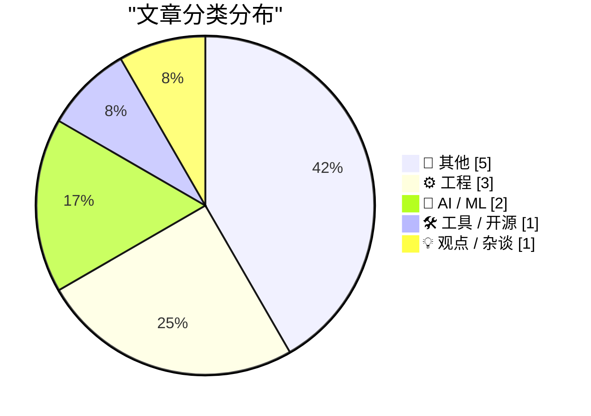
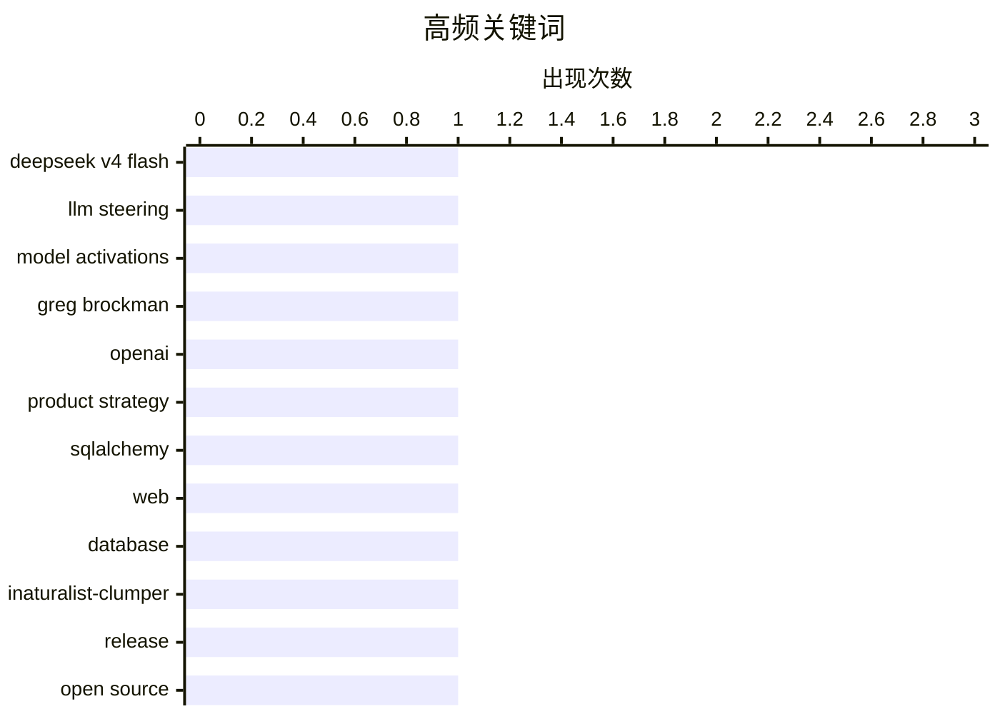

# 📰 AI 博客每日精选 — 2026-05-17

> 来自 Karpathy 推荐的 92 个顶级技术博客，AI 精选 Top 12

## 📝 今日看点

今日技术圈聚焦三大趋势：AI 模型控制方法创新受关注，DeepSeek 提出转向向量技术以精准引导 LLM 输出；OpenAI 重组产品战略，Greg Brockman 全面接管产品方向，凸显大模型公司架构调整潮；开发者工具持续进化，从 SQLAlchemy 实战指南到 iNaturalist 自动化展示，再到 macOS 文件操作新交互设计，体现工程实践与用户体验并重。

---

## 🏆 今日必读

🥇 **DeepSeek-V4-Flash：LLM 转向控制重燃兴趣**

[DeepSeek-V4-Flash means LLM steering is interesting again](https://seangoedecke.com/steering-vectors/) — seangoedecke.com · 18 小时前 · 🤖 AI / ML

> 文章探讨了通过直接干预模型中间层激活值来“引导”大型语言模型（LLM）输出的技术，即“转向向量”方法。受 antirez 的 DwarfStar 4 项目启发，该项目基于 llama.cpp 实现，作者认为 DeepSeek V4 Flash 的发布使这一研究方向再次变得具有吸引力。尽管存在争议，但该方法展示了在不改变模型权重的情况下影响输出行为的潜力。作者强调，这种激活层面的操控为 LLM 提供了新的可控性路径。

💡 **为什么值得读**: 如果你对无需微调即可实时控制大模型输出的前沿技术感兴趣，这篇文章值得一看，它揭示了 DeepSeek V4 Flash 如何重新点燃了 LLM 转向研究的热潮。

🏷️ DeepSeek V4 Flash, LLM steering, model activations

🥈 **Greg Brockman 正式接管 OpenAI 产品战略**

[Greg Brockman Officially Takes Control of Products at OpenAI, a Very Stable Well-Run Company](https://www.wired.com/story/openai-reorg-greg-brockman-product/) — daringfireball.net · 16 小时前 · 🤖 AI / ML

> OpenAI 宣布重组公司结构，旨在统一其产品战略。联合创始人兼总裁 Greg Brockman 将全面负责公司的产品策略，同时继续领导 AI 基础设施建设工作。此前他已在 Fidji Simo（AGI 部署 CEO）医疗休假期间临时接管产品事务。此次调整标志着 OpenAI 在组织架构上的重大变动。

💡 **为什么值得读**: 了解 OpenAI 内部权力结构的重大调整，以及其对未来产品开发方向可能产生的影响。

🏷️ Greg Brockman, OpenAI, product strategy

🥉 **SQLAlchemy 2 实战：第八章——SQLAlchemy 与 Web 应用**

[SQLAlchemy 2 In Practice - Chapter 8: SQLAlchemy and the Web](https://blog.miguelgrinberg.com/post/sqlalchemy-2-in-practice---chapter-8-sqlalchemy-and-the-web) — miguelgrinberg.com · 4 小时前 · ⚙️ 工程

> 这是 Miguel Grinberg 所著《SQLAlchemy 2 实战》系列的最后一章，聚焦于 SQLAlchemy 在现代 Web 开发中的应用。书中涵盖传统 Web 应用和 API 的设计模式，重点讲解如何利用 SQLAlchemy 2 的声明式模型和 ORM 功能构建高效、可维护的后端服务。作者鼓励读者购买此书以支持其持续创作。

💡 **为什么值得读**: 想深入学习 SQLAlchemy 2 在生产环境中的实际应用？这本实战指南提供了详尽的代码示例和设计思路。

🏷️ SQLAlchemy, web, database

---

## 📊 数据概览

| 扫描源 | 抓取文章 | 时间范围 | 精选 |
|:---:|:---:|:---:|:---:|
| 82/92 | 2429 篇 → 12 篇 | 24h | **12 篇** |

### 分类分布



### 高频关键词



<details>
<summary>📈 纯文本关键词图（终端友好）</summary>

```
deepseek v4 flash   │ ████████████████████ 1
llm steering        │ ████████████████████ 1
model activations   │ ████████████████████ 1
greg brockman       │ ████████████████████ 1
openai              │ ████████████████████ 1
product strategy    │ ████████████████████ 1
sqlalchemy          │ ████████████████████ 1
web                 │ ████████████████████ 1
database            │ ████████████████████ 1
inaturalist-clumper │ ████████████████████ 1
```

</details>

### 🏷️ 话题标签

**deepseek v4 flash**(1) · **llm steering**(1) · **model activations**(1) · greg brockman(1) · openai(1) · product strategy(1) · sqlalchemy(1) · web(1) · database(1) · inaturalist-clumper(1) · release(1) · open source(1) · css(1) · tailwind(1) · web development(1) · dropover(1) · macos utility(1) · user interface(1) · trump(1) · american empire(1)

---

## 📝 其他

### 1. 建筑物理阅读清单（2026年5月16日）

[Reading List 05/16/26](https://www.construction-physics.com/p/reading-list-051626) — **construction-physics.com** · 6 小时前 · ⭐ 17/30

> 本期阅读清单涵盖多个热点话题：东京低成本住房与高地价矛盾现象；参议院住房法案引发的众议院回应；阿拉巴马州水坝附近的简易爆炸装置事件；Fervo 能源公司即将上市；以及其他建筑与基础设施领域的最新动态。

🏷️ housing crisis, IED, Fervo IPO

---

### 2. 播客访谈：‘一个反社会人格的父亲’

[The Talk Show: ‘A Sociopathic Father’](https://daringfireball.net/thetalkshow/2026/05/15/ep-447) — **daringfireball.net** · 16 小时前 · ⭐ 15/30

> Adam Lisagor 重返播客节目，讨论其新推出的虚拟摄像应用 Hovercraft，以及如何使用 AI 编程工具进行开发。此外，他还分享了喜爱的一种日式讽刺饼干——‘ spite sandwich cookies’，为严肃话题增添轻松元素。

🏷️ AI coding tools, app development, entrepreneurship

---

### 3. 铝 OS：谷歌‘PC 版 Android’操作系统代号曝光

[Aluminium OS: Google’s ‘Android for PC’ OS for Googlebooks](https://aluminium-os.com/) — **daringfireball.net** · 23 小时前 · ⭐ 14/30

> 此前报道的‘铝 OS’实为谷歌内部代号，并非正式产品名称。尽管官网 aluminium-os.com 声称其为官方平台，但页面底部小字注明此非官方信息。谷歌曾声明该名称仅为代号，此次曝光引发对其真实意图的猜测。

🏷️ Aluminium OS, Google, Android for PC

---

### 4. 五分钟的黄金时间

[Five Minutes of Prime Time](https://susam.net/five-minutes-of-prime-time.html) — **susam.net** · 18 小时前 · ⭐ 10/30

> 文章回顾了作者在2008年加入RSA公司时的趣事，当时公司内部流行讨论素数、组合数学和概率论等硬核话题。作者分享了一个关于寻找大素数的个人经历，展示了早期互联网时代程序员对数学的热情。虽然故事本身看似随意，但它反映了技术社区中那种纯粹追求知识乐趣的文化氛围。这种文化至今仍影响着许多工程师和技术爱好者。

🏷️ RSA, history, security

---

### 5. 肆意破坏CBS财产

[Wanton Destruction of CBS Property](https://www.youtube.com/watch?v=eBKWKu2Rqxc) — **daringfireball.net** · 21 小时前 · ⭐ 6/30

> 该视频标题暗示了对CBS资产的故意破坏行为，配文“晚安，好运，混蛋们”带有挑衅意味。从标题和语气判断，这可能是一次有预谋的恶作剧或抗议行动。虽然具体内容未详述，但结合YouTube平台特性，这很可能是一个讽刺性或政治性的网络迷因视频。

🏷️ CBS, property destruction, satire

---

## ⚙️ 工程

### 6. SQLAlchemy 2 实战：第八章——SQLAlchemy 与 Web 应用

[SQLAlchemy 2 In Practice - Chapter 8: SQLAlchemy and the Web](https://blog.miguelgrinberg.com/post/sqlalchemy-2-in-practice---chapter-8-sqlalchemy-and-the-web) — **miguelgrinberg.com** · 4 小时前 · ⭐ 21/30

> 这是 Miguel Grinberg 所著《SQLAlchemy 2 实战》系列的最后一章，聚焦于 SQLAlchemy 在现代 Web 开发中的应用。书中涵盖传统 Web 应用和 API 的设计模式，重点讲解如何利用 SQLAlchemy 2 的声明式模型和 ORM 功能构建高效、可维护的后端服务。作者鼓励读者购买此书以支持其持续创作。

🏷️ SQLAlchemy, web, database

---

### 7. Julia Evans：十年经验教会我认真对待 CSS

[Quoting Julia Evans](https://simonwillison.net/2026/May/16/julia-evans/#atom-everything) — **simonwillison.net** · 1 小时前 · ⭐ 18/30

> Julia Evans 分享了她过去十年间对 CSS 态度的转变：从认为‘CSS 很难’到真正欣赏并尊重这门技术。她指出许多曾被抱怨的问题（如居中布局）其实已有成熟解决方案，关键在于深入学习和掌握现代 CSS 特性。她的经历表明，正视而非回避技术挑战能极大提升开发体验。

🏷️ CSS, Tailwind, web development

---

### 8. Dropover：利用鼠标晃动触发 Mac 文件快速操作面板

[Dropover, a Mac Shelf Utility That Makes Clever Use of Mouse Shaking](https://dropoverapp.com/) — **daringfireball.net** · 22 小时前 · ⭐ 18/30

> Dropover 是一款 macOS 实用工具，允许用户在拖拽文件时通过晃动鼠标触发一个浮动操作面板（drop shelf），从而快速执行复制、移动或分享等操作。这一设计巧妙利用了鼠标晃动这一手势，与 macOS 原生的大光标提示功能形成互补，提升了桌面文件管理的效率。

🏷️ Dropover, macOS utility, user interface

---

## 🤖 AI / ML

### 9. DeepSeek-V4-Flash：LLM 转向控制重燃兴趣

[DeepSeek-V4-Flash means LLM steering is interesting again](https://seangoedecke.com/steering-vectors/) — **seangoedecke.com** · 18 小时前 · ⭐ 26/30

> 文章探讨了通过直接干预模型中间层激活值来“引导”大型语言模型（LLM）输出的技术，即“转向向量”方法。受 antirez 的 DwarfStar 4 项目启发，该项目基于 llama.cpp 实现，作者认为 DeepSeek V4 Flash 的发布使这一研究方向再次变得具有吸引力。尽管存在争议，但该方法展示了在不改变模型权重的情况下影响输出行为的潜力。作者强调，这种激活层面的操控为 LLM 提供了新的可控性路径。

🏷️ DeepSeek V4 Flash, LLM steering, model activations

---

### 10. Greg Brockman 正式接管 OpenAI 产品战略

[Greg Brockman Officially Takes Control of Products at OpenAI, a Very Stable Well-Run Company](https://www.wired.com/story/openai-reorg-greg-brockman-product/) — **daringfireball.net** · 16 小时前 · ⭐ 24/30

> OpenAI 宣布重组公司结构，旨在统一其产品战略。联合创始人兼总裁 Greg Brockman 将全面负责公司的产品策略，同时继续领导 AI 基础设施建设工作。此前他已在 Fidji Simo（AGI 部署 CEO）医疗休假期间临时接管产品事务。此次调整标志着 OpenAI 在组织架构上的重大变动。

🏷️ Greg Brockman, OpenAI, product strategy

---

## 🛠 工具 / 开源

### 11. inaturalist-clumper 0.1 发布：自动化 iNaturalist 数据展示工具

[inaturalist-clumper 0.1](https://simonwillison.net/2026/May/15/inaturalist-clumper/#atom-everything) — **simonwillison.net** · 18 小时前 · ⭐ 19/30

> Simon Willison 发布了 inaturalist-clumper 0.1 版本，这是一个用于自动将其 iNaturalist 观测记录发布到个人博客的基础设施工具。该工具已在生产环境中运行数周，经过多次迭代优化后正式发布。用户可通过 GitHub 查看示例输出，了解如何将自然观察数据无缝集成至静态网站。

🏷️ inaturalist-clumper, release, open source

---

## 💡 观点 / 杂谈

### 12. 解读特朗普突然空中拆解美国帝国：权力不等于持久

[Pluralistic: Making sense of Trump's unscheduled sudden midair disassembly of the American empire (16 May 2026)](https://pluralistic.net/2026/05/16/technopoly/) — **pluralistic.net** · 9 小时前 · ⭐ 17/30

> 本文分析特朗普政府近期一系列非计划性政策变动，探讨其如何动摇美国全球霸权根基。作者警告不应混淆‘强大’与‘持久’，指出当前政治动荡暴露了制度脆弱性。文章还涉及版权法、执法视频传播、金融丑闻等多个议题，呼吁公众理性看待权力更迭。

🏷️ Trump, American empire, geopolitics

---

*生成于 2026-05-17 02:09 (Asia/Shanghai) | 扫描 82 源 → 获取 2429 篇 → 精选 12 篇*
*基于 [Hacker News Popularity Contest 2025](https://refactoringenglish.com/tools/hn-popularity/) RSS 源列表，由 [Andrej Karpathy](https://x.com/karpathy) 推荐*
*由「懂点儿AI」制作，欢迎关注同名微信公众号获取更多 AI 实用技巧 💡*
