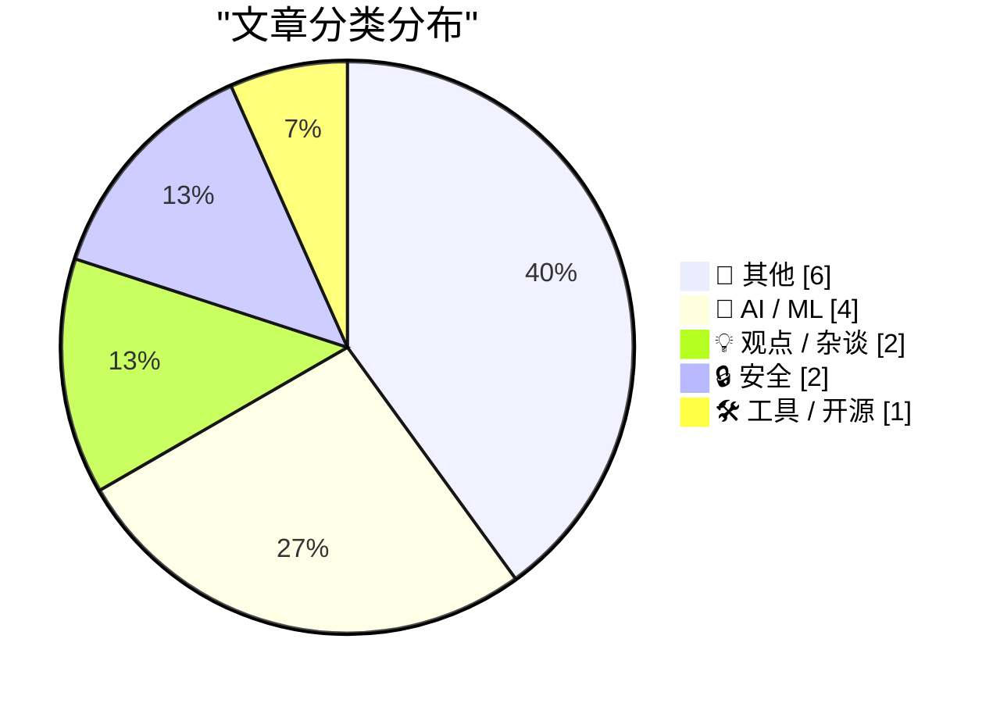
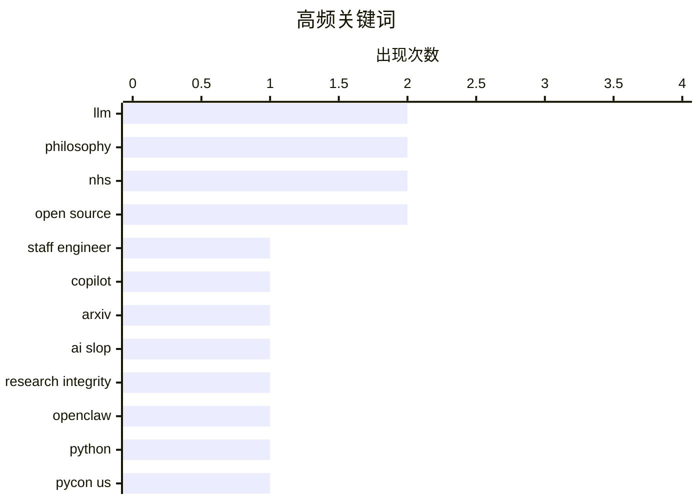

# 📰 AI 博客每日精选 — 2026-05-18

> 来自 Karpathy 推荐的 92 个顶级技术博客，AI 精选 Top 15

## 📝 今日看点

今日技术圈聚焦三大趋势：AI应用深化引发伦理与责任讨论，资深工程师加速整合LLM提升研发效率，同时学界对AI生成内容的学术诚信提出新规；开源生态面临挑战，英国政府内部罕见公开反对NHS退出开源项目，凸显公共部门对开放标准的立场分歧；平台治理争议持续发酵，Reddit强制用户下载App遭批损害开放性，Meta则因纵容诈骗广告被起诉获利70亿美元，反映科技公司在商业利益与用户安全间的深层矛盾。

---

## 🏆 今日必读

🥇 **2026年我作为资深工程师如何使用LLM**

[How I use LLMs as a staff engineer in 2026](https://seangoedecke.com/how-i-use-llms-in-2026/) — seangoedecke.com · 18 小时前 · 🤖 AI / ML

> 文章探讨了资深工程师在2026年如何利用大型语言模型（LLMs）提升工作效率。作者主要使用Copilot进行智能代码补全，在熟悉度低的领域实施经过专家审核的小型战术性修改，并大量编写一次性研究代码。此外，他频繁向LLM提问以快速学习新主题如Unity游戏引擎，并将LLM作为最后的调试工具。作者强调所有AI生成内容均需人工复核，尤其涉及关键系统时。其核心观点是：LLM应被视为增强人类能力的工具而非替代者，合理使用可显著加速开发流程。

💡 **为什么值得读**: 它为技术领导者提供了真实、可操作的AI集成策略，展示了如何在保持质量控制的前提下高效利用LLM加速工程实践。

🏷️ LLM, staff engineer, Copilot

🥈 **ArXiv新规：若论文含AI生成不当内容将禁投一年**

[ArXiv to Ban Researchers for a Year if They Submit AI Slop](https://www.404media.co/new-arxiv-rules-ai-generated-papers-ban/) — daringfireball.net · 22 小时前 · 🤖 AI / ML

> ArXiv近日宣布新规，若提交的科研论文包含由生成式AI产生的 plagiarized、biased、错误或误导性内容且无作者责任声明，作者将被禁止投稿一年。该政策针对的是未明确标注AI使用情况或放任AI输出低质内容的学术行为。此举旨在维护学术诚信与内容可靠性，尤其防范AI生成的虚假引用和事实错误。新规反映了学术界对AI滥用的日益担忧，标志着开放科学平台开始强化内容治理机制。

💡 **为什么值得读**: 这一政策为研究人员敲响警钟，提醒他们在AI辅助写作时必须承担最终责任，避免因疏忽导致学术声誉受损。

🏷️ ArXiv, AI slop, research integrity

🥉 **OpenClaw项目命名历史考据**

[Warelay -> OpenClaw](https://simonwillison.net/2026/May/16/openclaw-names/#atom-everything) — simonwillison.net · 21 小时前 · 🛠 工具 / 开源

> Simon Willison 通过分析GitHub提交历史发现，自2025年11月首次提交以来，OpenClaw项目实际使用过超过40个不同名称。他利用自定义工具 first_line_history.py 提取了每个仓库初始提交的第一行信息，揭示了项目在早期阶段频繁更名的事实。这一现象暴露了开源社区中命名混乱的问题，也引发对项目身份一致性的思考。Willison 的研究方法展示了如何通过代码历史追溯软件演化轨迹。

💡 **为什么值得读**: 这项研究不仅有趣地揭示了开源项目的命名乱象，还为理解软件演化提供了实用的数据分析方法。

🏷️ OpenClaw, Python, PyCon US

---

## 📊 数据概览

| 扫描源 | 抓取文章 | 时间范围 | 精选 |
|:---:|:---:|:---:|:---:|
| 82/92 | 2415 篇 → 15 篇 | 24h | **15 篇** |

### 分类分布



### 高频关键词



<details>
<summary>📈 纯文本关键词图（终端友好）</summary>

```
llm                │ ████████████████████ 2
philosophy         │ ████████████████████ 2
nhs                │ ████████████████████ 2
open source        │ ████████████████████ 2
staff engineer     │ ██████████░░░░░░░░░░ 1
copilot            │ ██████████░░░░░░░░░░ 1
arxiv              │ ██████████░░░░░░░░░░ 1
ai slop            │ ██████████░░░░░░░░░░ 1
research integrity │ ██████████░░░░░░░░░░ 1
openclaw           │ ██████████░░░░░░░░░░ 1
```

</details>

### 🏷️ 话题标签

**llm**(2) · **philosophy**(2) · **nhs**(2) · open source(2) · staff engineer(1) · copilot(1) · arxiv(1) · ai slop(1) · research integrity(1) · openclaw(1) · python(1) · pycon us(1) · pretraining(1) · parallelism(1) · reddit(1) · mobile access(1) · app enforcement(1) · ai(1) · technology(1) · meta(1)

---

## 📝 其他

### 1. Reddit强制移动端用户下载App引发争议

[Reddit Is Blocking Some Users From Accessing Its Website From Mobile Devices](https://arstechnica.com/information-technology/2026/05/why-reddit-blocked-my-daily-visit-to-its-mobile-website/) — **daringfireball.net** · 20 小时前 · ⭐ 23/30

> Reddit近期在移动浏览器上部署全屏弹窗，强制要求用户下载官方App才能继续使用网站功能。该弹窗无法关闭或绕过，仅提供‘获取App’按钮，严重干扰了依赖移动网页访问的用户体验。此举被批评为牺牲开放性换取用户增长指标，损害了Web平台的互操作性原则。事件凸显了科技公司对用户选择权的控制倾向及其对去中心化网络生态的潜在威胁。

🏷️ Reddit, mobile access, app enforcement

---

### 2. 英国GDS就NHS退出开源表态：内部争议公开化

[GDS weighs in on the NHS's decision to retreat from Open Source](https://simonwillison.net/2026/May/17/gds-weighs-in/#atom-everything) — **simonwillison.net** · 2 小时前 · ⭐ 18/30

> 英国政府数字化服务（GDS）罕见就NHS关闭开源仓库的决定发表公开批评，称其决策‘缺乏深思熟虑’。GDS认为此举违背了公共部门倡导开放标准的承诺，损害了开发者社区的协作精神。此次内部异议公开化反映了英国公共IT治理中的理念冲突：安全优先 vs. 开放创新。事件凸显了政府机构在网络安全与开源生态之间的艰难平衡。

🏷️ NHS, open source, GDS

---

### 3. GDS就NHS退出开源发表 frosty 回应

[GDS weighs in on the NHS's decision to retreat from Open Source](https://shkspr.mobi/blog/2026/05/gds-weighs-in-on-the-nhss-decision-to-retreat-from-open-source/) — **shkspr.mobi** · 6 小时前 · ⭐ 18/30

> Terence Eden 描述GDS对NHS关闭开源仓库的回应如同‘没有饼干的会议’——表面礼貌实则冰冷疏离。尽管双方同属公务员体系，此类内部重大分歧公开化极为罕见，反映出对开放源代码原则的根本分歧。Eden 暗示NHS的决策可能源于对漏洞风险的过度反应，而GDS则坚持开放协作的价值。这一事件标志着英国公共IT政策走向更加分裂。

🏷️ NHS, open source, UK government

---

### 4. 间隔重复的适用性

[The Applicability of Spaced Repetition](https://borretti.me/article/the-applicability-of-spaced-repetition) — **borretti.me** · 18 小时前 · ⭐ 14/30

> 文章分析了间隔重复学习法在不同知识类型中的有效性差异。研究表明，对于事实性知识（如词汇、日期），间隔重复显著提升记忆保持率；但对于概念性理解（如数学原理、理论框架），其效果有限甚至可能适得其反。作者建议结合主动回忆与深度解释来强化概念掌握。关键发现是：学习方法需匹配知识本质，不能一概而论。结论是：优化学习策略应区分知识类型并采用混合方法。

🏷️ spaced repetition, learning, knowledge

---

### 5. 我的第一台电脑：Tomy Tutor与1983年家用计算机生态

[The Tomy Tutor and the state of 1983 home computers](https://oldvcr.blogspot.com/feeds/7725068542078818117/comments/default) — **oldvcr.blogspot.com** · 17 小时前 · ⭐ 11/30

> 作者回顾了自己1983年在七岁时获得的Tomy Tutor电脑，至今仍能完美运行。这款日本产的教育型计算机代表了当时家用电脑市场的边缘尝试，主打儿童编程教学。尽管性能远逊于同期Apple II或Commodore 64，但它在特定用户群体中有一定影响力。文章还简要对比了1983年主流家用电脑的技术规格与市场格局，揭示了早期PC生态的多样性与不均衡发展。

🏷️ Tomy Tutor, retro computing, history

---

### 6. 帝国的胜利：重读《星球大战》的反派魅力

[In the Empire's Defense](https://idiallo.com/blog/the-empire-won?src=feed) — **idiallo.com** · 6 小时前 · ⭐ 8/30

> 作者分享了自己虽未在首映时观看《星球大战》的经历，却仍被达斯·维达这一反派角色深深吸引。他认为维达的出场瞬间即奠定其不可战胜的气场，无需言语便传递出压迫感。文章分析电影如何通过视觉、音效与表演塑造反派权威，并探讨为何这类‘纯粹邪恶’的角色反而更具戏剧张力。最终指出：优秀的反派不是简单的坏人，而是能激发观众敬畏的存在。

🏷️ Star Wars, Darth Vader, nostalgia

---

## 🤖 AI / ML

### 7. 2026年我作为资深工程师如何使用LLM

[How I use LLMs as a staff engineer in 2026](https://seangoedecke.com/how-i-use-llms-in-2026/) — **seangoedecke.com** · 18 小时前 · ⭐ 25/30

> 文章探讨了资深工程师在2026年如何利用大型语言模型（LLMs）提升工作效率。作者主要使用Copilot进行智能代码补全，在熟悉度低的领域实施经过专家审核的小型战术性修改，并大量编写一次性研究代码。此外，他频繁向LLM提问以快速学习新主题如Unity游戏引擎，并将LLM作为最后的调试工具。作者强调所有AI生成内容均需人工复核，尤其涉及关键系统时。其核心观点是：LLM应被视为增强人类能力的工具而非替代者，合理使用可显著加速开发流程。

🏷️ LLM, staff engineer, Copilot

---

### 8. ArXiv新规：若论文含AI生成不当内容将禁投一年

[ArXiv to Ban Researchers for a Year if They Submit AI Slop](https://www.404media.co/new-arxiv-rules-ai-generated-papers-ban/) — **daringfireball.net** · 22 小时前 · ⭐ 25/30

> ArXiv近日宣布新规，若提交的科研论文包含由生成式AI产生的 plagiarized、biased、错误或误导性内容且无作者责任声明，作者将被禁止投稿一年。该政策针对的是未明确标注AI使用情况或放任AI输出低质内容的学术行为。此举旨在维护学术诚信与内容可靠性，尤其防范AI生成的虚假引用和事实错误。新规反映了学术界对AI滥用的日益担忧，标志着开放科学平台开始强化内容治理机制。

🏷️ ArXiv, AI slop, research integrity

---

### 9. 预训练并行化技术与失败训练运行的分析笔记

[Notes on pretraining parallelisms and failed training runs.](https://www.dwarkesh.com/p/notes-on-pretraining-parallelisms) — **dwarkesh.com** · 23 小时前 · ⭐ 24/30

> Dwarkesh Patel 深入分析了大规模模型预训练中的并行化策略及其在实际训练中的失效原因。他指出，尽管数据并行、模型并行和张量并行等技术能提升计算效率，但通信开销、负载不均衡和硬件限制常导致训练失败。作者结合多个失败案例总结出关键教训：合理的并行策略必须匹配具体模型架构与集群配置，否则反而会降低稳定性。这些经验对构建高可用训练基础设施具有重要参考价值。

🏷️ pretraining, parallelism, LLM

---

### 10. RLVR在科学验证方面可能存在系统性缺陷

[RLVR might be disproportionately bad at science](https://www.dwarkesh.com/p/rlvr-might-be-disproportionately) — **dwarkesh.com** · 23 小时前 · ⭐ 19/30

> Dwarkesh Patel 提出理论验证循环（RLVR）可能在科学推理中存在结构性弱点。他指出，即使经过数十年甚至数百年的检验，某些曾被认为是更优的理论实际上可能做出更差的预测。这种滞后性与偏差表明，依赖经验积累的传统科学验证机制在面对复杂系统时可能失效。作者警告，过度信任长期公认的‘真理’可能导致认知盲区，建议引入更多元化的验证范式。

🏷️ RLVR, verification, science

---

## 💡 观点 / 杂谈

### 11. AI是技术而非产品——重新定义人工智能的角色

[★ AI Is Technology, Not a Product](https://daringfireball.net/2026/05/ai_is_technology_not_a_product) — **daringfireball.net** · 21 小时前 · ⭐ 22/30

> John Gruber 在文章中明确指出，AI本质上是一种通用技术，不应被包装成独立产品或营销噱头。他认为当前许多‘AI驱动的产品’只是将传统软件功能贴上AI标签，并未真正体现技术的核心价值。作者主张应以技术视角看待AI，聚焦其底层能力而非表面应用。这一观点呼吁行业回归理性，重视AI的实际工程价值而非炒作概念。

🏷️ AI, technology, philosophy

---

### 12. 混淆智慧与权力的错误

[The mistake of conflating intelligence and power](https://www.dwarkesh.com/p/the-mistake-of-conflating-intelligence) — **dwarkesh.com** · 23 小时前 · ⭐ 15/30

> 文章探讨了将‘智慧’简单定义为‘在多种领域中实现目标的能力’所带来的误导性。作者指出，若以此标准衡量，斯大林可被视为历史上最聪明的人，但这显然违背了我们对‘智慧’的常规理解。核心论点是：真正的智慧应包含道德判断、同理心和对长期后果的考量，而非仅追求权力与控制。作者通过历史案例说明，忽视伦理的智慧可能导致灾难性后果。结论是：我们必须区分工具性能力与真正的人类智慧。

🏷️ intelligence, power, philosophy

---

## 🔒 安全

### 13. 圣克拉拉县起诉Meta纵容诈骗广告获利70亿美元

[Santa Clara County Sues Meta Over Alleged Scam Ads](https://sanjosespotlight.com/santa-clara-county-sues-meta-over-alleged-scam-ads/) — **daringfireball.net** · 20 小时前 · ⭐ 21/30

> 加州圣克拉拉县提起集体诉讼，指控Meta明知其平台充斥欺诈性广告却故意削弱反欺诈团队，导致虚假公司每年通过广告骗取用户钱财并从中获得约70亿美元收入。诉讼指出Meta为追求广告收益最大化而忽视用户安全，违反了虚假广告法。此案可能开创地方政府追究科技巨头助长网络诈骗的先例，推动更严格的内容监管立法。

🏷️ Meta, fraud ads, legal action

---

### 14. Drata：用自主AI代理自动化合规管理

[Drata](https://drata.com/daring) — **daringfireball.net** · 14 分钟前 · ⭐ 12/30

> 本文介绍Drata平台如何通过自主AI代理帮助企业实现合规自动化。该平台能持续监控内部与第三方风险，自动生成审计证据，并实时证明安全态势。相比传统手动合规流程，Drata可将审计准备时间减少80%以上。它支持SOC 2、ISO 27001等主流框架，适用于中大型企业。核心优势在于将被动响应转为主动预防，降低人为错误风险。作者强调这是未来企业安全运营的关键基础设施。

🏷️ Drata, compliance, AI agents

---

## 🛠 工具 / 开源

### 15. OpenClaw项目命名历史考据

[Warelay -> OpenClaw](https://simonwillison.net/2026/May/16/openclaw-names/#atom-everything) — **simonwillison.net** · 21 小时前 · ⭐ 24/30

> Simon Willison 通过分析GitHub提交历史发现，自2025年11月首次提交以来，OpenClaw项目实际使用过超过40个不同名称。他利用自定义工具 first_line_history.py 提取了每个仓库初始提交的第一行信息，揭示了项目在早期阶段频繁更名的事实。这一现象暴露了开源社区中命名混乱的问题，也引发对项目身份一致性的思考。Willison 的研究方法展示了如何通过代码历史追溯软件演化轨迹。

🏷️ OpenClaw, Python, PyCon US

---

*生成于 2026-05-18 02:13 (Asia/Shanghai) | 扫描 82 源 → 获取 2415 篇 → 精选 15 篇*
*基于 [Hacker News Popularity Contest 2025](https://refactoringenglish.com/tools/hn-popularity/) RSS 源列表，由 [Andrej Karpathy](https://x.com/karpathy) 推荐*
*由「懂点儿AI」制作，欢迎关注同名微信公众号获取更多 AI 实用技巧 💡*
