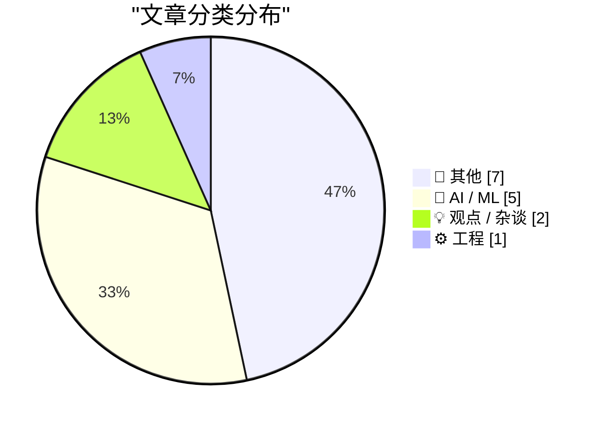
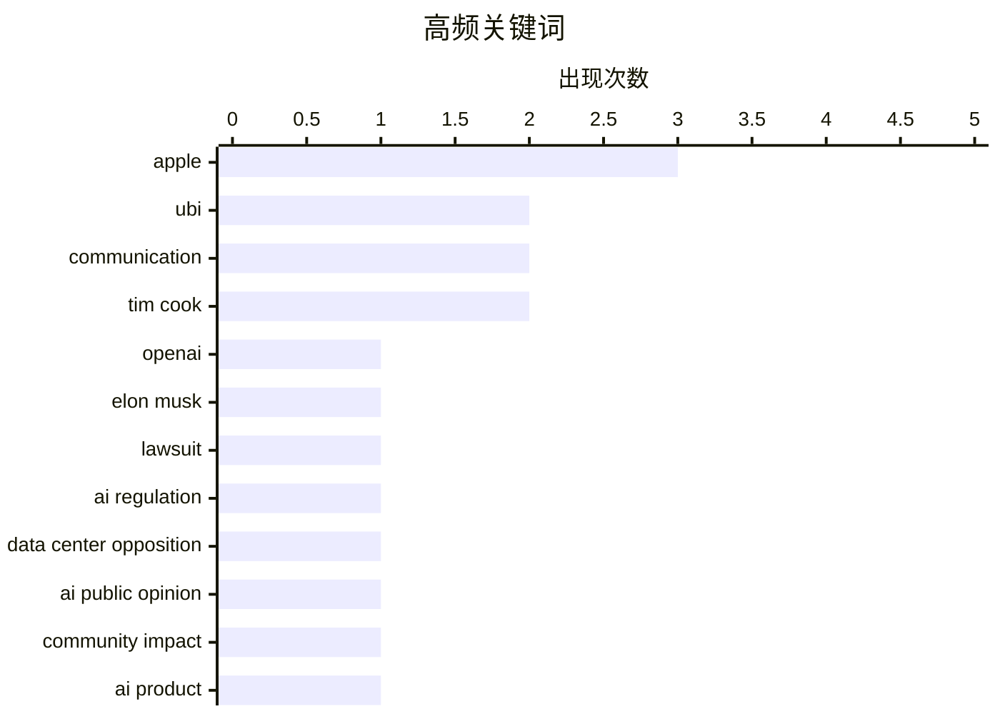

# 📰 AI 博客每日精选 — 2026-05-19

> 来自 Karpathy 推荐的 92 个顶级技术博客，AI 精选 Top 15

## 📝 今日看点

今日技术圈聚焦三大趋势：AI治理与公众信任成为焦点，从马斯克诉OpenAI案凸显法律争议，到民调显示71%民众反对建设AI数据中心，反映出社会对AI基础设施的深切忧虑；与此同时，AI代理将重塑人机交互方式，专家预测未来用户将与持续在线的AI直接对话，倒逼科技巨头加速布局杀手级产品；此外，行业正经历角色转型，“软件工程师”向“AI赋能工程师”演进，传统编程教育面临挑战，而企业盈利模式也显现分化——苹果虽未深度参与AI热潮，仍凭服务生态稳居四万亿美元市值。

---

## 🏆 今日必读

🥇 **陪审团一致裁定：马斯克对OpenAI和奥特曼的诉讼已过诉讼时效**

[Jury Rejects Elon Musk’s Claim Against Sam Altman in Unanimous Verdict](https://www.nytimes.com/live/2026/05/18/technology/openai-trial-verdict-altman-musk?unlocked_article_code=1.jVA.Cc2V.IwYuu2r4SJfQ) — daringfireball.net · 1 小时前 · 🤖 AI / ML

> 九人陪审团裁定，埃隆·马斯克在2024年夏季起诉OpenAI及其CEO萨姆·奥特曼的诉讼已超过三年诉讼时效。法院认定，马斯克早在2021年就已知晓其投诉中指控的行为，因此不具备起诉资格。这一 unanimous verdict 标志着这起备受关注的AI伦理与法律争议案以程序性驳回告终。

💡 **为什么值得读**: 此案揭示了科技巨头在AI治理中的法律边界问题，尤其凸显了诉讼时效对创新企业合规行为的潜在制约作用。

🏷️ OpenAI, Elon Musk, lawsuit, AI regulation

🥈 **AI数据中心广受政治光谱两端反对**

[AI Data Centers Are Deeply Unpopular, Across the Political Spectrum](https://news.gallup.com/poll/709772/americans-oppose-data-centers-area.aspx) — daringfireball.net · 4 小时前 · 🤖 AI / ML

> 盖洛普2026年3月调查显示，71%美国人反对在其社区建设AI数据中心，其中48%强烈反对；相比之下，仅25%表示支持，7%强烈支持。这一反对率远超同期对核电站的态度（53%反对建核电站），表明公众对集中式算力基础设施存在普遍担忧。

💡 **为什么值得读**: 该数据为政策制定者提供了关键民意依据，说明无论左右立场，民众普遍抵制本地大型科技设施落地。

🏷️ data center opposition, AI public opinion, community impact

🥉 **现有利益相关方将决定AI未来走向**

[Existing Stakeholders Have a Say in the Future](https://daringfireball.net/2026/05/ai_is_technology_not_a_product) — daringfireball.net · 2 小时前 · 🤖 AI / ML

> Steven Levy指出，到2030年用户不再通过手机App叫车，而是直接与持续在线的AI代理沟通，汽车会自动抵达接载。这种无缝体验要求苹果等公司必须打造杀手级AI产品，否则将被时代淘汰。John Ternus领导的团队面临战略抉择。

💡 **为什么值得读**: 这预示着人机交互范式的根本转变，传统平台经济模式正被智能体驱动的服务生态取代。

🏷️ AI product, Apple, John Ternus, UBI

---

## 📊 数据概览

| 扫描源 | 抓取文章 | 时间范围 | 精选 |
|:---:|:---:|:---:|:---:|
| 82/92 | 2431 篇 → 19 篇 | 24h | **15 篇** |

### 分类分布



### 高频关键词



<details>
<summary>📈 纯文本关键词图（终端友好）</summary>

```
apple                  │ ████████████████████ 3
ubi                    │ █████████████░░░░░░░ 2
communication          │ █████████████░░░░░░░ 2
tim cook               │ █████████████░░░░░░░ 2
openai                 │ ███████░░░░░░░░░░░░░ 1
elon musk              │ ███████░░░░░░░░░░░░░ 1
lawsuit                │ ███████░░░░░░░░░░░░░ 1
ai regulation          │ ███████░░░░░░░░░░░░░ 1
data center opposition │ ███████░░░░░░░░░░░░░ 1
ai public opinion      │ ███████░░░░░░░░░░░░░ 1
```

</details>

### 🏷️ 话题标签

**apple**(3) · **ubi**(2) · **communication**(2) · tim cook(2) · openai(1) · elon musk(1) · lawsuit(1) · ai regulation(1) · data center opposition(1) · ai public opinion(1) · community impact(1) · ai product(1) · john ternus(1) · senior engineer(1) · expertise(1) · ai risk(1) · public trust(1) · disaster(1) · ai(1) · product strategy(1)

---

## 📝 其他

### 1. 如何使用我的Index 01及生产更新

[How I Use My Index 01 + Production Update](https://repebble.com/blog/how-i-use-my-index-01-production-update) — **ericmigi.com** · 19 小时前 · ⭐ 15/30

> 作者分享了个人使用Index 01设备的实践案例，包括视频演示和功能设计哲学。尽管项目进度略有延迟，但整体仍在正轨上推进，体现了从原型到量产阶段的典型迭代过程。

---

### 2. 别再自称软件工程师，你现在是一名AI赋能工程师

[Don't call yourself a Software Engineer, you are an AI Enabled Engineer.](https://idiallo.com/blog/you-are-an-ai-enabled-engineer-now?src=feed) — **idiallo.com** · 7 小时前 · ⭐ 15/30

> 作者反思当代编程教育困境：大学课程仍教授传统编码技能，而职场已全面转向AI辅助开发。学生若不及时建立行业人脉，将难以应对AI重塑的就业市场。LinkedIn等平台虽非理想社交场域，却是现实求职的重要跳板。

---

### 3. 10Gb/s 以太网：为 10GBASE-T SFP+ 模块加装迷你散热片

[10Gb/s Ethernet: using mini-heatsinks with a 10GBASE-T SFP+ module](https://www.gilesthomas.com/2026/05/10g-ethernet-sfpplus-mini-heatsinks) — **gilesthomas.com** · -9 分钟前 · ⭐ 15/30

> 作者测试了在 MikroTik 10GBASE-T SFP+ 光模块上安装 VooGenzek 品牌迷你散热片以降低高温问题。实验显示，加装散热片后模块温度显著下降，有效改善了高负载下的稳定性。该方案成本低廉且易于实施，适合在消费级硬件中推广使用。

---

### 4. 永远在责备中提升代码理解能力

[Always Be Blaming](https://matklad.github.io/2026/05/18/always-be-blaming.html) — **matklad.github.io** · 19 小时前 · ⭐ 15/30

> 文章提出通过‘责备’（blaming）机制来增强对代码的理解力，建议开发者主动质疑和追溯代码行为背后的逻辑。作者强调将代码视为可问责的系统，有助于发现隐藏假设和设计缺陷。这种方法能提升调试效率和架构认知深度。

---

### 5. 如何在不抄袭的情况下获得灵感

[How to be inspired without copying](https://www.joanwestenberg.com/how-to-be-inspired-without-copying/) — **joanwestenberg.com** · 20 小时前 · ⭐ 15/30

> 以巴赫抄写维瓦尔第协奏曲为例，说明真正的灵感源于深度模仿与内化。作者指出，通过细致转录他人作品，艺术家能将外部技巧转化为自身表达方式，从而实现创造性转化而非简单复制。

---

### 6. Cyberrebate.com：史上最烂的互联网泡沫时代创意？

[Cyberrebate.com: The worst dotcom-era idea?](https://dfarq.homeip.net/cyberrebate-com-the-worst-dotcom-era-idea/?utm_source=rss&#038;utm_medium=rss&#038;utm_campaign=cyberrebate-com-the-worst-dotcom-era-idea) — **dfarq.homeip.net** · 8 小时前 · ⭐ 15/30

> 文章回顾了 dotcom 泡沫时期 Cyberrebate.com 这一荒诞商业模式——用户购买商品后可获返利，但实际通过强制安装间谍软件获利。作者认为这是 freemium 模式滥用与隐私侵犯的早期典型案例，警示现代科技创业中的伦理风险。

---

### 7. FediMeteo、HAProxy 与高效利用 snac 线程的艺术

[FediMeteo, HAProxy, and the art of not wasting snac threads](https://it-notes.dragas.net/2026/05/18/fedimeteo-haproxy-and-the-art-of-not-wasting-snac-threads/) — **it-notes.dragas.net** · 9 小时前 · ⭐ 15/30

> 作者分享了 FediMeteo 项目如何通过 HAProxy 优化 SNAC（Synchronous Network Access Control）线程使用，避免资源浪费。通过合理配置连接池与负载均衡策略，系统在数千并发请求下仍保持稳定运行。

---

## 🤖 AI / ML

### 8. 陪审团一致裁定：马斯克对OpenAI和奥特曼的诉讼已过诉讼时效

[Jury Rejects Elon Musk’s Claim Against Sam Altman in Unanimous Verdict](https://www.nytimes.com/live/2026/05/18/technology/openai-trial-verdict-altman-musk?unlocked_article_code=1.jVA.Cc2V.IwYuu2r4SJfQ) — **daringfireball.net** · 1 小时前 · ⭐ 26/30

> 九人陪审团裁定，埃隆·马斯克在2024年夏季起诉OpenAI及其CEO萨姆·奥特曼的诉讼已超过三年诉讼时效。法院认定，马斯克早在2021年就已知晓其投诉中指控的行为，因此不具备起诉资格。这一 unanimous verdict 标志着这起备受关注的AI伦理与法律争议案以程序性驳回告终。

🏷️ OpenAI, Elon Musk, lawsuit, AI regulation

---

### 9. AI数据中心广受政治光谱两端反对

[AI Data Centers Are Deeply Unpopular, Across the Political Spectrum](https://news.gallup.com/poll/709772/americans-oppose-data-centers-area.aspx) — **daringfireball.net** · 4 小时前 · ⭐ 25/30

> 盖洛普2026年3月调查显示，71%美国人反对在其社区建设AI数据中心，其中48%强烈反对；相比之下，仅25%表示支持，7%强烈支持。这一反对率远超同期对核电站的态度（53%反对建核电站），表明公众对集中式算力基础设施存在普遍担忧。

🏷️ data center opposition, AI public opinion, community impact

---

### 10. 现有利益相关方将决定AI未来走向

[Existing Stakeholders Have a Say in the Future](https://daringfireball.net/2026/05/ai_is_technology_not_a_product) — **daringfireball.net** · 2 小时前 · ⭐ 24/30

> Steven Levy指出，到2030年用户不再通过手机App叫车，而是直接与持续在线的AI代理沟通，汽车会自动抵达接载。这种无缝体验要求苹果等公司必须打造杀手级AI产品，否则将被时代淘汰。John Ternus领导的团队面临战略抉择。

🏷️ AI product, Apple, John Ternus, UBI

---

### 11. AI与人类信任危机：曼哈顿博士综合征启示录

[‘AI, “Humanity”, and Dr. Manhattan Syndrome’](https://www.personfamiliar.com/p/ai-humanity-and-dr-manhattan-syndrome) — **daringfireball.net** · 2 小时前 · ⭐ 21/30

> Jim Prosser类比核工业发展史指出，AI推广失败的主因并非技术本身，而是长期缺乏公众沟通所致。如同核能在三里岛事故前已失去社会信任基础，AI领域也因二十年忽视人文对话而陷入‘曼哈顿博士综合征’——即技术精英脱离公众认知的傲慢状态。

🏷️ AI risk, public trust, disaster, communication

---

### 12. 苹果错过AI浪潮仍成四万亿美元公司

[Define ‘Boom’ Please](https://www.nytimes.com/2026/04/21/business/how-apple-became-a-4-trillion-company-under-tim-cook.html?unlocked_article_code=1.jVA.MV8m.0JfUOJOME5WH) — **daringfireball.net** · 1 小时前 · ⭐ 20/30

> 尽管苹果未参与当前由AI推动的科技股上涨潮，其利润与股价仍持续增长。文章对比显示，Nvidia等公司已从AI热潮中显著受益，而苹果的稳健财务表现凸显其在非AI领域的强大盈利能力。

🏷️ Apple, AI, Tim Cook, product strategy

---

## 💡 观点 / 杂谈

### 13. ‘说不工程师’是ZIRP时代的产物

[The just-say-no engineer was a ZIRP phenomenon](https://seangoedecke.com/the-just-say-no-engineer-was-a-zirp-phenomenon/) — **seangoedecke.com** · 19 小时前 · ⭐ 21/30

> 资深工程师常扮演‘说不先生’角色，旨在延缓开发、减少代码负债。Sean Goedecke认为这种现象源于零利率环境（ZIRP）下企业对风险的过度规避，导致技术决策趋于保守而非创新驱动。

🏷️ senior engineer, communication, expertise

---

### 14. ‘约翰·苹果种子’：库克时代苹果市值突破四万亿美元

[‘John Appleseed’](https://om.co/2026/04/20/john-appleseed/) — **daringfireball.net** · 1 小时前 · ⭐ 15/30

> 蒂姆·库克自2011年接任以来，苹果市值从3500亿飙升至近4万亿美元，增长超10倍；营收从1080亿增至4160亿，几乎翻四番。Om Malik指出，苹果通过构建服务生态实现了历史性跨越。

🏷️ Apple, Tim Cook, leadership, growth

---

## ⚙️ 工程

### 15. 阿拉斯加永久基金可作为AI数据中心全民基本收入支付的先例

[The Alaska Permanent Fund as Loose Precedent for AI Data Center ‘UBI’ Payments](https://en.wikipedia.org/wiki/Alaska_Permanent_Fund) — **daringfireball.net** · 3 小时前 · ⭐ 19/30

> 阿拉斯加永久基金（APF）成立于1976年，由油气矿产收入支撑，截至2019年规模达640亿美元，向居民发放年均约1000美元分红。该模式为利用AI税收或收益实施全民基本收入（UBI）提供了宪法保障型财政框架参考。

🏷️ data center, AI infrastructure, UBI, Alaska Permanent Fund

---

*生成于 2026-05-19 03:06 (Asia/Shanghai) | 扫描 82 源 → 获取 2431 篇 → 精选 15 篇*
*基于 [Hacker News Popularity Contest 2025](https://refactoringenglish.com/tools/hn-popularity/) RSS 源列表，由 [Andrej Karpathy](https://x.com/karpathy) 推荐*
*由「懂点儿AI」制作，欢迎关注同名微信公众号获取更多 AI 实用技巧 💡*
