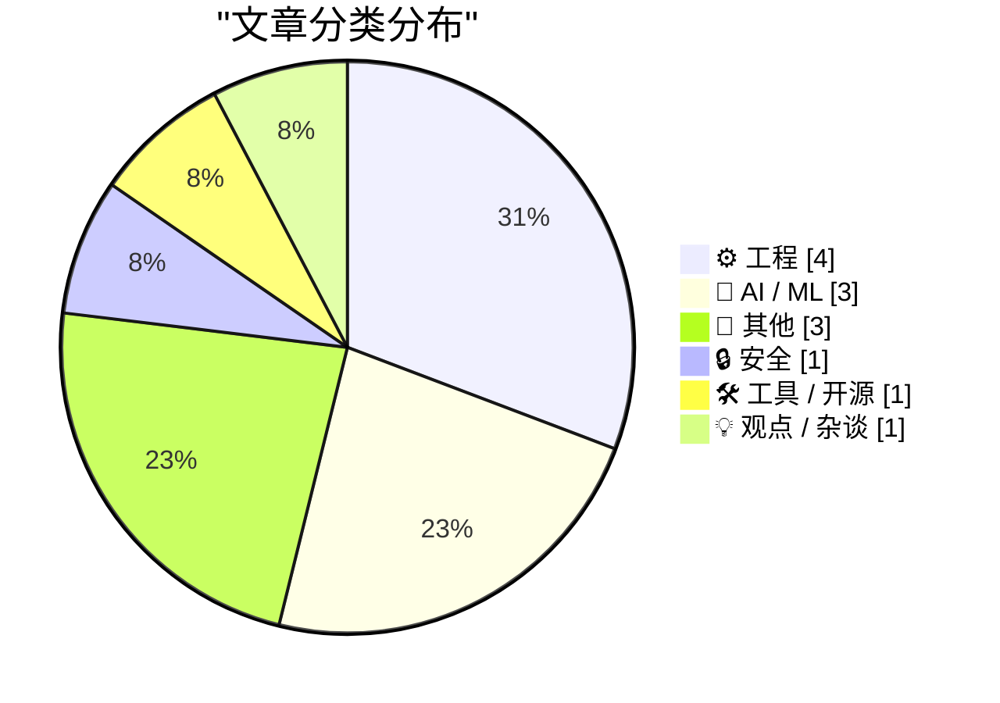
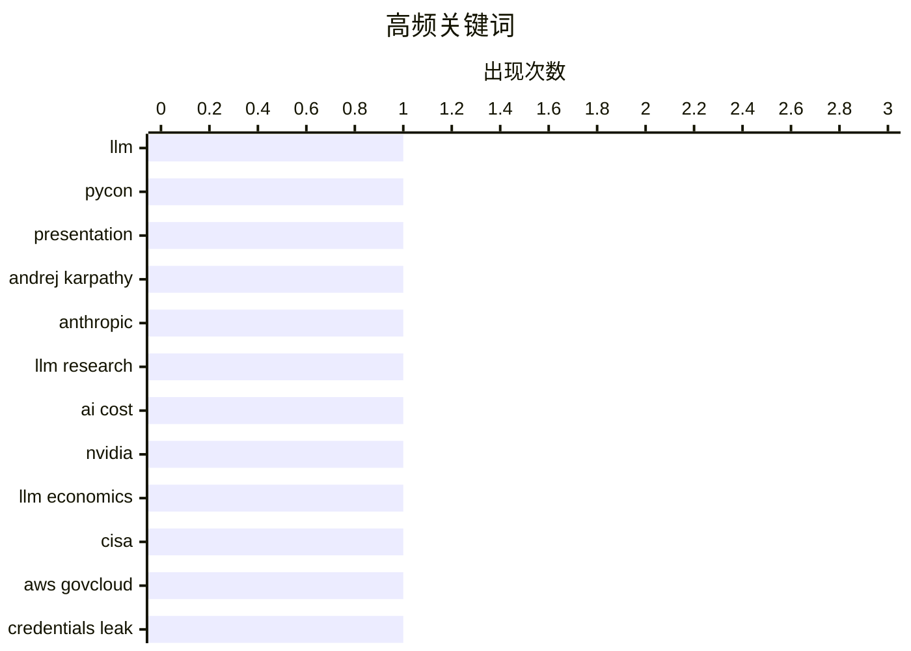

# 📰 AI 博客每日精选 — 2026-05-20

> 来自 Karpathy 推荐的 92 个顶级技术博客，AI 精选 Top 13

## 📝 今日看点

大模型技术持续演进，行业聚焦成本优化与效率提升；AI安全议题升温，政府云密钥泄露事件引发对权限管理的关注；同时，开源生态面临挑战，项目维护与可持续性成为开发者共同课题。

---

## 🏆 今日必读

🥇 **The last six months in LLMs in five minutes**

[The last six months in LLMs in five minutes](https://simonwillison.net/2026/May/19/5-minute-llms/#atom-everything) — simonwillison.net · 18 小时前 · 🤖 AI / ML

> The last six months in LLMs in five minutes

🏷️ LLM, PyCon, presentation

🥈 **Andrej Karpathy Joined Anthropic**

[Andrej Karpathy Joined Anthropic](https://x.com/karpathy/status/2056753169888334312) — daringfireball.net · 3 小时前 · 🤖 AI / ML

> Andrej Karpathy Joined Anthropic

🏷️ Andrej Karpathy, Anthropic, LLM research

🥉 **AI Is Too Expensive**

[AI Is Too Expensive](https://www.wheresyoured.at/ai-is-too-expensive/) — wheresyoured.at · 3 小时前 · 🤖 AI / ML

> AI Is Too Expensive

🏷️ AI cost, NVIDIA, LLM economics

---

## 📊 数据概览

| 扫描源 | 抓取文章 | 时间范围 | 精选 |
|:---:|:---:|:---:|:---:|
| 82/92 | 2458 篇 → 13 篇 | 24h | **13 篇** |

### 分类分布



### 高频关键词



<details>
<summary>📈 纯文本关键词图（终端友好）</summary>

```
llm             │ ████████████████████ 1
pycon           │ ████████████████████ 1
presentation    │ ████████████████████ 1
andrej karpathy │ ████████████████████ 1
anthropic       │ ████████████████████ 1
llm research    │ ████████████████████ 1
ai cost         │ ████████████████████ 1
nvidia          │ ████████████████████ 1
llm economics   │ ████████████████████ 1
cisa            │ ████████████████████ 1
```

</details>

### 🏷️ 话题标签

**llm**(1) · **pycon**(1) · **presentation**(1) · andrej karpathy(1) · anthropic(1) · llm research(1) · ai cost(1) · nvidia(1) · llm economics(1) · cisa(1) · aws govcloud(1) · credentials leak(1) · edit tool(1) · llm agents(1) · crc32(1) · microsoft antitrust(1) · 1998 case(1) · doj lawsuit(1) · workos(1) · agent context(1)

---

## ⚙️ 工程

### 1. Alternatives for the EDIT tool of LLM agents

[Alternatives for the EDIT tool of LLM agents](http://antirez.com/news/166) — **antirez.com** · 11 小时前 · ⭐ 22/30

> Alternatives for the EDIT tool of LLM agents

🏷️ EDIT tool, LLM agents, CRC32

---

### 2. Dumb Ways for an Open Source Project to Die

[Dumb Ways for an Open Source Project to Die](https://nesbitt.io/2026/05/19/dumb-ways-for-an-open-source-project-to-die.html) — **nesbitt.io** · 9 小时前 · ⭐ 19/30

> Dumb Ways for an Open Source Project to Die

🏷️ open source, dependencies, project failure

---

### 3. Pythagorean Addition

[Pythagorean Addition](https://entropicthoughts.com/pythagorean-addition) — **entropicthoughts.com** · 21 小时前 · ⭐ 18/30

> Pythagorean Addition

🏷️ Pythagorean addition, alpha-max plus beta-min, numerical approximation

---

### 4. 近似马尔可夫方程

[Approximating Markov’s equation](https://www.johndcook.com/blog/2026/05/19/zagiers-equation/) — **johndcook.com** · 7 小时前 · ⭐ 16/30

> 文章探讨了马尔可夫数（满足 x² + y² + z² = 3xyz 的整数解）的研究方法，重点介绍了唐·扎吉尔（Don Zagier）通过引入近似方程 x² + y² + z² = 3xyz + 4/9 来分析马尔可夫数的策略。该方程等价于函数 f(t) = arccosh(3t/2) 满足 f(x) + f(y) = f(z)，揭示了马尔可夫数与双曲余弦反函数之间的深层联系。作者指出这一变换简化了对马尔可夫数分布的理解，并强调其数学构造的精妙性。

🏷️ Markov numbers, Zagier, approximation

---

## 🤖 AI / ML

### 5. The last six months in LLMs in five minutes

[The last six months in LLMs in five minutes](https://simonwillison.net/2026/May/19/5-minute-llms/#atom-everything) — **simonwillison.net** · 18 小时前 · ⭐ 27/30

> The last six months in LLMs in five minutes

🏷️ LLM, PyCon, presentation

---

### 6. Andrej Karpathy Joined Anthropic

[Andrej Karpathy Joined Anthropic](https://x.com/karpathy/status/2056753169888334312) — **daringfireball.net** · 3 小时前 · ⭐ 26/30

> Andrej Karpathy Joined Anthropic

🏷️ Andrej Karpathy, Anthropic, LLM research

---

### 7. AI Is Too Expensive

[AI Is Too Expensive](https://www.wheresyoured.at/ai-is-too-expensive/) — **wheresyoured.at** · 3 小时前 · ⭐ 25/30

> AI Is Too Expensive

🏷️ AI cost, NVIDIA, LLM economics

---

## 📝 其他

### 8. Microsoft Antitrust case of 1998

[Microsoft Antitrust case of 1998](https://dfarq.homeip.net/microsoft-antitrust-case-of-1998/?utm_source=rss&#038;utm_medium=rss&#038;utm_campaign=microsoft-antitrust-case-of-1998) — **dfarq.homeip.net** · 8 小时前 · ⭐ 20/30

> Microsoft Antitrust case of 1998

🏷️ Microsoft antitrust, 1998 case, DOJ lawsuit

---

### 9. Wi-Wi：无线时间同步精度达1纳秒

[Wi-Wi Is Wireless Time Sync at 1 nanosecond](https://www.jeffgeerling.com/blog/2026/wi-wi-is-wireless-time-sync-less-than-5ns/) — **jeffgeerling.com** · 5 小时前 · ⭐ 15/30

> Wi-Wi STAMP 是一种由日本 NICT 开发的无线时间同步协议，可在无需有线连接的情况下实现小于5纳秒的时间同步精度。该系统基于 IEEE 802.11 Wi-Fi 技术构建，适用于高精度分布式系统如金融交易、科学实验和工业自动化。其硬件设计优化了信号传播延迟补偿机制，突破了传统 GPS 授时在室内或短距离场景中的局限。

🏷️ Wi-Wi, time sync, nanosecond

---

### 10. 书评：《可怕的世界：目的地》——阿德里安·查普斯基著 ★★★★★

[Book Review: Terrible Worlds: Destinations by Adrian Tchaikovsky ★★★★★](https://shkspr.mobi/blog/2026/05/book-review-terrible-worlds-destinations-by-adrian-tchaikovsky/) — **shkspr.mobi** · 7 小时前 · ⭐ 10/30

> 本书收录了阿德里安·查普斯基的三部中篇小说，表面上讲述人类向太空和未来世界的迁徙冒险，实则深入探讨孤独这一核心主题。每篇故事虽设定迥异，但都通过角色在陌生环境中的孤立状态，反思人类存在的本质与情感联结的脆弱性。文笔优美，思想深邃，是科幻文学中罕见的情感与哲思结合之作。

🏷️ Terrible Worlds, Adrian Tchaikovsky, book review

---

## 🔒 安全

### 11. CISA Admin Leaked AWS GovCloud Keys on Github

[CISA Admin Leaked AWS GovCloud Keys on Github](https://krebsonsecurity.com/2026/05/cisa-admin-leaked-aws-govcloud-keys-on-github/) — **krebsonsecurity.com** · 22 小时前 · ⭐ 24/30

> CISA Admin Leaked AWS GovCloud Keys on Github

🏷️ CISA, AWS GovCloud, credentials leak

---

## 🛠 工具 / 开源

### 12. [Sponsor] WorkOS: Agents Need Context. Ship the Integrations That Give It to Them.

[[Sponsor] WorkOS: Agents Need Context. Ship the Integrations That Give It to Them.](https://workos.com/docs/pipes?utm_source=daringfireball&amp;utm_medium=newsletter&amp;utm_campaign=q22026) — **daringfireball.net** · 17 小时前 · ⭐ 19/30

> [Sponsor] WorkOS: Agents Need Context. Ship the Integrations That Give It to Them.

🏷️ WorkOS, agent context, integrations

---

## 💡 观点 / 杂谈

### 13. Pluralistic: There's no such thing as "age verification" (19 May 2026)

[Pluralistic: There's no such thing as "age verification" (19 May 2026)](https://pluralistic.net/2026/05/19/shes-dead-of-course/) — **pluralistic.net** · 12 小时前 · ⭐ 19/30

> Pluralistic: There's no such thing as "age verification" (19 May 2026)

🏷️ age verification, privacy, regulation

---

*生成于 2026-05-20 03:20 (Asia/Shanghai) | 扫描 82 源 → 获取 2458 篇 → 精选 13 篇*
*基于 [Hacker News Popularity Contest 2025](https://refactoringenglish.com/tools/hn-popularity/) RSS 源列表，由 [Andrej Karpathy](https://x.com/karpathy) 推荐*
*由「懂点儿AI」制作，欢迎关注同名微信公众号获取更多 AI 实用技巧 💡*
