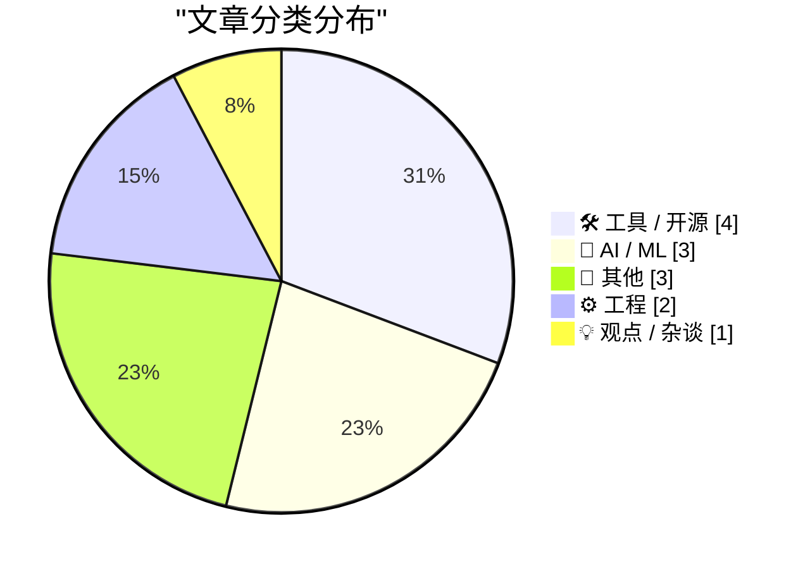
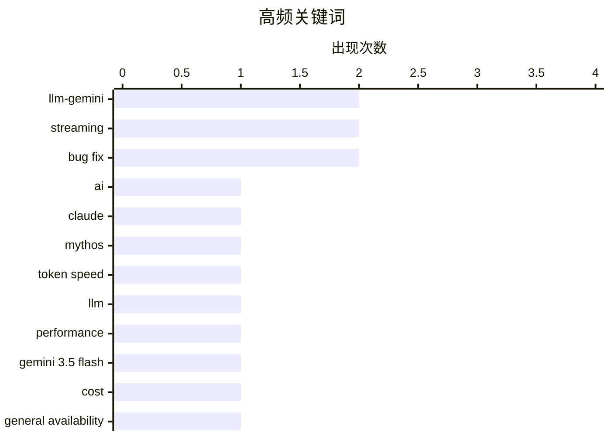

# 📰 AI 博客每日精选 — 2026-05-21

> 来自 Karpathy 推荐的 92 个顶级技术博客，AI 精选 Top 13

## 📝 今日看点

今日技术圈聚焦三大趋势：一是主流 AI 模型正加速落地，Google 将 Gemini 3.5 Flash 全面接入 Bard、Gmail 等核心产品，推动大模型普惠化；二是开发者工具持续优化，LLM 插件纷纷增强对流式推理与多轮对话追踪的支持，提升系统可观测性；三是工程实践反思升温，“提示词即技术债务”引发关注，强调需以工程思维管理 LLM 应用复杂性。

---

## 🏆 今日必读

🥇 **更好的 AI 意味着什么？**

[What will better AI mean?](https://geohot.github.io//blog/jekyll/update/2026/05/20/what-will-better-mean.html) — geohot.github.io · 12 小时前 · 🤖 AI / ML

> 文章探讨了当前前沿 AI 实验室（如 Anthropic）是否拥有超越公开技术的秘密训练方法。作者认为，所谓‘Claude Mythos’模型并无特殊技巧，其能力主要来自常规的大规模数据训练和工程优化。对于可验证的任务领域，提升性能只需修复 bug 和扩大规模。因此，作者指出 Anthropic 急于推动监管俘获，是因为 AI 行业缺乏真正的护城河。

💡 **为什么值得读**: 揭示了 AI 巨头依赖监管而非技术优势的本质，对理解当前 AI 竞争格局具有批判性价值。

🏷️ AI, Claude, Mythos

🥈 **每秒 10 个 token 到底有多快？**

[How fast is 10 tokens per second really?](https://simonwillison.net/2026/May/20/tokens-per-second/#atom-everything) — simonwillison.net · 1 小时前 · 🤖 AI / ML

> Mike Veerman 开发了一个交互式 HTML 应用，模拟不同 LLM 输出速度（5–800 tokens/秒）下的文本生成体验。该工具帮助用户直观感受广告中宣称的“30 tokens/second”在实际对话中的延迟表现，尤其适用于评估实时聊天机器人的流畅度。

💡 **为什么值得读**: 提供了一个直观的工具来量化 AI 响应速度的实际体验，填补了宣传参数与用户感知之间的鸿沟。

🏷️ token speed, LLM, performance

🥉 **Gemini 3.5 Flash：更贵但 Google 计划全面采用**

[Gemini 3.5 Flash: more expensive, but Google plan to use it for everything](https://simonwillison.net/2026/May/19/gemini-35-flash/#atom-everything) — simonwillison.net · 20 小时前 · 🤖 AI / ML

> Google 在 I/O 大会上正式发布 Gemini 3.5 Flash，跳过预览阶段直接上线，并计划将其用于旗下多个核心产品，包括 Bard、Gmail、Docs 等。该模型面向全球数十亿用户开放，标志着 Google 全面转向使用高性能通用模型替代专用轻量模型。

💡 **为什么值得读**: 反映了 Google 在 AI 产品战略上的重大转变，值得开发者关注其对现有生态的影响。

🏷️ Gemini 3.5 Flash, cost, general availability

---

## 📊 数据概览

| 扫描源 | 抓取文章 | 时间范围 | 精选 |
|:---:|:---:|:---:|:---:|
| 80/92 | 2420 篇 → 13 篇 | 24h | **13 篇** |

### 分类分布



### 高频关键词



<details>
<summary>📈 纯文本关键词图（终端友好）</summary>

```
llm-gemini       │ ████████████████████ 2
streaming        │ ████████████████████ 2
bug fix          │ ████████████████████ 2
ai               │ ██████████░░░░░░░░░░ 1
claude           │ ██████████░░░░░░░░░░ 1
mythos           │ ██████████░░░░░░░░░░ 1
token speed      │ ██████████░░░░░░░░░░ 1
llm              │ ██████████░░░░░░░░░░ 1
performance      │ ██████████░░░░░░░░░░ 1
gemini 3.5 flash │ ██████████░░░░░░░░░░ 1
```

</details>

### 🏷️ 话题标签

**llm-gemini**(2) · **streaming**(2) · **bug fix**(2) · ai(1) · claude(1) · mythos(1) · token speed(1) · llm(1) · performance(1) · gemini 3.5 flash(1) · cost(1) · general availability(1) · release(1) · reasoning tokens(1) · technical debt(1) · prompt engineering(1) · maintainability(1) · testing(1) · assumptions(1) · properties(1)

---

## 🛠 工具 / 开源

### 1. llm-gemini 0.32 发布：支持 Gemini 3.5 Flash

[llm-gemini 0.32](https://simonwillison.net/2026/May/19/llm-gemini-2/#atom-everything) — **simonwillison.net** · 19 小时前 · ⭐ 22/30

> Simon Willison 发布的 llm-gemini 插件版本 0.32 新增了对 Google 最新模型 gemini-3.5-flash 的支持，使用户能通过 LLM CLI 工具调用该模型。这是继官方发布后首个兼容该模型的社区集成更新。

🏷️ llm-gemini, release, streaming

---

### 2. llm-gemini 0.32a0：支持流式推理令牌

[llm-gemini 0.32a0](https://simonwillison.net/2026/May/19/llm-gemini/#atom-everything) — **simonwillison.net** · 22 小时前 · ⭐ 22/30

> llm-gemini 0.32a0 版本发布，兼容 llm>=0.32a0 的 alpha 版本，新增对流式推理令牌（streaming reasoning tokens）的支持，允许实时获取模型的中间思考过程，增强调试与交互体验。

🏷️ llm-gemini, reasoning tokens, streaming

---

### 3. datasette-llm-accountant 0.1a4 修复响应链追踪问题

[datasette-llm-accountant 0.1a4](https://simonwillison.net/2026/May/19/datasette-llm-accountant/#atom-everything) — **simonwillison.net** · 22 小时前 · ⭐ 18/30

> Datasette LLM accountant 插件 0.1a4 修复了无法完整追踪多轮对话响应链的 bug（见 issue #7），确保日志记录能准确反映上下文依赖的 LLM 调用流程，提升审计与调试能力。

🏷️ datasette-llm-accountant, bug fix, response chains

---

### 4. datasette-llm 0.1a8 修复上下文钩子收集不全问题

[datasette-llm 0.1a8](https://simonwillison.net/2026/May/19/datasette-llm/#atom-everything) — **simonwillison.net** · 23 小时前 · ⭐ 18/30

> datasette-llm 插件 0.1a8 版本修复了 llm_prompt_context() 钩子未能完全收集响应链的问题，确保插件能正确捕获完整的对话历史，避免信息丢失影响后续处理。

🏷️ datasette-llm, bug fix, context hook

---

## 🤖 AI / ML

### 5. 更好的 AI 意味着什么？

[What will better AI mean?](https://geohot.github.io//blog/jekyll/update/2026/05/20/what-will-better-mean.html) — **geohot.github.io** · 12 小时前 · ⭐ 25/30

> 文章探讨了当前前沿 AI 实验室（如 Anthropic）是否拥有超越公开技术的秘密训练方法。作者认为，所谓‘Claude Mythos’模型并无特殊技巧，其能力主要来自常规的大规模数据训练和工程优化。对于可验证的任务领域，提升性能只需修复 bug 和扩大规模。因此，作者指出 Anthropic 急于推动监管俘获，是因为 AI 行业缺乏真正的护城河。

🏷️ AI, Claude, Mythos

---

### 6. 每秒 10 个 token 到底有多快？

[How fast is 10 tokens per second really?](https://simonwillison.net/2026/May/20/tokens-per-second/#atom-everything) — **simonwillison.net** · 1 小时前 · ⭐ 24/30

> Mike Veerman 开发了一个交互式 HTML 应用，模拟不同 LLM 输出速度（5–800 tokens/秒）下的文本生成体验。该工具帮助用户直观感受广告中宣称的“30 tokens/second”在实际对话中的延迟表现，尤其适用于评估实时聊天机器人的流畅度。

🏷️ token speed, LLM, performance

---

### 7. Gemini 3.5 Flash：更贵但 Google 计划全面采用

[Gemini 3.5 Flash: more expensive, but Google plan to use it for everything](https://simonwillison.net/2026/May/19/gemini-35-flash/#atom-everything) — **simonwillison.net** · 20 小时前 · ⭐ 24/30

> Google 在 I/O 大会上正式发布 Gemini 3.5 Flash，跳过预览阶段直接上线，并计划将其用于旗下多个核心产品，包括 Bard、Gmail、Docs 等。该模型面向全球数十亿用户开放，标志着 Google 全面转向使用高性能通用模型替代专用轻量模型。

🏷️ Gemini 3.5 Flash, cost, general availability

---

## 📝 其他

### 8. x² − 1 的平方根

[Square root of x² − 1](https://www.johndcook.com/blog/2026/05/19/square-root-of-x-squared-minus-one/) — **johndcook.com** · 18 小时前 · ⭐ 16/30

> 文章探讨了复数域中表达式 √(z² − 1) 的定义问题，指出其看似简单却存在多值性和分支选择等微妙之处。作者强调不能仅通过代数操作（如先平方再减一再开方）来定义该表达式，而必须考虑复变函数中的主值分支和解析性。最终结论是：在数学严谨性要求下，该平方根需要借助复对数或三角恒等式进行明确定义，而非直接运算。

🏷️ square root, complex numbers, mathematics

---

### 9. 对一个恒等式的深入审视

[Closer look at an identity](https://www.johndcook.com/blog/2026/05/19/closer-look-at-an-identity/) — **johndcook.com** · 19 小时前 · ⭐ 16/30

> 文章回顾并验证了一个先前提出的恒等式，重点分析了其在 x > 1 且 y > 1 条件下成立的原因，同时解释了为何需要特别注明这一限制条件。通过使用 Mathematica 绘制函数图像，作者展示了当 x ≤ 1 或 y ≤ 1 时图像不再平坦，说明恒等式在这些区域不成立。这表明原恒等式的有效性依赖于变量的取值范围，突显了数学证明中边界条件的重要性。

🏷️ identity, mathematical proof, plot

---

### 10. Kaypro II 于1982年5月20日上市

[Kaypro II launched May 20, 1982](https://dfarq.homeip.net/kaypro-ii-launched-may-20-1982/?utm_source=rss&#038;utm_medium=rss&#038;utm_campaign=kaypro-ii-launched-may-20-1982) — **dfarq.homeip.net** · 8 小时前 · ⭐ 10/30

> 1982年5月20日，Kaypro 公司推出了 Kaypro II 便携式计算机，运行 CP/M 操作系统并支持配套软件。该产品的主要创新在于将多种流行软件捆绑销售，提升了整体用户体验和市场竞争力。作为早期个人电脑的重要代表之一，Kaypro II 的成功推动了软件生态与硬件整合的发展模式。

🏷️ Kaypro II, CP/M, history

---

## ⚙️ 工程

### 11. 提示词也是技术债务

[Prompts are technical debt too](https://seangoedecke.com/prompts-are-technical-debt-too/) — **seangoedecke.com** · 19 小时前 · ⭐ 22/30

> 文章类比代码即技术债务的观点，提出提示词（prompts）同样构成技术债务——每次修改 prompt 都会增加系统复杂性，影响未来变更与维护。随着 prompt 数量增长，系统将变得难以管理，甚至无法单人维护。

🏷️ technical debt, prompt engineering, maintainability

---

### 12. 假设会削弱属性保证

[Assumptions weaken properties](https://buttondown.com/hillelwayne/archive/assumptions-weaken-properties/) — **buttondown.com/hillelwayne** · 4 小时前 · ⭐ 21/30

> 通过逻辑蕴含关系 P => Q = !P || (P && Q)，文章解释为何更强的测试（STRONG）能保证通过更弱的测试（WEAK），但引入额外假设会使原有属性失效。形式化规范中需谨慎处理假设条件，否则可能破坏系统的正确性保证。

🏷️ testing, assumptions, properties

---

## 💡 观点 / 杂谈

### 13. Google I/O：Gemini Spark 与 Antigravity 亮点解析

[Google I/O, Gemini Spark, Antigravity](https://simonwillison.net/2026/May/20/google-io/#atom-everything) — **simonwillison.net** · 4 小时前 · ⭐ 17/30

> 尽管多数 Google I/O 发布尚未上线，作者仍聚焦于已可用的成果，重点提及 Gemini 3.5 Flash 的发布及其在多产品中的应用。同时提到 Antigravity 作为内部代号项目，暗示 Google 在 AI 基础设施上的持续投入。

🏷️ Google I/O, Gemini, availability

---

*生成于 2026-05-21 03:35 (Asia/Shanghai) | 扫描 80 源 → 获取 2420 篇 → 精选 13 篇*
*基于 [Hacker News Popularity Contest 2025](https://refactoringenglish.com/tools/hn-popularity/) RSS 源列表，由 [Andrej Karpathy](https://x.com/karpathy) 推荐*
*由「懂点儿AI」制作，欢迎关注同名微信公众号获取更多 AI 实用技巧 💡*
