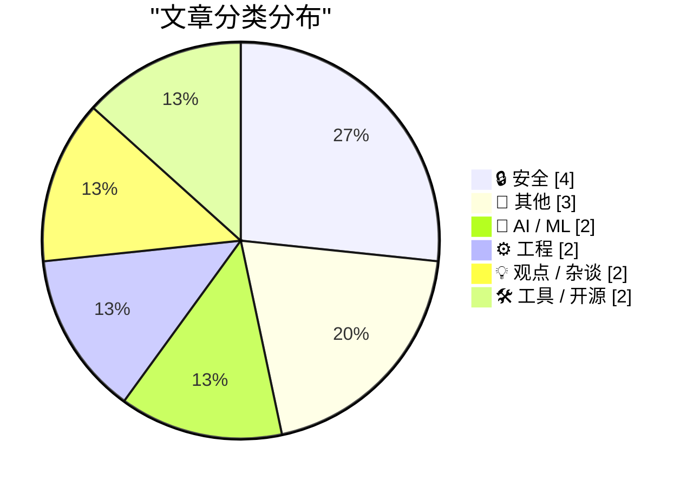
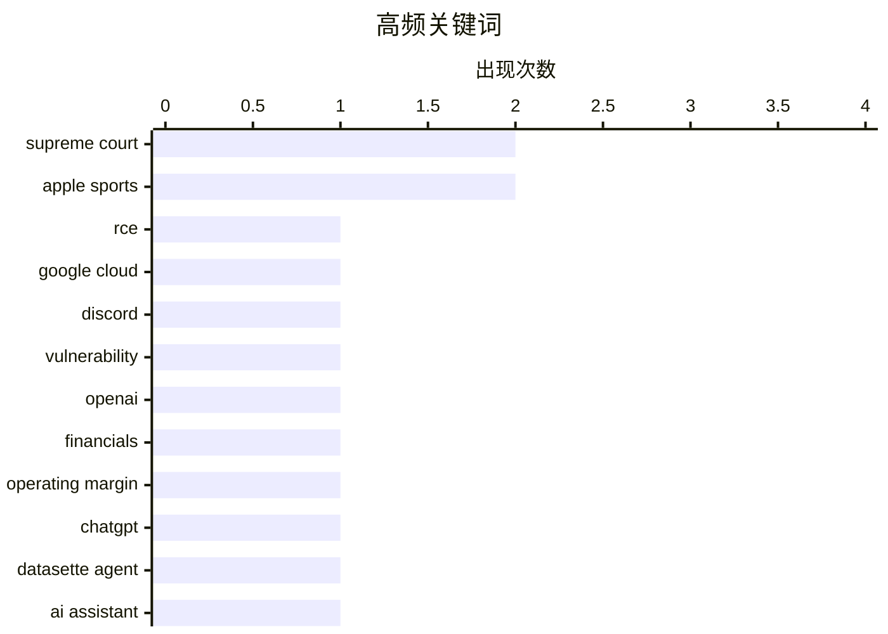

# 📰 AI 博客每日精选 — 2026-05-23

> 来自 Karpathy 推荐的 92 个顶级技术博客，AI 精选 Top 15

## 📝 今日看点

今日技术圈聚焦两大核心趋势：**安全事件频发与AI商业化挑战**。一方面，Google Cloud遭RCE漏洞攻击、CISA承包商泄露AWS密钥等事件凸显云安全与第三方供应商管理的严峻风险；另一方面，OpenAI巨额亏损（营收57亿美元但亏损率-122%）引发对AI行业盈利模式的质疑，同时伴随对AI投资过热的理性反思。此外，Datasette Agent等AI工具落地进展与人脑芯片架构差异的探讨，反映了技术落向多样化探索。

---

## 🏆 今日必读

🥇 **Google Cloud生产环境遭$148,337 RCE漏洞利用**

[StubZero: $148,337 RCE in Google Cloud Production](https://brutecat.com/articles/google-cloud-rce) — brutecat.com · -13254 分钟前 · 🔒 安全

> 文章描述了一起发生在Google Cloud生产环境的远程代码执行（RCE）安全事件，攻击者通过信息泄露和组合缺失的漏洞组件，在一小时内成功利用漏洞。三个月后类似事件再次发生。漏洞涉及金额高达14.8万美元，凸显了云环境配置错误和快速响应的重要性。

💡 **为什么值得读**: 揭示了云环境中因配置错误导致的严重漏洞及重复风险，对云安全从业者极具警示意义。

🏷️ RCE, Google Cloud, Discord, vulnerability

🥈 **OpenAI Q1 2026营收57亿美元但亏损率达122%**

[News: OpenAI Had A Negative 122% Non-GAAP Operating Margin In Q1 2026, and ChatGPT Growth Has Stalled](https://www.wheresyoured.at/news-openai-had-a-negative-122-operating-margin-in-q1-2026-and-chatgpt-growth-has-stalled/) — wheresyoured.at · 4 小时前 · 🤖 AI / ML

> 据The Information报道，OpenAI在2026年第一季度营收达57亿美元，但经调整后的运营亏损率高达-122%，即每赚取1美元收入就额外损失1.22美元。这一数据反映了其高昂的运营成本与商业化挑战，同时ChatGPT用户增长已停滞。

💡 **为什么值得读**: 揭示了AI公司盈利模式的严峻现实，对投资者和行业观察者具有重要参考价值。

🏷️ OpenAI, financials, operating margin, ChatGPT

🥉 **Datasette Agent：Datasette首个可扩展AI助手发布**

[Datasette Agent](https://simonwillison.net/2026/May/21/datasette-agent/#atom-everything) — simonwillison.net · 23 小时前 · 🤖 AI / ML

> Simon Willison宣布推出Datasette Agent，这是Datasette的首个可扩展AI助手，整合了LLM Python库（开发超三年）与Datasette功能。它提供交互式对话接口，标志着两者技术融合的关键里程碑。

💡 **为什么值得读**: 展示了开源工具链如何结合AI助手能力，为开发者提供高效数据交互新范式。

🏷️ Datasette Agent, AI assistant, LLM

---

## 📊 数据概览

| 扫描源 | 抓取文章 | 时间范围 | 精选 |
|:---:|:---:|:---:|:---:|
| 81/92 | 2443 篇 → 18 篇 | 24h | **15 篇** |

### 分类分布



### 高频关键词



<details>
<summary>📈 纯文本关键词图（终端友好）</summary>

```
supreme court    │ ████████████████████ 2
apple sports     │ ████████████████████ 2
rce              │ ██████████░░░░░░░░░░ 1
google cloud     │ ██████████░░░░░░░░░░ 1
discord          │ ██████████░░░░░░░░░░ 1
vulnerability    │ ██████████░░░░░░░░░░ 1
openai           │ ██████████░░░░░░░░░░ 1
financials       │ ██████████░░░░░░░░░░ 1
operating margin │ ██████████░░░░░░░░░░ 1
chatgpt          │ ██████████░░░░░░░░░░ 1
```

</details>

### 🏷️ 话题标签

**supreme court**(2) · **apple sports**(2) · **rce**(1) · google cloud(1) · discord(1) · vulnerability(1) · openai(1) · financials(1) · operating margin(1) · chatgpt(1) · datasette agent(1) · ai assistant(1) · llm(1) · cisa(1) · data leak(1) · aws govcloud(1) · kimwolf botnet(1) · ddos(1) · iot(1) · chip design(1)

---

## 🔒 安全

### 1. Google Cloud生产环境遭$148,337 RCE漏洞利用

[StubZero: $148,337 RCE in Google Cloud Production](https://brutecat.com/articles/google-cloud-rce) — **brutecat.com** · -13254 分钟前 · ⭐ 28/30

> 文章描述了一起发生在Google Cloud生产环境的远程代码执行（RCE）安全事件，攻击者通过信息泄露和组合缺失的漏洞组件，在一小时内成功利用漏洞。三个月后类似事件再次发生。漏洞涉及金额高达14.8万美元，凸显了云环境配置错误和快速响应的重要性。

🏷️ RCE, Google Cloud, Discord, vulnerability

---

### 2. CISA承包商故意泄露AWS GovCloud密钥致数据泄露

[Lawmakers Demand Answers as CISA Tries to Contain Data Leak](https://krebsonsecurity.com/2026/05/lawmakers-demand-answers-as-cisa-tries-to-contain-data-leak/) — **krebsonsecurity.com** · 2 小时前 · ⭐ 24/30

> 美国网络安全与基础设施安全局（CISA）承包商将AWS GovCloud密钥及其他机密文件公开至GitHub账户，引发议员质询。目前CISA仍在努力遏制泄露并撤销凭证，暴露了第三方供应商管理漏洞。

🏷️ CISA, data leak, AWS GovCloud

---

### 3. 涉嫌Kimwolf僵尸网络主谋'Dort'在美加被捕

[Alleged Kimwolf Botmaster ‘Dort’ Arrested, Charged in U.S. and Canada](https://krebsonsecurity.com/2026/05/alleged-kimwolf-botmaster-dort-arrested-charged-in-u-s-and-canada/) — **krebsonsecurity.com** · 21 小时前 · ⭐ 23/30

> 加拿大当局逮捕23岁男子Dort，此人涉嫌构建并运营Kimwolf物联网僵尸网络，过去六个月操控数百万设备发起大规模DDoS攻击。KrebsOnSecurity曾在2026年2月公开指认该嫌疑人，因其曾针对作者和安全研究员发起攻击。

🏷️ Kimwolf botnet, DDoS, IoT

---

### 4. FTC要求Cox等三家公司支付990万美元赔偿“主动监听”AI营销欺诈案

[FTC to Require Cox Media Group, Two Other Firms to Pay Nearly $1 Million to Settle Charges They Deceived Customers About “Active Listening” AI-Powered Marketing Service](https://simonwillison.net/2026/May/22/ftc-active-listening/#atom-everything) — **simonwillison.net** · 14 小时前 · ⭐ 22/30

> 美国联邦贸易委员会（FTC）裁定Cox Media Group等三家公司因误导客户关于“主动监听”AI营销服务而违规，需支付近100万美元和解金。该公司此前试图向广告商推销基于虚假监听技术的套餐。

🏷️ FTC, AI marketing, deception

---

## 📝 其他

### 5. 苹果申请最高法院推翻Epic Games案中的藐视裁决与禁令范围

[Apple Seeks Supreme Court Review of Contempt Finding and Injunction Scope in Epic Games Case](https://9to5mac.com/2026/05/21/apple-seeks-supreme-court-review-of-contempt-finding-and-injunction-scope-in-epic-games-case/) — **daringfireball.net** · 18 小时前 · ⭐ 21/30

> 苹果向最高法院提交动议，请求撤销下级法院关于App Store佣金收费构成藐视法庭的裁决，并重新评估Epic Games诉讼中禁令的范围，涉及App Store商业模式合法性争议。

🏷️ Apple, Epic Games, Supreme Court

---

### 6. 第九巡回法院对“Epic诉苹果案”的裁决：苹果欲推翻判决

[The Ninth Circuit Appeal Ruling in ‘Epic v. Apple’ That Apple Is Seeking to Overturn at the Supreme Court (PDF)](https://cdn.ca9.uscourts.gov/datastore/opinions/2025/12/11/25-2935.pdf) — **daringfireball.net** · 1 小时前 · ⭐ 18/30

> 文章围绕美国第九巡回上诉法院在“Epic v. Apple”案件中的裁决展开，该裁决涉及苹果请求最高法院推翻原判的核心争议。法院在裁决中引用了Trump v. CASA的先例，认为针对佣金禁令的裁定不应仅适用于Epic Games，而应扩展到所有美国App Store开发者。苹果的论点试图限制禁令范围，但法院未明确支持这一主张。裁决第50页详细阐述了苹果的法律依据及其与先例的关联性。

🏷️ Epic v. Apple, Supreme Court, injunction

---

### 7. 如何有效与同事沟通：减少重复提问的实用技巧

[How to Talk to Your Coworkers](https://idiallo.com/blog/how-to-talk-to-your-coworkers?src=feed) — **idiallo.com** · 6 分钟前 · ⭐ 15/30

> 文章探讨开发者为何频繁被同事重复提问的问题，指出尽管已有文档（如Jira）记录，仍存在沟通障碍。作者提出解决方案包括优化文档可读性、建立标准化问答模板，以及鼓励异步沟通（如留言板）以减少不必要的会议。目标是通过结构化方法提升团队协作效率。

🏷️ communication, coworkers, Jira

---

## 🤖 AI / ML

### 8. OpenAI Q1 2026营收57亿美元但亏损率达122%

[News: OpenAI Had A Negative 122% Non-GAAP Operating Margin In Q1 2026, and ChatGPT Growth Has Stalled](https://www.wheresyoured.at/news-openai-had-a-negative-122-operating-margin-in-q1-2026-and-chatgpt-growth-has-stalled/) — **wheresyoured.at** · 4 小时前 · ⭐ 27/30

> 据The Information报道，OpenAI在2026年第一季度营收达57亿美元，但经调整后的运营亏损率高达-122%，即每赚取1美元收入就额外损失1.22美元。这一数据反映了其高昂的运营成本与商业化挑战，同时ChatGPT用户增长已停滞。

🏷️ OpenAI, financials, operating margin, ChatGPT

---

### 9. Datasette Agent：Datasette首个可扩展AI助手发布

[Datasette Agent](https://simonwillison.net/2026/May/21/datasette-agent/#atom-everything) — **simonwillison.net** · 23 小时前 · ⭐ 25/30

> Simon Willison宣布推出Datasette Agent，这是Datasette的首个可扩展AI助手，整合了LLM Python库（开发超三年）与Datasette功能。它提供交互式对话接口，标志着两者技术融合的关键里程碑。

🏷️ Datasette Agent, AI assistant, LLM

---

## ⚙️ 工程

### 10. 从逻辑门解析GPU/TPU/FPGA与人脑芯片设计差异

[Reiner Pope – Chip design from the bottom up](https://www.dwarkesh.com/p/reiner-pope-2) — **dwarkesh.com** · 3 小时前 · ⭐ 23/30

> Reiner Pope演讲从基础逻辑门出发，对比分析了GPU、TPU、FPGA及人脑芯片的设计哲学，揭示不同架构（如并行计算vs模拟信号）如何导致它们在性能、能耗和应用场景上的显著差异。

🏷️ chip design, logic gates, GPUs, TPUs

---

### 11. 依赖项修剪工具综述：检测未使用依赖的方案调查

[Dependency Pruning](https://nesbitt.io/2026/05/22/dependency-pruning.html) — **nesbitt.io** · 9 小时前 · ⭐ 22/30

> 文章综述了多种未使用依赖检测工具（如unused-detectors），探讨其在Python项目中的适用性、准确性和效率，帮助开发者优化依赖树以减少冗余和潜在安全风险。

🏷️ dependency, pruning, unused-dependency

---

## 💡 观点 / 杂谈

### 12. AI泡沫系列第二部分：质疑当前AI投资过热现象

[Premium: What If...We're In An AI Bubble? (Part 2)](https://www.wheresyoured.at/premium-what-if-were-in-an-ai-bubble-part-2/) — **wheresyoured.at** · 2 小时前 · ⭐ 21/30

> WheresYoured.at作者延续AI泡沫主题分析，提出若当前AI投资热潮持续，可能引发资源错配、市场泡沫破裂等连锁反应，呼吁理性评估技术成熟度与商业落地瓶颈。

🏷️ AI bubble, consequences, scenarios

---

### 13. 零和问题与Apple Sports的数据可视化缺陷

[Zero Sum Problems and Apple Sports](https://kieranhealy.org/blog/archives/2026/05/21/zero-sum-problems/) — **daringfireball.net** · 1 小时前 · ⭐ 16/30

> Kieran Healy批评Apple Sports的“零和”团队统计可视化设计存在信息组织问题，指出其本质是信息设计而非数据可视化的缺陷。具体表现为需处理15组相关但独立的数据对（如15支球队的双变量），导致用户难以直观理解对比关系。作者认为这种设计未能解决核心的信息呈现挑战。

🏷️ Apple Sports, visualization, information design

---

## 🛠 工具 / 开源

### 14. Apple TV首次全程使用iPhone 17 Pro直播MLS比赛

[Apple TV to Broadcast Entire MLS Match Shot Using iPhones](https://www.apple.com/newsroom/2026/05/apple-tv-to-air-first-major-live-pro-sports-event-shot-on-iphone-17-pro/) — **daringfireball.net** · 19 小时前 · ⭐ 18/30

> 苹果宣布将于2026年5月23日通过Apple TV直播洛杉矶银河队对阵休斯顿动力FC的MLS比赛，这是职业体育赛事史上首次全程由iPhone 17 Pro拍摄并播出。该项目是苹果与MLS合作开发的成果，画面将独家来自iPhone 17 Pro，并通过Dignity Health Sports Park场馆的Apple TV平台实时转播。

🏷️ Apple TV, MLS, iPhone

---

### 15. Apple Sports扩展至90余新国家，世界杯前夕覆盖全球170地区

[Apple Sports Expands to More Than 90 New Countries on Cusp of World Cup](https://www.apple.com/newsroom/2026/05/apple-sports-expands-to-more-than-90-new-countries-and-regions/) — **daringfireball.net** · 23 小时前 · ⭐ 18/30

> 苹果免费应用Apple Sports现已在App Store下载量超170个国家和地区，新增90余个市场，包括世界杯前夕加入的新地区。该应用专注于实时比分、统计数据和个性化体验，采用简洁直观的界面设计，旨在为球迷提供高效便捷的观赛服务。

🏷️ Apple Sports, World Cup, App Store

---

*生成于 2026-05-23 03:06 (Asia/Shanghai) | 扫描 81 源 → 获取 2443 篇 → 精选 15 篇*
*基于 [Hacker News Popularity Contest 2025](https://refactoringenglish.com/tools/hn-popularity/) RSS 源列表，由 [Andrej Karpathy](https://x.com/karpathy) 推荐*
*由「懂点儿AI」制作，欢迎关注同名微信公众号获取更多 AI 实用技巧 💡*
