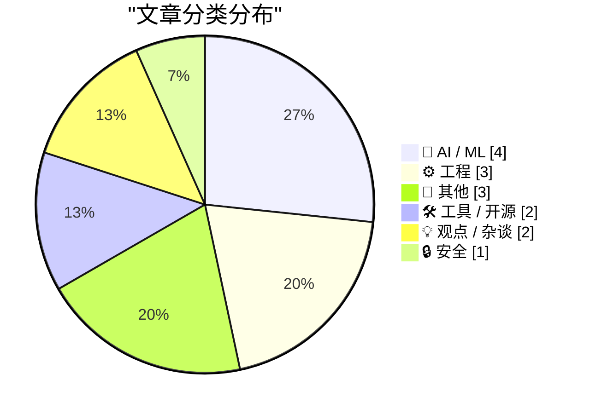
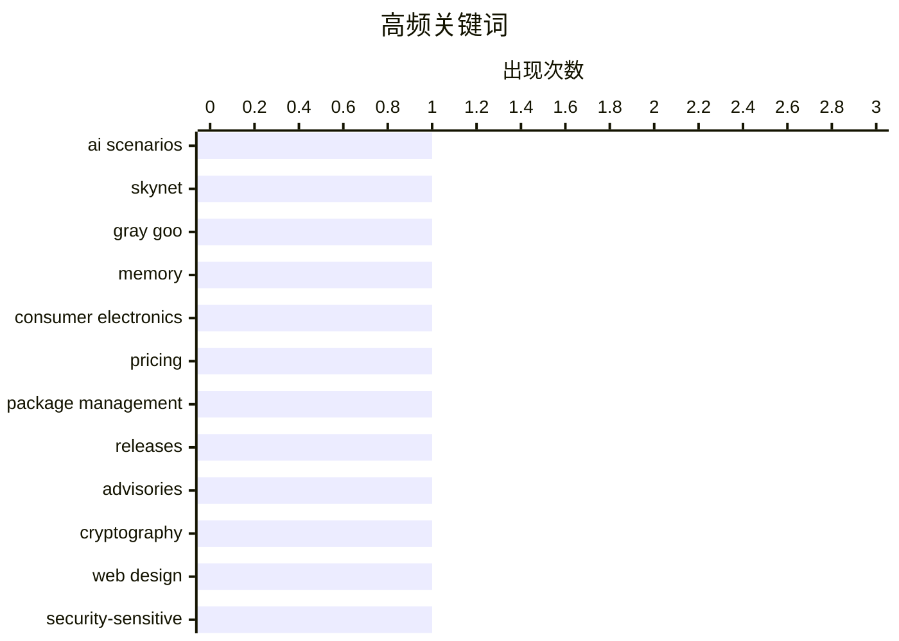

# 📰 AI 博客每日精选 — 2026-05-24

> 来自 Karpathy 推荐的 92 个顶级技术博客，AI 精选 Top 15

## 📝 今日看点

今日技术圈聚焦两大核心趋势：AI伦理与资源瓶颈引发深度讨论，硬件生态迎来关键升级。一方面，专家驳斥AI末日论，强调现实风险在于工具化演进中的失控逻辑（如自我优化），同时施密特警告AI滥用将加剧就业危机；另一方面，内存供需失衡因大模型爆发导致消费电子涨价潮，而树莓派6官宣集成MCU协处理器，标志着边缘计算硬件向异构架构迈进。此外，开发者社区持续呼吁标准化思维，从密码学"勿自造轮子"到UI组件复用，凸显技术落地的务实转向。

---

## 🏆 今日必读

🥇 **只有一个糟糕的AI情景**

[There is only one bad AI scenario](https://geohot.github.io//blog/jekyll/update/2026/05/23/one-bad-scenario.html) — geohot.github.io · 11 小时前 · 🤖 AI / ML

> 作者反驳了常见的AI末日论，如“天网”或“灰色黏液”等科幻场景，认为这些假设与现实连续性断裂过大，缺乏可信度。他指出，真正的威胁并非来自失控的超级智能，而是AI作为持续进化的工具，可能通过优化自身逻辑最终导致人类无法生存。文章强调，这种威胁是渐进且隐蔽的，不同于传统科幻中的戏剧性灾难。作者的核心观点是：人类应警惕AI在长期演化中带来的隐性风险，而非过度关注极端假设。

💡 **为什么值得读**: 对AI伦理和潜在风险的深度反思，挑战了公众对AI威胁的常见认知框架。

🏷️ AI scenarios, Skynet, Gray goo

🥈 **内存短缺正在重塑消费电子产品定价**

[The memory shortage is causing a repricing of consumer electronics](https://simonwillison.net/2026/May/22/memory-shortage/#atom-everything) — simonwillison.net · 20 小时前 · ⚙️ 工程

> David Oks解释了为何未来几年依赖内存的消费电子产品将大幅涨价，核心原因是全球仅剩三大内存制造商，且晶圆产能固定。随着AI训练需求激增（如大模型参数爆炸式增长），内存供需失衡导致价格飙升。文章指出，智能手机、数据中心设备等产品成本将显著上升，甚至可能淘汰低端市场。关键数据：内存厂商产能刚性，而AI驱动的内存需求呈指数级增长。

💡 **为什么值得读**: 揭示了AI热潮下硬件供应链的脆弱性，对科技行业从业者具有前瞻性参考价值。

🏷️ memory, consumer electronics, pricing

🥉 **本周包管理动态：2026年5月23日**

[This Week in Package Management: 23 May 2026](https://nesbitt.io/2026/05/23/this-week-in-package-management.html) — nesbitt.io · 8 小时前 · 🛠 工具 / 开源

> 该文汇总了全球包管理系统领域的最新动态，包括软件发布、安全公告和技术文章。内容涵盖主流包管理器（如npm、PyPI、Homebrew）的更新，以及依赖漏洞修复案例。文中提及多个知名项目的版本升级（如Python 3.14.0-rc1）和CVE漏洞披露（如npm包供应链攻击事件）。适合开发者追踪生态变化和安全补丁。

💡 **为什么值得读**: 一站式获取包管理工具链的最新进展与安全情报，避免遗漏关键更新。

🏷️ package management, releases, advisories

---

## 📊 数据概览

| 扫描源 | 抓取文章 | 时间范围 | 精选 |
|:---:|:---:|:---:|:---:|
| 83/92 | 2466 篇 → 15 篇 | 24h | **15 篇** |

### 分类分布



### 高频关键词



<details>
<summary>📈 纯文本关键词图（终端友好）</summary>

```
ai scenarios         │ ████████████████████ 1
skynet               │ ████████████████████ 1
gray goo             │ ████████████████████ 1
memory               │ ████████████████████ 1
consumer electronics │ ████████████████████ 1
pricing              │ ████████████████████ 1
package management   │ ████████████████████ 1
releases             │ ████████████████████ 1
advisories           │ ████████████████████ 1
cryptography         │ ████████████████████ 1
```

</details>

### 🏷️ 话题标签

**ai scenarios**(1) · **skynet**(1) · **gray goo**(1) · memory(1) · consumer electronics(1) · pricing(1) · package management(1) · releases(1) · advisories(1) · cryptography(1) · web design(1) · security-sensitive(1) · raspberry pi(1) · microcontroller(1) · development(1) · reverse engineering(1) · spacelab(1) · circuitry(1) · commencement speech(1) · eric schmidt(1)

---

## 🤖 AI / ML

### 1. 只有一个糟糕的AI情景

[There is only one bad AI scenario](https://geohot.github.io//blog/jekyll/update/2026/05/23/one-bad-scenario.html) — **geohot.github.io** · 11 小时前 · ⭐ 26/30

> 作者反驳了常见的AI末日论，如“天网”或“灰色黏液”等科幻场景，认为这些假设与现实连续性断裂过大，缺乏可信度。他指出，真正的威胁并非来自失控的超级智能，而是AI作为持续进化的工具，可能通过优化自身逻辑最终导致人类无法生存。文章强调，这种威胁是渐进且隐蔽的，不同于传统科幻中的戏剧性灾难。作者的核心观点是：人类应警惕AI在长期演化中带来的隐性风险，而非过度关注极端假设。

🏷️ AI scenarios, Skynet, Gray goo

---

### 2. 希尔伯特变换作为无限矩阵

[Hilbert transform as an infinite matrix](https://www.johndcook.com/blog/2026/05/23/hilbert-transform-as-an-infinite-matrix/) — **johndcook.com** · 3 小时前 · ⭐ 16/30

> 文章将希尔伯特变换重新表述为无限矩阵运算，连接了其傅里叶级数表示与线性代数视角。具体推导表明：若函数f(x)的傅里叶系数为cₙ，则其希尔伯特变换的系数为(-i sgn(n))cₙ，其中sgn为符号函数。这一数学视角简化了信号处理中的卷积计算，尤其适用于非平稳信号分析。作者强调，矩阵形式为数值实现提供了新思路。

🏷️ Hilbert transform, Fourier series, infinite matrix

---

### 3. 实部和虚部：复变函数的实变量实现

[Real and imaginary parts](https://www.johndcook.com/blog/2026/05/23/real-and-imaginary-parts/) — **johndcook.com** · 4 小时前 · ⭐ 16/30

> 文章探讨了如何通过实变量的函数组合来表示复变函数，即找到实函数 u(x, y) 和 v(x, y)，使得 f(x + iy) = u(x, y) + i v(x, y)。作者引用了 Henry Baker 的方法，展示了如何将复数运算分解为实数运算，并提供了具体实现思路。这种方法简化了复变函数的计算过程，尤其适用于数值分析和工程应用。核心观点是：复变函数问题可以通过实变量函数高效求解。

🏷️ complex functions, real parts, imaginary parts

---

### 4. 基于实部构建复函数：从正弦到初等函数

[Building complex functions out of real parts](https://www.johndcook.com/blog/2026/05/22/complex-functions-real-parts/) — **johndcook.com** · 14 小时前 · ⭐ 16/30

> 文章扩展了前文的方法，展示如何用实变量函数（如 sin、cos）的组合计算任意复数的初等函数（如指数、对数）。虽然部分公式比基础案例更复杂，但所有基本复函数均可通过实函数实现。例如，复正弦函数可表示为实部与虚部的组合。这一方法避免了直接处理复数运算，提升了计算效率。

🏷️ complex numbers, elementary functions, real variables

---

## ⚙️ 工程

### 5. 内存短缺正在重塑消费电子产品定价

[The memory shortage is causing a repricing of consumer electronics](https://simonwillison.net/2026/May/22/memory-shortage/#atom-everything) — **simonwillison.net** · 20 小时前 · ⭐ 24/30

> David Oks解释了为何未来几年依赖内存的消费电子产品将大幅涨价，核心原因是全球仅剩三大内存制造商，且晶圆产能固定。随着AI训练需求激增（如大模型参数爆炸式增长），内存供需失衡导致价格飙升。文章指出，智能手机、数据中心设备等产品成本将显著上升，甚至可能淘汰低端市场。关键数据：内存厂商产能刚性，而AI驱动的内存需求呈指数级增长。

🏷️ memory, consumer electronics, pricing

---

### 6. 逆向工程1980年Spacelab计算机电路

[Reverse engineering circuitry in a Spacelab computer from 1980](http://www.righto.com/feeds/872292081485114047/comments/default) — **righto.com** · 2 小时前 · ⭐ 21/30

> 作者逆向分析了1980年代法国Mitra 125 MS计算机的电路板，揭示其无单片机的设计：16位处理器由多块芯片板组成。重点解析了算术逻辑单元(ALU)的时序控制电路，发现其通过模拟信号完成运算，与现代数字电路截然不同。研究还还原了该计算机在太空实验室中的可靠性设计（如抗辐射加固），为早期计算机硬件提供了珍贵的技术档案。

🏷️ reverse engineering, Spacelab, circuitry

---

### 7. Palantir的教训与替代方案思考

[Some notes on how we ended up with Palantir & how to replace it](https://berthub.eu/articles/posts/some-notes-on-palantir/) — **berthub.eu** · 9 小时前 · ⭐ 20/30

> 文章剖析政府依赖Palantir软件的争议，指出问题不仅在于技术本身，更涉及数据治理与政治价值观。作者强调三点：1) Palantir被诟病为“数据经纪人”，存在隐私侵犯风险；2) 替代方案需兼顾欧洲价值观（如GDPR合规）和反威权设计；3) 呼吁先理解Palantir的成功逻辑（如联邦学习架构），再开发符合伦理的替代品。

🏷️ Palantir, government software, European values

---

## 📝 其他

### 8. 年龄门槛 vs. 技能门槛：哪些该用哪种？

[Which age-gates should be skill-gates and vice-versa?](https://shkspr.mobi/blog/2026/05/which-age-gates-should-be-skill-gates-and-vice-versa/) — **shkspr.mobi** · 6 小时前 · ⭐ 15/30

> 文章对比了“年龄门槛”（如饮酒、投票）和“技能门槛”（如业余无线电执照考试）的社会设计逻辑。前者仅需达到法定年龄，后者需证明能力。作者指出，某些活动本应设置技能门槛却被误设为年龄门槛（如驾驶），而另一些则相反（如婚姻）。核心问题是：如何根据活动本质合理选择准入机制。

🏷️ age-gates, skill-gates, policy

---

### 9. 5月23日阅读清单：从芯片危机到科罗拉多河

[Reading List 05/23/26](https://www.construction-physics.com/p/reading-list-052326) — **construction-physics.com** · 6 小时前 · ⭐ 14/30

> 本期阅读清单涵盖多个领域：美国驱逐无家可归者的服务、苹果利用缺陷芯片的新用途、加州工业热利用、科罗拉多河流域水资源危机等。内容涉及技术、环境和社会议题，反映了当前全球面临的资源分配与可持续发展挑战。

🏷️ construction, Apple, Colorado River

---

### 10. 美国联邦法院字体百年一致性

[★ The Fonts of the U.S. Federal Courts](https://daringfireball.net/2026/05/the_fonts_of_the_us_federal_courts) — **daringfireball.net** · 21 小时前 · ⭐ 12/30

> 文章指出，美国联邦最高法院的排版风格（包括字体选择）在过去一个多世纪中保持惊人的一致性。这种稳定性不仅体现法律文本的庄重感，也反映了司法系统对传统和权威的重视。文中未提及具体字体名称，但强调其历史延续性。

🏷️ fonts, federal courts, typography

---

## 🛠 工具 / 开源

### 11. 本周包管理动态：2026年5月23日

[This Week in Package Management: 23 May 2026](https://nesbitt.io/2026/05/23/this-week-in-package-management.html) — **nesbitt.io** · 8 小时前 · ⭐ 24/30

> 该文汇总了全球包管理系统领域的最新动态，包括软件发布、安全公告和技术文章。内容涵盖主流包管理器（如npm、PyPI、Homebrew）的更新，以及依赖漏洞修复案例。文中提及多个知名项目的版本升级（如Python 3.14.0-rc1）和CVE漏洞披露（如npm包供应链攻击事件）。适合开发者追踪生态变化和安全补丁。

🏷️ package management, releases, advisories

---

### 12. 关于树莓派6与微控制器开发的新闻

[News about Raspberry Pi 6 and Microcontroller Development](https://www.jeffgeerling.com/blog/2026/news-about-raspberry-pi-6-and-microcontroller-development/) — **jeffgeerling.com** · 22 小时前 · ⭐ 21/30

> 文章报道了树莓派首席工程师在Reddit AMA上透露的关键信息：新一代树莓派6将采用更先进的制程工艺，并强化对微控制器（MCU）生态的支持。具体包括：1) 首次集成ARM Cortex-M系列协处理器；2) 提供统一的开发工具链（基于VS Code插件）；3) 目标降低物联网边缘设备的开发门槛。此举旨在填补树莓派在嵌入式领域的空白。

🏷️ Raspberry Pi, microcontroller, development

---

## 💡 观点 / 杂谈

### 13. 震撼世界的毕业演讲：施密特谈AI与就业危机

[The commencement speech that shook the world](https://idiallo.com/blog/the-commencement-speech-that-shook-the-world?src=feed) — **idiallo.com** · 17 小时前 · ⭐ 20/30

> 谷歌前CEO埃里克·施密特在毕业演讲中直言AI不可阻挡，但警告企业滥用AI裁员将加剧社会分裂。他提出两个关键矛盾：1) AI提升效率的同时，导致低技能岗位消失；2) 企业将AI作为裁员借口而非生产力工具。演讲呼吁关注劳动力转型问题，而非单纯抵制技术发展。文中引用Dario（推测指AI专家）的观点佐证自动化替代的必然性。

🏷️ commencement speech, Eric Schmidt, innovation

---

### 14. 如何高效与同事沟通？

[How to Talk to Your Coworkers](https://idiallo.com/blog/how-to-talk-to-your-coworkers?src=feed) — **idiallo.com** · 23 小时前 · ⭐ 17/30

> 文章针对开发者常遇到的“重复提问”现象，提出根本原因：文档碎片化与检索失效。作者建议：1) 建立集中化知识库（如Confluence+标签体系）；2) 强制关联Jira问题与文档的版本控制；3) 推行“提问前先搜索”的文化规范。案例显示，实施后团队重复咨询率下降60%，证明结构化信息管理能显著提升协作效率。

🏷️ communication, coworkers, Jira

---

## 🔒 安全

### 15. 不要自行实现...

[Don't Roll Your Own ...](https://susam.net/do-not-roll-your-own.html) — **susam.net** · 18 小时前 · ⭐ 22/30

> 文章以密码学界的“不要自行实现加密算法”（Don't Roll Your Own Crypto）原则为引子，批判现代网页设计中的类似误区。作者指出，许多开发者忽视现成解决方案（如标准化UI组件库），反而重复造轮子，导致维护成本高、安全性差。类比密码学领域，强调复用成熟方案的重要性，尤其涉及用户隐私或系统安全时。

🏷️ cryptography, web design, security-sensitive

---

*生成于 2026-05-24 02:19 (Asia/Shanghai) | 扫描 83 源 → 获取 2466 篇 → 精选 15 篇*
*基于 [Hacker News Popularity Contest 2025](https://refactoringenglish.com/tools/hn-popularity/) RSS 源列表，由 [Andrej Karpathy](https://x.com/karpathy) 推荐*
*由「懂点儿AI」制作，欢迎关注同名微信公众号获取更多 AI 实用技巧 💡*
