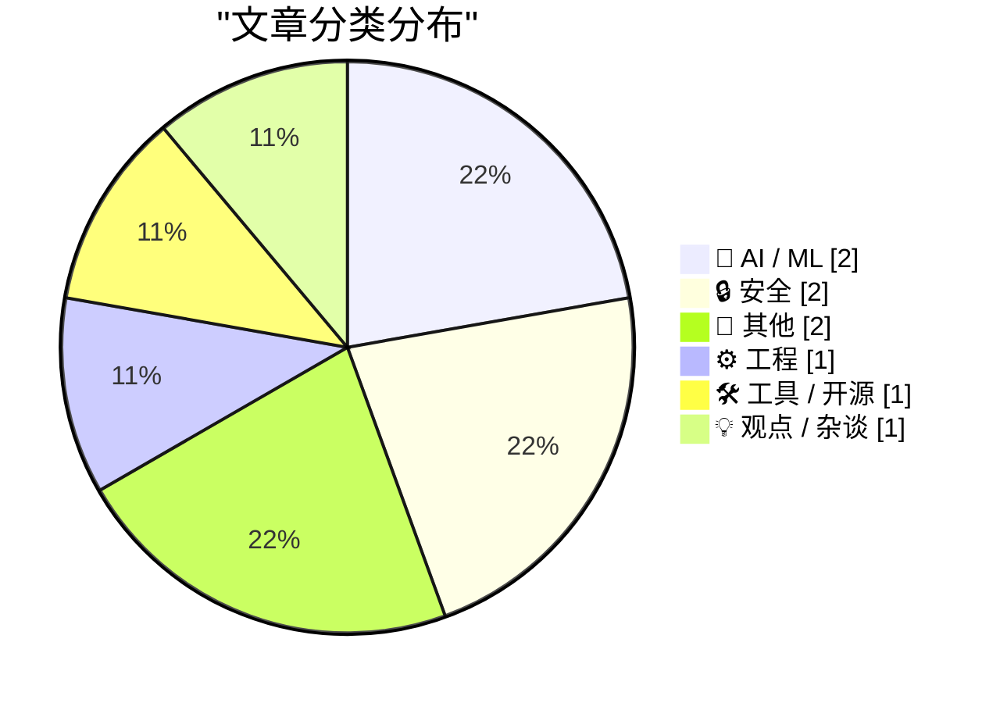
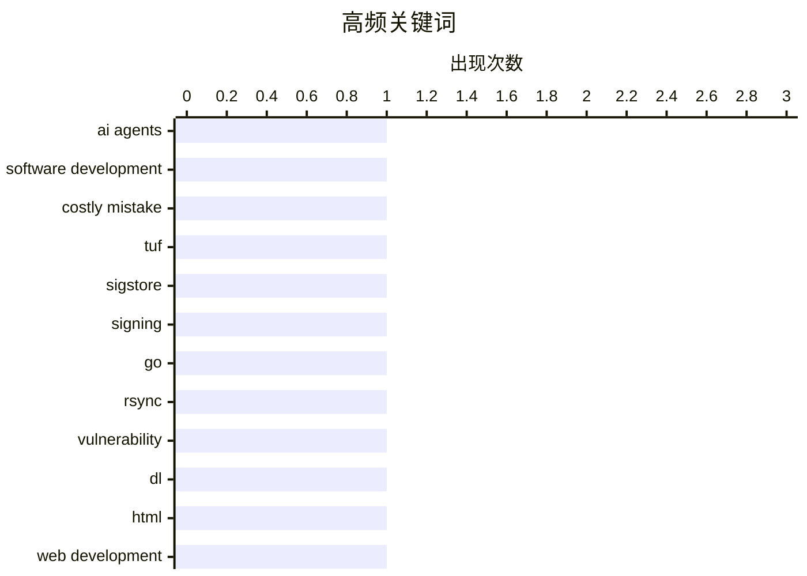

# 📰 AI 博客每日精选 — 2026-05-25

> 来自 Karpathy 推荐的 92 个顶级技术博客，AI 精选 Top 9

## 📝 今日看点

今日技术圈两大焦点：AI 工具的双刃剑效应与安全防御的隐性价值。一方面，AI 代理在软件开发中的高成本风险引发争议，其统计本质导致的错误隐蔽性正成为行业隐忧；另一方面，签名协议（如 Sigstore）等安全机制的价值在供应链攻击事件中被凸显，验证了事前防御的关键作用。此外，内存安全的 Go 语言实践和 AI 场景化交互（如遛狗访谈 Claude）则分别展现了工程创新与沟通技术的突破方向。

---

## 🏆 今日必读

🥇 **AI 代理在软件开发中的代价**

[The Eternal Sloptember](https://geohot.github.io//blog/jekyll/update/2026/05/24/the-eternal-sloptember.html) — geohot.github.io · 11 小时前 · 🤖 AI / ML

> 文章作者认为，将 AI 代理引入软件开发可能是历史上最昂贵的错误之一。AI 代理本质上是模仿编程分布的统计模型，无法真正编写代码，且其输出错误正变得越来越难以察觉。随着统计模型的准确性提高，这种“伪代码”问题反而更难被识别。作者警告，这一趋势可能给软件开发带来灾难性后果。

💡 **为什么值得读**: 对 AI 工具在开发中真实能力的批判性分析，揭示了当前技术乐观主义的潜在风险

🏷️ AI agents, software development, costly mistake

🥈 **签名协议：危机时刻才显价值**

[Signing is for the bad days](https://nesbitt.io/2026/05/24/signing-is-for-the-bad-days.html) — nesbitt.io · 8 小时前 · 🔒 安全

> 文章强调 TUF、in-toto 和 Sigstore 这类签名协议的价值只有在安全事件发生时才能体现。作者指出，这些机制平时看似多余，但在系统遭攻击或数据篡改时（如供应链攻击），它们提供的完整性验证和审计追踪才是关键防线。

💡 **为什么值得读**: 澄清了安全签名工具的实用场景，帮助开发者避免过度设计或忽视关键防护

🏷️ TUF, Sigstore, signing

🥉 **极简内存安全的 Go rsync 实现如何规避漏洞**

[How my minimal, memory-safe Go rsync steers clear of vulnerabilities](https://michael.stapelberg.ch/posts/2026-05-24-minimal-memory-safe-go-rsync-vulns/) — michael.stapelberg.ch · 3 小时前 · 🔒 安全

> Michael Stapelberg 分享了一个用 Go 编写的极简、内存安全的 rsync 实现，通过严格校验校验和长度避免了特定漏洞（引用 Google Security 报告）。该方案通过语言特性（Go 的内存安全）和代码设计双重保障，解决了传统 C/C++ 实现的校验和长度验证缺陷。

💡 **为什么值得读**: 展示了如何用现代语言特性重构经典工具，同时兼顾性能与安全性

🏷️ Go, rsync, vulnerability

---

## 📊 数据概览

| 扫描源 | 抓取文章 | 时间范围 | 精选 |
|:---:|:---:|:---:|:---:|
| 83/92 | 2467 篇 → 9 篇 | 24h | **9 篇** |

### 分类分布



### 高频关键词



<details>
<summary>📈 纯文本关键词图（终端友好）</summary>

```
ai agents            │ ████████████████████ 1
software development │ ████████████████████ 1
costly mistake       │ ████████████████████ 1
tuf                  │ ████████████████████ 1
sigstore             │ ████████████████████ 1
signing              │ ████████████████████ 1
go                   │ ████████████████████ 1
rsync                │ ████████████████████ 1
vulnerability        │ ████████████████████ 1
dl                   │ ████████████████████ 1
```

</details>

### 🏷️ 话题标签

**ai agents**(1) · **software development**(1) · **costly mistake**(1) · tuf(1) · sigstore(1) · signing(1) · go(1) · rsync(1) · vulnerability(1) · dl(1) · html(1) · web development(1) · claude(1) · ai(1) · simplification(1) · shinyhunters(1) · ransomware(1) · update(1) · pi(1) · earendil(1)

---

## 🤖 AI / ML

### 1. AI 代理在软件开发中的代价

[The Eternal Sloptember](https://geohot.github.io//blog/jekyll/update/2026/05/24/the-eternal-sloptember.html) — **geohot.github.io** · 11 小时前 · ⭐ 27/30

> 文章作者认为，将 AI 代理引入软件开发可能是历史上最昂贵的错误之一。AI 代理本质上是模仿编程分布的统计模型，无法真正编写代码，且其输出错误正变得越来越难以察觉。随着统计模型的准确性提高，这种“伪代码”问题反而更难被识别。作者警告，这一趋势可能给软件开发带来灾难性后果。

🏷️ AI agents, software development, costly mistake

---

### 2. 遛狗时的 Claude AI 访谈：解释复杂事物的艺术

[Walking the dog with Claude](http://xania.org/202605/walking-the-dog?utm_source=feed&amp;utm_medium=rss) — **xania.org** · 1 小时前 · ⭐ 23/30

> 文章记录了一场在遛狗途中进行的 AI 访谈，探讨如何用简单语言解释复杂概念。Claude 展现了生成自然对话的能力，而场景化互动（如结合遛狗环境）使抽象话题更生动，暗示 AI 辅助沟通的新可能性。

🏷️ Claude, AI, simplification

---

## 🔒 安全

### 3. 签名协议：危机时刻才显价值

[Signing is for the bad days](https://nesbitt.io/2026/05/24/signing-is-for-the-bad-days.html) — **nesbitt.io** · 8 小时前 · ⭐ 26/30

> 文章强调 TUF、in-toto 和 Sigstore 这类签名协议的价值只有在安全事件发生时才能体现。作者指出，这些机制平时看似多余，但在系统遭攻击或数据篡改时（如供应链攻击），它们提供的完整性验证和审计追踪才是关键防线。

🏷️ TUF, Sigstore, signing

---

### 4. 极简内存安全的 Go rsync 实现如何规避漏洞

[How my minimal, memory-safe Go rsync steers clear of vulnerabilities](https://michael.stapelberg.ch/posts/2026-05-24-minimal-memory-safe-go-rsync-vulns/) — **michael.stapelberg.ch** · 3 小时前 · ⭐ 25/30

> Michael Stapelberg 分享了一个用 Go 编写的极简、内存安全的 rsync 实现，通过严格校验校验和长度避免了特定漏洞（引用 Google Security 报告）。该方案通过语言特性（Go 的内存安全）和代码设计双重保障，解决了传统 C/C++ 实现的校验和长度验证缺陷。

🏷️ Go, rsync, vulnerability

---

## 📝 其他

### 5. Weekly Update 505：ShinyHunters 动态与 Instructure 勒索事件后续

[Weekly Update 505](https://www.troyhunt.com/weekly-update-505/) — **troyhunt.com** · 16 小时前 · ⭐ 20/30

> Troy Hunt 周报提到 ShinyHunters 自支付 Instructure 赎金后突然沉寂，距离首次传闻已过去两周。作者对比了此次事件与过往数据泄露响应速度，暗示勒索软件团伙行为模式的变化可能影响企业安全策略调整。

🏷️ ShinyHunters, ransomware, update

---

### 6. 史蒂夫·科尔留勇士队：乔丹式复出的启示录

[Why Steve Kerr Stayed With the Warriors](https://www.espn.com/nba/story/_/id/48686303/steve-kerr-decision-return-coach-golden-state-warriors-steph-curry) — **daringfireball.net** · 46 分钟前 · ⭐ 14/30

> ESPN 深度报道金州勇士队主教练史蒂夫·科尔拒绝效仿迈克尔·乔丹的反复退役决策，以避免球队陷入争怨。文章通过科尔与波波维奇等教练的对比，强调长期稳定的领导风格对团队文化的塑造作用，并隐含对管理层短期主义的反思。

🏷️ Steve Kerr, Warriors, profile

---

## ⚙️ 工程

### 7. 关于 <dl> 元素的隐藏细节

[On the <dl>](https://simonwillison.net/2026/May/23/on-the-dl/#atom-everything) — **simonwillison.net** · 21 小时前 · ⭐ 24/30

> Ben Meyer 的文章揭示了 HTML `<dl>` 元素四个鲜为人知的功能：`<dt>` 后可跟多个 `<dd>`；可用 `<div>` 包裹 `<dt>`/`<dd>` 组进行样式控制；支持 ARIA 标签；以及历史演变。这些特性常被开发者忽略，但能提升语义化和可访问性。

🏷️ dl, HTML, web development

---

## 🛠 工具 / 开源

### 8. Pi 项目自反：用 Pi 维护 Pi 的趣事

[Building Pi With Pi](https://lucumr.pocoo.org/2026/5/24/pi-oss/) — **lucumr.pocoo.org** · 18 小时前 · ⭐ 19/30

> Luca Rossi 反思 Earendil 项目中 Pi 工具的使用体验，描述如何用自身开发的工具（Pi）管理自己的项目（Pi）。重点提及“Slop Issues”（混乱问题跟踪）现象，即开源社区中自动化工具可能加剧而非简化协作问题，引发对 AI 代理在开源治理中副作用的思考。

🏷️ Pi, Earendil, Open Source

---

## 💡 观点 / 杂谈

### 9. 童年计算机回忆：跨越时代的数字怀旧

[Childhood Computing](https://susam.net/childhood-computing.html) — **susam.net** · 18 小时前 · ⭐ 18/30

> Susam Net 通过对比 Lily Things 作者的童年计算经历，回溯自己 1992 年（8 岁）转学接触计算机的早期记忆。文章以个人叙事展现技术代际差异，强调即使对资深开发者而言，早期硬件限制（如 1990 年代设备）仍具独特情感价值。

🏷️ childhood computing, nostalgia, technology

---

*生成于 2026-05-25 02:14 (Asia/Shanghai) | 扫描 83 源 → 获取 2467 篇 → 精选 9 篇*
*基于 [Hacker News Popularity Contest 2025](https://refactoringenglish.com/tools/hn-popularity/) RSS 源列表，由 [Andrej Karpathy](https://x.com/karpathy) 推荐*
*由「懂点儿AI」制作，欢迎关注同名微信公众号获取更多 AI 实用技巧 💡*
