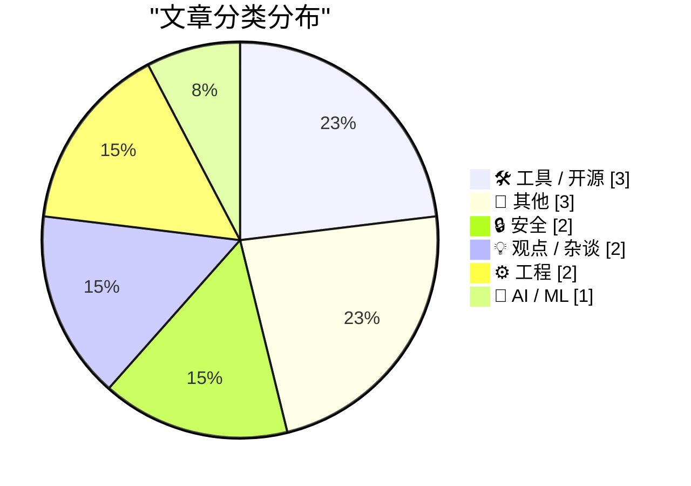
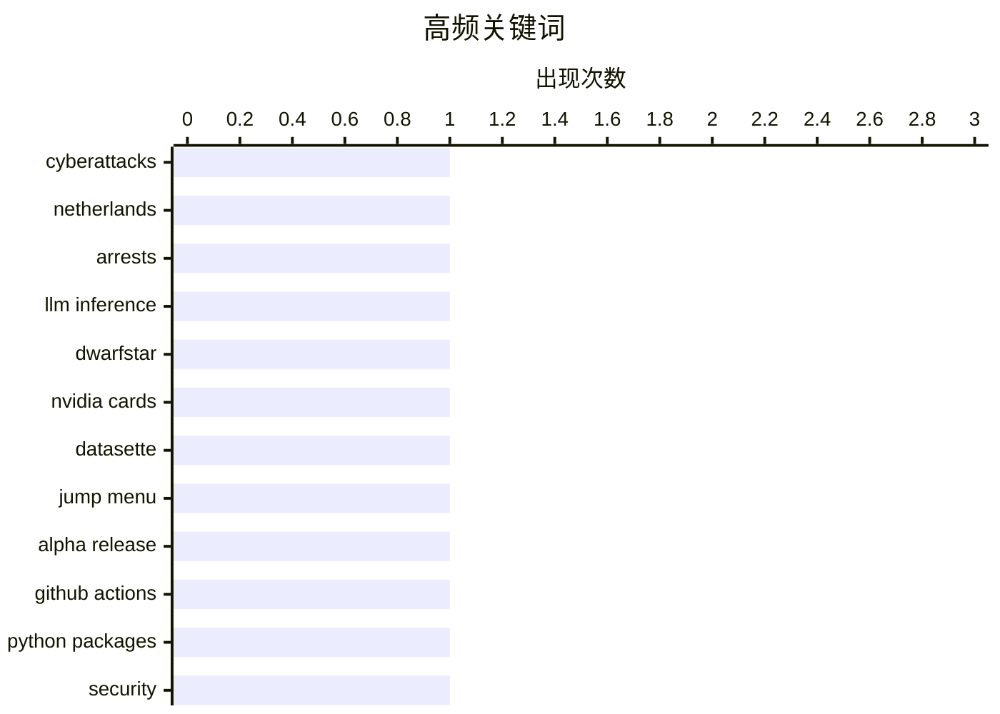

# 📰 AI 博客每日精选 — 2026-05-26

> 来自 Karpathy 推荐的 92 个顶级技术博客，AI 精选 Top 13

## 📝 今日看点

今日技术圈聚焦两大趋势：一是网络安全持续升级，荷兰当局打击跨境网络犯罪基础设施，同时GitHub Actions安全实践引发开发者对代码供应链保护的重视；二是AI与工具链创新加速，低成本LLM推理方案（如Apple硬件应用）和Datasette生态新工具（支持Agent交互的测试数据库填充工具）成为热点。此外，广告行业伦理争议与时区处理的工程化平衡问题也引发广泛讨论。

---

## 🏆 今日必读

🥇 **荷兰查封800台服务器，逮捕2人协助网络攻击**

[Netherlands Seizes 800 Servers, Arrests 2 for Aiding Cyberattacks](https://krebsonsecurity.com/2026/05/netherlands-seizes-800-servers-arrests-2-for-aiding-cyberattacks/) — krebsonsecurity.com · 5 小时前 · 🔒 安全

> 荷兰当局逮捕了两家互联网托管公司的共同所有者，指控其运营俄罗斯用于在欧盟发动网络攻击、影响操作和虚假宣传活动的IT基础设施。这两家公司此前因接管被欧盟制裁的Stark Industries Solutions的技术基础设施而引发关注。此次行动涉及查封800台服务器，凸显了国际网络安全执法的力度。

💡 **为什么值得读**: 此事件揭示了跨国网络犯罪的新动向及执法机构的强硬应对，对网络安全从业者具有重要警示意义。

🏷️ cyberattacks, Netherlands, arrests

🥈 **DwarfStar中分发LLM推理的替代方案**

[Distributing LLM inference in DwarfStar](http://antirez.com/news/167) — antirez.com · 4 小时前 · 🤖 AI / ML

> 文章探讨了在高成本NVIDIA显卡和配套服务器外，如何以较低成本运行大规模模型（LLMs）的替代方案。指出Apple硬件和DGX Spark虽受限于内存带宽，但能实现快速的prompt处理；Mac Studio则提供高达512GB统一内存，价格更具竞争力。

💡 **为什么值得读**: 为希望降低大模型部署成本的团队提供了高性价比硬件选型参考。

🏷️ LLM inference, DwarfStar, NVIDIA cards

🥉 **Datasette 1.0a30发布：新增可定制“跳转”菜单**

[datasette 1.0a30](https://simonwillison.net/2026/May/24/datasette/#atom-everything) — simonwillison.net · 19 小时前 · 🛠 工具 / 开源

> Datasette 1.0a30版本推出重要新功能：支持自定义“跳转到...”菜单，用户可通过访问latest.datasette.io的根路径体验该功能。这是继JavaScript插件hook makeJumpSections()之后，进一步提升用户体验的关键改进。

💡 **为什么值得读**: 该升级简化了数据浏览流程，尤其适合需要频繁跨表查询的数据分析场景。

🏷️ datasette, jump menu, alpha release

---

## 📊 数据概览

| 扫描源 | 抓取文章 | 时间范围 | 精选 |
|:---:|:---:|:---:|:---:|
| 83/92 | 2469 篇 → 13 篇 | 24h | **13 篇** |

### 分类分布



### 高频关键词



<details>
<summary>📈 纯文本关键词图（终端友好）</summary>

```
cyberattacks   │ ████████████████████ 1
netherlands    │ ████████████████████ 1
arrests        │ ████████████████████ 1
llm inference  │ ████████████████████ 1
dwarfstar      │ ████████████████████ 1
nvidia cards   │ ████████████████████ 1
datasette      │ ████████████████████ 1
jump menu      │ ████████████████████ 1
alpha release  │ ████████████████████ 1
github actions │ ████████████████████ 1
```

</details>

### 🏷️ 话题标签

**cyberattacks**(1) · **netherlands**(1) · **arrests**(1) · llm inference(1) · dwarfstar(1) · nvidia cards(1) · datasette(1) · jump menu(1) · alpha release(1) · github actions(1) · python packages(1) · security(1) · workos(1) · agents(1) · integrations(1) · datasette-agent(1) · javascript plugins(1) · makejumpsections(1) · ad-tech(1) · enshittification(1)

---

## 🛠 工具 / 开源

### 1. Datasette 1.0a30发布：新增可定制“跳转”菜单

[datasette 1.0a30](https://simonwillison.net/2026/May/24/datasette/#atom-everything) — **simonwillison.net** · 19 小时前 · ⭐ 24/30

> Datasette 1.0a30版本推出重要新功能：支持自定义“跳转到...”菜单，用户可通过访问latest.datasette.io的根路径体验该功能。这是继JavaScript插件hook makeJumpSections()之后，进一步提升用户体验的关键改进。

🏷️ datasette, jump menu, alpha release

---

### 2. datasette-agent 0.1a4：基于新JavaScript插件的Agent功能

[datasette-agent 0.1a4](https://simonwillison.net/2026/May/24/datasette-agent/#atom-everything) — **simonwillison.net** · 19 小时前 · ⭐ 20/30

> 利用Datasette 1.0a30新增的makeJumpSections() JavaScript插件，datasette-agent 0.1a4实现了“启动新Agent对话”功能，进一步扩展了Datasette生态的交互能力。

🏷️ datasette-agent, javascript plugins, makeJumpSections

---

### 3. datasette-fixtures 0.1a0：测试数据库填充工具

[datasette-fixtures 0.1a0](https://simonwillison.net/2026/May/24/datasette-fixtures/#atom-everything) — **simonwillison.net** · 21 小时前 · ⭐ 18/30

> Datasette 1.0a30附带新工具datasette-fixtures 0.1a0，提供populate_fixture_database(conn)辅助函数，用于测试环境中快速填充模拟数据库，提升插件开发和测试效率。

🏷️ datasette-fixtures, small feature, Datasette 1.0a30

---

## 📝 其他

### 4. 为何我无法忍受“driven”一词

[Why I can't stand the word "driven"](https://www.joanwestenberg.com/why-i-cant-stand-the-word-driven/) — **joanwestenberg.com** · 18 小时前 · ⭐ 14/30

> 文章通过历史事件探讨词汇“driven”的隐含问题。作者以Harry Readford偷牛并驱赶数千头牲畜穿越澳大利亚荒漠的真实事件为例，指出“driven”常暗含被动、机械化的意味，与主动掌控形成对比。文中批评该词掩盖了决策中的真实能动性，尤其在商业语境中易导致责任模糊。结论认为应避免使用“driven”，转而强调具体行动者及其选择。

🏷️ driven, Harry Readford, cattle theft

---

### 5. ‘OK’的起源史

[The History of ‘OK’](https://www.merriam-webster.com/wordplay/the-hilarious-history-of-ok-okay) — **daringfireball.net** · 1 小时前 · ⭐ 13/30

> 文章追溯“OK”作为流行语的起源，聚焦19世纪20-30年代的拼写风潮。当时幽默作家故意用错误拼写（如Kewl、rite）模仿乡巴佬形象，导致短语“no go”演变为“know go”，“all right”缩写为“O.W.”，最终“all correct”简化为“o.k.”。这一演变反映了美国早期语言文化中对俚语和简化的追捧，如今已成为全球通用表达。

🏷️ history of 'OK', linguistic fad, misspellings

---

### 6. 量子链接：AOL的前身

[Quantum Link: AOL before it was AOL](https://dfarq.homeip.net/quantum-link-aol-before-it-was-aol/?utm_source=rss&#038;utm_medium=rss&#038;utm_campaign=quantum-link-aol-before-it-was-aol) — **dfarq.homeip.net** · 7 小时前 · ⭐ 13/30

> 文章介绍1985年Control Video公司重组后推出的Quantum Link（Q-Link），这是AOL的前身。1980年代拥有Commodore电脑和调制解调器的用户曾通过该平台联网，标志着早期互联网服务的雏形。文中强调其技术先驱地位，以及从Q-Link到AOL的品牌演变过程。

🏷️ Quantum Link, AOL, history

---

## 🔒 安全

### 7. 荷兰查封800台服务器，逮捕2人协助网络攻击

[Netherlands Seizes 800 Servers, Arrests 2 for Aiding Cyberattacks](https://krebsonsecurity.com/2026/05/netherlands-seizes-800-servers-arrests-2-for-aiding-cyberattacks/) — **krebsonsecurity.com** · 5 小时前 · ⭐ 27/30

> 荷兰当局逮捕了两家互联网托管公司的共同所有者，指控其运营俄罗斯用于在欧盟发动网络攻击、影响操作和虚假宣传活动的IT基础设施。这两家公司此前因接管被欧盟制裁的Stark Industries Solutions的技术基础设施而引发关注。此次行动涉及查封800台服务器，凸显了国际网络安全执法的力度。

🏷️ cyberattacks, Netherlands, arrests

---

### 8. GitHub Actions在Python包中的安全实践

[GitHub Actions security in Python packages](https://nesbitt.io/2026/05/25/github-actions-security-in-python-packages.html) — **nesbitt.io** · 8 小时前 · ⭐ 24/30

> 文章未完整提供内容，仅提及致谢Dr. Zizmor，推测可能讨论如何在Python包中使用GitHub Actions时保障安全性，如权限控制、依赖扫描等关键措施。

🏷️ GitHub Actions, Python packages, security

---

## 💡 观点 / 杂谈

### 9. WorkOS：‘Agent需要上下文，集成即交付’

[WorkOS: ‘Agents Need Context. Ship the Integrations That Give It to Them.’](https://workos.com/docs/pipes?utm_source=daringfireball&amp;utm_medium=newsletter&amp;utm_campaign=q22026) — **daringfireball.net** · 3 小时前 · ⭐ 21/30

> WorkOS提出多阶段AI Agent的核心痛点在于缺乏实时上下文访问，需通过预建集成（如GitHub、Slack、Salesforce）解决OAuth和令牌生命周期问题。WorkOS Pipes平台直接连接用户常用工具，避免多周开发延迟。

🏷️ WorkOS, agents, integrations

---

### 10. Pluralistic：广告技术界的‘无荣誉’现象（2026年5月25日）

[Pluralistic: No honor among (ad-tech) thieves (25 May 2026)](https://pluralistic.net/2026/05/25/lying-spies/) — **pluralistic.net** · 10 小时前 · ⭐ 20/30

> 文章揭露广告技术行业存在系统性欺骗行为，包括虚假追踪、数据垄断和算法操纵，并列举多个案例（如Budweiser nunchucks、GOP投票违规等），批判行业伦理缺失与权力滥用。

🏷️ ad-tech, enshittification, pluralistic

---

## ⚙️ 工程

### 11. PHP：脚本结束后发送HTTP头部的简易方法

[PHP - simple way to send HTTP headers before a script ends](https://shkspr.mobi/blog/2026/05/php-simple-way-to-send-http-headers-before-a-script-ends/) — **shkspr.mobi** · 7 小时前 · ⭐ 19/30

> 文章介绍了一种在PHP脚本执行完毕后仍能发送HTTP头部（如重定向）的技术方案，解决了传统header()函数因脚本继续执行导致头部失效的问题，适用于需立即响应后仍进行后台操作的场景。

🏷️ PHP, HTTP headers, script ends

---

### 12. FediMeteo与时区处理：不破坏现有系统的艺术

[FediMeteo, timezones, and the art of not breaking what already works](https://it-notes.dragas.net/2026/05/25/fedimeteo-timezones-and-the-art-of-not-breaking-what-already-works/) — **it-notes.dragas.net** · 9 小时前 · ⭐ 18/30

> 作者分享维护FediMeteo（全球天气服务）时遇到的时区处理挑战，强调在系统升级中保持向后兼容的重要性，并通过HAProxy等技术实现平滑过渡，避免影响现有用户。

🏷️ timezones, FediMeteo, software maintenance

---

## 🤖 AI / ML

### 13. DwarfStar中分发LLM推理的替代方案

[Distributing LLM inference in DwarfStar](http://antirez.com/news/167) — **antirez.com** · 4 小时前 · ⭐ 26/30

> 文章探讨了在高成本NVIDIA显卡和配套服务器外，如何以较低成本运行大规模模型（LLMs）的替代方案。指出Apple硬件和DGX Spark虽受限于内存带宽，但能实现快速的prompt处理；Mac Studio则提供高达512GB统一内存，价格更具竞争力。

🏷️ LLM inference, DwarfStar, NVIDIA cards

---

*生成于 2026-05-26 02:55 (Asia/Shanghai) | 扫描 83 源 → 获取 2469 篇 → 精选 13 篇*
*基于 [Hacker News Popularity Contest 2025](https://refactoringenglish.com/tools/hn-popularity/) RSS 源列表，由 [Andrej Karpathy](https://x.com/karpathy) 推荐*
*由「懂点儿AI」制作，欢迎关注同名微信公众号获取更多 AI 实用技巧 💡*
