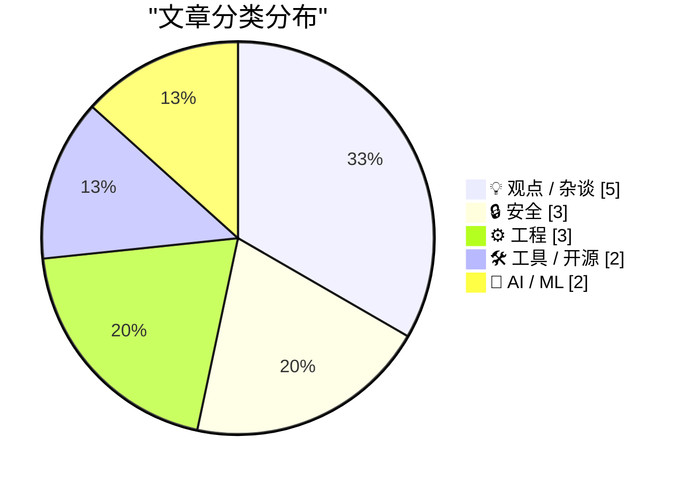
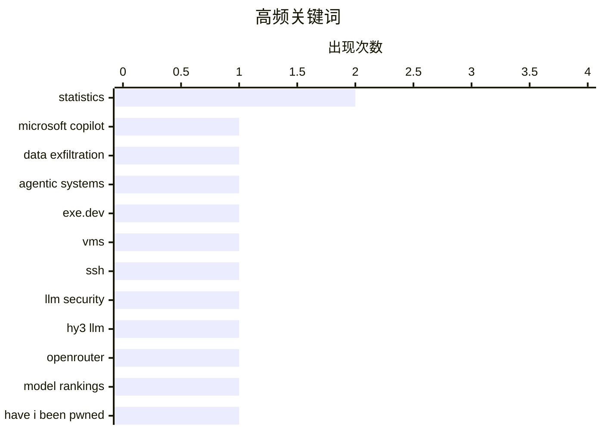

# 📰 AI 博客每日精选 — 2026-05-27

> 来自 Karpathy 推荐的 92 个顶级技术博客，AI 精选 Top 15

## 📝 今日看点

今日技术圈聚焦两大趋势：**AI安全与伦理治理**成为核心议题，微软Copilot数据外泄风险引发对智能代理系统安全的警示，梵蒂冈发布教皇关于AI伦理的通谕则凸显全球对AI社会影响的深度思考；同时，**工具创新加速代理时代落地**，如exe.dev推出云计算机平台解决密钥安全难题，而Hy3 LLM在模型排名的突进也反映了大模型性能竞争的白热化。此外，AI泡沫与互联网泡沫的差异讨论、新兴术语引发的文化争议等观点性内容持续发酵，折射出技术发展的多维碰撞。

---

## 🏆 今日必读

🥇 **微软 Copilot Cowork 文件外泄问题**

[Microsoft Copilot Cowork Exfiltrates Files](https://simonwillison.net/2026/May/26/copilot-cowork-exfiltrates-files/#atom-everything) — simonwillison.net · 3 小时前 · 🔒 安全

> 文章指出，微软的 Copilot Cowork 产品存在数据外泄风险。该产品允许智能代理系统访问敏感文件，可能使攻击者得以窃取数据。作者强调，设计智能代理系统时，防止数据外泄仍是最大挑战。微软的产品名称和具体功能被详细提及，以说明问题的严重性。结论是，开发者需加强对这类产品的安全审查。

💡 **为什么值得读**: 值得读，因为它揭示了当前AI工具中普遍存在的安全隐患，对开发者和企业有实际警示意义。

🏷️ Microsoft Copilot, data exfiltration, agentic systems

🥈 **exe.dev：面向代理时代的云计算机平台**

[[Sponsor] exe.dev](https://exe.dev/?df) — daringfireball.net · 19 小时前 · 🛠 工具 / 开源

> exe.dev 是一个专为代理时代设计的云平台，提供预配置SSH、root权限和Web认证的虚拟机池。其核心特点是网络边缘注入密钥，避免密钥泄露到LLM环境中。支持持久服务器、内部工具和临时开发环境，满足多样化需求。

💡 **为什么值得读**: 值得读，因为它提供了一个安全的、灵活的云开发环境解决方案，适合需要隔离敏感数据的开发者。

🏷️ exe.dev, VMs, SSH, LLM security

🥉 **Hy3 LLM为何在OpenRouter模型排名中大幅领先？**

[The mysterious Hy3 LLM is topping OpenRouter Model Rankings by a large margin](https://minimaxir.com/2026/05/openrouter-hy3/) — minimaxir.com · 4 小时前 · 🤖 AI / ML

> 文章探讨了Hy3 LLM为何在OpenRouter模型排名中显著领先的问题。尽管未明确解释原因，但暗示Hy3可能在性能或效率方面有独特优势。排名结果引发了关于该模型技术细节的猜测和讨论。

💡 **为什么值得读**: 值得读，因为Hy3的崛起可能预示着新一代大模型的突破方向，对行业有前瞻性参考价值。

🏷️ Hy3 LLM, OpenRouter, model rankings

---

## 📊 数据概览

| 扫描源 | 抓取文章 | 时间范围 | 精选 |
|:---:|:---:|:---:|:---:|
| 84/92 | 2488 篇 → 22 篇 | 24h | **15 篇** |

### 分类分布



### 高频关键词



<details>
<summary>📈 纯文本关键词图（终端友好）</summary>

```
statistics        │ ████████████████████ 2
microsoft copilot │ ██████████░░░░░░░░░░ 1
data exfiltration │ ██████████░░░░░░░░░░ 1
agentic systems   │ ██████████░░░░░░░░░░ 1
exe.dev           │ ██████████░░░░░░░░░░ 1
vms               │ ██████████░░░░░░░░░░ 1
ssh               │ ██████████░░░░░░░░░░ 1
llm security      │ ██████████░░░░░░░░░░ 1
hy3 llm           │ ██████████░░░░░░░░░░ 1
openrouter        │ ██████████░░░░░░░░░░ 1
```

</details>

### 🏷️ 话题标签

**statistics**(2) · **microsoft copilot**(1) · **data exfiltration**(1) · agentic systems(1) · exe.dev(1) · vms(1) · ssh(1) · llm security(1) · hy3 llm(1) · openrouter(1) · model rankings(1) · have i been pwned(1) · bhutan(1) · cirt(1) · ai bubble(1) · internet bubble(1) · workers(1) · macos(1) · clipboard(1) · terminal(1)

---

## 💡 观点 / 杂谈

### 1. AI泡沫不同于互联网泡沫

[Pluralistic: The AI bubble isn't like the internet bubble (26 May 2026)](https://pluralistic.net/2026/05/26/the-ai-will-continue/) — **pluralistic.net** · 9 小时前 · ⭐ 23/30

> 文章对比了AI泡沫与历史上的互联网泡沫，指出两者本质不同：互联网无需强制向工人灌输内容。作者还列举了多个社会现象，如网站坟场、反图书馆员运动等，并预告了未来演讲行程。

🏷️ AI bubble, internet bubble, workers

---

### 2. 引用保罗·格雷厄姆的观点

[Quoting Paul Graham](https://simonwillison.net/2026/May/26/paul-graham/#atom-everything) — **simonwillison.net** · 4 小时前 · ⭐ 21/30

> 保罗·格雷厄姆指出，许多创始人现在通过AI撰写邮件，采用了一种以前不存在的强硬新闻风格。一旦意识到邮件由AI生成，人们往往选择忽略。他从未完整阅读过由人类签名但由AI撰写的邮件，感觉像是在被欺骗。

🏷️ Paul Graham, AI writing, founders

---

### 3. “Clanker”一词引发的争议

[Clanker: A Word For The Machine](https://lucumr.pocoo.org/2026/5/26/clankers/) — **lucumr.pocoo.org** · 19 小时前 · ⭐ 21/30

> 作者在博客中使用“clanker”作为“agent”的替代词，引发强烈反应，部分人认为这个词带有冒犯性，甚至联想到种族歧视词汇。作者意识到需要明确定义该词的含义以避免误解。

🏷️ clanker, agent, Hacker News

---

### 4. 商业智者的复仇

[Revenge of The Business Idiot](https://www.wheresyoured.at/the-revenge-of-the-business-idiot/) — **wheresyoured.at** · 2 小时前 · ⭐ 21/30

> 文章介绍了一个名为'wheresyoured.at'的付费新闻通讯，年费70美元或月费7美元。每期包含5,000至18,000字的深度分析，内容涉及NVIDIA、Anthropic等科技公司的详细解析。作者通过订阅此服务获取前沿商业和技术洞察。

🏷️ NVIDIA, Anthropic, business analysis

---

### 5. 引用Corey Quinn的话

[Quoting Corey Quinn](https://simonwillison.net/2026/May/26/corey-quinn/#atom-everything) — **simonwillison.net** · 17 小时前 · ⭐ 15/30

> 文章引用了Corey Quinn的一段话，讽刺性地描述了Anthropic联合创始人Christopher Olah将产品技术限制“神圣化”的行为。Quinn称这是他见过最极端的厂商游说行为之一，暗示这种举动过于夸张和不切实际。

🏷️ vendor lobbying, technical limitations, Pope

---

## 🔒 安全

### 6. 微软 Copilot Cowork 文件外泄问题

[Microsoft Copilot Cowork Exfiltrates Files](https://simonwillison.net/2026/May/26/copilot-cowork-exfiltrates-files/#atom-everything) — **simonwillison.net** · 3 小时前 · ⭐ 26/30

> 文章指出，微软的 Copilot Cowork 产品存在数据外泄风险。该产品允许智能代理系统访问敏感文件，可能使攻击者得以窃取数据。作者强调，设计智能代理系统时，防止数据外泄仍是最大挑战。微软的产品名称和具体功能被详细提及，以说明问题的严重性。结论是，开发者需加强对这类产品的安全审查。

🏷️ Microsoft Copilot, data exfiltration, agentic systems

---

### 7. 不丹政府加入Have I Been Pwned免费政府服务

[Welcoming the Bhutanese Government to Have I Been Pwned](https://www.troyhunt.com/welcoming-the-bhutanese-government-to-have-i-been-pwned/) — **troyhunt.com** · 20 小时前 · ⭐ 24/30

> 不丹政府成为第45个接入Have I Been Pwned（HIBP）免费政府服务的国家。不丹计算机应急响应团队（BtCIRT）获得权限，可监控本国政府域名与HIBP数据库的数据匹配。此举旨在提升国家网络安全威胁监测能力。

🏷️ Have I Been Pwned, Bhutan, CIRT

---

### 8. Amber警报中的垃圾URL？

[Amber Alert with Spam URL?](https://idiallo.com/byte-size/amber-alert-with-spam-link?src=feed) — **idiallo.com** · 16 小时前 · ⭐ 18/30

> 文章描述了一起异常事件：用户收到一条Amber警报，但链接指向一个可疑的3GP文件转换网站。作者推测这可能是由于加州公路巡逻队超过了紧急服务警报的最大字符限制导致的错误。警报内容涉及Daleza Fregoso于2026年5月24日失踪的信息。

🏷️ Amber Alert, spam URL, phishing

---

## ⚙️ 工程

### 9. t分布的90%区间

[90 % of the t distribution](https://entropicthoughts.com/ninety-percent-of-the-t-distribution) — **entropicthoughts.com** · 21 小时前 · ⭐ 21/30

> 文章讲述了统计学家William Sealy Gosset的故事，他在吉尼斯啤酒厂工作时改进了当时的统计方法，并发明了t分布等至今仍广泛使用的新统计方法。由于保密要求，他以笔名Student发表成果。

🏷️ t-distribution, statistics, Guinness

---

### 10. 解决棋盘游戏Quoridor

[Solving the board game Quoridor](https://grantslatton.com/solving-quoridor) — **grantslatton.com** · 23 小时前 · ⭐ 21/30

> 文章探讨了一种算法和优化方法来解决复杂的棋盘游戏Quoridor。作者展示了如何通过编程策略和优化技术来高效地处理游戏中的路径规划和障碍设置问题。这种方法不仅适用于Quoridor，还可推广到其他类似的游戏。

🏷️ Quoridor, algorithm, optimization

---

### 11. 计算正态样本的期望范围

[Calculating the expected range of normal samples](https://www.johndcook.com/blog/2026/05/26/calculating-expected-normal-range/) — **johndcook.com** · 1 小时前 · ⭐ 18/30

> 文章扩展了之前关于陪审团IQ范围的讨论，重点介绍了如何计算从标准正态分布N(0,1)中抽取n个样本的期望范围。结果以σ为单位，若实际σ不为1，需乘以相应值。这是统计学中一个重要的理论问题。

🏷️ normal distribution, expected range, statistics

---

## 🛠 工具 / 开源

### 12. exe.dev：面向代理时代的云计算机平台

[[Sponsor] exe.dev](https://exe.dev/?df) — **daringfireball.net** · 19 小时前 · ⭐ 26/30

> exe.dev 是一个专为代理时代设计的云平台，提供预配置SSH、root权限和Web认证的虚拟机池。其核心特点是网络边缘注入密钥，避免密钥泄露到LLM环境中。支持持久服务器、内部工具和临时开发环境，满足多样化需求。

🏷️ exe.dev, VMs, SSH, LLM security

---

### 13. 将远程命令输出复制到macOS剪贴板

[Copying Remote Command Output to Your macOS Clipboard](https://it-notes.dragas.net/2026/05/26/copying-remote-command-output-to-your-macos-clipboard/) — **it-notes.dragas.net** · 10 小时前 · ⭐ 23/30

> 文章介绍了一个实用的macOS终端技巧：使用`pbcopy`命令可将任何标准输入内容复制到剪贴板。例如，在shell中运行命令后，输出可直接粘贴，极大提升了工作效率。作者特别赞赏Apple设备的易用性。

🏷️ macOS, clipboard, terminal

---

## 🤖 AI / ML

### 14. Hy3 LLM为何在OpenRouter模型排名中大幅领先？

[The mysterious Hy3 LLM is topping OpenRouter Model Rankings by a large margin](https://minimaxir.com/2026/05/openrouter-hy3/) — **minimaxir.com** · 4 小时前 · ⭐ 26/30

> 文章探讨了Hy3 LLM为何在OpenRouter模型排名中显著领先的问题。尽管未明确解释原因，但暗示Hy3可能在性能或效率方面有独特优势。排名结果引发了关于该模型技术细节的猜测和讨论。

🏷️ Hy3 LLM, OpenRouter, model rankings

---

### 15. 教皇利奥十四世关于AI的通谕笔记

[Notes on Pope Leo XIV's encyclical on AI](https://simonwillison.net/2026/May/25/encyclical-on-ai/#atom-everything) — **simonwillison.net** · 19 小时前 · ⭐ 22/30

> 梵蒂冈今日发布教皇利奥十四世关于AI伦理的通谕《Magnifica Humanitas》，这是目前最清晰的AI伦理整合现代社会的论述之一。文章提到该通谕延续了利奥十三世的思想传统，引发广泛关注。

🏷️ Vatican, AI ethics, encyclical

---

*生成于 2026-05-27 03:30 (Asia/Shanghai) | 扫描 84 源 → 获取 2488 篇 → 精选 15 篇*
*基于 [Hacker News Popularity Contest 2025](https://refactoringenglish.com/tools/hn-popularity/) RSS 源列表，由 [Andrej Karpathy](https://x.com/karpathy) 推荐*
*由「懂点儿AI」制作，欢迎关注同名微信公众号获取更多 AI 实用技巧 💡*
