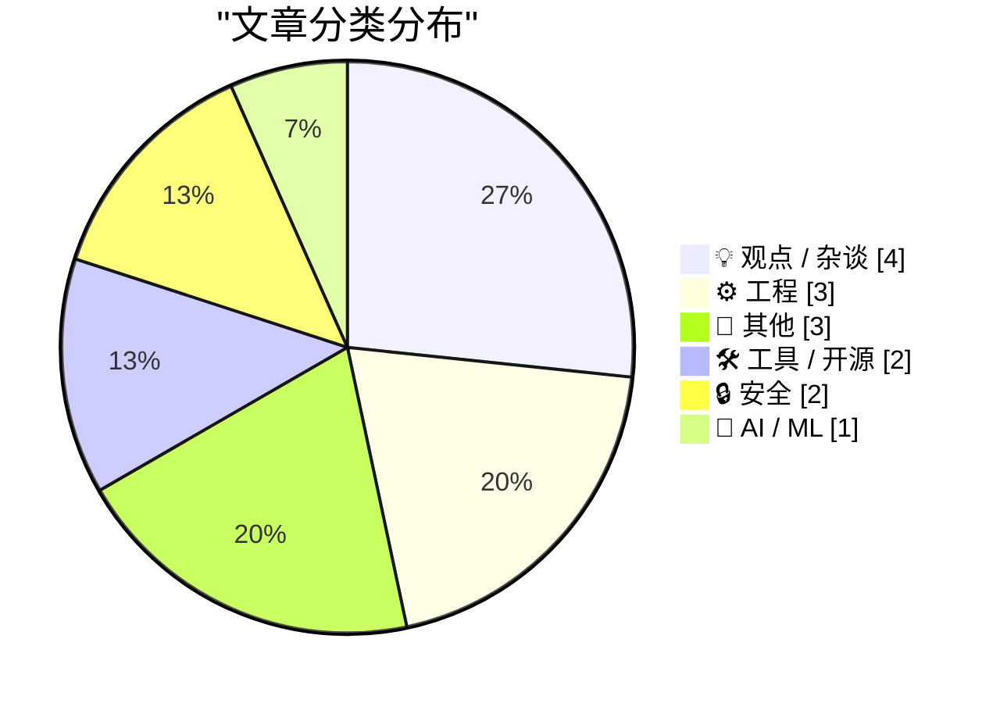
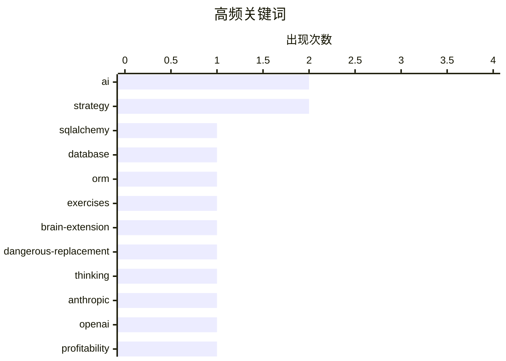

# 📰 AI 博客每日精选 — 2026-05-28

> 来自 Karpathy 推荐的 92 个顶级技术博客，AI 精选 Top 15

## 📝 今日看点

今日技术圈聚焦两大核心趋势：AI的伦理争议与产业落地风险，以及开源生态的技术演进。一方面，多篇观点文章警示AI过度依赖可能引发认知退化（如《使用我的大脑》），并探讨其对社会结构的颠覆性影响（如无移民世界预言）；另一方面，OpenAI与Anthropic的盈利传闻叠加企业LLM成本激增，凸显AI商业化进程中的新挑战。技术领域则呈现活跃创新，从macOS磁盘测试工具升级（iozone补丁）到CHAOSS指标优化，均体现开发者对效率与人性化协作的追求，而数学建模在品牌设计中的应用（Meta曲线拟合）也展现了跨学科技术的实用价值。

---

## 🏆 今日必读

🥇 **《SQLAlchemy 2实战》习题解答**

[SQLAlchemy 2 In Practice - Solutions to the Exercises](https://blog.miguelgrinberg.com/post/sqlalchemy-2-in-practice---solutions-to-the-exercises) — miguelgrinberg.com · 13 分钟前 · 🛠 工具 / 开源

> 本文是Miguel Grinberg的《SQLAlchemy 2 in Practice》系列的收官之作，提供了书中所有编程练习的完整解决方案。文章鼓励读者通过购买书籍支持作者，并提供了直接购买链接和亚马逊购买选项。内容不涉及技术细节，仅作为学习资源的补充说明。

💡 **为什么值得读**: 适合需要SQLAlchemy 2实践教程习题答案的学习者，可直接获取官方配套资源。

🏷️ SQLAlchemy, database, ORM, exercises

🥈 **使用我的大脑（AI替代思考的危险）**

[Using My Fucking Brain](https://terriblesoftware.org/2026/05/27/using-my-fucking-brain/) — terriblesoftware.org · 6 小时前 · 💡 观点 / 杂谈

> 作者警告当AI悄然取代人类思考功能时会产生危险，强调AI应作为思维延伸而非替代品。文章以直白语言指出过度依赖AI可能导致认知能力退化，呼吁保持独立思考的重要性。

💡 **为什么值得读**: 对关注AI伦理与认知发展的读者具有警示意义，揭示技术依赖的潜在风险。

🏷️ AI, brain-extension, dangerous-replacement, thinking

🥉 **OpenAI与Anthropic已找到产品市场契合点？**

[I think Anthropic and OpenAI have found product-market fit](https://simonwillison.net/2026/May/27/product-market-fit/#atom-everything) — simonwillison.net · 2 小时前 · 🤖 AI / ML

> 文章援引传闻称Anthropic即将实现首个盈利季度，同时指出企业因员工使用LLM导致成本激增。作者认为OpenAI和Anthropic均成功实现了产品与市场需求的匹配，但高使用成本可能成为新挑战。

💡 **为什么值得读**: 为关注AI商业化进展的企业决策者提供行业动态与成本预警。

🏷️ Anthropic, OpenAI, profitability, product-market-fit

---

## 📊 数据概览

| 扫描源 | 抓取文章 | 时间范围 | 精选 |
|:---:|:---:|:---:|:---:|
| 83/92 | 2479 篇 → 15 篇 | 24h | **15 篇** |

### 分类分布



### 高频关键词



<details>
<summary>📈 纯文本关键词图（终端友好）</summary>

```
ai                    │ ████████████████████ 2
strategy              │ ████████████████████ 2
sqlalchemy            │ ██████████░░░░░░░░░░ 1
database              │ ██████████░░░░░░░░░░ 1
orm                   │ ██████████░░░░░░░░░░ 1
exercises             │ ██████████░░░░░░░░░░ 1
brain-extension       │ ██████████░░░░░░░░░░ 1
dangerous-replacement │ ██████████░░░░░░░░░░ 1
thinking              │ ██████████░░░░░░░░░░ 1
anthropic             │ ██████████░░░░░░░░░░ 1
```

</details>

### 🏷️ 话题标签

**ai**(2) · **strategy**(2) · **sqlalchemy**(1) · database(1) · orm(1) · exercises(1) · brain-extension(1) · dangerous-replacement(1) · thinking(1) · anthropic(1) · openai(1) · profitability(1) · product-market-fit(1) · migrants(1) · solipsism(1) · migration-policy(1) · solvinity(1) · kyndryl(1) · government intervention(1) · cybersecurity(1)

---

## 💡 观点 / 杂谈

### 1. 使用我的大脑（AI替代思考的危险）

[Using My Fucking Brain](https://terriblesoftware.org/2026/05/27/using-my-fucking-brain/) — **terriblesoftware.org** · 6 小时前 · ⭐ 25/30

> 作者警告当AI悄然取代人类思考功能时会产生危险，强调AI应作为思维延伸而非替代品。文章以直白语言指出过度依赖AI可能导致认知能力退化，呼吁保持独立思考的重要性。

🏷️ AI, brain-extension, dangerous-replacement, thinking

---

### 2. AI与无移民的世界：非必要主义

[Pluralistic: AI and a world without migrants (27 May 2026)](https://pluralistic.net/2026/05/27/unnecessariat/) — **pluralistic.net** · 11 小时前 · ⭐ 24/30

> 文章批判AI技术可能加剧社会孤立性，预言技术发展将导致世界无需移民，暗含技术决定论的隐患。通过多个案例讨论自动化、疫苗豁免等议题，揭示技术对社会结构的深层影响。

🏷️ AI, migrants, solipsism, migration-policy

---

### 3. 比尔·盖茨“互联网浪潮”备忘录（1995年）

[Bill Gates’ Internet Tidal Wave Microsoft memo](https://dfarq.homeip.net/bill-gates-internet-tidal-wave-microsoft-memo/?utm_source=rss&#038;utm_medium=rss&#038;utm_campaign=bill-gates-internet-tidal-wave-microsoft-memo) — **dfarq.homeip.net** · 8 小时前 · ⭐ 22/30

> 文章回顾1995年比尔·盖茨向微软撰写的战略备忘录，首次提出互联网为核心优先事项。这份被描述为“五级警报”的文件标志着微软从软件公司向互联网巨头的转型起点，具有重要历史意义。

🏷️ Bill Gates, Internet, Microsoft memo, strategy

---

### 4. 代码行数饼图：一场荒诞管理要求的回忆

[How Many Tokens Did You Burn Today](https://idiallo.com/blog/how-many-tokens-did-you-burn-today?src=feed) — **idiallo.com** · 19 小时前 · ⭐ 15/30

> 文章通过职场轶事讽刺无效的管理指标——某经理要求按开发者每周代码行数制作饼图。团队发现这种量化方式毫无意义，甚至怀疑经理是否因过度工作而出现幻觉。故事揭示了盲目追求数据可视化的荒谬性。

🏷️ tokens, lines-of-code, developer-metrics, pie-chart

---

## ⚙️ 工程

### 5. 2026年CHAOSS指标：面向人类速度的贡献度量

[CHAOSS Metrics in 2026](https://nesbitt.io/2026/05/27/chaoss-metrics-in-2026.html) — **nesbitt.io** · 9 小时前 · ⭐ 20/30

> 文章介绍2026年CHAOSS（开源软件社区健康度指标）的最新调整，强调其校准以适应人类协作节奏。该指标旨在量化开源项目的贡献效率，平衡自动化与人类参与的关系。

🏷️ CHAOSS, metrics, contribution, human-speed

---

### 6. Meta标志曲线拟合：Besace曲线参数求解

[The Meta logo and fitting Besace curves](https://www.johndcook.com/blog/2026/05/27/the-meta-logo-and-fitting-besace-curves/) — **johndcook.com** · 4 小时前 · ⭐ 18/30

> 数学博客解析Meta标志背后的Besace曲线拟合问题，给出隐式方程和参数化形式。文章重点探讨如何通过数学方法确定参数a和b来精确匹配该曲线，展示实际应用中的数学建模技巧。

🏷️ Meta-logo, Besace-curve, parametric-form, fitting

---

### 7.  AMD K6-2 处理器发布（1998年5月28日）

[AMD K6-2 released May 28, 1998](https://dfarq.homeip.net/amd-k6-2-released-may-26-1998/?utm_source=rss&#038;utm_medium=rss&#038;utm_campaign=amd-k6-2-released-may-26-1998) — **dfarq.homeip.net** · 8 小时前 · ⭐ 16/30

> AMD 于1998年5月28日发布K6-2处理器，较前代K6提升性能以应对Pentium II的竞争。仍采用Socket接口设计，发布时间距前代仅一年多。文章强调这是AMD在x86架构中追赶英特尔的关键一步。

🏷️ AMD, K6-2, microprocessor, Pentium II

---

## 📝 其他

### 8.  Chuwi Minibook X N150 + Linux 评测

[Gadget Review: Chuwi Minibook X N150 + Linux ★★★★☆](https://shkspr.mobi/blog/2026/05/gadget-review-chuwi-minibook-x-n150-linux/) — **shkspr.mobi** · 8 小时前 · ⭐ 17/30

> 文章评测了 Chuwi Minibook X N150 搭配 Linux 系统的便携笔记本。设备重量极轻，可轻松放入裤袋，屏幕尺寸比手机大，适合浏览网页。售价约 £300，性价比突出，且支持通用 USB-C 充电。作者认为其性能虽有限，但对预算有限、注重便携性的用户是合适选择。

🏷️ Chuwi Minibook, Linux, laptop-review, portable

---

### 9. 引用 Kyle Ferrana：盾牌不是万能

[Quoting Kyle Ferrana](https://simonwillison.net/2026/May/27/kyle-ferrana/#atom-everything) — **simonwillison.net** · 12 小时前 · ⭐ 12/30

> 文章引用Kyle Ferrana的推文，用《星际迷航》中DATA的台词类比技术防护措施：启用“盾牌”（如安全机制）只能减少损害而非消除风险。作者借此提醒，过度依赖防护工具可能掩盖真正问题，需平衡防御与主动策略。

🏷️ quote, shields, strategy, damage

---

### 10. 旧文重登：你可能错过的文章

[Resurfacing posts](https://herman.bearblog.dev/resurfacing-posts/) — **herman.bearblog.dev** · 12 小时前 · ⭐ 11/30

> 博客更新了几篇被忽略的旧文章，内容涉及技术、生活或行业观察。具体主题未详述，但旨在为读者提供遗漏内容的二次曝光机会。这类栏目常见于个人博客，用于整理和推荐过往优质内容。

🏷️ resurfacing, posts, archive

---

## 🛠 工具 / 开源

### 11. 《SQLAlchemy 2实战》习题解答

[SQLAlchemy 2 In Practice - Solutions to the Exercises](https://blog.miguelgrinberg.com/post/sqlalchemy-2-in-practice---solutions-to-the-exercises) — **miguelgrinberg.com** · 13 分钟前 · ⭐ 26/30

> 本文是Miguel Grinberg的《SQLAlchemy 2 in Practice》系列的收官之作，提供了书中所有编程练习的完整解决方案。文章鼓励读者通过购买书籍支持作者，并提供了直接购买链接和亚马逊购买选项。内容不涉及技术细节，仅作为学习资源的补充说明。

🏷️ SQLAlchemy, database, ORM, exercises

---

### 12. 为现代macOS优化iozone磁盘基准测试补丁

[I patched iozone for better disk benchmarks on modern macOS](https://www.jeffgeerling.com/blog/2026/i-patched-iozone-for-better-disk-benchmarks-on-modern-macos/) — **jeffgeerling.com** · 18 小时前 · ⭐ 21/30

> Jeff Geerling发布iozone工具补丁，提升其在现代macOS上的磁盘基准测试准确性。作者解释iozone因其跨平台兼容性和直观性能概览优势，仍是他首选的磁盘测试工具，此次更新针对Apple Silicon架构进行优化。

🏷️ iozone, macOS, disk-benchmarks, performance

---

## 🔒 安全

### 13. Solvinity收购禁令详解及潜在影响

[Het Solvinity besluit in detail, en de mogelijke gevolgen](https://berthub.eu/articles/posts/het-solvinity-besluit-gevolgen/) — **berthub.eu** · 11 小时前 · ⭐ 24/30

> 荷兰经济气候国务秘书宣布禁止Kyndryl收购Solvinity，引发20万联署抗议和法律行动。文章分析该事件涉及反垄断担忧、数据安全争议及公民社会组织'The Firewall'的法律介入，反映科技监管的复杂性。

🏷️ Solvinity, Kyndryl, government intervention, cybersecurity

---

### 14. curl团队面临前所未有的安全报告压力

[The pressure](https://simonwillison.net/2026/May/26/the-pressure/#atom-everything) — **simonwillison.net** · 19 小时前 · ⭐ 21/30

> curl团队收到安全报告的频率较2024年增长4-5倍，日均超1份，创历史新高。作者Daniel Stenberg指出，AI辅助漏洞发现的激增正使开源项目承受前所未有的安全审查压力。

🏷️ curl, security-issues, AI-assisted, pressure

---

## 🤖 AI / ML

### 15. OpenAI与Anthropic已找到产品市场契合点？

[I think Anthropic and OpenAI have found product-market fit](https://simonwillison.net/2026/May/27/product-market-fit/#atom-everything) — **simonwillison.net** · 2 小时前 · ⭐ 24/30

> 文章援引传闻称Anthropic即将实现首个盈利季度，同时指出企业因员工使用LLM导致成本激增。作者认为OpenAI和Anthropic均成功实现了产品与市场需求的匹配，但高使用成本可能成为新挑战。

🏷️ Anthropic, OpenAI, profitability, product-market-fit

---

*生成于 2026-05-28 03:35 (Asia/Shanghai) | 扫描 83 源 → 获取 2479 篇 → 精选 15 篇*
*基于 [Hacker News Popularity Contest 2025](https://refactoringenglish.com/tools/hn-popularity/) RSS 源列表，由 [Andrej Karpathy](https://x.com/karpathy) 推荐*
*由「懂点儿AI」制作，欢迎关注同名微信公众号获取更多 AI 实用技巧 💡*
