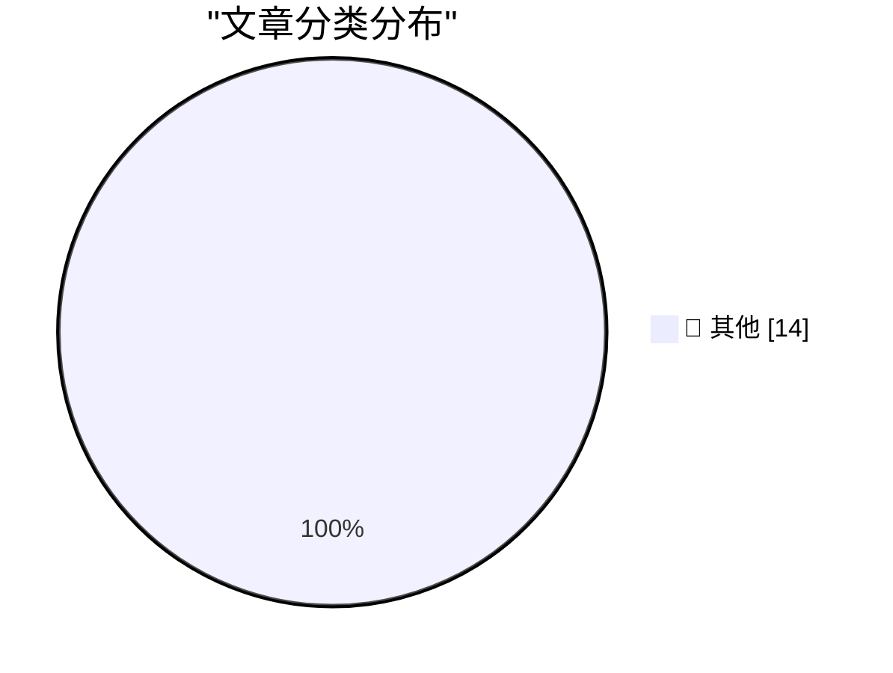

# 📰 AI 博客每日精选 — 2026-05-29

> 来自 Karpathy 推荐的 92 个顶级技术博客，AI 精选 Top 14

## 🏆 今日必读

🥇 **sqlite AGENTS.md**

[sqlite AGENTS.md](https://simonwillison.net/2026/May/27/sqlite-agents/#atom-everything) — simonwillison.net · 20 小时前 · 📝 其他

> sqlite AGENTS.md

🥈 **Tuning in FM Radio on a 3D Printer Heatbed**

[Tuning in FM Radio on a 3D Printer Heatbed](https://www.jeffgeerling.com/blog/2026/tuning-in-fm-radio-on-a-3d-printer-heatbed/) — jeffgeerling.com · 5 小时前 · 📝 其他

> Tuning in FM Radio on a 3D Printer Heatbed

🥉 **Footage From the LA-Houston MLS Match That Apple Shot Using iPhone 17 Pro Cameras**

[Footage From the LA-Houston MLS Match That Apple Shot Using iPhone 17 Pro Cameras](https://tv.apple.com/us/sporting-event/mls-wrap-up/umc.cse.3a198p24hrehwhonbhgx2zvhv) — daringfireball.net · 2 小时前 · 📝 其他

> Footage From the LA-Houston MLS Match That Apple Shot Using iPhone 17 Pro Cameras

---

## 📊 数据概览

| 扫描源 | 抓取文章 | 时间范围 | 精选 |
|:---:|:---:|:---:|:---:|
| 80/92 | 2420 篇 → 14 篇 | 24h | **14 篇** |

### 分类分布

---

## 📝 其他

### 1. sqlite AGENTS.md

[sqlite AGENTS.md](https://simonwillison.net/2026/May/27/sqlite-agents/#atom-everything) — **simonwillison.net** · 20 小时前 · ⭐ 15/30

> sqlite AGENTS.md

---

### 2. Tuning in FM Radio on a 3D Printer Heatbed

[Tuning in FM Radio on a 3D Printer Heatbed](https://www.jeffgeerling.com/blog/2026/tuning-in-fm-radio-on-a-3d-printer-heatbed/) — **jeffgeerling.com** · 5 小时前 · ⭐ 15/30

> Tuning in FM Radio on a 3D Printer Heatbed

---

### 3. Footage From the LA-Houston MLS Match That Apple Shot Using iPhone 17 Pro Cameras

[Footage From the LA-Houston MLS Match That Apple Shot Using iPhone 17 Pro Cameras](https://tv.apple.com/us/sporting-event/mls-wrap-up/umc.cse.3a198p24hrehwhonbhgx2zvhv) — **daringfireball.net** · 2 小时前 · ⭐ 15/30

> Footage From the LA-Houston MLS Match That Apple Shot Using iPhone 17 Pro Cameras

---

### 4. Researchers Publish Method to Surveil Web Page Visitors by Analyzing Their SSD Activity

[Researchers Publish Method to Surveil Web Page Visitors by Analyzing Their SSD Activity](https://arstechnica.com/security/2026/05/websites-have-a-new-way-to-spy-on-visitors-analyzing-their-ssd-activity/) — **daringfireball.net** · 5 小时前 · ⭐ 15/30

> Researchers Publish Method to Surveil Web Page Visitors by Analyzing Their SSD Activity

---

### 5. Pluralistic: Hold on for dear life (28 May 2026)

[Pluralistic: Hold on for dear life (28 May 2026)](https://pluralistic.net/2026/05/28/we-live-in-a-society/) — **pluralistic.net** · 8 小时前 · ⭐ 15/30

> Pluralistic: Hold on for dear life (28 May 2026)

---

### 6. Dancing mad with sandboxing

[Dancing mad with sandboxing](https://xeiaso.net/blog/2026/dancing-mad-sandboxing/) — **xeiaso.net** · 19 小时前 · ⭐ 15/30

> Dancing mad with sandboxing

---

### 7. Turning K-L divergence into a metric

[Turning K-L divergence into a metric](https://www.johndcook.com/blog/2026/05/27/jensen-shannon/) — **johndcook.com** · 18 小时前 · ⭐ 15/30

> Turning K-L divergence into a metric

---

### 8. The Costco theory of the internet

[The Costco theory of the internet](https://www.joanwestenberg.com/the-costco-theory-of-the-internet/) — **joanwestenberg.com** · 18 小时前 · ⭐ 15/30

> The Costco theory of the internet

---

### 9. Protestware for coding agents

[Protestware for coding agents](https://nesbitt.io/2026/05/28/protestware-for-coding-agents.html) — **nesbitt.io** · 4 小时前 · ⭐ 15/30

> Protestware for coding agents

---

### 10. Package managers that package package managers

[Package managers that package package managers](https://nesbitt.io/2026/05/28/package-managers-that-package-package-managers.html) — **nesbitt.io** · 9 小时前 · ⭐ 15/30

> Package managers that package package managers

---

### 11. Where Are the Economies of Scale in Homebuilding?

[Where Are the Economies of Scale in Homebuilding?](https://www.construction-physics.com/p/where-are-the-economies-of-scale) — **construction-physics.com** · 7 小时前 · ⭐ 15/30

> Where Are the Economies of Scale in Homebuilding?

---

### 12. Knowing about things is cheaper than knowing things

[Knowing about things is cheaper than knowing things](https://buttondown.com/hillelwayne/archive/knowing-about-things-is-cheaper-than-knowing/) — **buttondown.com/hillelwayne** · 3 小时前 · ⭐ 15/30

> Knowing about things is cheaper than knowing things

---

### 13. Notes on Fourier series

[Notes on Fourier series](https://eli.thegreenplace.net/2026/notes-on-fourier-series/) — **eli.thegreenplace.net** · 17 小时前 · ⭐ 15/30

> Notes on Fourier series

---

### 14. Every Enemy Wears Your Face

[Every Enemy Wears Your Face](https://simone.org/projection/) — **simone.org** · 6 小时前 · ⭐ 15/30

> Every Enemy Wears Your Face

---

*生成于 2026-05-29 03:47 (Asia/Shanghai) | 扫描 80 源 → 获取 2420 篇 → 精选 14 篇*
*基于 [Hacker News Popularity Contest 2025](https://refactoringenglish.com/tools/hn-popularity/) RSS 源列表，由 [Andrej Karpathy](https://x.com/karpathy) 推荐*
*由「懂点儿AI」制作，欢迎关注同名微信公众号获取更多 AI 实用技巧 💡*
