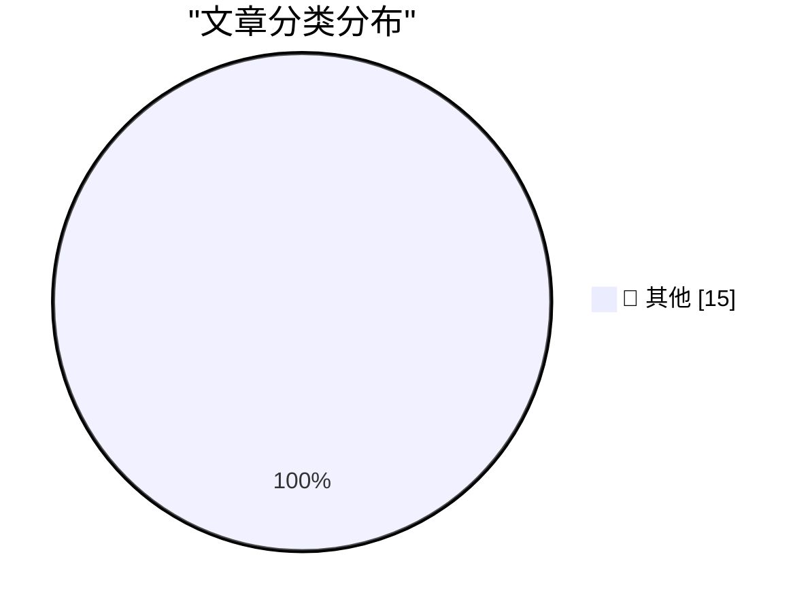

# 📰 AI 博客每日精选 — 2026-05-30

> 来自 Karpathy 推荐的 92 个顶级技术博客，AI 精选 Top 15

## 🏆 今日必读

🥇 **datasette 1.0a31**

[datasette 1.0a31](https://simonwillison.net/2026/May/29/datasette/#atom-everything) — simonwillison.net · 16 小时前 · 📝 其他

> datasette 1.0a31

🥈 **Anthropic's run-rate revenue hits $47 billion**

[Anthropic's run-rate revenue hits $47 billion](https://simonwillison.net/2026/May/29/anthropic/#atom-everything) — simonwillison.net · 18 小时前 · 📝 其他

> Anthropic's run-rate revenue hits $47 billion

🥉 **Claude Opus 4.8: "a modest but tangible improvement"**

[Claude Opus 4.8: "a modest but tangible improvement"](https://simonwillison.net/2026/May/28/claude-opus-4-8/#atom-everything) — simonwillison.net · 19 小时前 · 📝 其他

> Claude Opus 4.8: "a modest but tangible improvement"

---

## 📊 数据概览

| 扫描源 | 抓取文章 | 时间范围 | 精选 |
|:---:|:---:|:---:|:---:|
| 82/92 | 2462 篇 → 15 篇 | 24h | **15 篇** |

### 分类分布

---

## 📝 其他

### 1. datasette 1.0a31

[datasette 1.0a31](https://simonwillison.net/2026/May/29/datasette/#atom-everything) — **simonwillison.net** · 16 小时前 · ⭐ 15/30

> datasette 1.0a31

---

### 2. Anthropic's run-rate revenue hits $47 billion

[Anthropic's run-rate revenue hits $47 billion](https://simonwillison.net/2026/May/29/anthropic/#atom-everything) — **simonwillison.net** · 18 小时前 · ⭐ 15/30

> Anthropic's run-rate revenue hits $47 billion

---

### 3. Claude Opus 4.8: "a modest but tangible improvement"

[Claude Opus 4.8: "a modest but tangible improvement"](https://simonwillison.net/2026/May/28/claude-opus-4-8/#atom-everything) — **simonwillison.net** · 19 小时前 · ⭐ 15/30

> Claude Opus 4.8: "a modest but tangible improvement"

---

### 4. llm-anthropic 0.25.1

[llm-anthropic 0.25.1](https://simonwillison.net/2026/May/28/llm-anthropic/#atom-everything) — **simonwillison.net** · 19 小时前 · ⭐ 15/30

> llm-anthropic 0.25.1

---

### 5. markdown-svg-renderer

[markdown-svg-renderer](https://simonwillison.net/2026/May/28/markdown-svg-renderer/#atom-everything) — **simonwillison.net** · 23 小时前 · ⭐ 15/30

> markdown-svg-renderer

---

### 6. It's hard to justify buying a Framework 12

[It's hard to justify buying a Framework 12](https://www.jeffgeerling.com/blog/2026/its-hard-to-justify-framework-12/) — **jeffgeerling.com** · 5 小时前 · ⭐ 15/30

> It's hard to justify buying a Framework 12

---

### 7. One Group, Clearly, Is Deranged

[One Group, Clearly, Is Deranged](https://paulkrugman.substack.com/p/whos-deranged-exactly) — **daringfireball.net** · 3 小时前 · ⭐ 15/30

> One Group, Clearly, Is Deranged

---

### 8. The UK Government's Low Value Purchase System is a Waste of Time

[The UK Government's Low Value Purchase System is a Waste of Time](https://shkspr.mobi/blog/2026/05/the-uk-governments-low-value-purchase-system-is-a-waste-of-time/) — **shkspr.mobi** · 8 小时前 · ⭐ 15/30

> The UK Government's Low Value Purchase System is a Waste of Time

---

### 9. Online (one-pass) algorithms

[Online (one-pass) algorithms](https://www.johndcook.com/blog/2026/05/29/online-one-pass-algorithms/) — **johndcook.com** · 7 小时前 · ⭐ 15/30

> Online (one-pass) algorithms

---

### 10. Composer’s dependency policies

[Composer’s dependency policies](https://nesbitt.io/2026/05/29/composer-dependency-policies.html) — **nesbitt.io** · 9 小时前 · ⭐ 15/30

> Composer’s dependency policies

---

### 11. Premium: What If...We're In An AI Bubble? (Part 3)

[Premium: What If...We're In An AI Bubble? (Part 3)](https://www.wheresyoured.at/premium-what-if-were-in-an-ai-bubble-part-3/) — **wheresyoured.at** · 2 小时前 · ⭐ 15/30

> Premium: What If...We're In An AI Bubble? (Part 3)

---

### 12. This Week on The Analog Antiquarian

[This Week on The Analog Antiquarian](https://www.filfre.net/2026/05/this-week-on-the-analog-antiquarian/) — **filfre.net** · 3 小时前 · ⭐ 15/30

> This Week on The Analog Antiquarian

---

### 13. Why people say CRTs don’t have pixels

[Why people say CRTs don’t have pixels](https://dfarq.homeip.net/why-people-say-crts-dont-have-pixels/?utm_source=rss&#038;utm_medium=rss&#038;utm_campaign=why-people-say-crts-dont-have-pixels) — **dfarq.homeip.net** · 8 小时前 · ⭐ 15/30

> Why people say CRTs don’t have pixels

---

### 14. DR DOS: Revenge of CP/M

[DR DOS: Revenge of CP/M](https://dfarq.homeip.net/dr-dos-revenge-of-cp-m/?utm_source=rss&#038;utm_medium=rss&#038;utm_campaign=dr-dos-revenge-of-cp-m) — **dfarq.homeip.net** · 8 小时前 · ⭐ 15/30

> DR DOS: Revenge of CP/M

---

### 15. What's going on with Gemini?

[What's going on with Gemini?](https://martinalderson.com/posts/whats-going-on-with-gemini/?utm_source=rss&amp;utm_medium=rss&amp;utm_campaign=feed) — **martinalderson.com** · 19 小时前 · ⭐ 15/30

> What's going on with Gemini?

---

*生成于 2026-05-30 03:42 (Asia/Shanghai) | 扫描 82 源 → 获取 2462 篇 → 精选 15 篇*
*基于 [Hacker News Popularity Contest 2025](https://refactoringenglish.com/tools/hn-popularity/) RSS 源列表，由 [Andrej Karpathy](https://x.com/karpathy) 推荐*
*由「懂点儿AI」制作，欢迎关注同名微信公众号获取更多 AI 实用技巧 💡*
