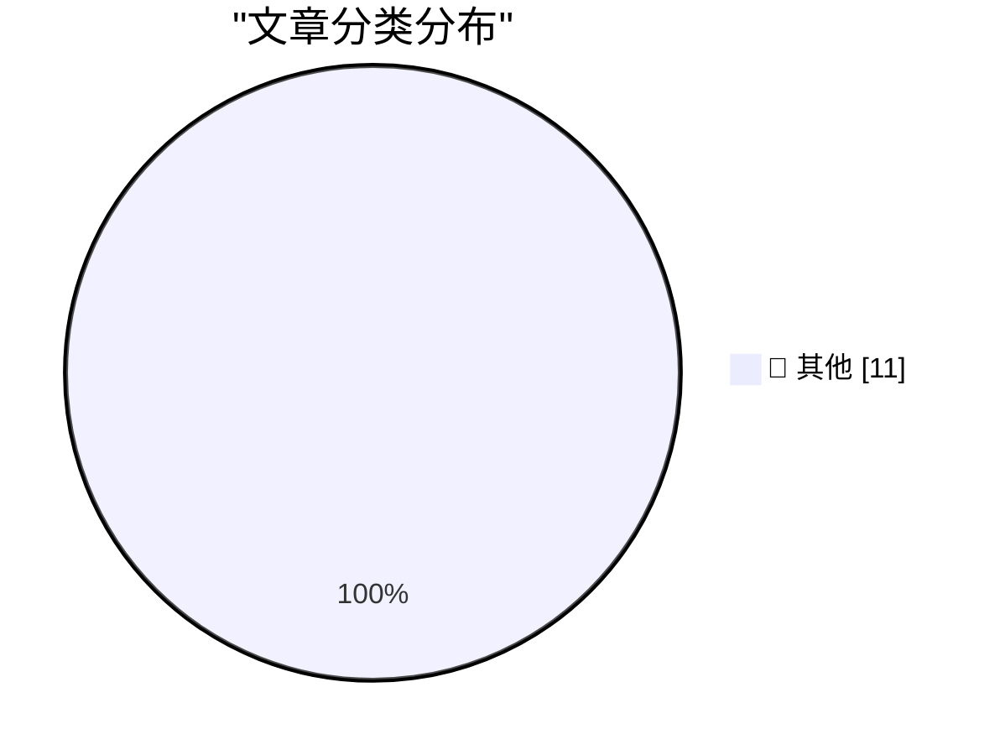

# 📰 AI 博客每日精选 — 2026-05-31

> 来自 Karpathy 推荐的 92 个顶级技术博客，AI 精选 Top 11

## 🏆 今日必读

🥇 **Quoting Daniel Jalkut**

[Quoting Daniel Jalkut](https://simonwillison.net/2026/May/30/daniel-jalkut/#atom-everything) — simonwillison.net · 47 分钟前 · 📝 其他

> Quoting Daniel Jalkut

🥈 **Meta Is Launching Instagram, Facebook, and WhatsApp Subscriptions for ‘Fun Features’**

[Meta Is Launching Instagram, Facebook, and WhatsApp Subscriptions for ‘Fun Features’](https://techcrunch.com/2026/05/27/meta-officially-launches-instagram-facebook-and-whatsapp-subscriptions-with-more-to-come-including-ai-plans/) — daringfireball.net · 2 小时前 · 📝 其他

> Meta Is Launching Instagram, Facebook, and WhatsApp Subscriptions for ‘Fun Features’

🥉 **Daniel Jalkut on AI**

[Daniel Jalkut on AI](https://mastodon.social/@danielpunkass/116639318125898071) — daringfireball.net · 2 小时前 · 📝 其他

> Daniel Jalkut on AI

---

## 📊 数据概览

| 扫描源 | 抓取文章 | 时间范围 | 精选 |
|:---:|:---:|:---:|:---:|
| 82/92 | 2461 篇 → 11 篇 | 24h | **11 篇** |

### 分类分布

---

## 📝 其他

### 1. Quoting Daniel Jalkut

[Quoting Daniel Jalkut](https://simonwillison.net/2026/May/30/daniel-jalkut/#atom-everything) — **simonwillison.net** · 47 分钟前 · ⭐ 15/30

> Quoting Daniel Jalkut

---

### 2. Meta Is Launching Instagram, Facebook, and WhatsApp Subscriptions for ‘Fun Features’

[Meta Is Launching Instagram, Facebook, and WhatsApp Subscriptions for ‘Fun Features’](https://techcrunch.com/2026/05/27/meta-officially-launches-instagram-facebook-and-whatsapp-subscriptions-with-more-to-come-including-ai-plans/) — **daringfireball.net** · 2 小时前 · ⭐ 15/30

> Meta Is Launching Instagram, Facebook, and WhatsApp Subscriptions for ‘Fun Features’

---

### 3. Daniel Jalkut on AI

[Daniel Jalkut on AI](https://mastodon.social/@danielpunkass/116639318125898071) — **daringfireball.net** · 2 小时前 · ⭐ 15/30

> Daniel Jalkut on AI

---

### 4. Yours Truly on TBPN Yesterday

[Yours Truly on TBPN Yesterday](https://www.youtube.com/live/sQVwLUxFdMY?t=1997) — **daringfireball.net** · 5 小时前 · ⭐ 15/30

> Yours Truly on TBPN Yesterday

---

### 5. ★ What Is a Dickover?

[★ What Is a Dickover?](https://daringfireball.net/2026/05/what_is_a_dickover) — **daringfireball.net** · 21 小时前 · ⭐ 15/30

> ★ What Is a Dickover?

---

### 6. Pluralistic: Carneyism without Carney (30 May 2026)

[Pluralistic: Carneyism without Carney (30 May 2026)](https://pluralistic.net/2026/05/30/rupture/) — **pluralistic.net** · 8 小时前 · ⭐ 15/30

> Pluralistic: Carneyism without Carney (30 May 2026)

---

### 7. Microcode inside the Intel 8087 floating-point chip: register exchange

[Microcode inside the Intel 8087 floating-point chip: register exchange](http://www.righto.com/feeds/5917097192784199241/comments/default) — **righto.com** · 1 小时前 · ⭐ 15/30

> Microcode inside the Intel 8087 floating-point chip: register exchange

---

### 8. On first looking into JAX

[On first looking into JAX](https://www.gilesthomas.com/2026/05/on-first-looking-into-jax) — **gilesthomas.com** · -28 分钟前 · ⭐ 15/30

> On first looking into JAX

---

### 9. Notes from May 2026

[Notes from May 2026](https://evanhahn.com/notes-from-may-2026/) — **evanhahn.com** · 18 小时前 · ⭐ 15/30

> Notes from May 2026

---

### 10. This Week in Package Management: 30 May 2026

[This Week in Package Management: 30 May 2026](https://nesbitt.io/2026/05/30/this-week-in-package-management.html) — **nesbitt.io** · 8 小时前 · ⭐ 15/30

> This Week in Package Management: 30 May 2026

---

### 11. Reading List 05/30/26

[Reading List 05/30/26](https://www.construction-physics.com/p/reading-list-053026) — **construction-physics.com** · 6 小时前 · ⭐ 15/30

> Reading List 05/30/26

---

*生成于 2026-05-31 02:17 (Asia/Shanghai) | 扫描 82 源 → 获取 2461 篇 → 精选 11 篇*
*基于 [Hacker News Popularity Contest 2025](https://refactoringenglish.com/tools/hn-popularity/) RSS 源列表，由 [Andrej Karpathy](https://x.com/karpathy) 推荐*
*由「懂点儿AI」制作，欢迎关注同名微信公众号获取更多 AI 实用技巧 💡*
