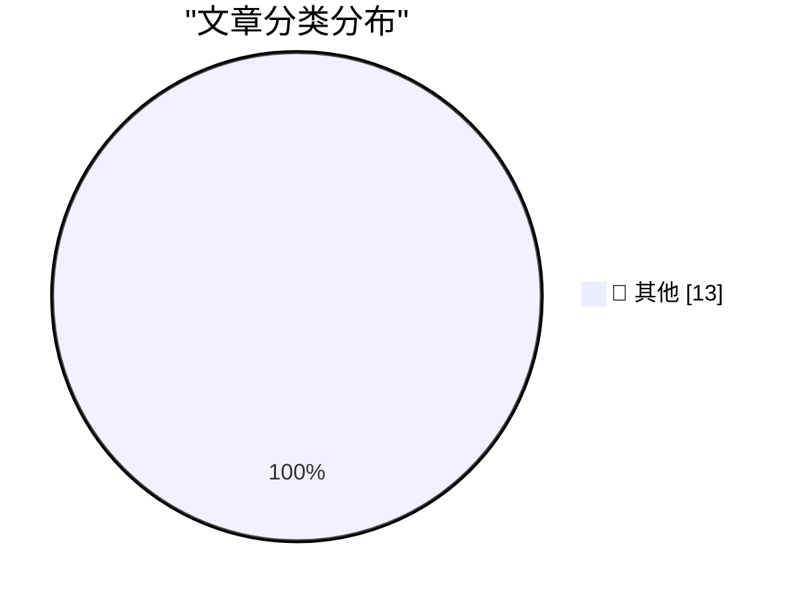

# 📰 AI 博客每日精选 — 2026-06-01

> 来自 Karpathy 推荐的 92 个顶级技术博客，AI 精选 Top 13

## 🏆 今日必读

🥇 **The solution might be cancelling my AI subscription**

[The solution might be cancelling my AI subscription](https://simonwillison.net/2026/May/31/the-solution-might-be-cancelling-my-ai-subscription/#atom-everything) — simonwillison.net · 1 小时前 · 📝 其他

> The solution might be cancelling my AI subscription

🥈 **Quoting Karen Kwok for Reuters Breakingviews**

[Quoting Karen Kwok for Reuters Breakingviews](https://simonwillison.net/2026/May/31/anthropic-run-rate/#atom-everything) — simonwillison.net · 16 小时前 · 📝 其他

> Quoting Karen Kwok for Reuters Breakingviews

🥉 **How we contain Claude across products**

[How we contain Claude across products](https://simonwillison.net/2026/May/30/how-we-contain-claude/#atom-everything) — simonwillison.net · 20 小时前 · 📝 其他

> How we contain Claude across products

---

## 📊 数据概览

| 扫描源 | 抓取文章 | 时间范围 | 精选 |
|:---:|:---:|:---:|:---:|
| 84/92 | 2492 篇 → 13 篇 | 24h | **13 篇** |

### 分类分布

---

## 📝 其他

### 1. The solution might be cancelling my AI subscription

[The solution might be cancelling my AI subscription](https://simonwillison.net/2026/May/31/the-solution-might-be-cancelling-my-ai-subscription/#atom-everything) — **simonwillison.net** · 1 小时前 · ⭐ 15/30

> The solution might be cancelling my AI subscription

---

### 2. Quoting Karen Kwok for Reuters Breakingviews

[Quoting Karen Kwok for Reuters Breakingviews](https://simonwillison.net/2026/May/31/anthropic-run-rate/#atom-everything) — **simonwillison.net** · 16 小时前 · ⭐ 15/30

> Quoting Karen Kwok for Reuters Breakingviews

---

### 3. How we contain Claude across products

[How we contain Claude across products](https://simonwillison.net/2026/May/30/how-we-contain-claude/#atom-everything) — **simonwillison.net** · 20 小时前 · ⭐ 15/30

> How we contain Claude across products

---

### 4. Running Python ASGI apps in the browser via Pyodide + a service worker

[Running Python ASGI apps in the browser via Pyodide + a service worker](https://simonwillison.net/2026/May/30/pyodide-asgi-browser/#atom-everything) — **simonwillison.net** · 21 小时前 · ⭐ 15/30

> Running Python ASGI apps in the browser via Pyodide + a service worker

---

### 5. I Am Retiring from Tech to Live Offline

[I Am Retiring from Tech to Live Offline](https://simonwillison.net/2026/May/30/retiring-from-tech-to-live-offline/#atom-everything) — **simonwillison.net** · 22 小时前 · ⭐ 15/30

> I Am Retiring from Tech to Live Offline

---

### 6. Build agents, not pipelines

[Build agents, not pipelines](https://seangoedecke.com/build-agents-not-pipelines/) — **seangoedecke.com** · 18 小时前 · ⭐ 15/30

> Build agents, not pipelines

---

### 7. Who are the actors in the UK's 2015 passport?

[Who are the actors in the UK's 2015 passport?](https://shkspr.mobi/blog/2026/05/who-are-the-actors-in-the-uks-2015-passport/) — **shkspr.mobi** · 6 小时前 · ⭐ 15/30

> Who are the actors in the UK's 2015 passport?

---

### 8. Another Gaussian approximation

[Another Gaussian approximation](https://www.johndcook.com/blog/2026/05/31/another-gaussian-approximation/) — **johndcook.com** · 2 小时前 · ⭐ 15/30

> Another Gaussian approximation

---

### 9. Spot checking polynomial identities

[Spot checking polynomial identities](https://www.johndcook.com/blog/2026/05/30/schwartz-zippel/) — **johndcook.com** · 21 小时前 · ⭐ 15/30

> Spot checking polynomial identities

---

### 10. On first looking into JAX

[On first looking into JAX](https://www.gilesthomas.com/2026/05/on-first-looking-into-jax) — **gilesthomas.com** · 23 小时前 · ⭐ 15/30

> On first looking into JAX

---

### 11. One &udm After Another

[One &udm After Another](https://feed.tedium.co/link/15204/17351430/google-ai-udm14-reflection) — **tedium.co** · 17 小时前 · ⭐ 15/30

> One &udm After Another

---

### 12. Ahoy, DECmate II! the little PDP-8 that could

[Ahoy, DECmate II! the little PDP-8 that could](https://oldvcr.blogspot.com/feeds/8074763508065030069/comments/default) — **oldvcr.blogspot.com** · 15 小时前 · ⭐ 15/30

> Ahoy, DECmate II! the little PDP-8 that could

---

### 13. A day in the threatened forests of the Central Highlands

[A day in the threatened forests of the Central Highlands](https://hey.paris/posts/threatened-forests/) — **hey.paris** · 18 小时前 · ⭐ 15/30

> A day in the threatened forests of the Central Highlands

---

*生成于 2026-06-01 02:18 (Asia/Shanghai) | 扫描 84 源 → 获取 2492 篇 → 精选 13 篇*
*基于 [Hacker News Popularity Contest 2025](https://refactoringenglish.com/tools/hn-popularity/) RSS 源列表，由 [Andrej Karpathy](https://x.com/karpathy) 推荐*
*由「懂点儿AI」制作，欢迎关注同名微信公众号获取更多 AI 实用技巧 💡*
